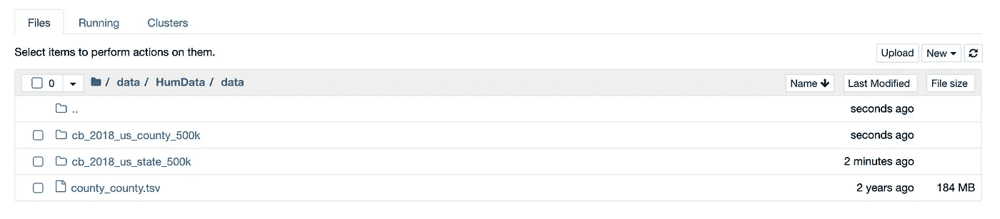
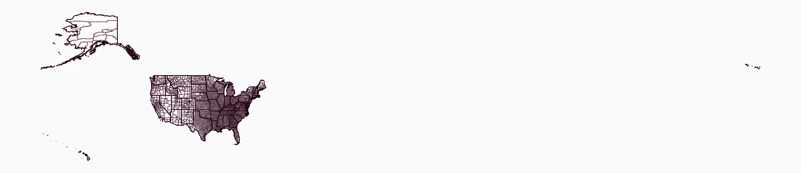
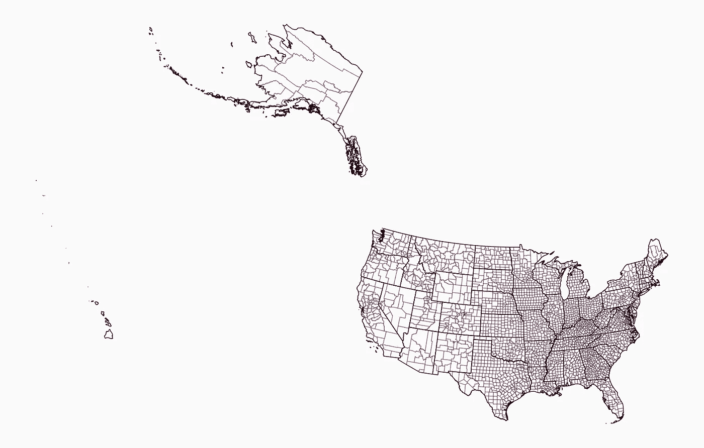
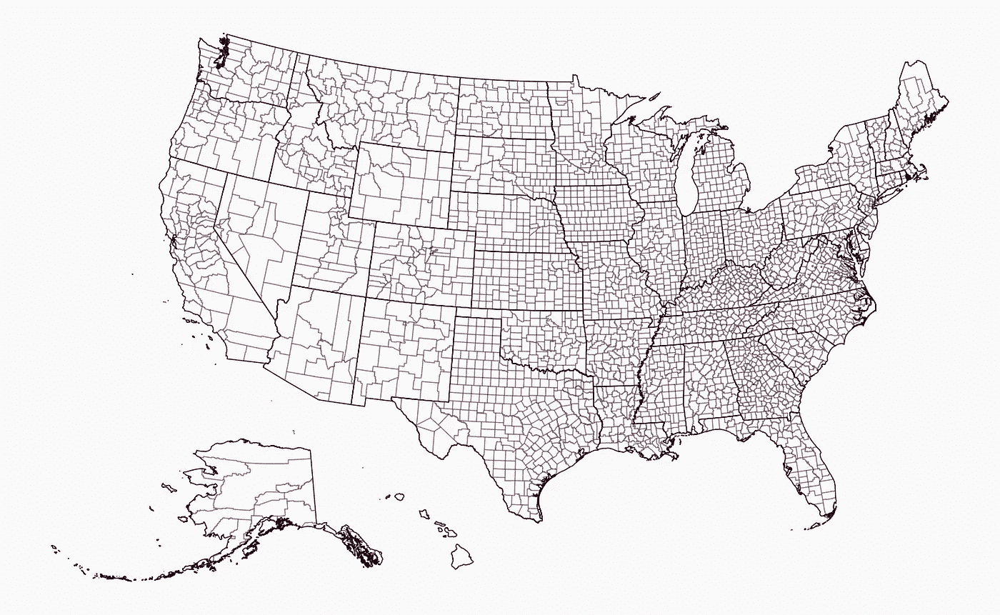
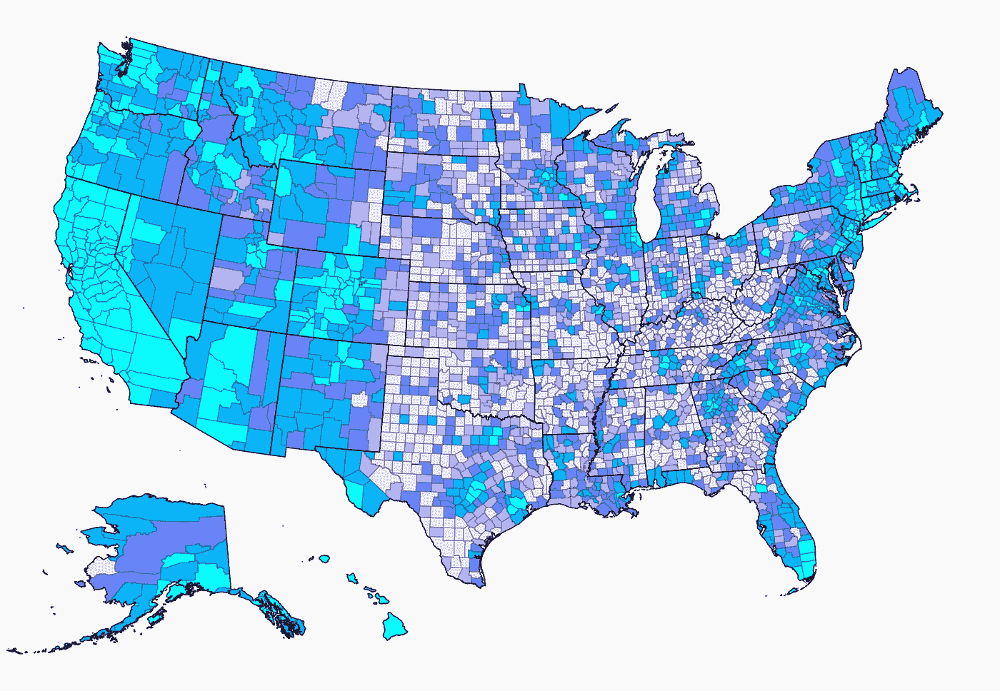
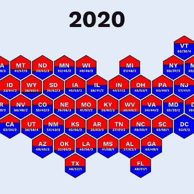

# 如何使用 Python 和 Matplotlib 创建美国数据地图

> 原文：[`towardsdatascience.com/how-to-create-data-maps-of-the-united-states-with-python-and-matplotlib-5dfb425bd87d`](https://towardsdatascience.com/how-to-create-data-maps-of-the-united-states-with-python-and-matplotlib-5dfb425bd87d)

## Matplotlib 教程

## 创建引人注目的地图

[](https://medium.com/@oscarleo?source=post_page-----5dfb425bd87d--------------------------------)[](https://towardsdatascience.com/?source=post_page-----5dfb425bd87d--------------------------------) [Oscar Leo](https://medium.com/@oscarleo?source=post_page-----5dfb425bd87d--------------------------------)

·发布于[数据科学前沿](https://towardsdatascience.com/?source=post_page-----5dfb425bd87d--------------------------------) ·7 分钟阅读·2023 年 9 月 7 日

--


地图由作者创建

你好，欢迎来到这个教程。

今天，我将教你如何使用地理数据和 Facebook 连通性指数（这两个数据源都是公共领域且免费使用）来创建上面看到的数据可视化。

像这样的地图非常适合可视化地理信息，如果选择合适的颜色，它们会立即吸引任何人的注意。

典型的使用场景是通过经济规模、人口或其他指标如全球地图上的寿命来比较国家（或美国各州）。

这些地图通常会揭示出基于地理位置的模式，这是其他可视化中看不到的。

如果这听起来很有趣，你来对地方了。

让我们开始教程吧。

## 步骤 1：下载数据

在开始之前，我们需要下载一个足够精彩的数据集和地理数据，以绘制准确的美国地图。

对于地图，我使用了来自[Cencus.gov](https://www.census.gov/)的形状文件。你可以使用以下链接下载[州](https://www2.census.gov/geo/tiger/GENZ2018/shp/cb_2018_us_state_500k.zip)和[县](https://www2.census.gov/geo/tiger/GENZ2018/shp/cb_2018_us_county_500k.zip)。

为了获得补充数据集，我选择了 Facebook 连通性指数，该指数测量了不同县之间的两个人在 Facebook 上的连接可能性。

你可以通过[这个链接](https://data.humdata.org/dataset/e9988552-74e4-4ff4-943f-c782ac8bca87/resource/c59fd5ac-0458-4e83-b6be-5334f0ea9a69/download/us-counties-us-counties-fb-social-connectedness-index-october-2021.zip)下载连通性数据。

下载完成后，解压文件并放在一个合适的位置。我在教程中使用的是`./data`，但你可以根据自己的需要进行设置。

它应该是这样的。



作者截屏

让我们写一些代码。

## 第二步：导入库并准备 Seaborn

唯一的新库（如果你做过我的其他[Matplotlib 教程](https://medium.com/@oscarleo/list/matplotlib-tutorials-262e5d7f0847)）是 `geopandas`，我们将用它来绘制地图。

```py
# Import libraries

import numpy as np
import pandas as pd
import seaborn as sns
import geopandas as gpd
import matplotlib.pyplot as plt

from PIL import Image
from matplotlib.patches import Patch, Circle
```

接下来，让我们使用 `seaborn` 定义一些样式特征。

```py
edge_color = "#30011E"
background_color = "#fafafa"

sns.set_style({
    "font.family": "serif",
    "figure.facecolor": background_color,
    "axes.facecolor": background_color,
})
```

现在是学习如何绘制地图的时候了。

## 第三步：加载和准备地理数据

我使用 `geopandas` 加载数据并删除“未合并领土”，例如关岛、波多黎各和美属萨摩亚。

```py
# Load and prepare geo-data
counties = gpd.read_file("./data/cb_2018_us_county_500k/")
counties = counties[~counties.STATEFP.isin(["72", "69", "60", "66", "78"])]
counties = counties.set_index("GEOID")

states = gpd.read_file("./data/cb_2018_us_state_500k/")
states = states[~states.STATEFP.isin(["72", "69", "60", "66", "78"])]
```

`geopandas` 数据框有一个 `geometry` 列，用于定义每一行的形状。它允许我们通过调用 `counties.plot()` 或 `states.plot()` 来绘制地图。

```py
ax = counties.plot(edgecolor=edge_color + "55", color="None", figsize=(20, 20))
states.plot(ax=ax, edgecolor=edge_color, color="None", linewidth=1)

plt.axis("off")
plt.show()
```

在这里，我开始绘制具有透明边框的县，然后在调用 `states.plot()` 时重用 `ax`，以避免绘制多个地图。

这是我得到的结果。



地图由作者创建

地图看起来不太好，但我会做一些快速调整，让我们走上正确的轨道。

第一个调整是将地图投影更改为以美国为中心的投影。你可以通过调用 `to_crs()` 来实现。

```py
# Load and prepare geo-data
...

counties = counties.to_crs("ESRI:102003")
states = states.to_crs("ESRI:102003")
```

这是不同之处。



地图由作者创建

在绘制美国的数据地图时，通常会将阿拉斯加和夏威夷放在大陆下方，我们也会这样做。

使用 `geopandas`，你可以通过内置函数进行几何形状的平移、缩放和旋转。这里有一个有用的函数来完成这项任务。

```py
def translate_geometries(df, x, y, scale, rotate):
    df.loc[:, "geometry"] = df.geometry.translate(yoff=y, xoff=x)
    center = df.dissolve().centroid.iloc[0]
    df.loc[:, "geometry"] = df.geometry.scale(xfact=scale, yfact=scale, origin=center)
    df.loc[:, "geometry"] = df.geometry.rotate(rotate, origin=center)
    return df
```

我计算整个数据框的中心点，定义旋转和缩放的原点。如果不这样做，`geopandas` 会自动为每一行处理，这会使地图看起来完全混乱。

下一个函数处理我们当前的数据框，分离夏威夷和阿拉斯加，调用 `translate_geometries()` 来调整它们的几何形状，并将其放回新的数据框中。

```py
def adjust_maps(df):
    df_main_land = df[~df.STATEFP.isin(["02", "15"])]
    df_alaska = df[df.STATEFP == "02"]
    df_hawaii = df[df.STATEFP == "15"]

    df_alaska = translate_geometries(df_alaska, 1300000, -4900000, 0.5, 32)
    df_hawaii = translate_geometries(df_hawaii, 5400000, -1500000, 1, 24)

    return pd.concat([df_main_land, df_alaska, df_hawaii])
```

我们将 `adjust_maps()` 添加到我们的代码中。

```py
# Load and prepare geo-data
...

counties = adjust_maps(counties)
states = adjust_maps(states)
```

现在我们的地图看起来是这样的。



地图由作者创建

进入下一步。

## 第四步：添加数据

要添加数据，我们首先加载 Facebook 连接数据。我将 `user_loc` 和 `fr_loc` 列转换为字符串，并添加前导零，以使其与地理数据一致。

```py
# Load facebook data
facebook_df = pd.read_csv("./data/county_county.tsv", sep="\t")
facebook_df.user_loc = ("0" + facebook_df.user_loc.astype(str)).str[-5:]
facebook_df.fr_loc = ("0" + facebook_df.fr_loc.astype(str)).str[-5:]
```

`user_loc` 和 `fr_loc` 列定义了一个县对，第三列 `scaled_sci` 是我们要显示的值。

数据集中有 3,227 个县，这意味着总共有 10,413,529 对，但我们将逐个显示每个县的连接指数。

```py
# Create data map
county_id = "06075" # San Francisco
county_name = counties.loc[county_id].NAME
county_facebook_df = facebook_df[facebook_df.user_loc == county_id]
```

接下来，我定义一个 `selected_color` 和 `data_breaks`，其中包含百分位数、颜色和后续使用的图例文本。

```py
# Create data map
...

selected_color = "#FA26A0"
data_breaks = [
    (90, "#00ffff", "Top 10%"),
    (70, "#00b5ff", "90-70%"),
    (50, "#6784ff", "70-50%"),
    (30, "#aeb3fe", "50-30%"),
    (0, "#e6e5fc", "Bottom 30%"),
]
```

以下函数使用 `county_df` 和我们刚刚定义的 `data_breaks` 来定义每一行的颜色。

```py
def create_color(county_df, data_breaks):
    colors = []

    for i, row in county_df.iterrows():
        for p, c, _ in data_breaks:
            if row.value >= np.percentile(county_df.value, p):
                colors.append(c)
                break

    return colors
```

我们计算出正确的值并像这样添加`create_color()`。

```py
# Create data map
...

counties.loc[:, "value"] = (county_facebook_df.set_index("fr_loc").scaled_sci)
counties.loc[:, "value"] = counties["value"].fillna(0)
counties.loc[:, "color"] = create_color(counties, data_breaks)
counties.loc[county_id, "color"] = selected_color

ax = counties.plot(edgecolor=edge_color + "55", color=counties.color, figsize=(20, 20))
states.plot(ax=ax, edgecolor=edge_color, color="None", linewidth=1)
ax.set(xlim=(-2600000, None)) # Removing some of the padding to the left

plt.axis("off")
plt.show()
```

这是我们得到的结果。



地图由作者创建

这看起来很棒，但我们需要添加一些信息。

## 第 5 步：添加信息

我们需要的第一条信息是一个标题，用来解释数据可视化的内容。

这是一个执行此任务的函数。

```py
def add_title(county_id, county_name):
    plt.annotate(
        text="Social Connectedness Ranking Between US Counties and",
        xy=(0.5, 1.1), xycoords="axes fraction", fontsize=16, ha="center"
    )

    plt.annotate(
        text="{} (FIPS Code {})".format(county_name, county_id), 
        xy=(0.5, 1.03), xycoords="axes fraction", fontsize=32, ha="center",
        fontweight="bold"
    )
```

接下来，我们需要一个图例和解释数据的辅助信息，因为它有点复杂。

用于添加图例的函数使用`data_breaks`和`selected_color`来创建`Patch(es)`，然后我们通过`plt.legend()`添加这些补丁。

```py
def add_legend(data_breaks, selected_color, county_name):
    patches = [Patch(facecolor=c, edgecolor=edge_color, label=t) for _, c, t in data_breaks]
    patches = [Patch(facecolor=selected_color, edgecolor=edge_color, label=county_name)] + patches

    leg = plt.legend(
        handles=patches,
        bbox_to_anchor=(0.5, -0.03), loc='center',
        ncol=10, fontsize=20, columnspacing=1,
        handlelength=1, handleheight=1,
        edgecolor=background_color,
        handletextpad=0.4
    )
```

我还有一个简单的函数可以在图例下方添加一些额外的信息。

```py
def add_information():
    plt.annotate(
        "The Facebook Connectivity Index measure the likelyhood that users in different\nlocations are connected on Facebook. The formula divides the number of Facebook\nconnections with the number of possible connections for the two locations.",
        xy=(0.5, -0.08), xycoords="axes fraction", ha="center", va="top", fontsize=18, linespacing=1.8
    )

    plt.annotate(
        "Source: https://dataforgood.facebook.com/", 
        xy=(0.5, -0.22), xycoords="axes fraction", fontsize=16, ha="center",
        fontweight="bold"
    )
```

最后，我有一个`add_circle()`函数，通过在县周围画一个圆圈来指示我们正在查看哪个县。

```py
def add_circle(ax, counties_df, county_id):
    center = counties_df[counties_df.index == county_id].geometry.centroid.iloc[0]
    ax.add_artist(
        Circle(
            radius=100000, xy=(center.x, center.y), facecolor="None", edgecolor=selected_color, linewidth=4
        )
    )
```

我们将所有这些内容添加到`# Create data map`注释下方的其余代码中。

```py
# Create data map
...

add_circle(ax, counties, county_id)
add_title(county_id, county_name)
add_legend(data_breaks, selected_color, county_name)
add_information()

plt.axis("off")
plt.show()
```

这是完成的数据显示。


地图由作者创建

恭喜，你现在知道如何在 Matplotlib 中创建美国的精彩数据地图！ :)

## 结论

数据地图在你想以引人注目的方式可视化地理信息时非常棒。

这一次，我们使用了来自 Facebook 的社会联系指数，但你可以将其更改为任何其他带有地理信息的数据。

我在我的新免费通讯中，写了更多关于可视化和数据集的内容，[数据奇迹](https://datawonder.substack.com/p/investigating-the-facebook-connectivity)。

如果你喜欢这个教程，确保也查看一下我的其他教程。


[奥斯卡·莱奥](https://medium.com/@oscarleo?source=post_page-----5dfb425bd87d--------------------------------)

## Matplotlib 教程

[查看列表](https://medium.com/@oscarleo/list/matplotlib-tutorials-262e5d7f0847?source=post_page-----5dfb425bd87d--------------------------------)8 个故事

下次见。
