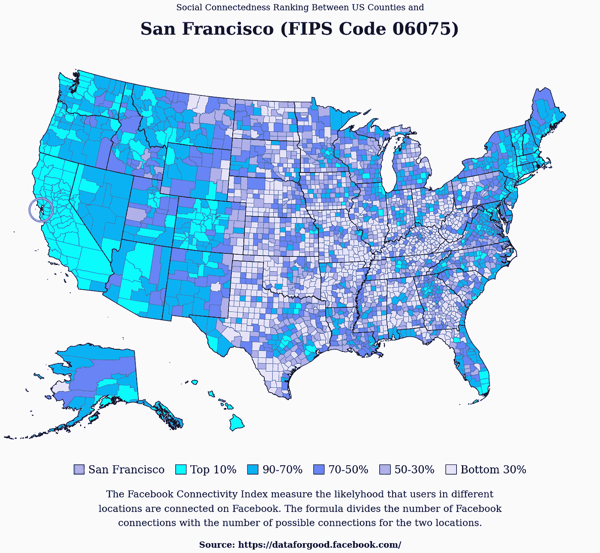

# 如何使用 Python 和 Matplotlib 创建美国数据地图

> 原文：[`towardsdatascience.com/how-to-create-data-maps-of-the-united-states-with-python-and-matplotlib-5dfb425bd87d?source=collection_archive---------7-----------------------#2023-09-07`](https://towardsdatascience.com/how-to-create-data-maps-of-the-united-states-with-python-and-matplotlib-5dfb425bd87d?source=collection_archive---------7-----------------------#2023-09-07)

## Matplotlib 教程

## 创建引人注目的地图

 [Oscar Leo](https://medium.com/@oscarleo?source=post_page-----5dfb425bd87d--------------------------------)

·

[关注](https://medium.com/m/signin?actionUrl=https%3A%2F%2Fmedium.com%2F_%2Fsubscribe%2Fuser%2Fd7e5c1ca65b7&operation=register&redirect=https%3A%2F%2Ftowardsdatascience.com%2Fhow-to-create-data-maps-of-the-united-states-with-python-and-matplotlib-5dfb425bd87d&user=Oscar+Leo&userId=d7e5c1ca65b7&source=post_page-d7e5c1ca65b7----5dfb425bd87d---------------------post_header-----------) 发表在 [Towards Data Science](https://towardsdatascience.com/?source=post_page-----5dfb425bd87d--------------------------------) ·7 分钟阅读·2023 年 9 月 7 日

--

由作者创建的地图

你好，欢迎来到这个教程。

今天，我将教你如何使用地理数据和 Facebook 连接性指数（这两个数据源都是公共领域并且免费使用）来创建你上面看到的数据可视化。

像这样的地图非常适合可视化地理信息，如果选择合适的颜色，它们会立刻吸引任何人的注意。

典型的用例是通过经济规模、人口或其他指标（如世界地图上的寿命）来比较国家（或美国各州）。

地图常常揭示基于地理位置的模式，而这些模式在其他可视化方式中是看不到的。

如果这听起来很有趣，那么你来对地方了。

让我们开始这个教程吧。

## 第一步：下载数据

在我们开始之前，我们需要下载一个足够令人兴奋的数据集，以便为本教程准备，并获取地理数据以绘制准确的美国地图。

对于地图，我使用了来自[Cencus.gov](https://www.census.gov/)的形状文件。你可以使用以下链接下载[州](https://www2.census.gov/geo/tiger/GENZ2018/shp/cb_2018_us_state_500k.zip)和[县](https://www2.census.gov/geo/tiger/GENZ2018/shp/cb_2018_us_county_500k.zip)的数据。
