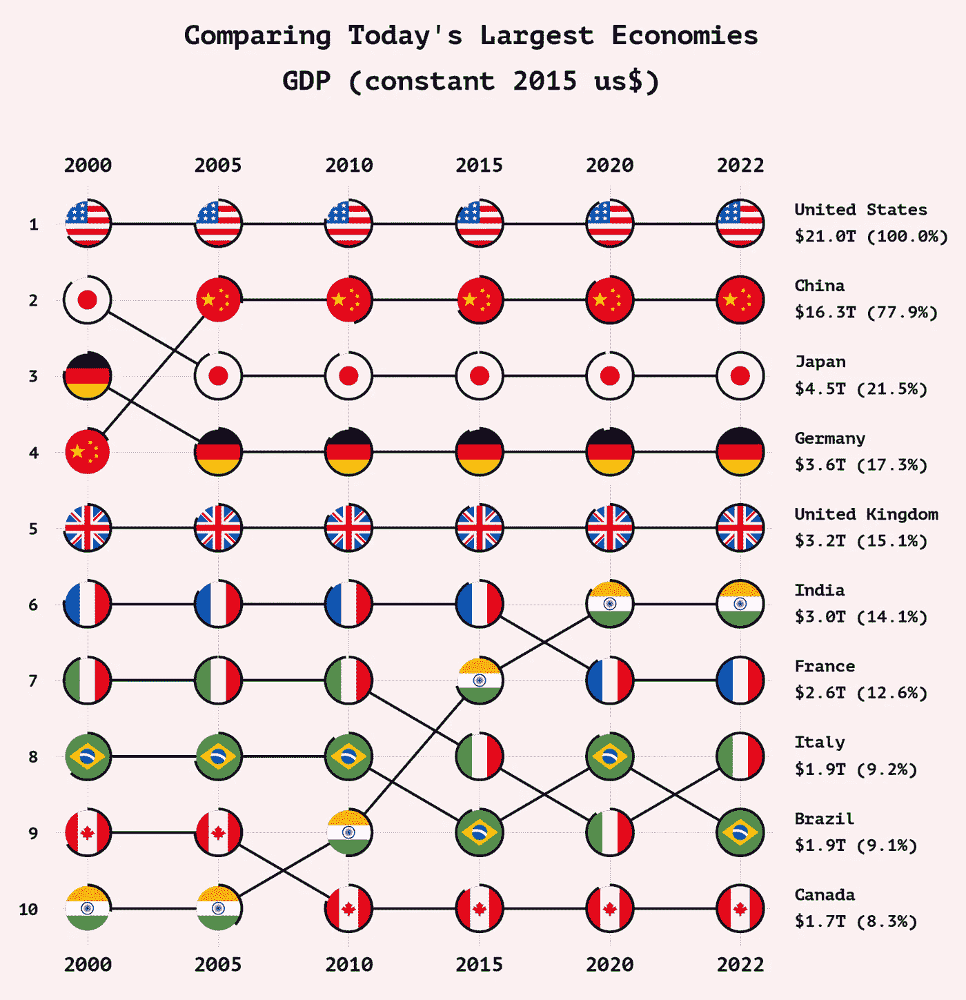
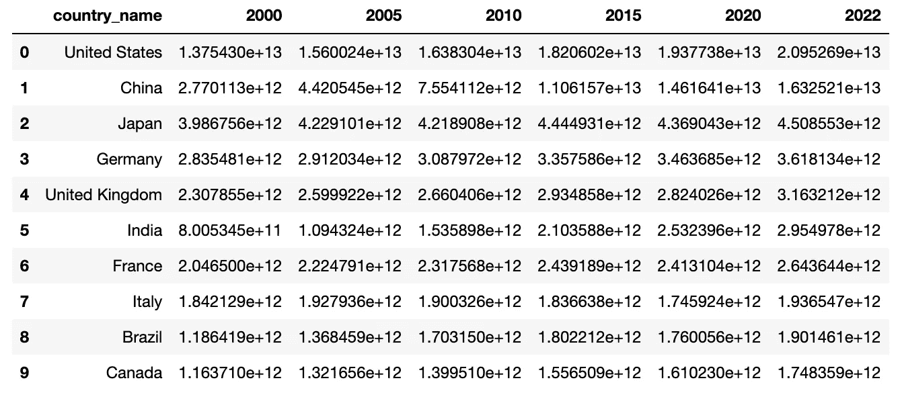
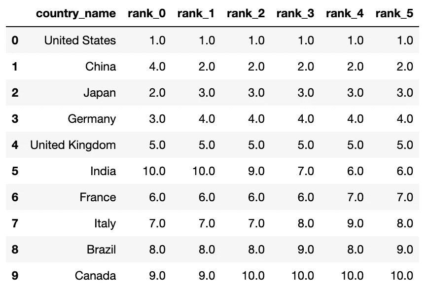
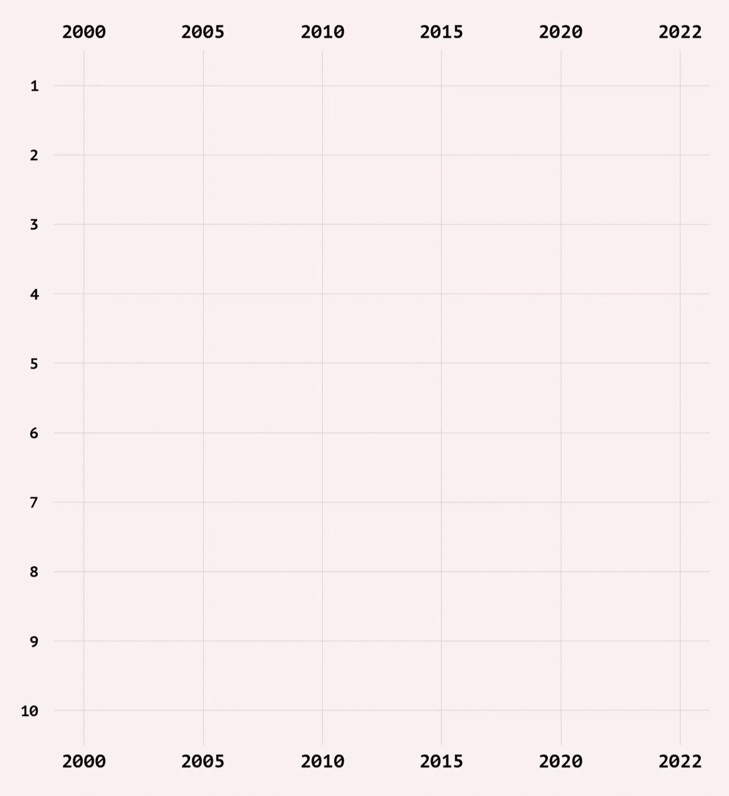
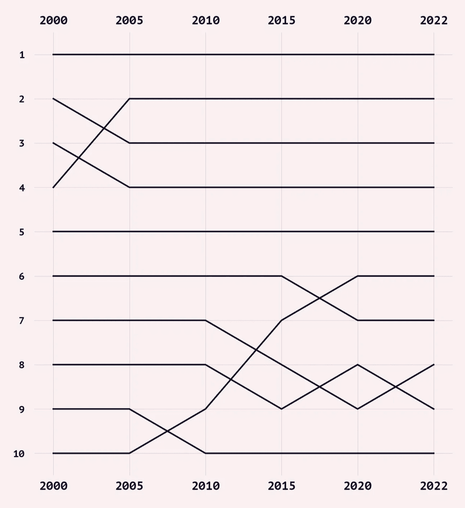
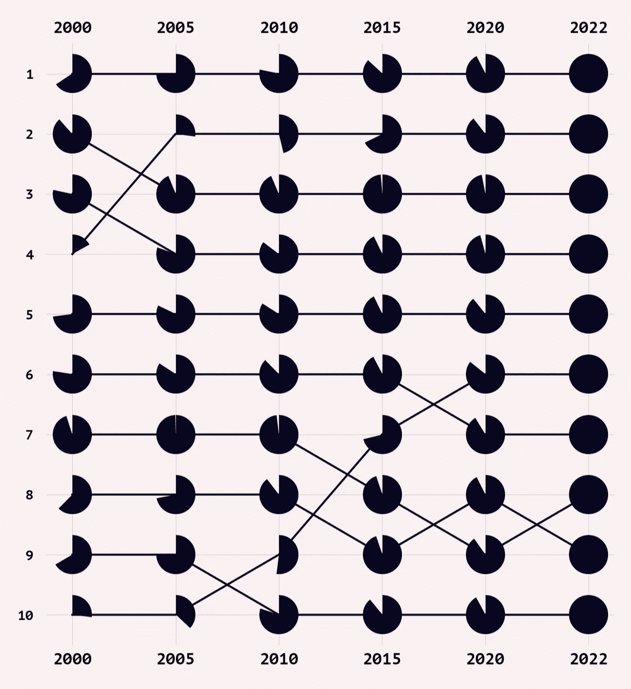
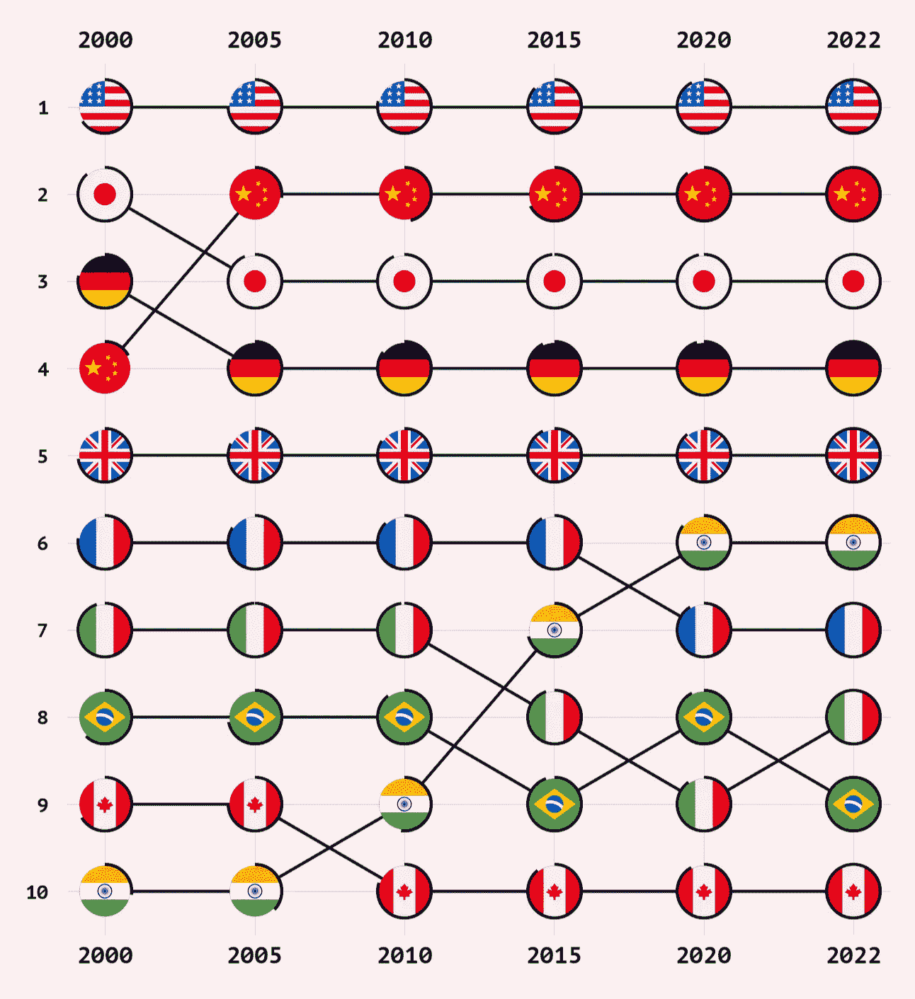

# 如何使用 Python 和 Matplotlib 创建引人注目的国家排名

> 原文：[`towardsdatascience.com/how-to-create-eye-cathing-country-rankings-using-python-and-matplotlib-d57e4594fe13`](https://towardsdatascience.com/how-to-create-eye-cathing-country-rankings-using-python-and-matplotlib-d57e4594fe13)

## Matplotlib 教程

## 一种美丽的替代标准折线图的方法

[](https://medium.com/@oscarleo?source=post_page-----d57e4594fe13--------------------------------)[](https://towardsdatascience.com/?source=post_page-----d57e4594fe13--------------------------------) [奥斯卡·利奥](https://medium.com/@oscarleo?source=post_page-----d57e4594fe13--------------------------------)

·发布于 [Towards Data Science](https://towardsdatascience.com/?source=post_page-----d57e4594fe13--------------------------------) ·阅读时间 7 分钟·2023 年 8 月 18 日

--



作者创建的图表

嗨，欢迎来到本教程，我将在这里教你如何使用 Python 和 Matplotlib 创建上面的图表。

我喜欢这种数据可视化的地方在于它以简洁而美观的方式展示了各国在某一指标上的排名。

使用标准折线图显示实际值的替代方案在某些国家接近彼此或某些国家表现大幅超越其他国家时，会显得混乱。

如果你想访问本教程的代码，可以在这个 [GitHub 仓库](https://github.com/oscarleoo/country-ranking-tutorial)中找到。

如果你喜欢这个教程，记得查看我的其他 Matplotlib 教程。


[奥斯卡·利奥](https://medium.com/@oscarleo?source=post_page-----d57e4594fe13--------------------------------)

## Matplotlib 教程

[查看列表](https://medium.com/@oscarleo/list/matplotlib-tutorials-262e5d7f0847?source=post_page-----d57e4594fe13--------------------------------)8 个故事

我们开始吧。

## 关于数据

我为本教程创建了一个包含今天前十大经济体 GDP 值的简单 CSV 文件。



作者截图

数据来自 [世界银行](https://data.worldbank.org/)，指标的全称是“GDP（2015 年不变美元）”。

如果你想了解更多关于测量 GDP 的不同方法，可以查看这个故事，在那里我使用了相同类型的数据可视化。

[## 4 Charts About Our Planet’s Largest Economies That Will Improve Your Understanding of the World](https://medium.datadriveninvestor.com/4-charts-about-our-planets-largest-economies-that-will-improve-your-understanding-of-the-world-c58a357fad7?source=post_page-----d57e4594fe13--------------------------------)

### 他们说知识就是力量。

[medium.datadriveninvestor.com](https://medium.datadriveninvestor.com/4-charts-about-our-planets-largest-economies-that-will-improve-your-understanding-of-the-world-c58a357fad7?source=post_page-----d57e4594fe13--------------------------------)

让我们继续教程吧。

## 第 1 步：创建排名

第一步是对数据集中每年的国家进行排名，这在 pandas 中很容易做到。

```py
def create_rankings(df, columns):
    rank_columns = ["rank_{}".format(i) for i in range(len(columns))]
    for i, column in enumerate(columns):
        df[rank_columns[i]] = df[column].rank(ascending=False)

    return df, rank_columns
```

结果列如下所示。



截图由作者提供

这就是我们继续进行数据可视化所需的所有预处理。

## 第 2 步：创建和样式化网格

现在我们已经准备好了数据，是时候创建一个可以绘制线条和旗帜的网格了。

这是一个使用 [Seaborn](https://seaborn.pydata.org/) 创建整体样式的函数。它定义了背景颜色和字体系列等内容。我还移除了脊线和刻度。

```py
def set_style(font_family, background_color, grid_color, text_color):
    sns.set_style({
        "axes.facecolor": background_color,
        "figure.facecolor": background_color,

        "axes.grid": True,
        "axes.axisbelow": True,

        "grid.color": grid_color,

        "text.color": text_color,
        "font.family": font_family,

        "xtick.bottom": False,
        "xtick.top": False,
        "ytick.left": False,
        "ytick.right": False,

        "axes.spines.left": False,
        "axes.spines.bottom": False,
        "axes.spines.right": False,
        "axes.spines.top": False,
    }
)
```

我使用以下值运行该函数。

```py
font_family = "PT Mono"
background_color = "#FAF0F1"
text_color = "#080520"
grid_color = "#E4C9C9"

set_style(font_family, background_color, grid_color, text_color)
```

为了创建实际的网格，我有一个格式化 y 轴和 x 轴的函数。它接受几个参数，让我可以尝试不同的设置，例如标签的大小。

```py
def format_ticks(ax, years, padx=0.25, pady=0.5, y_label_size=20, x_label_size=24):
    ax.set(xlim=(-padx, len(years) -1 + padx), ylim=(-len(df) - pady, - pady))

    xticks = [i for i in range(len(years))]
    ax.set_xticks(ticks=xticks, labels=years)

    yticks = [-i for i in range(1, len(df) + 1)]
    ylabels = ["{}".format(i) for i in range(1, len(df) + 1)]
    ax.set_yticks(ticks=yticks, labels=ylabels)

    ax.tick_params("y",labelsize=y_label_size, pad=16)
    ax.tick_params("x", labeltop=True, labelsize=x_label_size, pad=8)
```

这是我运行到目前为止的所有内容的效果。

```py
# Load data
years = ["2000", "2005", "2010", "2015", "2020", "2022"]
df = pd.read_csv("rankings.csv", index_col=None)
df, rank_columns = create_rankings(df, years)

# Create chart
fig, ax = plt.subplots(nrows=1, ncols=1, figsize=(15, 1.6*len(df)))
format_ticks(ax, years)
```

这是生成的网格。



网格由作者创建

现在我们可以开始添加一些数据了。

## 第 3 步：添加线条

我希望有一条线显示数据集中每个国家每年的排名——在 Matplotlib 中这是一个简单的任务。

```py
def add_line(ax, row, columns, linewidth=3):
    x = [i for i in range(len(columns))]
    y = [-row[rc] for rc in columns]

    ax.add_artist(
        Line2D(x, y, linewidth=linewidth, color=text_color)
    )
```

然后我像这样对数据集中的每一行运行该函数。

```py
# Load data
years = ["2000", "2005", "2010", "2015", "2020", "2022"]
df = pd.read_csv("rankings.csv", index_col=None)
df, rank_columns = create_rankings(df, years)

# Create chart
fig, ax = plt.subplots(nrows=1, ncols=1, figsize=(15, 1.6*len(df)))
format_ticks(ax, years)

# Draw lines
for i, row in df.iterrows():
    add_line(ax, row, rank_columns)
```

这是我得到的结果。



图表由作者创建

我对每一条线使用相同的颜色，因为我想用国家旗帜来引导视线。使用每条线的独特颜色是有意义的，但效果看起来很混乱。

## 第 4 步：绘制饼图

我想在不添加文本的情况下，指示一个国家的经济如何随时间增长。相反，我的目标是以视觉格式传达信息。

我的想法是在每个点上绘制一个饼图，显示一个国家的经济规模与其最佳年份的对比。

我正在使用 PIL 创建饼图图像，但你可以直接使用 Matplotlib。我不这样做是因为我遇到了一些比例问题。

```py
def add_pie(ax, x, y, ratio, size=572, zoom=0.1):
    image = Image.new('RGBA', (size, size))
    draw = ImageDraw.Draw(image)

    draw.pieslice((0, 0, size, size), start=-90, end=360*ratio-90, fill=text_color, outline=text_color)
    im = OffsetImage(image, zoom=zoom, interpolation="lanczos", resample=True, visible=True)

    ax.add_artist(AnnotationBbox(
        im, (x, y), frameon=False,
        xycoords="data",
    ))
```

尺寸参数的值略大于我的旗帜图像的尺寸，这些图像的大小是 512x512。稍后，我想将这些旗帜粘贴到饼图上。

这是更新后的代码。

```py
# Load data
years = ["2000", "2005", "2010", "2015", "2020", "2022"]
df = pd.read_csv("rankings.csv", index_col=None)
df, rank_columns = create_rankings(df, years)

# Create chart
fig, ax = plt.subplots(nrows=1, ncols=1, figsize=(15, 1.6*len(df)))
format_ticks(ax, years)

# Draw lines
for i, row in df.iterrows():
    add_line(ax, row, rank_columns)

    for j, rc in enumerate(rank_columns):
        add_pie(ax, j, -row[rc], ratio=row[years[j]] / row[years].max())
```

这是结果。



图表由作者创建

它开始看起来很有信息量了，因此是时候让它变得更美观了。

## 第 5 步：添加旗帜

我喜欢在图表中使用旗帜，因为它们实在是太美了。

在这里，旗帜的目的是使图表视觉上更具吸引力，解释我们正在查看哪些国家，并引导视线沿着线条移动。

我使用了这些[圆角旗帜](https://www.flaticon.com/packs/countrys-flags)。它们需要许可证，因此不幸的是，我不能分享，但你可以在其他地方找到类似的旗帜。

我在将饼图和旗帜对齐时遇到了一些问题，因此，我决定重写 add_pie()函数，而不是创建一个单独的函数来添加旗帜。

```py
def add_pie_and_flag(ax, x, y, name, ratio, size=572, zoom=0.1):
    flag = Image.open("<location>/{}.png".format(name.lower()))
    image = Image.new('RGBA', (size, size))
    draw = ImageDraw.Draw(image)
    pad = int((size - 512) / 2)

    draw.pieslice((0, 0, size, size), start=-90, end=360*ratio-90, fill=text_color, outline=text_color)
    image.paste(flag, (pad, pad), flag.split()[-1])

    im = OffsetImage(image, zoom=zoom, interpolation="lanczos", resample=True, visible=True)

    ax.add_artist(AnnotationBbox(
        im, (x, y), frameon=False,
        xycoords="data",
    ))
```

我将它添加在饼图函数之后。

```py
# Load data
years = ["2000", "2005", "2010", "2015", "2020", "2022"]
df = pd.read_csv("rankings.csv", index_col=None)
df, rank_columns = create_rankings(df, years)

# Create chart
fig, ax = plt.subplots(nrows=1, ncols=1, figsize=(15, 1.6*len(df)))
format_ticks(ax, years)

# Draw lines
for i, row in df.iterrows():
    add_line(ax, row, rank_columns)

    for j, rc in enumerate(rank_columns):
        add_pie_and_flag(
            ax, j, -row[rc], 
            name=row.country_name,
            ratio=row[years[j]] / row[years].max()
        )
```

现在你可以欣赏到使用旗帜的视觉魔法。这与之前的输出相比，差异巨大。



图表由作者创建

我们突然有了看起来既美观又易于理解的东西。最后一步是添加一些有用的信息。

## 第 5 步：添加额外信息

由于不是每个人都能记住所有的旗帜，我想在右侧添加国家的名称。

我还想展示经济规模及每个国家与最高排名国家的对比。

这是我为此编写的代码。

```py
def add_text(ax, value, max_value, y):
    trillions = round(value / 1e12, 1)
    ratio_to_max = round(100 * value / max_value, 1)

    text = "{}\n${:,}T ({}%)".format(
        row.country_name, 
        trillions,
        ratio_to_max
    )

    ax.annotate(
        text, (1.03, y), 
        fontsize=20,
        linespacing=1.7,
        va="center",
        xycoords=("axes fraction", "data")
    )
```

如前所述，我将函数添加到主代码块中。请注意，我还添加了一个标题。

```py
years = ["2000", "2005", "2010", "2015", "2020", "2022"]
df = pd.read_csv("rankings.csv", index_col=None)
df, rank_columns = create_rankings(df, years)

fig, ax = plt.subplots(nrows=1, ncols=1, figsize=(15, 1.6*len(df)))
format_ticks(ax, years)

for i, row in df.iterrows():
    add_line(ax, row, rank_columns)

    for j, rc in enumerate(rank_columns):
        add_pie_and_flag(
            ax, j, -row[rc], 
            name=row.country_name,
            ratio=row[years[j]] / row[years].max()
        )

    add_text(ax, value=row[years[-1]], max_value=df.iloc[0][years[-1]], y=-(i + 1))
    plt.title("Comparing Today's Largest Economies\nGDP (constant 2015 us$)", linespacing=1.8, fontsize=32, x=0.58, y=1.12)
```

完成。


图表由作者创建

就这些，我们完成了。

## 结论

今天，你学到了另一种可视化的方法。

我喜欢这种数据可视化方式，因为它视觉效果好，并且用很少的文字传达了大量信息。

如果你和我一样喜欢这种方式，确保订阅我的频道，获取更多类似的内容！ :)

感谢阅读。
