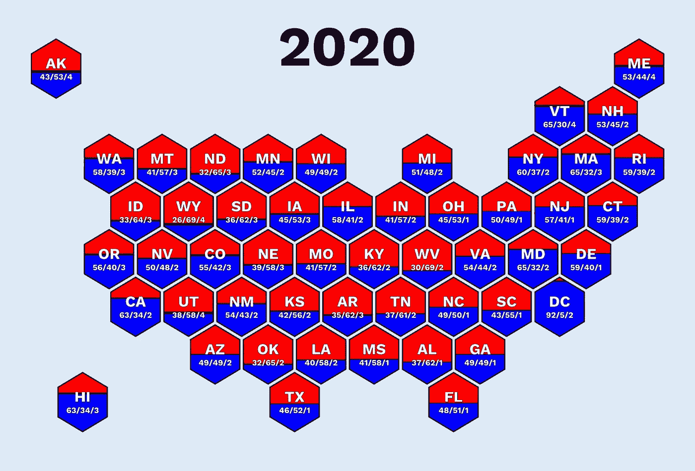
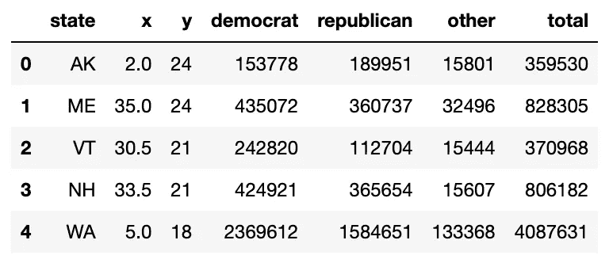
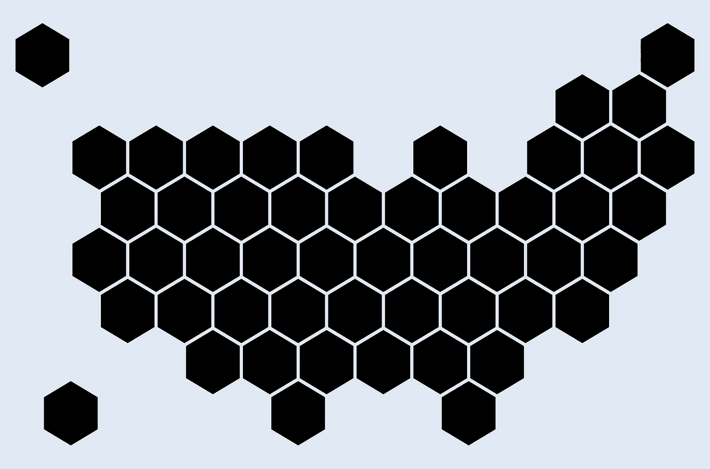
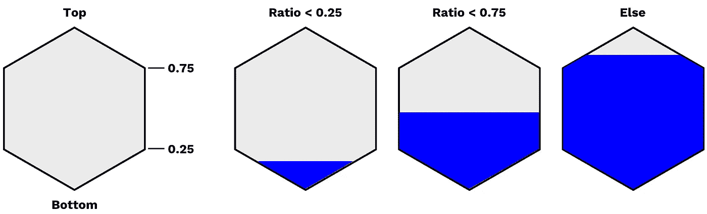
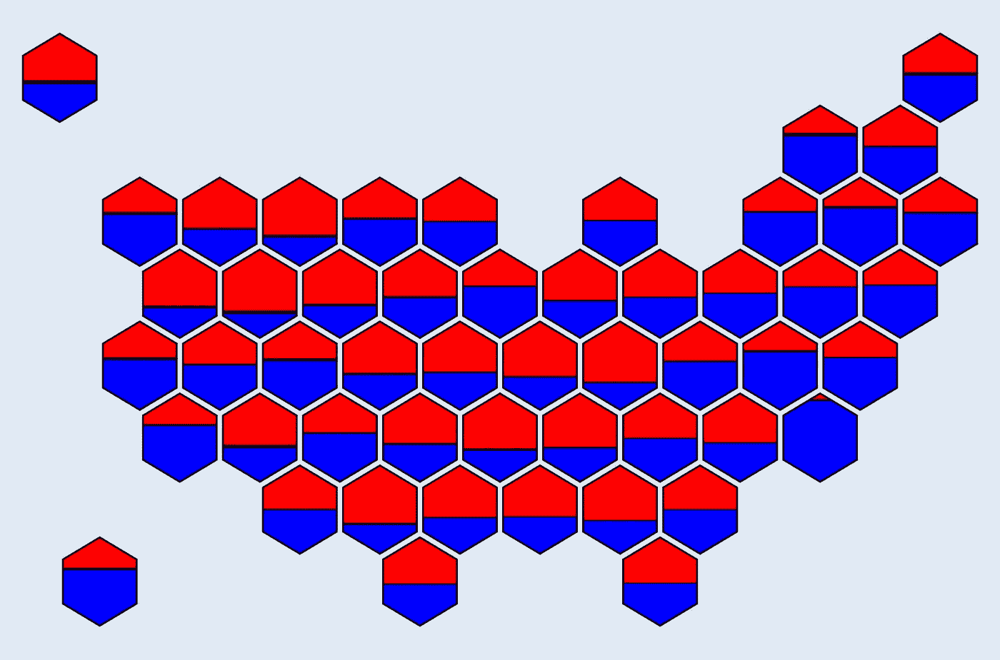
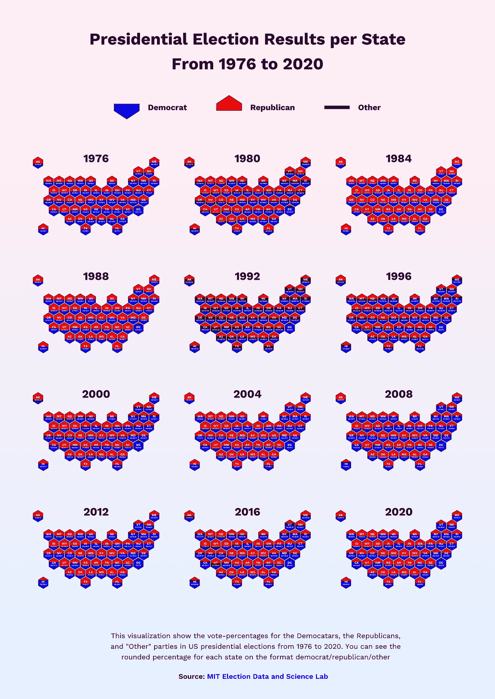

# 如何使用 Matplotlib 创建六边形地图

> 原文：[`towardsdatascience.com/how-to-create-hexagon-maps-with-matplotlib-eb5eef82ab2c`](https://towardsdatascience.com/how-to-create-hexagon-maps-with-matplotlib-eb5eef82ab2c)

## Matplotlib 教程

## 使用形状表示地理信息

[](https://medium.com/@oscarleo?source=post_page-----eb5eef82ab2c--------------------------------)[](https://towardsdatascience.com/?source=post_page-----eb5eef82ab2c--------------------------------) [Oscar Leo](https://medium.com/@oscarleo?source=post_page-----eb5eef82ab2c--------------------------------)

·发表于 [Towards Data Science](https://towardsdatascience.com/?source=post_page-----eb5eef82ab2c--------------------------------) ·阅读时间 7 分钟·2023 年 11 月 21 日

--



图表由作者创建

**让我们制作一些地图吧！🗺**

嗨，欢迎来到新的 matplotlib 教程。这一次，我将教你如何创建像上面这样的有洞察力的六边形地图。

可视化地理信息是困难的，因为区域（如国家）在大小和形状上有所不同。

结果是，当你使用常规地图绘制数据时，一些区域很难看清。

将国家名称或数值添加到你的可视化中也是困难的。

一种消除这些差异的替代方案是使用六边形地图。

这个想法是将每个区域表示为一个六边形，并将它们排列成类似实际地图的方式。

由于每个六边形的形状相同，添加信息以结构化的方式并创建美观的数据可视化变得容易。

本教程将教你如何使用美国总统选举的数据来做到这一点。

（不要忘记查看[我的其他 Matplotlib 教程](https://medium.com/@oscarleo/list/262e5d7f0847)）

让我们开始吧。🚀

## 第一步：导入库

我们首先导入所需的库。

```py
import pandas as pd
from matplotlib.patches import Polygon
import matplotlib.pyplot as plt
import seaborn as sns

import matplotlib.patheffects as PathEffects
```

就这样。

## 第二步：创建一个 seaborn 样式

接下来，我们使用 seaborn 来设置背景和字体。 我使用的是 `Work Sans` 和 `#F4EBCD`，但可以随意尝试。

```py
font_family = "Work sans"
background_color = "#E0E9F5"

sns.set_style({
    "axes.facecolor": background_color,
    "figure.facecolor": background_color,
    "font.family": font_family,
})
```

**仅供参考：** 如果我想将图表添加到信息图或类似内容中，我通常使用 `background_color="#00000000"` 以获得透明背景。

现在进入有趣的部分。

## 第三步：获取数据

我已经使用以下数据集准备了一个包含每个美国州投票数的 CSV 文件：[美国总统 1976–2020](https://dataverse.harvard.edu/dataset.xhtml?persistentId=doi%3A10.7910%2FDVN%2F42MVDX)（公共领域许可）。

这是如何访问它的方法。

```py
df = pd.read_csv(
    "https://raw.githubusercontent.com/oscarleoo/matplotlib-tutorial-data/main/us_election_2020.csv"
)
```

每一行代表一个州，并存储对民主党、共和党和“其他”政党的投票数。



作者截图

幸运的是，我准备了另外两列叫做 x 和 y，它们代表每个六边形的中心。

## 第 4 步：绘制六边形边界

既然我们有了数据，我们可以立即使用每行定义的中心绘制六边形的边界。

我们第一个与 Matplotlib 相关的函数接受一个`row`以及六边形的`width`和`height`。

它将这些信息结合起来，创建两个坐标列表，并以正确的格式返回它们。

```py
def get_hexagon_corners(row, width, height):
    cx, cy = row.x, row.y
    w2, h4 = width / 2, height / 4
    x = [cx, cx+w2, cx+w2, cx, cx-w2, cx-w2]
    y = [cy-2*h4, cy-h4, cy+h4, cy+2*h4, cy+h4, cy-h4]
    return list(zip(x, y))
```

现在，让我们定义`draw_hexagon()`，它接受一个`row`并使用`get_hexagon_corners()`在正确的位置绘制六边形。

```py
def draw_hexagon(ax, row, scale=1):
    width = 3 * scale
    height = 4 * scale

    xy = get_hexagon_corners(row, width, height)
    b_hexagon = Polygon(xy=xy, closed=True, facecolor="#000000", edgecolor="#000", linewidth=4)
    ax.add_artist(b_hexagon)

    # Additional functions
```

我硬编码`width`和`height`可能看起来有些奇怪，但你无需更改这些值，因此并不重要。

我选择了`width=3`和`height=4`，因为它给我一个好看的六边形。我使用`scale`参数来调整六边形之间的间距。

现在，我们可以将此函数与我们的标准 Matplotlib 代码一起运行。

```py
fig, ax = plt.subplots(figsize=(20, 20))
ax.set(xlim=(0, 37), ylim=(0, 27))

for i, row in df.iterrows():
    draw_hexagon(ax, row, scale=0.9)

ax.set_aspect(0.9, adjustable='box')
plt.axis("off")
plt.show()
```

我们得到以下图形。



如你所见，我将 51 个六边形排列成类似于美国的形状。

这是一个很好的开始！

## 第 5 步：添加颜色

定义六边形颜色的方法有很多种。

最常见的替代方案是根据类别定义颜色，或者基于诸如 GDP 等值的渐变，其中较低的值会导致例如更深的颜色。

为了让事情对你更有趣，我决定采取另一种方法。

我不想选择基础方法，而是根据每个政党的投票数量来为每个六边形上色。

一个六边形应该具有所有三种颜色，但根据投票数量的不同，比例会有所不同。

首先，我创建了一个函数，返回给定中心的六边形的最大值和最小值。

```py
def get_boundries(row, width, height):
    x_min = row.x - width / 2
    x_max = row.x + width / 2
    y_min = row.y - height / 2
    y_max = row.y + height / 2
    return x_min, x_max, y_min, y_max
```

接下来，我们有`fill_hexagon`函数，它定义了我们希望用颜色填充的区域。

有两个参数特别有趣。

+   `ratio`定义了要填充六边形的量（在垂直方向上，而不是按面积）。

+   `top`定义了我们是从顶部还是底部填充六边形。这对民主党和共和党会有所不同，你可以看到我们根据`top`定义了`y`、`y_start`和`h4`。

```py
def fill_hexagon(row, width, height, ratio, top=True):
    x_min, x_max, y_min, y_max = get_boundries(row, width, height)

    y = ratio * height
    y = y_max - y if top else y_min + y
    y_start = y_max if top else y_min
    h4 = height / 4 if top else - (height / 4)

    if ratio < 0.25:
        x_shift = 2 * ratio * width
        x = [row.x-x_shift, row.x, row.x+x_shift]
        y = [y, y_start, y]
    elif ratio < 0.75:
        x = [x_min, x_min, row.x, x_max, x_max]
        y = [y, row.y + h4, y_start, row.y + h4, y]
    else:
        x_shift = 2 * (1 - ratio) * width
        x = [row.x-x_shift, x_min, x_min, row.x, x_max, x_max, row.x+x_shift]
        y = [y, row.y - h4, row.y + h4, y_start, row.y + h4, row.y - h4, y]

    return list(zip(x, y))
```

一开始理解`if`语句并不容易。

这里有一张图解释了我们得到不同形状，并需要针对不同的阈值分别处理它们。



作者插图

现在，我们定义`d_ratio`和`r_ratio`以传递给`draw_hexagon()`并为民主党和共和党创建`Polygons`。

```py
def draw_hexagon(ax, row, edgecolor="#000", scale=1):
    width = 3 * scale
    height = 4 * scale

    xy = get_hexagon_corners(row, width, height)
    b_hexagon = Polygon(xy=xy, closed=True, facecolor="#000000", edgecolor="#000", linewidth=4)
    ax.add_artist(b_hexagon)

    # Additional functions
    d_ratio = row.democrat / row.total
    r_ratio = row.republican / row.total

    d_hexagon = Polygon(xy=fill_hexagon(row, width, height, d_ratio, top=False), closed=True, facecolor="blue")
    r_hexagon = Polygon(xy=fill_hexagon(row, width, height, r_ratio, top=True), closed=True, facecolor="red")

    ax.add_artist(d_hexagon)
    ax.add_artist(r_hexagon)
```

如果我们重新运行上一节的 matplotlib 代码，我们会得到以下图表。



请注意，水平黑线的厚度基于“其他”选项的投票数量而有所不同。

## 第 6 步：添加文本

大多数数据可视化需要一些文本来使其有意义。我想添加每个政党的州缩写和投票百分比。

```py
def add_text(row):
    center = (row.x, row.y - 0.2)
    d_ratio = row.democrat / row.total
    r_ratio = row.republican / row.total
    o_ratio = row.other / row.total

    a1 = plt.annotate(row.state, center, ha="center", va="bottom", fontsize=26, fontweight="bold", color="w")
    a2 = plt.annotate("{:.0f}/{:.0f}/{:.0f}".format(100 * d_ratio, 100 * r_ratio, 100 * o_ratio), (center[0], center[1] - 0.12), ha="center", va="top", fontsize=14, fontweight="bold", color="w")
    a1.set_path_effects([PathEffects.withStroke(linewidth=1, foreground="#000000")])
    a2.set_path_effects([PathEffects.withStroke(linewidth=1, foreground="#000000")])
```

我在 `draw_hexagon()` 之后直接添加了 `add_text()`。我还添加了年份以提供额外信息。

```py
fig, ax = plt.subplots(figsize=(20, 20))
ax.set(xlim=(0, 37), ylim=(0, 27))

for i, row in df.iterrows():
    draw_hexagon(ax, row, scale=0.9)
    add_text(row)

plt.annotate("2020", xy=(0.5, 0.93), fontsize=96, xycoords="axes fraction", ha="center", va="center", fontweight="bold", color="#000")

ax.set_aspect(0.9, adjustable='box')
plt.axis("off")
plt.show()
```

运行代码会得到以下的六边形地图。


图表由作者创建

就这样，我完成了我们要创建的最终图表。我使用 KeyNotes 添加了一些填充，但你几乎可以使用任何工具。

## 额外内容：这是我如何使用这个可视化的

我有一个免费的通讯，叫做 [Data Wonder](https://datawonder.substack.com/)，在里面我分享美丽且富有洞察的数据可视化。

在 “[Visualizing Election Results From 1976 to 2020](https://open.substack.com/pub/datawonder/p/us-election-results?r=17ashl&utm_campaign=post&utm_medium=web)” 版本中，我为上面的图表定义了一个透明背景。我使用 Corel Vector 创建了网格、渐变、标题和图例。



真是太酷了！ 😄

## 结论

六边形图表可能看起来复杂，但使用 Matplotlib 创建起来出奇的简单。

最大的挑战是将六边形对齐，使其类似于地图，同时保持顺序有意义。

这一次，我们学习了如何为美国制作这种图表，你可以将选举数据更改为任何你觉得有趣的信息。

例如，当我创建一个名为 “[The Escalating Crisis: Drug Overdose Deaths Across the U.S](https://datawonder.substack.com/p/the-escalating-crisis-drug-overdose)” 的可视化时，我使用了相同的代码。

感谢阅读，下次见！ :)
