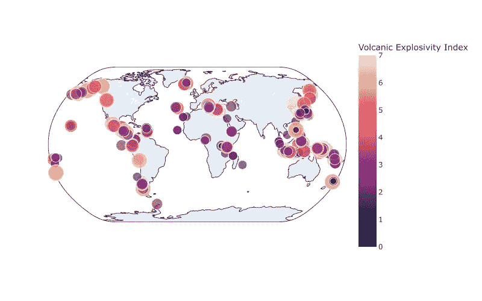

# 如何使用 Plotly 创建地图图

> 原文：[`towardsdatascience.com/how-to-create-map-plots-with-plotly-26111d38fff9`](https://towardsdatascience.com/how-to-create-map-plots-with-plotly-26111d38fff9)

## 来自显著火山爆发数据库的 5 个示例

 [Caroline Arnold](https://medium.com/@caroline.arnold_63207?source=post_page-----26111d38fff9--------------------------------)

·发布于[Towards Data Science](https://towardsdatascience.com/?source=post_page-----26111d38fff9--------------------------------) ·阅读时间 5 分钟·2023 年 9 月 10 日

--

[Willian Justen de Vasconcellos](https://unsplash.com/@willianjusten?utm_source=medium&utm_medium=referral) 的照片，来源于[Unsplash](https://unsplash.com/?utm_source=medium&utm_medium=referral)

[Plotly](https://plotly.com/)是一个很棒的开源数据可视化库。在这篇博客文章中，我将展示如何使用 plotly 生成制图图，利用 Python 后端进行操作。

为了说明，我将使用由美国国家环境信息中心发布的显著火山爆发数据库，依据[美国政府工作许可](https://www.usa.gov/government-works)。数据集可以在这里下载：[`public.opendatasoft.com/explore/dataset/significant-volcanic-eruption-database/information/`](https://public.opendatasoft.com/explore/dataset/significant-volcanic-eruption-database/information/)

你将看到以下五种可视化：

1.  显著火山爆发的全球分布

1.  北美火山类型

1.  与海啸相关的火山爆发

1.  最具破坏性的火山爆发

1.  有趣的地图投影

对于那些对使用 plotly 进行数据分析感兴趣的读者，请参阅我最近关于女子世界杯数据可视化的文章：

 ## 2023 年女子世界杯通过 Plotly 可视化

### 数据科学家的五种图表回顾

towardsdatascience.com

## 准备数据

在[下载](https://public.opendatasoft.com/explore/dataset/significant-volcanic-eruption-database/information/)火山喷发数据库后，我们将其加载为 pandas DataFrame。DataFrame 与 Plotly 自然集成，便于数据分析。我们将编码火山喷发是否与火山或地震相关的列转换为 True/False 值，并添加了表示喷发的*纬度*和*经度*的新列。

## 重大火山喷发的全球分布

第一个可视化展示了重大火山喷发的全球分布。这是一个 `scatter_geo` 散点图，分别使用经度和纬度作为*x*和*y*坐标。地图投影设置为 `natural earth` ，单个事件的颜色和大小根据其火山爆发指数进行调整。颜色比例尺使用了适合火山主题的内置熔岩顺序比例尺。

火山爆发指数散点图。图像：作者。

如我们所见，火山喷发并没有均匀分布在全球，而是集中在某些地区。这些地区与构造边界有关，例如美国西海岸和太平洋火圈。

这是生成可视化的代码：

## 北美的火山类型

火山有不同类型，其中一些比其他类型更频繁。在下一个可视化中，我们专注于北美。再次使用 `scatter_geo` 图，并使用关键字参数 `scope='north america'` 自动设置显示的地图范围到所需区域。

我们观察到著名的夏威夷盾形火山以及太平洋沿岸构造边界附近的大量成层火山。

北美的火山类型。图像：作者。

可视化是通过以下代码生成的：

## 与海啸相关的火山喷发

火山喷发通常与其他灾难事件如地震和海啸有关。在此可视化中，我们专注于太平洋，并在地形图上展示火山事件。颜色编码了事件是否伴有海啸。

Mapbox 瓦片可以通过 `scatter_mapbox` 获得。

伴随海啸的重大火山喷发。图像：作者。

此可视化是通过以下代码生成的：

## 最致命的火山喷发

现在我们转向火山喷发的副作用。数据集中涵盖的火山喷发规模巨大，通常伴随有大量的人员伤亡。

在这个可视化中，我们使用叠加了 mapbox 瓦片的密度图来说明火山喷发的致命影响。mapbox 瓦片是制图的，显示的是州界而不是像之前的可视化那样的地形图。颜色刻度的强度表示与个别喷发相关的总死亡人数。

火山喷发的致命影响。图片：作者。

发生在有人口的地区的火山喷发可能会造成更多的损害。从地图上看，印尼的岛屿群突显出来。该地区是火山活动频繁的太平洋火带的一部分，同时也是人口稠密的区域。在欧洲，罗马时期维苏威火山的灾难性喷发导致了高死亡人数。

生成此可视化的代码如下：

## 有趣的地图投影

由于地球不是平坦的，任何在二维平面上对其表面的表示都必须依赖于地图投影。投影可以强调地图的不同方面 [[`en.wikipedia.org/wiki/Map_projection`](https://en.wikipedia.org/wiki/Map_projection)]。

Plotly 提供了广泛的内置地图投影，可以与地理图表一起使用。要选择另一种地图投影，请在 `scatter_geo` 和其他绘图函数中更改 `projection` 关键字。

在这里，我们再次可视化按爆发性着色的火山，但使用的是 Foucaut 地图投影。这是一种面积保持投影，即离赤道越远的区域*不会*放大。注意与我们习惯的标准地图投影相比，格林兰岛显得多么微小！

Foucaut 投影。图片：作者。

## 摘要

我们使用 plotly 库中的制图散点图生成了五个可视化图。Plotly 提供了可以使用 mapbox 库的瓦片自动添加到图中的地形图。图表的自定义方式与标准图表类似。

制图图表非常适合展示数据集中事件的区域影响。与其他软件包（如 cartopy 和 folium）相比，plotly 库提供的功能较少。然而，如果你希望快速在地图上可视化数据，plotly 允许你在不深入了解地理空间数据格式的情况下实现这一点。

## 进一步阅读和参考

+   [`plotly.com/python/scatter-plots-on-maps/`](https://plotly.com/python/scatter-plots-on-maps/)

查看 Github 上的笔记本以生成图表：

 [## medium_notebooks/plotly/volcanic_activity.ipynb 在 main · crlna16/medium_notebooks

### 通过在 GitHub 上创建账户来为 crlna16/medium_notebooks 的开发做出贡献。

[github.com](https://github.com/crlna16/medium_notebooks/blob/main/plotly/volcanic_activity.ipynb?source=post_page-----26111d38fff9--------------------------------)
