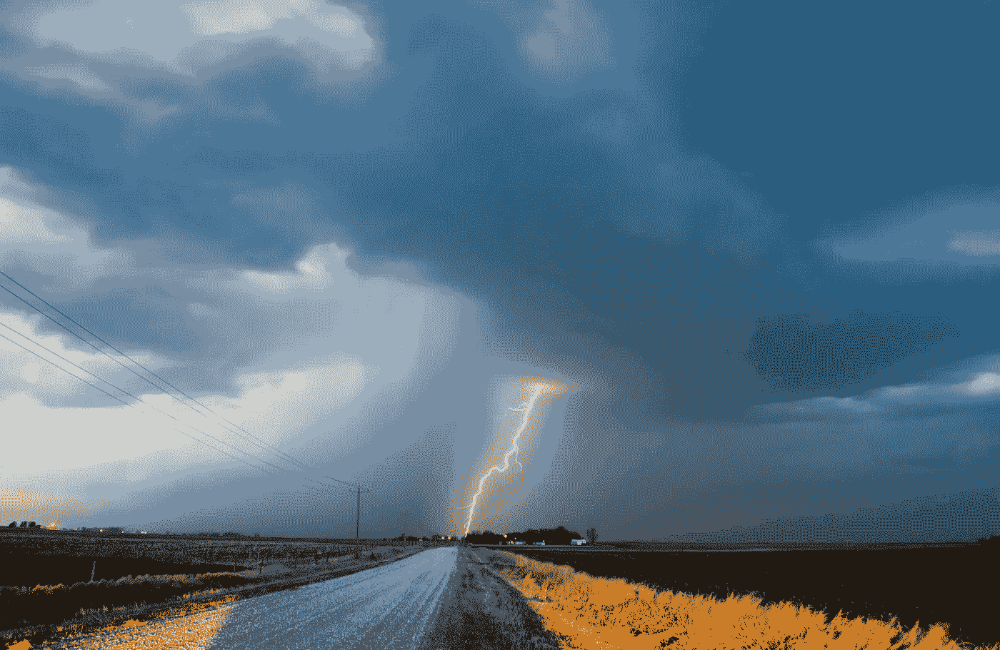

# 如何创建自己的 AI 天气预报

> 原文：[`towardsdatascience.com/how-to-create-your-own-ai-weather-forecast-de72c4c50810?source=collection_archive---------3-----------------------#2023-10-02`](https://towardsdatascience.com/how-to-create-your-own-ai-weather-forecast-de72c4c50810?source=collection_archive---------3-----------------------#2023-10-02)

## 使用预训练模型和再分析数据

 [Caroline Arnold](https://medium.com/@caroline.arnold_63207?source=post_page-----de72c4c50810--------------------------------)

·

[关注](https://medium.com/m/signin?actionUrl=https%3A%2F%2Fmedium.com%2F_%2Fsubscribe%2Fuser%2F9367198e7a3c&operation=register&redirect=https%3A%2F%2Ftowardsdatascience.com%2Fhow-to-create-your-own-ai-weather-forecast-de72c4c50810&user=Caroline+Arnold&userId=9367198e7a3c&source=post_page-9367198e7a3c----de72c4c50810---------------------post_header-----------) 发表于 [Towards Data Science](https://towardsdatascience.com/?source=post_page-----de72c4c50810--------------------------------) ·8 分钟阅读·2023 年 10 月 2 日

--

照片由 [NOAA](https://unsplash.com/@noaa?utm_source=medium&utm_medium=referral) 提供于 [Unsplash](https://unsplash.com/?utm_source=medium&utm_medium=referral)

数据驱动的天气预报与预训练模型的创建成本低廉，并能提供与传统数值天气模型相媲美的准确预报。几家公司和研究实验室已经开发了 AI 天气模型，包括：

+   PanguWeather [[华为]](https://github.com/198808xc/Pangu-Weather)

+   FourCastNet [[英伟达]](https://github.com/NVlabs/FourCastNet)

+   GraphCast [[Google DeepMind](https://github.com/google-deepmind/graphcast)]

欧洲中期天气预报中心（ECMWF）提供了使用这些模型生成天气预报的程序[1]。虽然模型推断可以在笔记本电脑上进行，但推荐使用 GPU。

在这篇文章中，我将

+   向你展示如何创建自己的人工智能天气预报

+   比较 GPU 和 CPU 上模型的推断时间

+   可视化 PanguWeather 和 FourCastNet 的天气预报，包括温度、水汽和喷射气流

## 背景信息

传统上，天气预报依赖于在全球网格上求解的数值天气模型。这需要大量的计算资源，世界上只有少数几个天气服务机构具备这样的能力…
