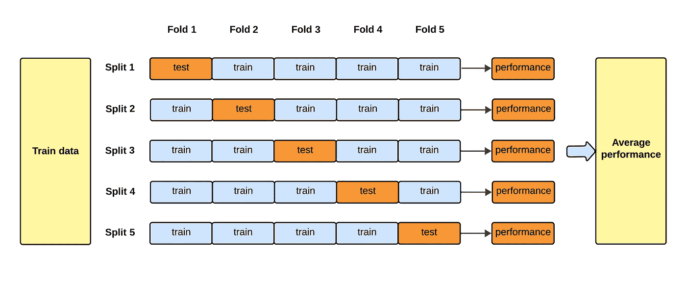
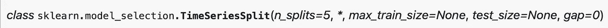
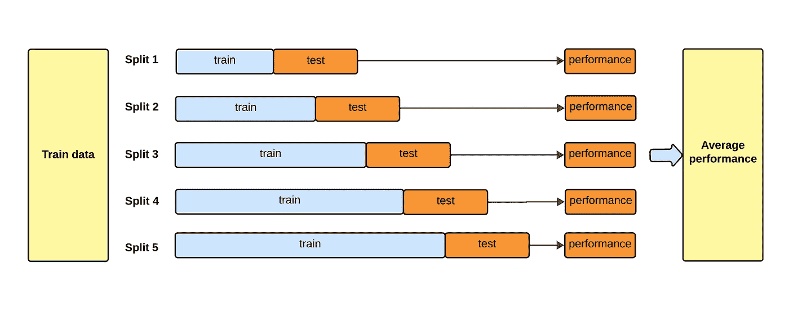

# 如何：时间序列数据的交叉验证

> 原文：[`towardsdatascience.com/how-to-cross-validation-with-time-series-data-9802a06272c6`](https://towardsdatascience.com/how-to-cross-validation-with-time-series-data-9802a06272c6)

## 说到时间序列数据，你必须以不同的方式进行交叉验证。

[](https://medium.com/@pelletierhaden?source=post_page-----9802a06272c6--------------------------------)[](https://towardsdatascience.com/?source=post_page-----9802a06272c6--------------------------------) [Haden Pelletier](https://medium.com/@pelletierhaden?source=post_page-----9802a06272c6--------------------------------)

·发布于 [Towards Data Science](https://towardsdatascience.com/?source=post_page-----9802a06272c6--------------------------------) ·5 分钟阅读·2023 年 12 月 29 日

--



标准的 k 折交叉验证。图像由作者提供

**交叉验证**是训练和评估机器学习模型的重要部分。它允许你估计训练好的模型在新数据上的表现。

大多数学习如何进行交叉验证的人首先了解的是**K 折方法**。我知道我就是这样。在 K 折交叉验证中，数据集被随机分成 n 折（通常是 5 折）。在 5 次迭代中，模型在 5 折中的 4 折上进行训练，而剩下的 1 折作为测试集用于评估性能。这个过程会重复，直到所有 5 折都被用作测试集为止。到最后，你将得到 5 个错误分数，将它们平均在一起，就会得到你的交叉验证分数。

但有个问题——这种方法实际上只适用于非时间序列/非顺序数据。如果数据的顺序有任何意义，或者任何数据点依赖于前面的值，**你不能使用 K 折交叉验证。**

原因很简单。如果你使用 KFold 将数据拆分为 4 个训练折和 1 个测试折，你将随机化数据的顺序。因此，曾经在其他数据点之前的数据点可能会出现在测试集中，最终，你***将使用未来的数据来预测过去。***

这绝对是不允许的。

## 在开发中测试模型的方式应该模拟它在生产环境中的运行方式。

如果你将在模型投入生产时使用过去的数据来预测未来的数据（就像时间序列中的做法），你应该在开发阶段以相同的方式测试你的模型。

这就是 TimeSeriesSplit 的作用。TimeSeriesSplit 是一个 scikit-learn 类，称自己为“KFold 的变体”。

> 在第 k 次拆分中，它返回前 k 个折叠作为训练集，第 (k+1) 个折叠作为测试集。



TimeSeriesSplit 如 scikit-learn 文档中定义的

TimeSeriesSplit 和 KFold 之间的主要区别是：

+   在 TimeSeriesSplit 中，训练数据集的大小逐渐增加，而在 KFold 中，它保持静态。

+   在 TimeSeriesSplit 中，训练集每次都会变大，因此训练数据总是包含之前迭代的训练数据中的值。在 KFold 中，当前迭代的训练数据可能在之前的迭代中作为测试数据的一部分，反之亦然。

+   在 KFold 中，数据集中的每个数据点在某一时刻都会成为测试集的一部分。而在 TimeSeriesSplit 中，第一块训练数据永远不会被包含在测试集中。

它是这样工作的：在第一次迭代时，数据被划分为训练集和测试集。测试集的大小（除非作为参数 test_size 指定）默认为 n_samples // (n_splits + 1)）而训练集的大小默认为 i * n_samples // (n_splits + 1) + n_samples % (n_splits + 1) 其中 i = 当前拆分次数。随着当前拆分次数的增加，i 增加，训练集的大小也增加。



一个时间序列交叉验证的视觉示意图。图片来自作者

为了更好地说明 TimeSeriesSplit 的工作原理，我将通过一个 Python 示例来演示。首先，我创建了一个非常简单的样本数据集：1 个特征，12 个值。然后我实例化了一个 TimeSeriesSplit 对象 tss，并指定了要 5 次拆分。为了实际进行拆分，我调用了 tss 的 .split 方法，并传入了我的数据集 X。这将产生一组索引，用于在交叉验证过程中确定拆分数据集的位置。为了查看数据是如何拆分的，我遍历了这些折叠及其相应的索引，并打印出了这些索引处的值。

```py
import numpy as np
from sklearn.model_selection import TimeSeriesSplit

# Create a sample dataset X and y
X = np.array([[1], [2], [3], [4], [5], [6], [7], [8], [9], [10], [11], [12]])
y = np.array([2, 4, 6, 8, 10, 12, 14, 16, 18, 20, 22, 24])

# Define TimeSeriesSplit object
tss = TimeSeriesSplit(n_splits=5)

# Split & print out results
for i, (train_index, test_index) in enumerate(tss.split(X)):
    print(f"Fold {i+1}:")
    print(f"  train:{X[train_index]}")
    print(f"  test:{X[test_index]}")
```

第一个结果看起来像这样：

Fold 1:

train:[[1] [2]]

test:[[3] [4]]

最后一个是这样的：

Fold 5:

train:[[ 1] [ 2] [ 3] [ 4] [ 5] [ 6] [ 7] [ 8] [ 9] [10]]

test:[[11] [12]]

现在对象和拆分索引已被定义，是时候进行实际的交叉验证（CV）了。我选择了一个随机森林回归器，但这可以用任何模型来完成。

幸运的是，scikit-learn 提供了一种简单的方法来进行交叉验证，通过其函数 **cross_validate**，它接受一个模型对象、X 和 y 数组、一个 cv 策略和一个评分指标（s）。

```py
from sklearn.ensemble import RandomForestRegressor
from sklearn.model_selection import cross_validate

# define model
rf = RandomForestRegressor()

# perform the cross-validation and get a score
cv = cross_validate(rf,X,y,cv=tss,scoring='neg_root_mean_squared_error')
```

如果你想在多个指标上进行交叉验证，你可以传入一个列表。你只需要确保每个指标都是 scikit-learn 的[可接受指标值](https://scikit-learn.org/stable/modules/model_evaluation.html#scoring-parameter)。

cross_validate 返回一个包含 fit_time、score_time 和 test_score 的 Python 字典。要找到平均 CV 分数，只需在 test_score 上调用 .mean()。

```py
cv['test_score'].mean()
```

有了这个，你将能够准确估计时间序列模型的表现。时间序列问题涉及的考虑因素和方法多种多样，超出了标准机器学习模板。研究时间序列问题的每一个步骤，从探索性数据分析（EDA）到交叉验证（CV）再到预测，并学习如何将时间序列特定技术正确应用于时间序列数据，是非常重要的。

**来源**

“TimeSeriesSplit。” scikit-learn，scikit-learn 开发者，2023 年，https://scikit-learn.org/stable/modules/generated/sklearn.model_selection.TimeSeriesSplit.html。
