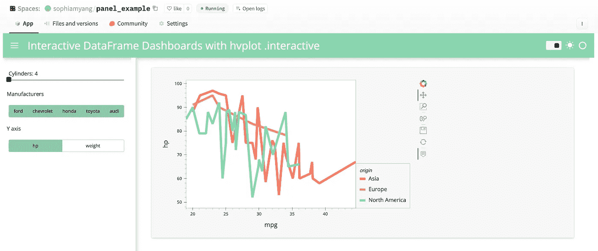
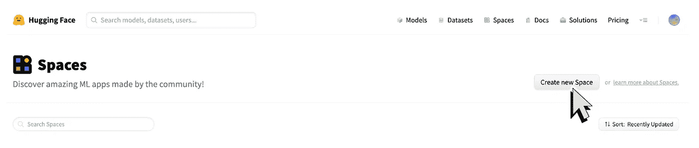
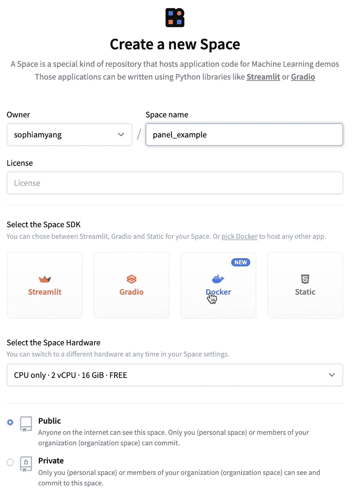
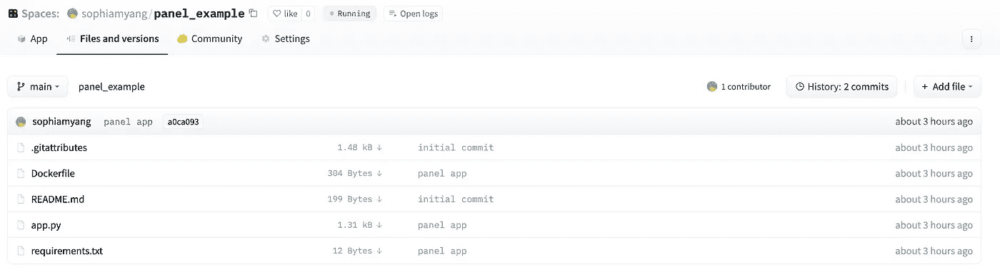
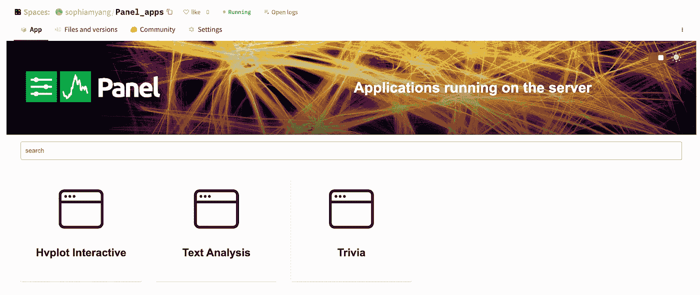
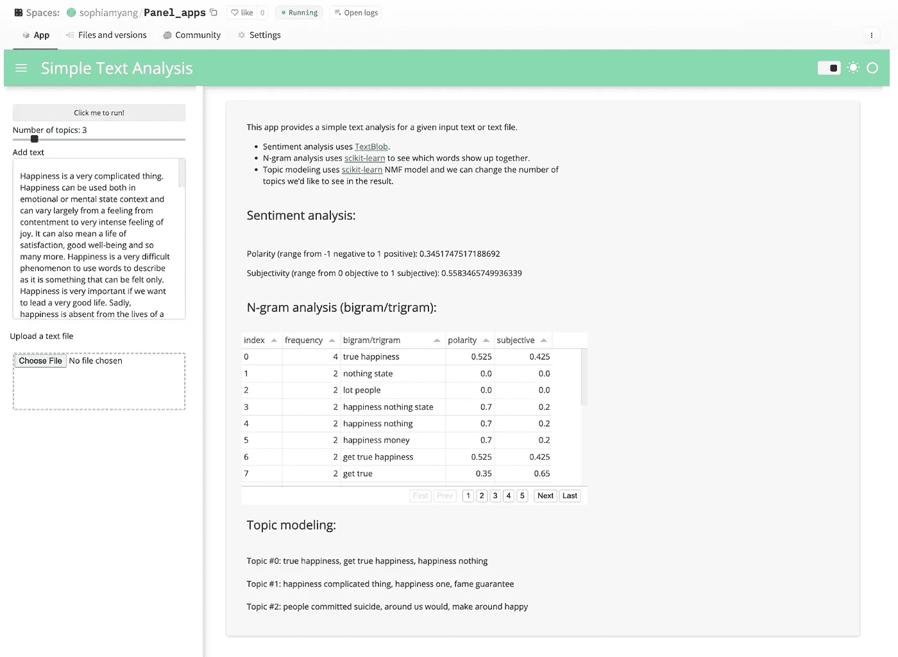

# 如何使用 Docker 将 Panel 应用部署到 Hugging Face

> 原文：[`towardsdatascience.com/how-to-deploy-a-panel-app-to-hugging-face-using-docker-6189e3789718`](https://towardsdatascience.com/how-to-deploy-a-panel-app-to-hugging-face-using-docker-6189e3789718)

## 五个简单步骤

[](https://sophiamyang.medium.com/?source=post_page-----6189e3789718--------------------------------)[](https://towardsdatascience.com/?source=post_page-----6189e3789718--------------------------------) [Sophia Yang, Ph.D.](https://sophiamyang.medium.com/?source=post_page-----6189e3789718--------------------------------)

·发表于 [Towards Data Science](https://towardsdatascience.com/?source=post_page-----6189e3789718--------------------------------) ·阅读时间 5 分钟·2023 年 1 月 6 日

--

作者：[Sophia Yang](https://twitter.com/sophiamyang) 和 [Marc Skov Madsen](https://twitter.com/MarcSkovMadsen)

你是否想将 Panel 应用部署到 Hugging Face，但不知道怎么做？通过五个简单的步骤，我们可以轻松地使用 Docker 将 Panel 应用部署到 Hugging Face。本文将逐步指导你完成这个过程。到本文结束时，你应该能够如下面所示地在 Hugging Face 上部署你自己的应用。这非常简单，而且是免费的。你还在等什么？让我们开始吧！



+   托管在 Hugging Face 上的 Panel 应用： [`huggingface.co/spaces/sophiamyang/panel_example`](https://huggingface.co/spaces/sophiamyang/panel_example)

+   独立应用链接： [`sophiamyang-panel-example.hf.space/app`](https://sophiamyang-panel-example.hf.space/app)

# 将 Panel 应用部署到 Hugging Face 的五个步骤

## **步骤 1：** [`huggingface.co/spaces`](https://huggingface.co/spaces)

访问 [`huggingface.co/spaces`](https://huggingface.co/spaces) 并点击“创建新空间”



## **步骤 2：创建新空间**

给它一个“空间名称”。这里我称之为“panel_example”。选择 Docker 作为空间 SDK，然后点击“创建空间”。



## **步骤 3：克隆仓库**

在命令行中克隆 Hugging Face 仓库（请记得将路径更改为你自己的用户名和空间名称）：

```py
git clone https://huggingface.co/spaces/sophiamyang/panel_example
```

现在你应该在电脑上看到一个名为“panel_example”的目录，其中只有一个 README.md 文件。

## **步骤 4：创建三个文件**

现在让我们在这个文件夹中创建三个文件：

+   `app.py` 是我们 Panel 应用的文件

你可以从 [`huggingface.co/spaces/sophiamyang/panel_example/blob/main/app.py`](https://huggingface.co/spaces/sophiamyang/panel_example/blob/main/app.py) 复制 app.py 文件

要了解更多关于如何创建 Panel 应用的信息，请查看我们之前的博客文章 创建交互式仪表板的最简单方法 和 [构建 Panel 可视化仪表板的 3 种方法](https://sophiamyang.medium.com/3-ways-to-build-a-panel-visualization-dashboard-6e14148f529d?sk=2cd93ae39586305bae8cfaead2bf7bb4)。

+   `requirements.txt` 定义了我们 Panel 应用所需的包。

我们的 Panel 应用只需要两个包：panel 和 hvplot。因此，我们只在我们的 [requirements.txt](https://huggingface.co/spaces/sophiamyang/panel_interactive/blob/main/requirements.txt) 中包含这两个包。

```py
panel
hvplot
```

+   `Dockerfile` 列出了我们希望 Docker 执行的所有命令，以便构建和运行镜像作为容器。要了解更多关于 Docker 的信息，请查看这个 [视频](https://www.youtube.com/watch?v=0H2miBK_gAk)。

在这个 Dockerfile 中，我们指定了 `python:3.9` 作为基础镜像，将工作目录设置为 `/code`，将 `requirements.txt` 文件复制到容器中，运行 `pip install` 来安装包到容器中，将目录中的每个文件复制到容器中，然后 CMD 提供了运行 Panel 应用的命令。请注意，通常我们运行 `panel serve app.py` 来服务一个 Panel 应用。在这个文件中，我们将命令拆分为字符串列表。我们还需要定义地址和端口，因为 Hugging Face 使用端口 7860 作为默认端口。我们还需要定义标志 `allow-websocket-origin` 以允许连接到服务器的 websocket。

! 重要：请记得将 sophiamyang-panel-example.hf.space 更改为 YOURUSERNAME-SPACENAME.hf.space。

```py
FROM python:3.9

WORKDIR /code

COPY ./requirements.txt /code/requirements.txt

RUN pip install --no-cache-dir --upgrade -r /code/requirements.txt

COPY . .

CMD ["panel", "serve", "/code/app.py", "--address", "0.0.0.0", "--port", "7860", "--allow-websocket-origin", "sophiamyang-panel-example.hf.space"]
```

## **第 5 步：** 提交所有更改并使用 git 推送更改：

```py
git add *
git commit
git push
```

现在你应该能在你的 Hugging Face 空间中看到这些文件。



在经过 Hugging Face 几分钟的努力构建我们的应用程序后，我们的 Panel 应用将会出现在应用标签中，你可以在这里找到独立应用链接：[`sophiamyang-panel-example.hf.space/app`](https://sophiamyang-panel-example.hf.space/app)。


# 如何本地运行 Docker？（可选步骤）

在你开发应用时，你可能希望在部署到 Hugging Face 之前，通过 Docker 本地运行应用。在第 4 步中，`app.py` 和 `requirements.txt` 与上述相同。然而，我们需要对 `Dockerfile` 做一个小的更改：

! 重要：我们在本地运行 Docker 时需要将 sophiamyang-panel-example.hf.space 更改为 0.0.0.0:7860。另一种**更好的**方法是将 0.0.0.0:7860 添加到允许的 WebSockets 中，除了 Hugging Face URL：

```py
FROM python:3.9

WORKDIR /code

COPY ./requirements.txt /code/requirements.txt

RUN pip install --no-cache-dir --upgrade -r /code/requirements.txt

COPY . .

CMD ["panel", "serve", "/code/app.py", "--address", "0.0.0.0", "--port", "7860", "--allow-websocket-origin", "sophiamyang-panel-example.hf.space",  "--allow-websocket-origin", "0.0.0.0:7860"]
```

要在本地使用 Docker，我们只需了解三个命令：

```py
docker build -t panel-image .
docker run --name panel-container -p 7860:7860 panel-image
docker rm panel-container
```

+   首先，确保我们在项目目录中。然后运行 `docker build -t panel-image .` 来根据这个目录中的文件构建 Docker 镜像。

+   其次，运行这个 Docker 镜像：`docker run --name panel-container -p 7860:7860 panel-image`。现在你应该可以在 0.0.0.0:7860 看到你的应用程序正在运行。

+   如果你想对文件进行任何更改，你需要先删除容器：`docker rm panel-container`，然后重复前面提到的前两个命令。

# 我们可以在 Hugging Face 上同时服务多个 Panel 应用程序吗？

是的，你绝对可以。查看我的示例：[`huggingface.co/spaces/sophiamyang/Panel_apps`](https://huggingface.co/spaces/sophiamyang/Panel_apps) 和相应的独立应用链接：[`sophiamyang-panel-apps.hf.space/`](https://sophiamyang-panel-apps.hf.space/)



当我们点击其中一个应用程序，例如，“文本分析”，我们可以看到我们的文本分析应用在 Hugging Face 上显示出来。



**结论**

在这篇文章中，我们展示了如何通过 Docker 将 Panel 应用程序部署到 Hugging Face，分为五个简单步骤。试试看吧！如果你有问题或想与 Panel 社区分享你的应用程序，请访问 [`discourse.holoviz.org/.`](https://discourse.holoviz.org/.)

**参考文献**：

+   [`panel.holoviz.org/`](https://panel.holoviz.org/)

+   [`huggingface.co/docs/hub/spaces-sdks-docker-first-demo`](https://huggingface.co/docs/hub/spaces-sdks-docker-first-demo)

+   [`www.youtube.com/watch?v=0H2miBK_gAk`](https://www.youtube.com/watch?v=0H2miBK_gAk)

+   博客文章 在 Python 中创建交互式仪表盘的最简单方法

+   博客文章 [构建 Panel 可视化仪表盘的 3 种方法](https://sophiamyang.medium.com/3-ways-to-build-a-panel-visualization-dashboard-6e14148f529d?sk=2cd93ae39586305bae8cfaead2bf7bb4)

. . .

由 [Sophia Yang](https://twitter.com/sophiamyang) 和 [Marc Skov Madsen](https://twitter.com/MarcSkovMadsen) 于 2022 年 1 月 6 日发布。

Sophia Yang 是 Anaconda 的高级数据科学家。请在 [LinkedIn](https://www.linkedin.com/in/sophiamyang/)、[Twitter](https://twitter.com/sophiamyang) 和 [YouTube](https://www.youtube.com/SophiaYangDS) 上与我联系，并加入 DS/ML [书友会](https://dsbookclub.github.io/) ❤️
