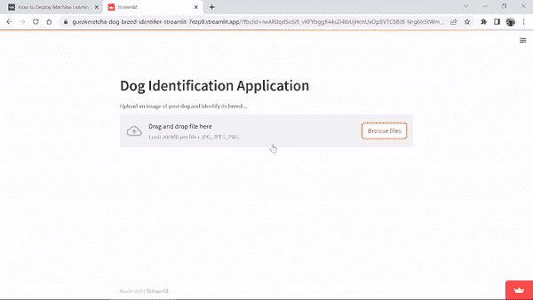
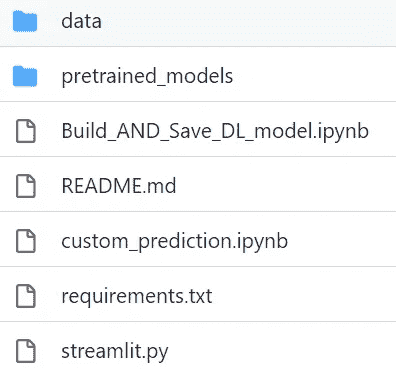
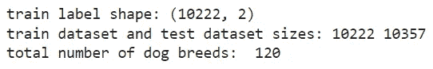
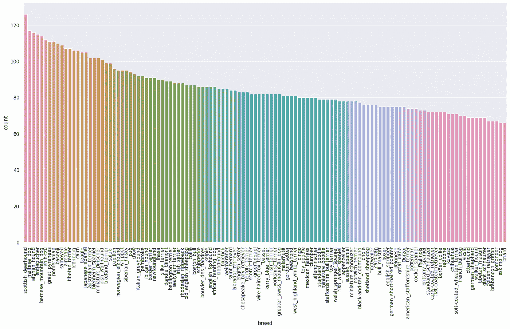
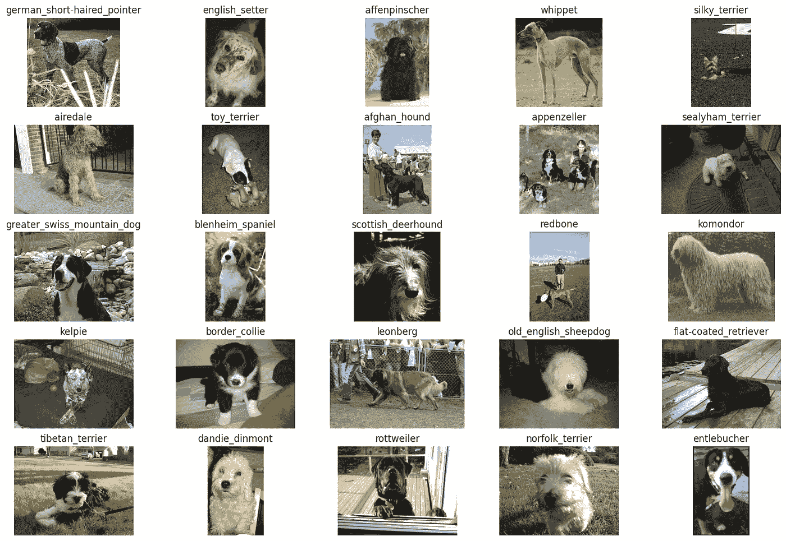
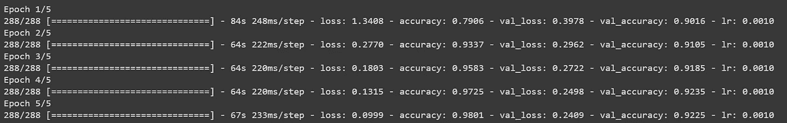
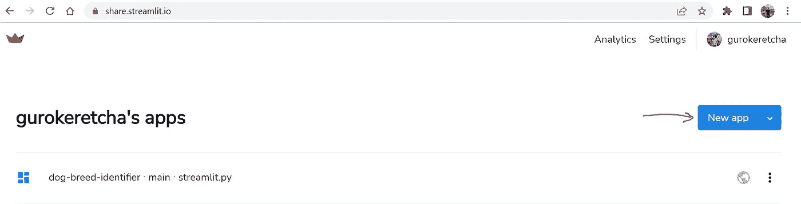
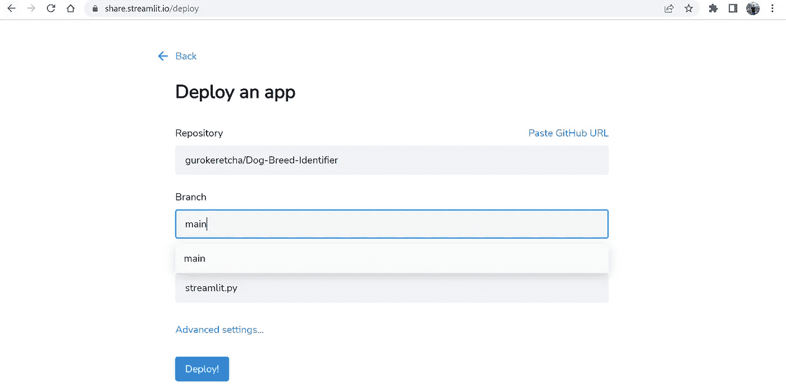

# 如何部署机器学习模型？端到端的狗品种识别项目！

> 原文：[`towardsdatascience.com/how-to-deploy-machine-learning-models-end-to-end-dog-breed-identification-project-5689457d8973`](https://towardsdatascience.com/how-to-deploy-machine-learning-models-end-to-end-dog-breed-identification-project-5689457d8973)

## 在网上部署你的 ML 模型的最简单方法。

[](https://medium.com/@gkeretchashvili?source=post_page-----5689457d8973--------------------------------)[](https://towardsdatascience.com/?source=post_page-----5689457d8973--------------------------------) [Gurami Keretchashvili](https://medium.com/@gkeretchashvili?source=post_page-----5689457d8973--------------------------------)

·发表于[Towards Data Science](https://towardsdatascience.com/?source=post_page-----5689457d8973--------------------------------) ·9 分钟阅读·2023 年 4 月 3 日

--

# **I. 介绍**

在这篇文章中，我将逐步讲解使用 Streamlit 部署你的 ML 项目到网上的最简单和最快的方法。这个项目是关于狗品种识别的，它可以将狗分类到 120 种品种中。我将更多关注于项目的部署部分，而不是构建复杂的机器学习模型。

在进一步讨论之前，让我们看看下面的项目演示：



部署演示（作者制作的 gif）

你可以在演示中尝试— [**这里**](https://gurokeretcha-dog-breed-identifier-streamlit-7itzp9.streamlit.app/?fbclid=IwAR0qdSoSi9_vXFYbggB44sZI4lbUjHcnUxOpBVTCBBJ8-Nrg6tr5tWmh_iI),

项目的 GitHub 链接在-[**这里**](https://github.com/gurokeretcha/Dog-Breed-Identifier)

## **文章大纲：**

+   **背景**

+   **项目教程** A. 构建和训练模型 (Build_AND_Save_DL_model.ipynb)

    B. Streamlit 应用程序 (streamlit.py)

    C. 部署

+   **常见错误和故障排除**

+   **结论和未来工作**

# **II. 背景**

在 Jupyter 笔记本中构建机器学习模型是一回事，而部署模型则是另一回事，这需要创建一个服务，供其他用户通过互联网访问。部署 ML 模型的方法和工具有很多，例如使用像 Flask 或 Django 这样的轻量级网络框架构建 REST API。该 API 可以从网页或移动应用程序中调用以获取模型的预测。此外，你还可以使用如 Google Cloud Functions 或 AWS Lambda 这样的平台将 ML 模型部署为无服务器函数。同时，你还可以将机器学习模型及其依赖项打包到 Docker 容器中，并将其部署到 Docker Swarm 或 Kubernetes 等管理平台。部署选项取决于项目需求，如预算、可扩展性和性能。根据这些需求，开发者应选择适当的方法。在我们的案例中，我们使用 Streamlit 构建机器学习模型，Streamlit 是一个用于构建数据科学网页应用程序的 Python 框架。我们还将使用相同的免费 Streamlit 平台来托管它。

# **III. 项目教程**

项目库包含以下文件/文件夹。



项目目录（图片由作者提供）

**两个重要的文件：**

A. Build_AND_Save_DL_model.ipynb -> 训练和保存机器学习模型。

B. Streamlit.py -> 使用 Streamlit 构建交互式网页应用程序并进行自定义预测。

**其他文件/文件夹：**

+   data -> 该文件夹存储自定义数据集和狗品种名称（训练数据集较大，你可以从 Kaggle 直接[下载](https://www.kaggle.com/datasets/jessicali9530/stanford-dogs-dataset)）

+   pretrained_models -> 存储预训练的精细调整过的 efficientnet3 模型。

+   README.md -> 项目相关信息的文本

+   custom_prediction.ipynb -> （可选）实验性 Jupyter 笔记本，用于对预训练模型进行自定义推理。

+   requirements.txt -> 用于在 Streamlit 网站上进行推理的包需求。

## A. [**Build_AND_Save_DL_model.ipynb**](https://github.com/gurokeretcha/Dog-Breed-Identifier/blob/main/Build_AND_Save_DL_model.ipynb)

1.  **导入库和辅助函数。**

我使用了已经安装了 Python 库的 Google Colab。

```py
# I use tensorflow 2.9.1 version to train model
!pip install tensorflow==2.9.1

import pandas as pd
import pickle
from PIL import Image
from google.colab import drive
import matplotlib.pyplot as plt
import matplotlib.image as mpimg
import tensorflow as tf
import numpy as np
import zipfile
import os
import warnings
import shutil
import seaborn as sns
import random
from tensorflow.keras import layers
from tensorflow.keras.layers.experimental import preprocessing
warnings.filterwarnings("ignore")
drive.mount('/content/gdrive')
print(tf.__version__)

def unzip_data(filename):
  """
  Unzips filename into the current working directory.
  Args:
    filename (str): a filepath to a target zip folder to be unzipped.
  """
  zip_ref = zipfile.ZipFile(filename, "r")
  zip_ref.extractall()
  zip_ref.close()

def plot_value_count(df, column):
 """
 plots value count of dataframe column
 """
 sns.set(style='darkgrid')
 plt.figure(figsize= (20,10))
 sns.countplot(x=column, data=df, order = df[column].value_counts().index)
 plt.xticks(rotation=90)
 plt.show()

unzip_data("/content/gdrive/MyDrive/dog-breed-identification/dog-breed-identification.zip")
```

如果你尝试在本地训练模型，确保使用批处理脚本创建一个新的 python 虚拟环境：

```py
python -m venv /path/to/new/virtual/environment
```

然后安装库，以避免包依赖问题。

**2\. 理解数据**

构建机器学习模型很重要，但在此之前，关键是要可视化数据及其统计信息。让我们看看训练样本和测试样本的总数，以及狗的品种总数。同时，我们还可视化每个狗品种的频率。

```py
labels_df=pd.read_csv('labels.csv')

train_images = os.listdir("/content/train/")
test_image = os.listdir("/content/test/")

# how many dog breed? 
target_labels = sorted(labels_df['breed'].unique().tolist())

print('train label shape:', labels_df.shape)
print('train dataset and test dataset sizes:',len(train_images), len(test_image))
print('total number of dog breeds: ',len(target_labels))
# lets plot distribution of dog breeds in training data
plot_value_count(labels_df, 'breed')
```



输出结果（图片由作者提供）



每个狗品种的计数（图片由作者提供）

**3\. 创建数据结构**

原始数据只包含一个文件夹中的所有品种的图像，因此，我为每个品种创建了一个文件夹，以创建特定格式来存储数据，并在后续加载。

```py
# 1.create class folders
parent_folder = "data"
datasets = ["all_data"]
for i in datasets:
  for j in target_labels:
      os.makedirs(parent_folder + "/" + i + "/" + j,  exist_ok=True)

# all data
for _, name, label in labels_df.itertuples():
  original_path = "/content/train/" + name +".jpg"
  dest_path = "/content/data/all_data/" + label
  shutil.copy(original_path, dest_path)
```

**4\. 可视化随机图像**

在这里，我只是可视化随机训练图像。

```py
all_data_dir = "/content/data/all_data/"

def view_25_random_image(target_dir, target_classes):
  plt.figure(figsize=(18, 12))
  random_images = []
  for i, target_class in enumerate(target_classes):
    # setup the target directory
    target_folder = target_dir + target_class

    # get the random image path
    random_image = random.sample(os.listdir(target_folder),1)
    img = mpimg.imread(target_folder + "/" + random_image[0])
    #print(target_folder + "/" + random_image[0])
    #print(random_image)
    plt.subplot(5,5,i+1)
    plt.imshow(img)
    plt.title(f"{target_class}")
    plt.axis("off");
    random_images.append(img)
    #print(f"image shape: {img.shape}")
  return random_images

random_images = view_25_random_image(target_dir=all_data_dir,
                                target_classes = random.sample(target_labels, 25))
```



狗的图像（图像由作者提供）

**5\. 获取数据**

由于我们创建了特定的数据存储格式，因此我们可以轻松地从图像文件夹生成 tensorflow 数据集。

```py
tf.random.set_seed(42)
IMG_SIZE  = (256,256)
IMG_SHAPE = IMG_SIZE +(3,)
BATCH_SIZE = 32
data_all = tf.keras.preprocessing.image_dataset_from_directory(all_data_dir,
                                                              label_mode = "categorical",
                                                              image_size=IMG_SIZE,
                                                              batch_size=BATCH_SIZE,
                                                               )
print(f"all_data batches: {len(data_all)}")
```

**6\. 训练模型**

我使用了几种数据增强技术，如 RandomFlip、RandomCrop、Randomrotation 等。同时，我使用了两个回调函数，如减少学习率回调，它会在验证准确率停止提高时减少学习率，以及早停法，它会在验证准确率不再提高时停止训练。减少学习率有助于模型更慢地收敛，从而潜在地找到更好且更具泛化能力的解决方案。而早停法则有助于模型避免过拟合，提前停止训练。至于 ML 模型架构，我使用了预训练的 EfficientNetB3 模型，然后用我们的新数据进行微调。EfficientNetB3 是一种卷积神经网络架构，由 Tan 等人在 2019 年提出，使用较少的参数和计算资源而达到最先进的准确率。

```py
#data augmentation
data_augmentation_layer = tf.keras.models.Sequential([
                                                preprocessing.RandomFlip("horizontal"),
                                                preprocessing.RandomCrop(height=224, width=224),
                                                preprocessing.RandomRotation(0.2),
                                                preprocessing.RandomZoom(0.1),
                                                preprocessing.RandomContrast(factor=0.1),
                                                ])

# EarlyStopping Callback (stop training in val accuracy not improves)
early_stopping = tf.keras.callbacks.EarlyStopping(monitor="val_accuracy", 
                                                  patience=5,
                                                  restore_best_weights=True)

#ReduceLROnPlateau Callback (Creating learning rate)
reduce_lr = tf.keras.callbacks.ReduceLROnPlateau(monitor="val_accuracy",  
                                                 factor=0.2, # multiply the learning rate by 0.2 (reduce by 5x)
                                                 patience=2,
                                                 verbose=1, # print out when learning rate goes down 
                                                 min_lr=1e-5)

baseline_model = tf.keras.applications.EfficientNetB3(include_top=False)
# trainable freeze
baseline_model.trainable = False
inputs = tf.keras.Input(shape = IMG_SIZE+(3,), name = "input_layer")
#x = data_augmentation_layer(inputs)
x = baseline_model(inputs, training=False) # weights whhich need to stay frozen, stay frozen
x = layers.GlobalAveragePooling2D(name="global_average_pool_layer")(x)
x = layers.Dense(len(data_all.class_names))(x)
outputs = layers.Activation("softmax", dtype=tf.float32)(x)
model_0 = tf.keras.Model(inputs, outputs)

train_size = int(0.9 * len(data_all))
print(train_size)

model_0.compile(optimizer=tf.keras.optimizers.Adam(),
                              loss="categorical_crossentropy",
                              metrics = ["accuracy"])

history_0 = model_0.fit(data_all.take(train_size),
                                      epochs=5,
                                      validation_data = data_all.skip(train_size),
                                      callbacks = [
                                                    early_stopping,
                                                    reduce_lr
                                                  ]) 
```



训练结果（图像由作者提供）

**7\. 保存模型和类名**

这是最后一步。微调模型后，我保存了训练好的模型和品种名称，以便后续使用。

```py
 #save model
model_0.save('/content/gdrive/MyDrive/dog-breed-identification/EfficientNetB3_Model.h5')

breed_names = data_all.class_names
breed_names = [n.replace('_',' ').capitalize() for n in breed_names]
print(breed_names[0:3])

#save dog breed names
with open('/content/gdrive/MyDrive/dog-breed-identification/class_names', 'wb') as fp:
    pickle.dump(breed_names, fp)
```

## B. [**Streamlit.py**](https://github.com/gurokeretcha/Dog-Breed-Identifier/blob/main/streamlit.py)

1.  **导入库、预训练模型和品种类名**

```py
import streamlit as st
import tensorflow as tf
from tensorflow.keras.preprocessing.image import load_img
from tensorflow.keras.preprocessing.image import img_to_array
import pickle
import numpy as np
import pathlib
import matplotlib.pyplot as plt
from PIL import Image

IMG_SIZE  = (256, 256)
IMG_SHAPE = IMG_SIZE +(3,)

#1\. load model
@st.cache_resource
def load_model():
    return tf.keras.models.load_model('pretrained_models/EfficientNetB3_Model.h5')

loaded_model = load_model()

#2\. load class names
with open ('data/class_names', 'rb') as fp:
    class_names = pickle.load(fp)
```

**2\. 创建网页应用**

我使用 Streamlit 脚本创建了一个互动式网页界面。我创建了网页的标题和文件上传对象。

```py
st.header("Dog Identification Application")

uploaded_file = st.file_uploader("Upload an image of your dog and identify its breed...", type=['jpg', 'jpeg', 'png'])
```

**3\. 进行预测**

当文件上传后，图像首先被调整大小，然后输入到加载的预训练模型中。如果预测的置信度分数超过 50%，则会在图像顶部显示一个预测结果；如果最大置信度低于 50%，则会基于前两个最高置信度分数显示两个结果。在网站的末尾，有一个包含我们模型知道的所有 120 个狗品种的列表。

```py
 # If an image is uploaded, display it and make a prediction
if uploaded_file is not None:
    img = Image.open(uploaded_file).resize(IMG_SIZE)
    img = np.array(img, dtype=np.float32)
    img_g = np.expand_dims(img, axis=0)
    custom_predict = loaded_model.predict(img_g)

    # Display the uploaded image and the predictions
    # st.write(f"{class_names[np.argmax(custom_predict[0])]}  ({round(np.max(custom_predict[0]*100))}% confidence)")
    if round(np.max(custom_predict[0]*100))>50:
        st.write(f'<p style="font-size:26px; color:green;"> {class_names[np.argmax(custom_predict[0])]}  ({round(np.max(custom_predict[0]*100))}% confidence)</p> ', unsafe_allow_html=True)
    else:
        argsorts = np.argsort(custom_predict[0])
        sorts = np.sort(custom_predict[0])
        st.write(f'<p style="font-size:26px; color:red;"> {class_names[argsorts[-1]]}  ({round(sorts[-1]*100)}% confidence) OR {class_names[argsorts[-2]]}  ({round(sorts[-2]*100)}% confidence)</p> ', unsafe_allow_html=True)

    st.image(img/255,  use_column_width=True)
    st.write('Notes:')
    st.write('1\. The model is a first simplest baseline version, the prediction result will be improved in later versions')
    st.write('2\. The model can identify up to 120 types of dog breeds')
    option = st.selectbox(
    'All Breeds',
    class_names)
```

你可以通过运行 bash 命令在本地主机上可视化结果

```py
streamlit run Streamlit.py
```

## C. **部署**

由于所有项目都是在本地创建的，现在是时候将其部署到网上了。这一步非常简单。

1.  **上传到 GitHub**

首先，我们上传以下文件/文件夹：

+   Streamlit.py，

+   pretrained_models/EfficientNetB3_Model.h5

+   data/class_names

+   requirements.txt

在 GitHub 存储库中。

**2\. 将 GitHub 存储库连接到** [**Streamlit**](https://streamlit.io/)**.**

之后，登录[Streamlit](https://streamlit.io/)网站，创建账户并点击“新建应用”



Streamlit 平台（图片来自作者）

我们只需按照指示操作。



Streamlit 的新应用程序说明（图片来自作者）

# IV. 常见错误与故障排除

以下是构建项目过程中一些最可能的错误和建议的解决方案。

1.  打包依赖问题：如果你在本地训练模型，可能会遇到此问题，请确保创建 python 虚拟环境，然后安装库。

1.  打包错误：使用 Google Colab 时，某些 Tensorflow 版本在保存模型时会出现问题，因此在 Google Colab 中使用 Tensorflow 版本 2.9.1。

1.  连接 GitHub 账户后 Streamlit 应用程序无法正常工作：这主要是因为缺少包。请确保在 GitHub 中上传了包含特定包的 requirements.txt 文件。Streamlit 将自动查找该文件并安装所有运行应用程序所需的包。

# V. 结论与未来工作

总结来说，我开发了一个简单的深度学习模型，可以从 120 种狗品种中识别出狗。此外，我使用 Streamlit 将模型托管在网上。该模型在验证数据上的准确率约为 94%，这是一个相当不错的结果。尽管模型运行良好，但也存在一些缺点。例如，模型的置信度评分没有校准，即置信度评分不能代表真实的预测概率。此外，模型只知道 120 种狗的品种，因此无法识别所有狗品种。此外，模型不知道自己不知道的情况。例如，如果你上传一张飞机的图片，模型无法告诉你那不是一只狗。我将尝试在应用程序的后续版本中克服这些问题。

> 希望你喜欢这篇文章，现在可以开始自己创建漂亮的应用程序了。如果你有任何问题或想分享对这篇文章的看法，随时评论，我会很乐意回答。
> 
> 如果你想直接支持我的工作并且获得 Medium 文章的无限制访问权限，请通过我的[推荐链接](https://medium.com/@gkeretchashvili/membership)成为 Medium 会员。非常感谢，祝你有美好的一天！

[](https://medium.com/@gkeretchashvili/membership?source=post_page-----5689457d8973--------------------------------) [## 使用我的推荐链接加入 Medium - Gurami Keretchashvili

### 阅读 Gurami Keretchashvili 的每个故事（以及 Medium 上的其他数千位作者的故事）。你的会员费直接…

medium.com](https://medium.com/@gkeretchashvili/membership?source=post_page-----5689457d8973--------------------------------)
