# 如何将 PyTorch 模型部署为生产就绪的 API

> 原文：[`towardsdatascience.com/how-to-deploy-pytorch-models-as-production-ready-apis-f61136fd0244`](https://towardsdatascience.com/how-to-deploy-pytorch-models-as-production-ready-apis-f61136fd0244)

## 一个将 PyTorch Lightning 和 BentoML 结合的端到端用例

[](https://ahmedbesbes.medium.com/?source=post_page-----f61136fd0244--------------------------------)[](https://towardsdatascience.com/?source=post_page-----f61136fd0244--------------------------------) [Ahmed Besbes](https://ahmedbesbes.medium.com/?source=post_page-----f61136fd0244--------------------------------)

·发表于 [Towards Data Science](https://towardsdatascience.com/?source=post_page-----f61136fd0244--------------------------------) ·阅读时间 12 分钟·2023 年 4 月 3 日

--


照片由 [SpaceX](https://unsplash.com/@spacex?utm_source=medium&utm_medium=referral) 提供，来自 [Unsplash](https://unsplash.com/?utm_source=medium&utm_medium=referral)

作为一名机器学习工程师，我在处理生产环境中的深度学习模型时经常遇到两个主要挑战。

第一个挑战是需要为每个项目重写模板代码，以处理训练循环、数据加载或度量计算等任务。由于这项工作常常使代码库变得更加复杂，并增加了不必要的抽象，这减慢了迭代过程。

第二个挑战涉及到将训练好的模型高效部署到云端所需的广泛技能或工具。这包括 Docker、API 或云服务，更不用提与 GPU 支持、多线程或可扩展性相关的知识。

如果你是数据科学家，你显然不需要了解所有这些。

> *幸运的是，有两个 Python 框架被设计用来缓解这些问题：* [***Pytorch Lightning***](https://github.com/Lightning-AI/lightning) *和* [***BentoML***](https://github.com/bentoml/BentoML)*。
> 
> 在本文中，我们将结合这些框架来构建* ***一个生产就绪的图像分类服务*** *并将其部署到 Kubernetes 原生环境中。*

让我们来看看 🔍

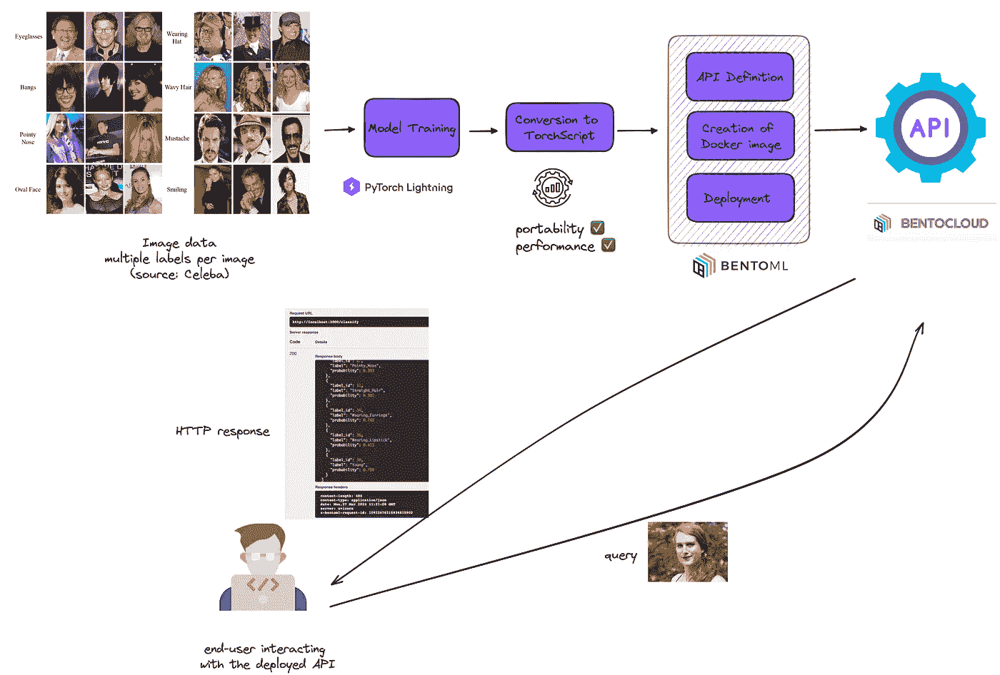

工作流 — 作者提供的图像

# 1 — 使用 PyTorch Lightning ⚡ 训练多标签图像分类器

> 本节将重点介绍 PyTorch Lightning，并详细介绍其一些功能以及训练过程。

作为数据集，我们将使用来自 [Kaggle](https://www.kaggle.com/datasets/jessicali9530/celeba-dataset) 的 CelebFaces Attributes：它包含 +200K 张各种名人的面部图像，附加了诸如身份、地标位置和 **每张图像 40 个二进制属性注释** 等元数据。

我们将使用面部属性元数据来训练一个多标签分类器，以检测诸如发色、鼻子大小、秃顶等信息。

如前所述，我们将使用 **Pytorch Lightning** 来训练模型。


GIF 由作者修改

PyTorch Lightning 是 PyTorch 的一个轻量级封装，标准化了训练循环、数据加载和验证过程的许多方面。它提供了一个更高级的接口，简化了训练过程，并减少了所需的样板代码。

使用 PyTorch Lightning，你可以减少代码复杂性，提高可重现性，并加快开发速度。

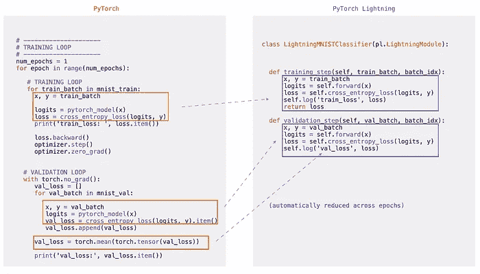

图片由作者提供

要获取数据集，你需要登录到 Kaggle 并点击下载按钮。

你也可以在获得你的凭证 (**kaggle.json**) 后通过命令行下载它。

```py
!cp kaggle.json ~/.kaggle/
!chmod 600 ~/.kaggle/kaggle.json
!kaggle datasets download jessicali9530/celeba-dataset
!unzip celeba-dataset.zip
```

解压文件夹后你会得到以下内容：

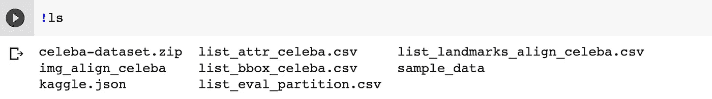

图片由作者提供

`**list_attr_celeba.csv**` 文件包含了我们感兴趣的属性：

```py
import pandas as pd 

data = pd.read_csv("list_attr_celeba.csv")
data = data.replace(-1, 0)
data = data.sample(25000)

data.head(5)
```


截图由作者提供

图像位于 `img_align_celeba/img_align_celeba/` 文件夹中。

现在我们开始训练这个模型：

## 👉 创建 Dataset

就像在 PyTorch 中一样，我们首先需要定义一个 Dataset。这是指示数据如何从磁盘读取并转换为张量的第一步。

```py
# src/train/datasets.py

import os
from PIL import Image
import pandas as pd
import torch
from torchvision.transforms.transforms import Compose
from torch.utils.data import Dataset, DataLoader
import pytorch_lightning as pl
from src.train.utils import train_transform, valid_transform

class CelebaDataset(Dataset):
    def __init__(
        self,
        data: pd.DataFrame,
        image_folder: str,
        augmentation: Compose,
    ):
        self.data = data
        self.column_labels = self.data.columns.tolist()[1:]
        self.column_image_id = self.data.columns.tolist()[0]
        self.image_folder = image_folder
        self.augmentation = augmentation

    def __len__(self):
        return len(self.data)

    def __getitem__(self, index: int):
        row = self.data.iloc[index]
        labels = torch.FloatTensor(row[self.column_labels])
        image_id = row[self.column_image_id]
        image = Image.open(os.path.join(self.image_folder, image_id))
        tensors = self.augmentation(image)
        return dict(
            tensors=tensors,
            labels=labels,
        )
```

## 👉 创建 LightningDataModule

现在我们需要创建一个 LightningDataModule，它实际上是一个包含 train_dataloader(s)、val_dataloader(s)、test_dataloader(s) 和 predict_dataloader(s) 的集合，以及匹配的转换和数据处理/下载步骤。

LightningDataModule 将一切组合在一起，并随后传递给训练器。因此，你无需显式地调用训练或验证数据加载器：PyTorch Lightning 会自动处理。

```py
class CelebaDataModule(pl.LightningDataModule):
    def __init__(self, train_df, test_df, batch_size, image_folder, num_workers):
        super().__init__()
        self.train_df = train_df
        self.test_df = test_df
        self.batch_size = batch_size
        self.image_folder = image_folder
        self.num_workers = num_workers

    def setup(self, stage=None):
        self.train_dataset = CelebaDataset(
            self.train_df,
            self.image_folder,
            train_transform,
        )
        self.test_dataset = CelebaDataset(
            self.test_df,
            self.image_folder,
            valid_transform,
        )

    def train_dataloader(self):
        return DataLoader(
            self.train_dataset,
            batch_size=self.batch_size,
            shuffle=True,
            num_workers=self.num_workers,
        )

    def val_dataloader(self):
        return DataLoader(
            self.test_dataset,
            batch_size=self.batch_size,
            num_workers=self.num_workers,
        )

    def test_dataloader(self):
        return DataLoader(
            self.test_dataset,
            batch_size=self.batch_size,
            num_workers=self.num_workers,
        )
```

## 👉 定义 LightningModule

一个 `[LightningModule](https://lightning.ai/docs/pytorch/stable/api/lightning.pytorch.core.LightningModule.html#lightning.pytorch.core.LightningModule)` 不仅定义了模型的架构。它将你的 PyTorch 代码组织成以下部分：

1.  初始化 (`__init__` 和 `setup()`)

1.  前向传播 — 就像在 PyTorch 中一样

1.  训练循环 (`training_step()`)

1.  验证循环 (`validation_step()`)

1.  测试循环 (`test_step()`) — 这里未显示

1.  优化器和学习率调度器 (`configure_optimizers()`)

```py
import torch
from torch import nn
from torch.optim import Adam
import pytorch_lightning as pl
from torchmetrics import AUROC
from torchvision.models import resnet34
from src.train.config import NUM_LABELS

class AttributeClassifier(pl.LightningModule):
    def __init__(self, lr: float):
        super().__init__()
        self.backbone = resnet34(pretrained=True)
        self.model = nn.Sequential(*list(self.backbone.children())[:-1])
        self.classifier = nn.Linear(512, NUM_LABELS)
        self.auroc = AUROC(task="multilabel", num_labels=NUM_LABELS)
        self.lr = lr
        self.criterion = nn.BCELoss()

    def forward(self, tensors):
        output = self.model(tensors)
        output = output.view(output.shape[0], -1)
        output = self.classifier(output)
        output = torch.sigmoid(output)
        return output

    def training_step(self, batch, batch_idx):
        tensors = batch["tensors"]
        labels = batch["labels"]
        outputs = self(tensors)
        loss = self.criterion(outputs, labels)
        self.log(
            "train_loss",
            loss,
            prog_bar=True,
            logger=True,
            on_epoch=True,
            on_step=True,
        )
        score = self.auroc(outputs, labels.long())
        self.log(
            "train_auc",
            score,
            prog_bar=True,
            logger=True,
            on_epoch=True,
            on_step=True,
        )
        return {"loss": loss, "predictions": outputs, "labels": labels}

    def validation_step(self, batch, batch_idx):
        tensors = batch["tensors"]
        labels = batch["labels"]
        outputs = self(tensors)
        loss = self.criterion(outputs, labels)
        self.log(
            "val_loss",
            loss,
            prog_bar=True,
            logger=True,
            on_epoch=True,
            on_step=True,
        )
        score = self.auroc(outputs, labels.long())
        self.log(
            "val_auc",
            score,
            prog_bar=True,
            logger=True,
            on_epoch=True,
            on_step=True,
        )
        return loss

    def configure_optimizers(self):
        optimizer = Adam(self.parameters(), lr=self.lr)
        return dict(optimizer=optimizer)
```

## 👉 定义回调函数

回调是你可以挂钩到训练管道中的实用函数，用于在工作流的特定时刻执行，例如，训练周期的开始或结束。

在接下来的部分，我们将使用两个回调，[模型检查点](https://lightning.ai/docs/pytorch/latest/api/lightning.pytorch.callbacks.ModelCheckpoint.html#lightning.pytorch.callbacks.ModelCheckpoint)（在指标改善时定期将模型保存到磁盘）和[早停](https://lightning.ai/docs/pytorch/latest/api/lightning.pytorch.callbacks.EarlyStopping.html#lightning.pytorch.callbacks.EarlyStopping)（当指标停止改善时停止训练）。

```py
checkpoint_callback = ModelCheckpoint(
    dirpath="checkpoints",
    filename="best-checkpoint",
    save_top_k=1,
    verbose=True,
    monitor="val_auc",
    mode="max",
)

early_stopping_callback = EarlyStopping(
    monitor="val_auc", 
    patience=2, 
    mode="max"
)
```

## 👉 开始训练

一旦你将 PyTorch 代码组织成一个`[LightningModule](https://lightning.ai/docs/pytorch/stable/api/lightning.pytorch.core.LightningModule.html#lightning.pytorch.core.LightningModule)`，`[Trainer](https://lightning.ai/docs/pytorch/stable/common/trainer.html)`会自动处理其他所有事情。

它运行训练和验证循环，计算指标并记录它们，执行回调。

```py
early_stopping_callback = EarlyStopping(
    monitor="val_auc",
    patience=2,
    mode="max",
)
model = AttributeClassifier(lr=config.lr)

trainer = pl.Trainer(
    callbacks=[early_stopping_callback, checkpoint_callback],
    max_epochs=config.n_epochs,
)
trainer.fit(model, data_module)
```

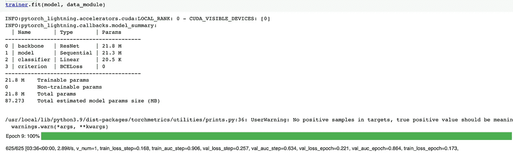

作者提供的图片

经过仅 25K 图像的 10 个训练周期后，最佳模型在验证集上的 AUROC 达到了 0.864 [AUROC](https://lightning.ai/docs/metrics/stable/classification/auroc.html)。

你可以从这个 S3 [链接](https://bentoml-ts.s3.eu-west-3.amazonaws.com/ts_model.pt)下载模型，并在[Github](https://github.com/ahmedbesbes/face-attributes-bentoml)查看代码。

# 2 — 将 Pytorch Lightning 模型转换为 TorchScript 🌬

> 本节将讨论 TorchScript 相对于 PyTorch（或 Lightning）的好处，并展示转换的过程。

TorchScript 是 PyTorch 中的一个功能，允许你序列化你的 PyTorch 模型，并在各种环境中运行它们。它提供了一种保存训练好的 PyTorch 模型并将其加载到无 Python 环境中，甚至在不同的硬件上运行，如 GPU、FPGA 或移动设备。

这相对于 PyTorch 有几个优点：

1.  **便携性**：使用 TorchScript，你可以在任何支持 TorchScript 运行时的环境中运行你的 PyTorch 模型，无论平台或语言如何。

1.  **性能**：TorchScript 可以通过融合操作和消除未使用的操作来优化你的 PyTorch 模型，以实现更快的执行。这可以带来显著的加速，特别是在资源有限的设备上，如手机。

1.  **安全性**：通过部署 TorchScript 模型，你可以保护你的 PyTorch 代码和模型不被逆向工程或篡改。

1.  **部署简便性**：使用 TorchScript，你可以轻松地将 PyTorch 模型部署到生产环境中，而无需 Python 环境。

> 对于 TorchScript 的更全面概述，我推荐你查看这个教程。

你可以通过调用`to_torchscript`方法轻松地将 Lightning 模块转换为 TorchScript。

```py
script = model.to_torchscript()
torch.jit.save(script, "torchscript_model.pt")
```

经过一些测试，我发现使用 TorchScript 的 GPU 推理时间比 PyTorch Lightning 的推理时间低 2 倍。然而，这仅发生在小批量（根据我的测试，1 或 2 个样本）时。

**无论如何，如果你想享受 TorchScript 的好处，你需要在 Python 运行时之外运行你的模型。**

# 3 — 使用 BentoML + TorchScript 🍱 构建一个图像分类服务

在本节中，我们将构建一个 BentoML 服务并在本地运行，以服务于 TorchScript 模型。

如果你想跟随本教程，我建议你使用 Poetry 安装项目的依赖项。

```py
git clone https://github.com/ahmedbesbes/face-attributes-bentoml
cd face-attributes-bentoml/
poetry install
```

你需要从 S3 下载模型：

```py
cd face-attributes-bentoml/models/
curl -O https://bentoml-ts.s3.eu-west-3.amazonaws.com/ts_model.pt
```

现在，我们可以使用 BentoML API 将 TorchScript 模型本地保存。这将自动提供一个版本标签，并允许你稍后轻松地将模型加载为运行器。

BentoML 与 TorchScript 集成良好，因此你可以通过调用 **bentoml.torchscript.save_model** 方法来保存模型。

更多信息 [here](https://docs.bentoml.org/en/latest/reference/frameworks/torchscript.html)。

```py
# src/serve/save_model.py

import bentoml
import torch

path = "models/ts_model.pt"
script = torch.jit.load(path)
bentoml.torchscript.save_model(
    "torchscript-attribute-classifier",
    script,
    signatures={"__call__": {"batchable": True}},
)
```

你可以通过运行 `**bentoml models list**` 来检查模型是否已经使用唯一标识符保存。

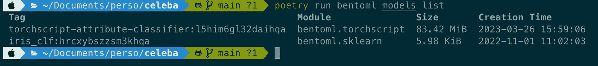

图片由作者提供

现在模型已经使用 BentoML API 保存，我们可以创建一个服务。

首先我们导入依赖项，加载模型，从中获取一个运行器，并定义一个服务：

```py
import torch
import bentoml
from bentoml.io import Image, JSON
from torchvision import transforms
from config import LABELS

torchscript_runner = bentoml.torchscript.get(
    "torchscript-attribute-classifier"
).to_runner()

svc = bentoml.Service(
    "face-attribute-classifier",
    runners=[torchscript_runner],
)
```

然后，我们定义一个 API 路由，该路由以图像作为输入，返回一个包含预测标签和相应概率的 JSON 作为输出。

```py
@svc.api(input=Image(), output=JSON())
def classify(input_image):
    tensor = process_image(input_image)
    tensor = torch.unsqueeze(tensor, 0)
    predictions = torchscript_runner.run(tensor)
    _, indices = torch.where(predictions > 0.3)
    indices = indices.numpy()
    output = {}
    labels = []
    for index in indices:
        probability = round(float(predictions[0][index]), 3)
        labels.append(
            {
                "label_id": index,
                "label": LABELS[index],
                "probability": probability,
            }
        )
    output["labels"] = labels

    print(output)

    return output
```

要在本地启动服务，请运行以下命令：

```py
poetry shell
poetry src/serve/
bentoml serve service:svc --reload
```

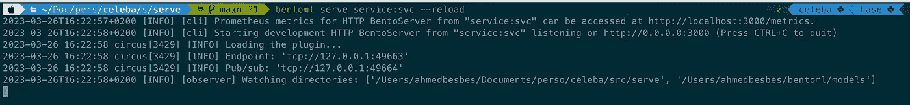

图片由作者提供

如果你想尝试这个 API，可以访问 Swagger UI（在 http://localhost:3000）并直接上传你的图片。

这里有一个例子。

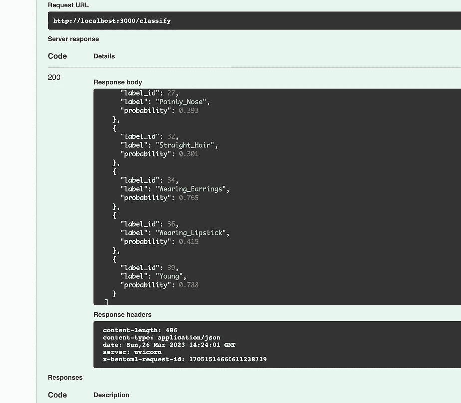

演示

# 4 — 将服务部署到云端

在本节中，我们将构建一个 bento 并将其部署到专门设计用于托管和扩展的云平台上。

> **什么是 bento？**
> 
> BentoML 将 ML 项目中所需的一切打包成一种叫做 ***bento*** 🍱的分发格式（这里的类比是有意义的，因为 *bento* 原本是一个日本的便当盒，里面装有一份主要菜肴和一些配菜）
> 
> 当一个 bento 构建完成后，你可以将其部署到任何云基础设施上。

## 👉 构建 bento

要构建一个 bento，你必须首先提供一个名为 `bentofile.yaml` 的配置文件，说明 bento 应如何构建，即要包含哪些文件和所需的 python 依赖项。

```py
service: "service.py:svc"
include:
  - "__init__.py"
  - "service.py"
  - "config.py"
  - "configuration.yaml"
python:
  packages:
    - torch==1.13.1
    - torchvision==0.14.1
    - pandas==1.5.3
    - scikit-learn==1.2.2
    - bentoml==1.0.16
    - bentoctl==0.3.4
```

运行以下命令将构建 bento。

```py
cd src/serve/
bentoml build
```

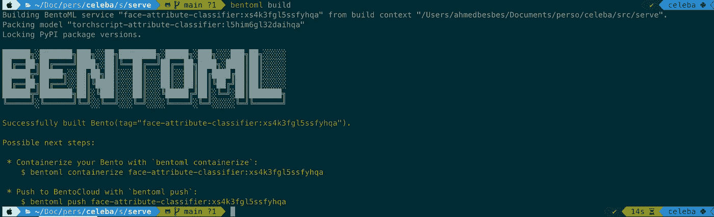

图片由作者提供

## 👉 连接到 BentoCloud 并推送 bento

在推送 bento 之前，你需要确保你已经登录到一个作为远程注册表的云平台（类似于 Dockerhub 这样的容器平台）。

我很幸运，BentoML 团队为我提供了他们的 [平台](https://default.cloud.bentoml.com/) 的访问权限，在那里他们推送和托管 bentos。

> 想在 BentoCloud 上创建一个账户并开始部署精彩的模型吗？请查看这个 [链接](https://www.bentoml.com/bento-cloud/) 来安排演示并与 BentoML 团队进行交流。

注册 BentoCloud 后，我能够生成 API 令牌并使用 `yatai` 命令登录。 (*我们将在本文的最后一部分中详细了解 Yatai 的具体情况*) 

```py
bentoml yatai login --api-token <API_TOKEN> \ 
                    --endpoint https://default.cloud.bentoml.com
```


登录 BentoCloud

登录后，你可以推送：这将同时将你的 **bento** 和基础的 **模型** 上传到云端。

```py
bentoml push face-attribute-classifier:qwwyr5gl7cw6ehqa
```

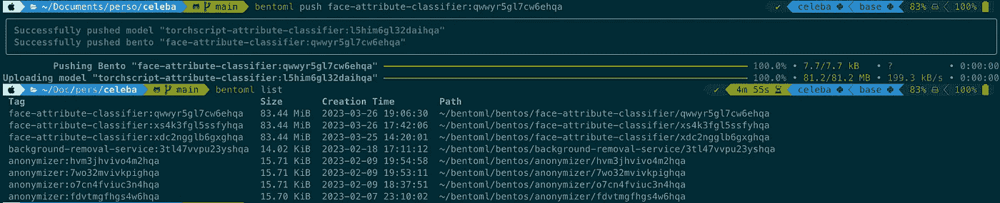

推送我的第一个 bento

你可以检查这两个工件是否在界面上可见，连同其他 bentos 和模型（来自其他用户）

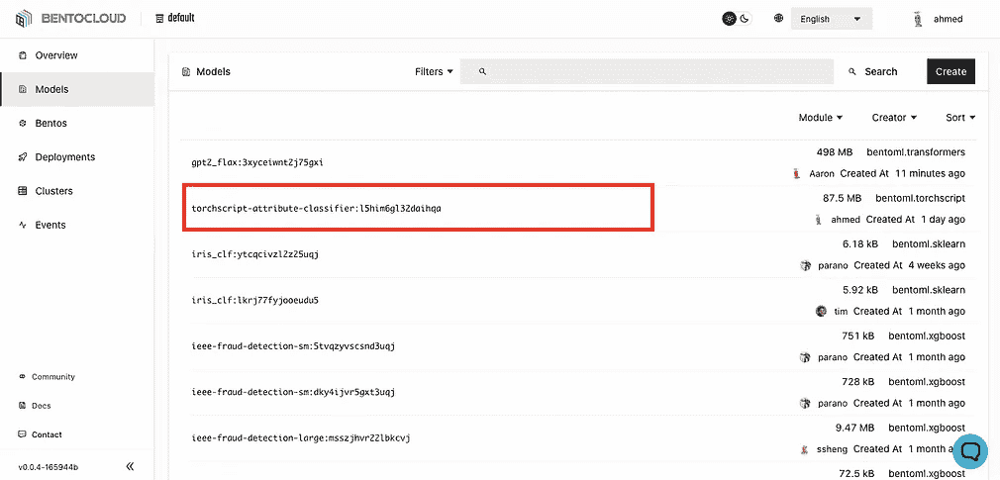

bento 和模型

## 👉 创建部署

从平台部署你的 bento 非常简单。前往部署选项卡，点击右上角的黑色 **创建** 按钮。

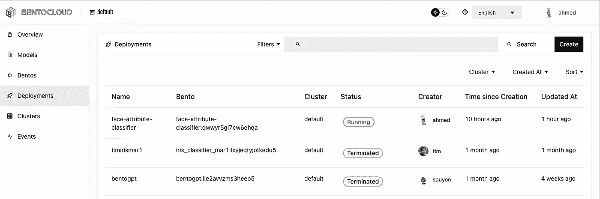

作者提供的图片

这将打开以下表单，你需要填写部署信息：

+   **集群信息和部署名称**

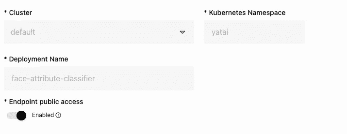

作者提供的图片

+   **bento 存储库及其版本**

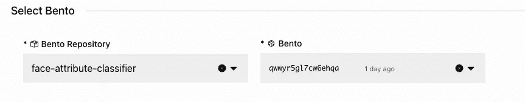

作者提供的图片

+   **API 服务器的配置：副本数量、CPU 和内存请求**

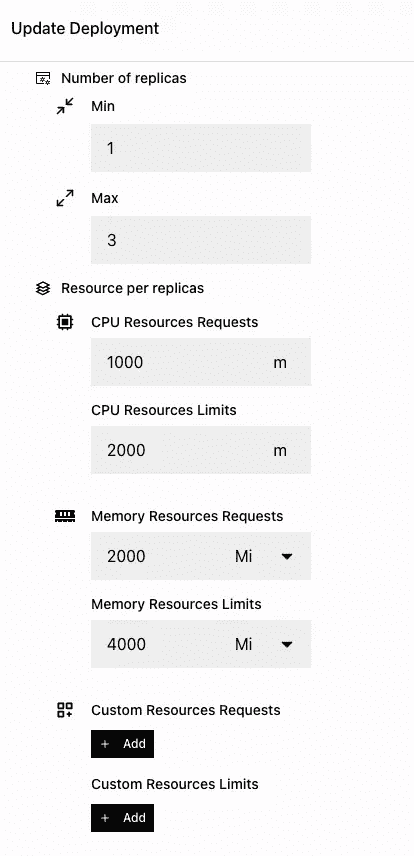

作者提供的图片

+   **每个运行程序的配置：在我们的例子中只有一个**

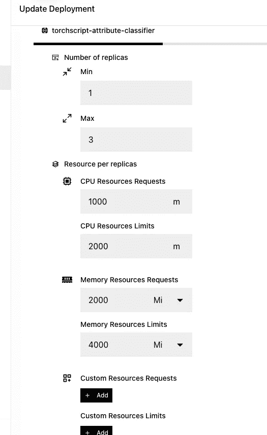

作者提供的图片

一旦点击 **提交** 按钮，你可以开始部署。这将构建镜像并在单独的 Pod 上部署 API 服务器和运行程序。**这是一个使 BentoML 与我之前使用的任何服务平台区分开的杀手级特性。**

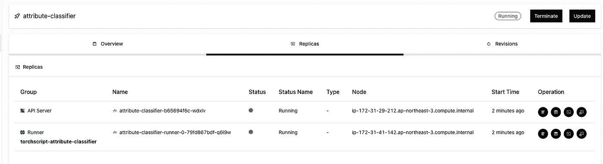

作者提供的图片

一旦你的 bento 成功部署，点击你的部署，然后点击 URL：

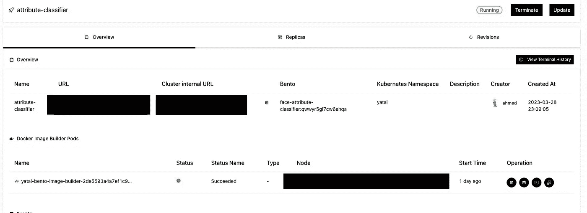

如果一切按预期工作，在浏览器中打开此 URL 将会带你到这个页面：

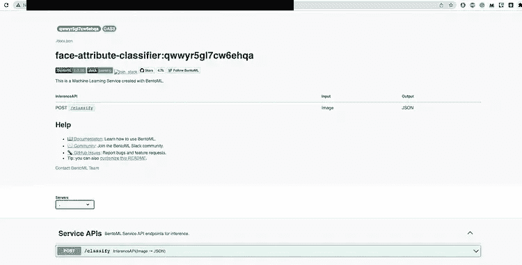

API 现在已经部署：你可以从互联网上的任何地方查询它。

# 需要在自己的基础设施上管理你的 bentos 吗？试试 Yatai

你可以通过 BentoML 团队开源的 [Yatai](https://github.com/bentoml/Yatai) 项目在你自己的云基础设施上复制 BentoCloud 平台。

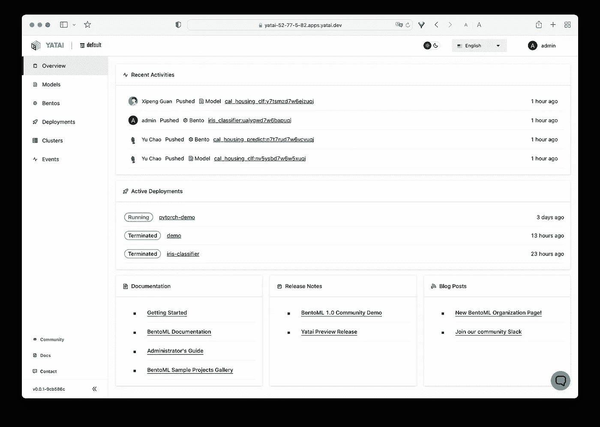

来源: [`github.com/bentoml/Yatai`](https://github.com/bentoml/Yatai)

Yatai 作为一个集中式注册表，你可以将其部署到任何 Kubernetes 原生环境中。

它与所有主要云平台（AWS、Azure 和 GCP）兼容。

它帮助你管理部署生命周期，通过 API 或 Web UI 进行部署、更新或回滚。

# 结论 🔚

如果你读到这里，我感谢你的时间，并希望你喜欢了解 PyTorch Lightning、TorchScript 和 BentoML。

将这三种工具结合起来，帮助你使用最佳实践的 DevOps 方法来原型设计和部署工业级深度学习模型。

当然，我展示的工作流中的不同步骤还有改进的空间：我只是希望这篇文章能够作为一个好的起点，帮助你深入了解 MLOps。

# 资源 🗞

+   `towardsdatascience.com/10-ways-bentoml-can-help-you-serve-and-scale-machine-learning-models-4060f1e59d0d`

+   `towardsdatascience.com/10-ways-bentoml-can-help-you-serve-and-scale-machine-learning-models-4060f1e59d0d`

+   [`youtu.be/Dk88zv1KYMI`](https://youtu.be/Dk88zv1KYMI)

+   [`youtu.be/2awmrMRf0dA`](https://youtu.be/2awmrMRf0dA)

# 对 Medium 不熟悉？你可以每月支付 5 美元订阅，解锁各种话题的无限文章（科技、设计、创业……）你可以通过点击我的推荐[链接](https://ahmedbesbes.medium.com/membership)来支持我。

[](https://ahmedbesbes.medium.com/membership?source=post_page-----f61136fd0244--------------------------------) [## 使用我的推荐链接加入 Medium - Ahmed Besbes

### 阅读 Ahmed Besbes（以及 Medium 上成千上万的其他作者）的每一个故事。你的会员费用直接支持……

[ahmedbesbes.medium.com](https://ahmedbesbes.medium.com/membership?source=post_page-----f61136fd0244--------------------------------)
