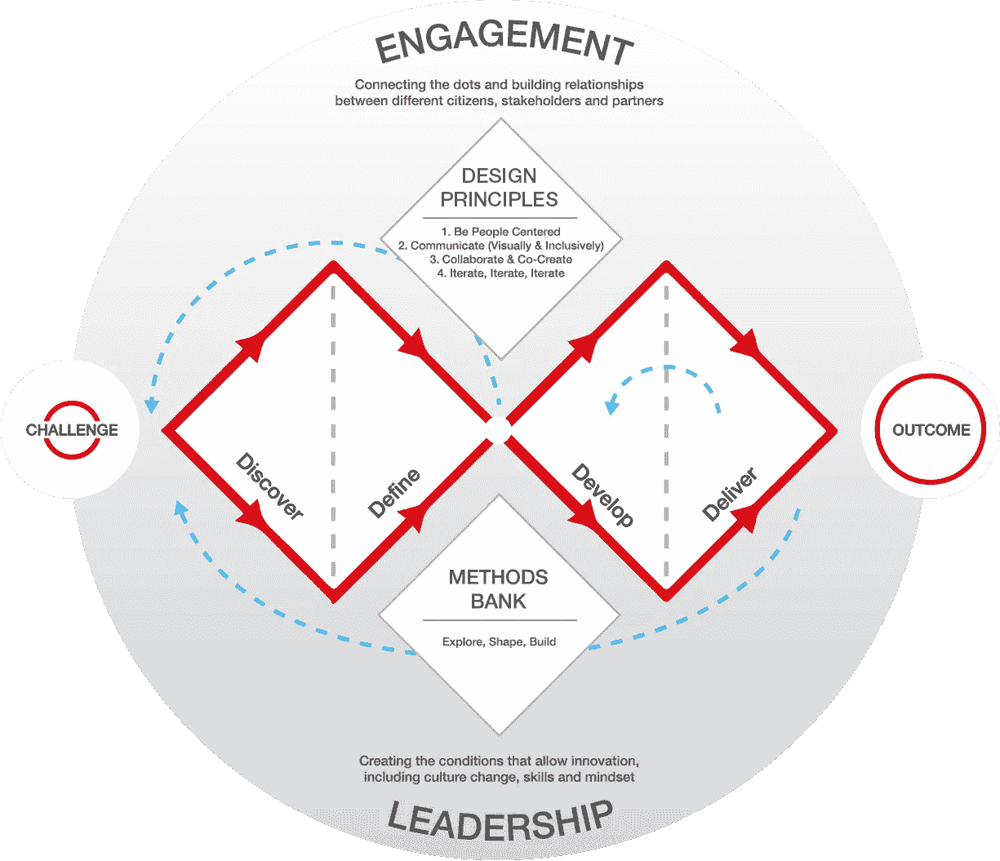
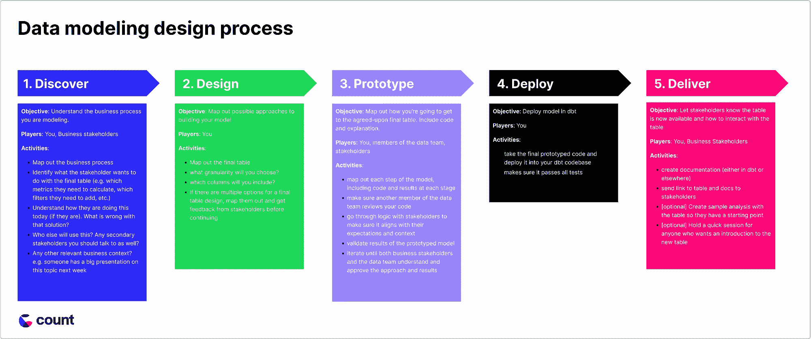
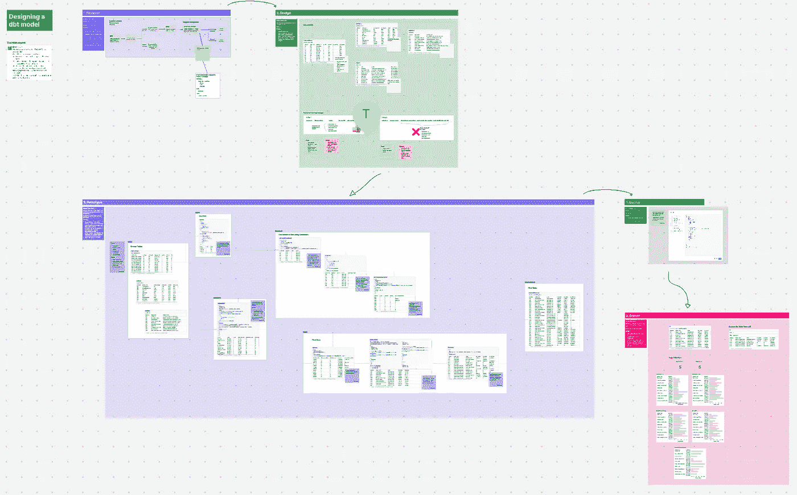
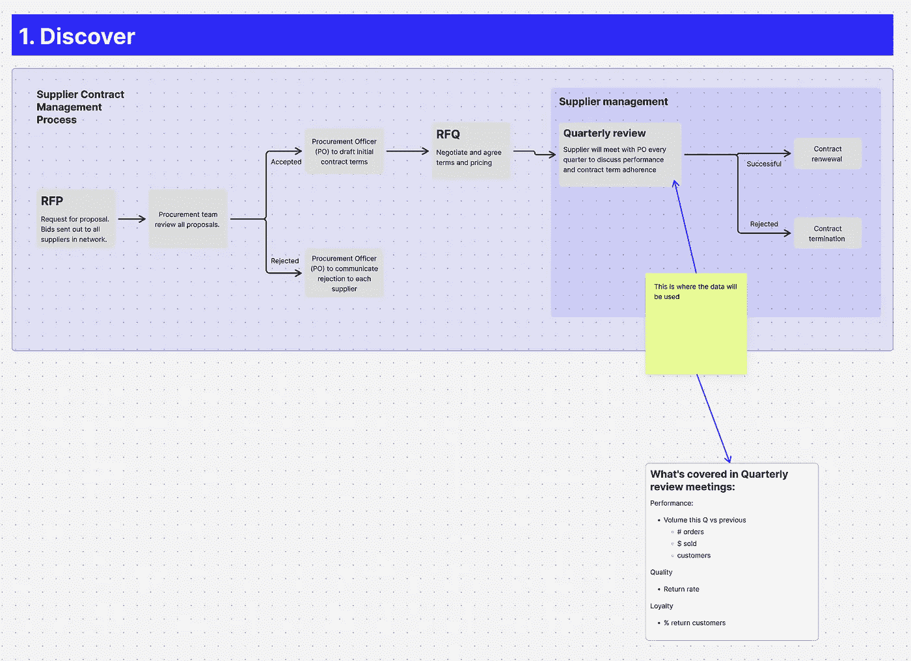
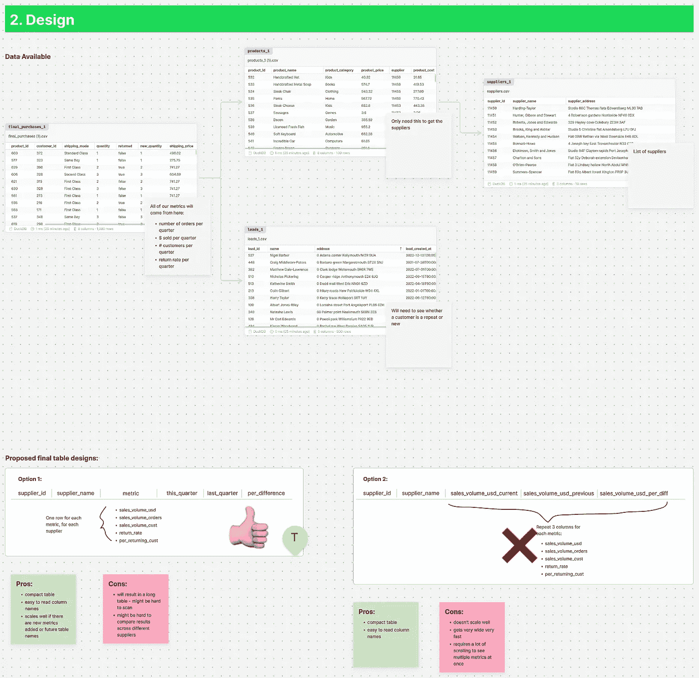
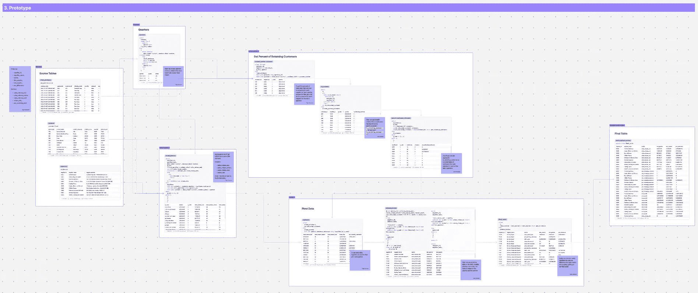
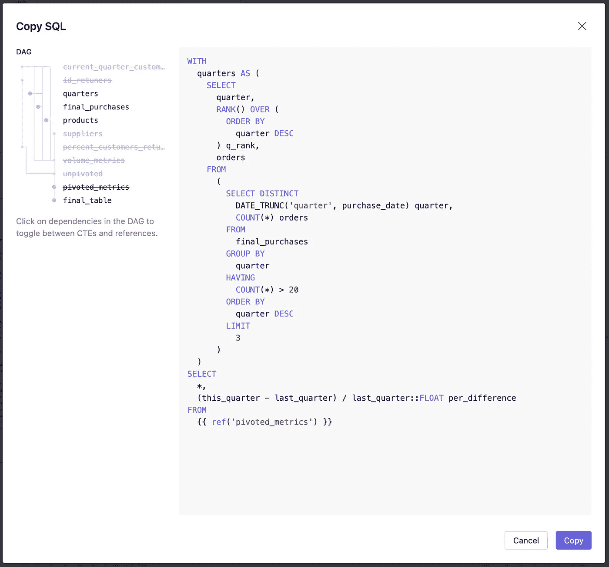
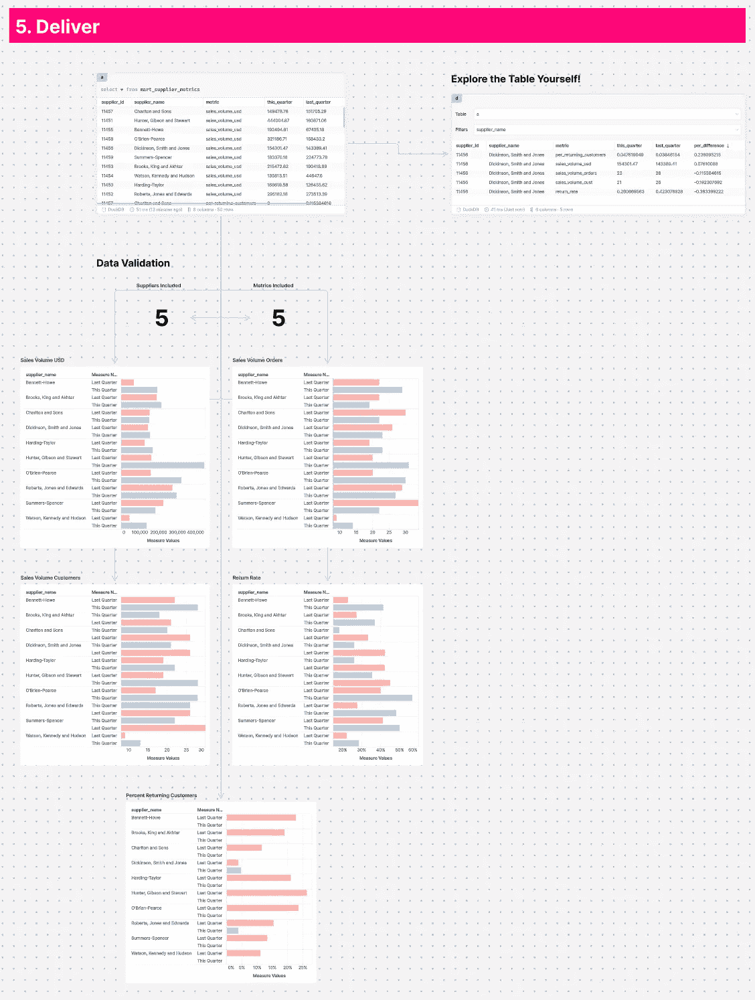

# 如何从头设计一个 dbt 模型

> 原文：[`towardsdatascience.com/how-to-design-a-dbt-model-from-scratch-8c72c7684203?source=collection_archive---------5-----------------------#2023-07-10`](https://towardsdatascience.com/how-to-design-a-dbt-model-from-scratch-8c72c7684203?source=collection_archive---------5-----------------------#2023-07-10)

## 一个实际可用的 dbt 模型构建简单框架。

 [Taylor Brownlow](https://taylor-count.medium.com/?source=post_page-----8c72c7684203--------------------------------)

·

[关注](https://medium.com/m/signin?actionUrl=https%3A%2F%2Fmedium.com%2F_%2Fsubscribe%2Fuser%2Fcdc63fa2a06e&operation=register&redirect=https%3A%2F%2Ftowardsdatascience.com%2Fhow-to-design-a-dbt-model-from-scratch-8c72c7684203&user=Taylor+Brownlow&userId=cdc63fa2a06e&source=post_page-cdc63fa2a06e----8c72c7684203---------------------post_header-----------) 发表在 [Towards Data Science](https://towardsdatascience.com/?source=post_page-----8c72c7684203--------------------------------) ·6 min read·2023 年 7 月 10 日

--

当我研究[dbt 终极指南](https://count.co/canvas/JpkaYdqr9oN)时，我对关于从头构建模型的材料的缺乏感到震惊。这不仅仅是工具中的具体操作步骤——这些在无数博客和教程中都有涵盖。我的意思是，如何确定正确的设计？如何确保你的利益相关者会使用这个模型？你如何确保它会被信任并理解？

当我们部署新模型而没有采取这些步骤时，可能会导致严重后果：

+   我们面临着来自利益相关者的大量问题和后续请求。

+   我们从其他数据工程师或分析工程师那里获得代码改进建议

+   我们必须回去添加新功能，进行改进，并回答所有问题，才能完成我们的工作。

如果我们一遍遍重复这个过程，数据团队和业务团队之间的信任将开始下降，因为双方在反馈狂潮中逐渐变得更加疲惫，这可能是很难恢复的。

这突显了仔细考虑我们如何设计模型的重要性，不仅仅是在 dbt 中单独进行，而是与所有利益相关者共同协作，以确保模型是 **准确** 和 **有效** 的，并且我们不会在每个模型上浪费 4-5 次的构建时间才使其 **有用**。

本文是关于如何最好地设计和实施 dbt 模型的研究和实验成果。它不会包含在 dbt 中执行的任何命令，但会讲解如何思考你的模型，以及如何构建你的工作流程，以确保你不会浪费时间。

图片来源：[Med Badr Chemmaoui](https://unsplash.com/@medbadrc?utm_source=unsplash&utm_medium=referral&utm_content=creditCopyText) 在 [Unsplash](https://unsplash.com/wallpapers/design?utm_source=unsplash&utm_medium=referral&utm_content=creditCopyText)

# 不同的方法

幸运的是，我不是第一个想到这个问题的人。许多其他领域也遇到了类似的挑战，并创建了自己的框架和流程，我可以借鉴这些来考虑如何进行数据建模。例如：

[**敏捷原则**](https://agilemanifesto.org/principles.html) 不鼓励软件工程师采用瀑布开发方法，这与快速变化的需求环境是背道而驰的 [1]。相反，敏捷方法拥抱快速迭代，并承认能够迅速响应变化需求的竞争优势。

[**设计原则**](https://www.designcouncil.org.uk/our-resources/framework-for-innovation/) 同样承认了在设计项目中与多个利益相关者合作时需要有意识的工作方法 [2]。该框架优先考虑人，并鼓励在每个开发阶段获取反馈，以便尽快找到最佳解决方案。

图片来源：[设计委员会](https://www.designcouncil.org.uk/) 的这项工作采用了 [CC BY 4.0 许可证](https://creativecommons.org/licenses/by/4.0/)。

即使是数据建模的教父 [Ralph Kimball](https://en.wikipedia.org/wiki/Ralph_Kimball) 也在他的 [**4 步数据建模过程**](https://www.holistics.io/books/setup-analytics/kimball-s-dimensional-data-modeling/) **[3]** 中强调了在建模过程初期从利益相关者那里获得高质量输入的重要性。第一步是尽可能多地了解业务流程，然后再考虑构建模型。

然而，在考虑这个问题时，我发现最有影响力的来源是 [**系统工程启发式**](https://sebokwiki.org/wiki/Systems_Engineering_Heuristics) —— 一组关于处理复杂问题与多个利益相关者的真理 [4]。

+   ***不要假设问题的原始陈述必然是最佳的，甚至是正确的。***

+   ***在项目的早期阶段，未知的问题比已知的问题更为棘手。***

+   ***尽可能在构建之前先建模。***

+   ***大多数严重错误发生在早期。***

这些来源帮助塑造了以下从零开始设计数据模型的过程。

# 数据建模设计过程

所以我想建立一个符合这些原则的过程，一个可重复的过程，并且能够确保我的模型第一次构建得很好。

这是我得出的结果：

我们将在下面更详细地讲解每一步。

> 以下示例将展示来自 [count.co](https://count.co) 的截图，这里是数据画布，我是产品负责人。不过，值得注意的是，这一过程与工具无关。你可以参考截图中的示例 [这里](https://count.co/canvas/m1UgaD6DbvG)。

图片由作者提供。所有 5 个步骤的过程展示。查看完整画布 [这里](https://count.co/canvas/m1UgaD6DbvG)。

# 第 1 步：发现

**目标**：理解你正在建模的业务流程。

**参与者**：你、业务利益相关者

**活动**：

+   规划业务流程

+   确定利益相关者希望对最终表格做什么（例如，他们需要计算哪些指标，需要添加哪些过滤器等）

+   了解他们今天是如何做到这一点的（如果他们这样做的话）。那个解决方案有什么问题？

+   还会有其他人使用这个吗？是否有其他次要利益相关者也应该沟通？

+   还有其他相关的业务背景吗？例如，有人下周会有一个关于这个主题的大型演示

图片由作者提供。点击 [这里](https://count.co/canvas/m1UgaD6DbvG?object=PZUMv4Y0CvO) 查看示例。

# 第 2 步：设计（并迭代！）

**目标**：规划构建模型的可能方法

**参与者**：你

**活动**：

+   规划最终表格

+   你将选择什么粒度？

+   你将包括哪些列？

+   如果最终表格设计有多个选项，请规划这些选项，并在继续之前从利益相关者那里获取反馈

图片由作者提供。点击 [这里](https://count.co/canvas/m1UgaD6DbvG?object=iKESpCOMjyZ) 查看示例。

# 第 3 步：原型制作（并迭代！）

**目标**：规划如何到达商定的最终表格。包括代码和解释。

**参与者**：你、数据团队成员、利益相关者

**活动**：

+   规划模型的每一步，包括每个阶段的代码和结果

+   确保数据团队的另一名成员审核你的代码

+   与相关方一起审查逻辑，以确保它符合他们的期望和背景

+   验证原型模型的结果

+   迭代直到业务相关方和数据团队都理解并批准方法和结果

作者提供的图片。点击 [这里](https://count.co/canvas/m1UgaD6DbvG?object=I7aMI3ANu87) 查看示例。

# 第 4 步：部署

**目标**：在 dbt 中部署模型

**参与者**：你

**活动**：

+   取最终原型代码并将其部署到你的 dbt 代码库中

+   确保它通过所有测试

作者提供的图片。这是如何将原型 SQL 导出为 dbt 友好的语法。

# 第 5 步：交付

**目标**：让相关方知道表格现在已可用以及如何与表格互动

**参与者**：你，业务相关方

**活动**：

+   创建文档（在 dbt 或其他地方）

+   将表格和文档的链接发送给相关方

+   [可选] 使用表格创建示例分析，以便他们有一个起点

+   [可选] 为任何希望了解新表的人举行简短的介绍会

作者提供的图片。点击 [这里](https://count.co/canvas/m1UgaD6DbvG?object=HNu4QT6yLSR) 查看完整示例。

# 下一步

下一次你从头开始构建 dbt 模型时，试试这个过程。这将对你和你的相关方带来很大变化，但它已经证明能显著减少部署新模型所需的时间，并提高这些模型的整体采纳度。

将更多人纳入数据建模过程，并展示透明度，有助于促进信任并快速交付有价值的数据模型。

**如果你尝试了这个过程，请给我留言，让我知道结果如何以及任何改进的想法！这些东西毕竟需要不断迭代…**

# 资源

[1] Agile Manifesto. (2001). Agile Manifesto 背后的原则。于 2023 年 7 月 1 日获取自 [`agilemanifesto.org/principles.html`](https://agilemanifesto.org/principles.html)

[2] Design Council. (2004). 创新框架。于 2023 年 7 月 1 日获取自 [`www.designcouncil.org.uk/our-resources/framework-for-innovation/`](https://www.designcouncil.org.uk/our-resources/framework-for-innovation/)

[3] Holistics. Kimball 的维度数据建模。于 2023 年 7 月 1 日获取自 [`www.holistics.io/books/setup-analytics/kimball-s-dimensional-data-modeling/`](https://www.holistics.io/books/setup-analytics/kimball-s-dimensional-data-modeling/)

[4] 彼得·布鲁克。《系统工程启发式》见 SEBoK 编辑委员会。2023 年。*系统工程知识指南（SEBoK）*，第 2.8 版，R.J. 克劳提耶（主编）。霍博肯，新泽西州：史蒂文斯理工学院信托基金。访问日期：[DATE]。[www.sebokwiki.org](http://www.sebokwiki.org)。BKCASE 由史蒂文斯理工学院系统工程研究中心、国际系统工程理事会以及电气和电子工程师学会系统委员会管理和维护。
