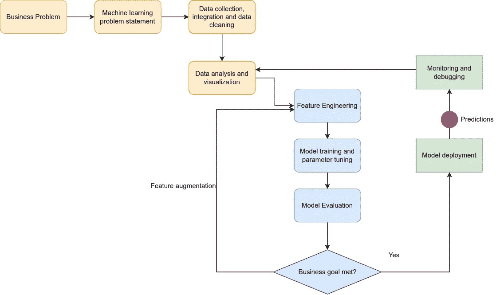
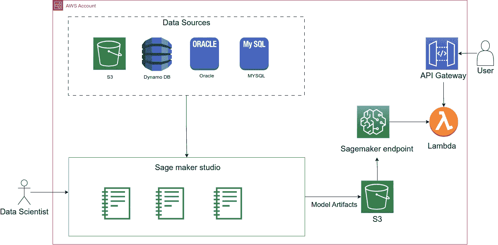
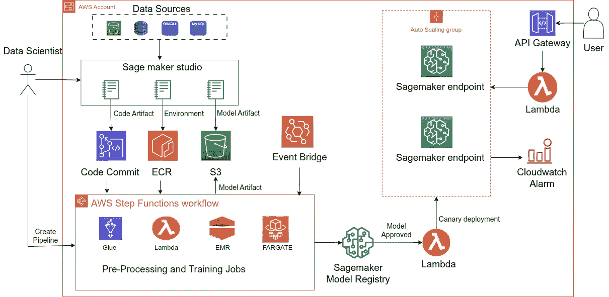
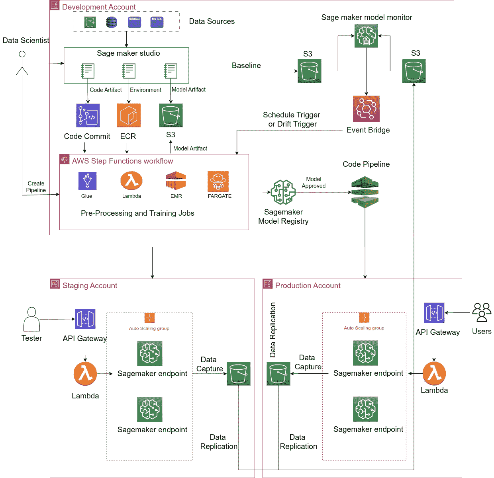

# 如何在 AWS 中设计 MLOps 架构？

> 原文：[`towardsdatascience.com/how-to-design-an-mlops-architecture-in-aws-67ee9843a430`](https://towardsdatascience.com/how-to-design-an-mlops-architecture-in-aws-67ee9843a430)

## 为开发人员和架构师提供的指南，特别是那些未专门从事机器学习的人员，帮助他们为组织设计 MLOps 架构

 [哈明德·辛格](https://medium.com/@harminder1?source=post_page-----67ee9843a430--------------------------------)

·发表于[数据科学之路](https://towardsdatascience.com/?source=post_page-----67ee9843a430--------------------------------) ·阅读时长 8 分钟·2023 年 4 月 14 日

--

## **介绍**

根据 Gartner 的研究，仅 53%的机器学习（ML）项目从概念验证（POC）阶段推进到生产阶段。公司战略目标与数据科学家构建的机器学习模型之间通常存在不一致。DevOps、安全、法律、IT 和数据科学家之间的沟通可能不足，这会给将模型推向生产带来挑战。最后，团队可能发现维护生产中的模型以及推出新模型是困难的。这导致了 MLOps 的兴起，将 DevOps 的原则，如持续集成和持续交付（CI/CD）、自动化和协作，带入机器学习生命周期——开发、部署和监控。

在本文中，我将深入探讨以下内容：

+   机器学习过程中的各个步骤

+   介绍不同的 MLOps 组件，并解释它们为何必要，而不深入讲解只有数据科学家需要了解的细节

+   根据组织的规模和成熟度，提供 MLOps 架构图

+   关于开始 MLOps 旅程的一般建议

**典型的机器学习过程**

首先，让我们了解机器学习过程中的各个步骤。

**机器学习过程** — 作者提供的图片

## 机器学习过程包括以下组件：

1.  **业务问题和机器学习问题陈述：** 我们通过识别业务问题并确认机器学习是解决该问题的正确方案来开始过程。提出的机器学习解决方案应产生可衡量的业务成果。

1.  **数据收集、整合和清理：** 在这一步中，数据科学家/数据工程师收集数据，将其与不同来源整合，并清理和转换以使其准备好供使用。数据工程师/科学家可能还会将数据划分为三组数据集——训练集、验证集和测试集，使用 80–10–10 或 60–20–20 的比例。训练集直接用于训练模型，验证集用于评估模型性能的未见示例，测试集则是另一组未见记录，用于检查模型在现实生活中的表现。

1.  **数据分析和可视化：** 数据科学家随后进行探索性分析（EDA）以理解数据的结构和质量。这一步是了解数据差异、模式以及形成新假设所必需的。

1.  **特征工程**：在这一步中，数据被选择、组合和处理，以使用统计或机器学习方法创建新变量。例如——进行对数变换、缩放或标准化。所有新特征共同有助于提高模型性能。

1.  **模型训练和参数调优**：一旦新特征可用，数据科学家将训练各种机器学习模型，并调优超参数以满足所需的服务水平协议指标。

1.  **模型评估和部署：** 在这一步中，从所有其他模型中选择准确度最高的模型，并将其部署到生产环境中。模型部署意味着模型已准备好进行预测。

1.  **监控和调试：** 机器学习模型一旦部署到真实世界中，就会变得过时。模型必须定期使用更新的数据重新训练。

每个数据科学家在机器学习旅程初期或多或少都会遵循这一过程，并手动执行大多数上述步骤。

为了说明我的意思，让我们看看没有 MLOps 的架构图。

**没有 MLOps 的机器学习架构** - 作者提供的图片

这里有一个相当标准的数据科学设置。数据科学家可以访问 AWS 账户中的 SageMaker Studio，他们可以使用 Jupyter Notebook 来开发模型。他们从各种数据源，如 S3 或 Athena，拉取数据，然后使用不同的机器学习技术创建模型。然后模型作为模型工件存储在 S3 中，并部署为 SageMaker 终端节点。通过 API 网关，终端节点对外界开放。

**没有 MLOps 的机器学习项目挑战**

虽然这种设置适合做概念验证，但它面临以下挑战：

1.  **变更依赖人工劳动：** 机器学习模型的任何更改都需要数据科学家进行人工修改。这可能涉及重新运行 Jupyter notebook 单元格或使用最新版本的模型更新 SageMaker 端点。如果代码扩展到多个 Jupyter notebooks，变更变得繁琐且难以扩展。

1.  **没有代码版本控制：** 数据科学家产生的代码存在于 Jupyter notebooks 中。这些笔记本难以进行版本控制和自动化。

1.  **没有反馈循环：** 过程中的自动反馈循环不存在。如果模型质量恶化，你只会通过不满客户的投诉才会发现。

这些是使用 MLOps 可以避免的一些挑战。

## 小团队（1–3 名数据科学家）的 MLOps 架构

MLOps 可能会很复杂，你不必立即采用所有功能。你可以从最小的 MLOps 设置开始，并随着团队的增长或成熟逐步采用更多功能。

让我们以上述相同的机器学习设置为例，并在其中引入 MLOps 元素。下图所述的架构图适用于小公司或 1–3 人的数据科学团队。

**小团队的 MLOps 架构** - 图片来源于作者

在此架构中

1.  数据科学家从 SageMaker notebook 实例开始，使用代码提交或任何基于 git 的代码库进行代码的版本控制，并使用 docker 容器在 elastic container registry（ECR）中存储训练机器学习模型的环境。通过对代码、环境和模型工件进行版本控制，你可以提高模型的重现能力，并鼓励团队之间的合作。

1.  你可以使用步骤函数或其他工作流工具，如 Airflow 或 SageMaker 管道，来自动化模型的再训练。数据科学家构建的再训练管道将使用版本代码和环境进行数据预处理、模型训练和模型验证，并将模型工件保存在 S3 中。管道可以利用各种服务，如 glue jobs、EMR jobs 和 lambda，来完成其流程，并可以使用基于时间的事件规则在事件桥中进行自动化。

1.  模型及其版本管理通过模型注册服务（如 SageMaker 模型注册表）进一步管理。SageMaker 模型注册表存储模型及其元数据，如超参数、评估指标以及偏差和解释性报告，并允许查看、比较和批准或拒绝模型。实际的模型工件存储在 S3 中，模型注册服务作为附加层位于顶部。

1.  最后，模型的部署通过 Lambda 函数自动化，该函数在模型在 Sage Maker 模型注册表中获得批准后立即触发。Lambda 会从 S3 中提取批准的模型，并在 Sage Maker 端点中更新版本而不发生停机。这些 Sage Maker 端点连接到 Lambda 和 API Gateway 以服务消费者应用程序，并附加有自动扩展组以应对请求的意外激增。你可以通过使用 Canary 部署进一步改进部署过程。这意味着少量用户请求将首先转发到新模型，任何错误将触发 Cloud Watch 警报以通知数据科学家。随着时间的推移，发送到新模型的请求数量将增加，直到新模型获得 100% 的流量。

这种架构对代码和模型进行版本管理，并自动化重新训练和部署。它提供了 Sage Maker 端点的自动扩展性和 Canary 部署的灵活性。然而，当数据科学家团队扩大时，我们可以引入更多 MLOps 元素。

## 中型和大型团队的 MLOps 架构

这种 MLOps 扩展了小型 MLOps 架构，并扩展到多账户设置，强调生产中模型的质量检查。

**中型和大型团队的 MLOps 架构** — 作者图像

在此架构中：

1.  数据科学家采用多账户方法，在开发账户中开发模型。

1.  在小型 MLOps 设置中，数据科学家从 Sage Maker Notebook 开始，使用 Code Commit 对代码进行版本管理，并通过 ECR 对环境进行版本管理。然后，他们使用 Step Function 创建一个重新训练的流水线，该流水线包括模型训练、验证和在 S3 中保存工件的步骤。模型的版本管理由 Sage Maker 模型注册表完成，该注册表允许用户接受或拒绝模型。

1.  模型的部署步骤包括 Sage Maker 端点和自动扩展组，这些端点和组连接到 Lambda 和 API Gateway 以允许用户提交推断请求。然而，这些组件服务位于不同的 AWS 账户中。推荐使用多账户策略，因为它提供了一种分离业务单元、轻松定义生产负载限制并提供每个架构组件成本细化视图的方式。

1.  多账户策略包括在生产账户旁边设置一个暂存账户。新的模型首先部署到暂存账户，进行测试，然后部署到生产账户。此部署必须通过开发账户中的代码流水线自动进行。代码流水线由模型版本在模型注册表中获得批准时生成的事件自动触发。

1.  监控生产环境中模型行为或准确性的变化是至关重要的。我们已在预发布和生产账户的端点启用了数据捕获功能。它将传入的请求和传出的推断结果捕获到 S3 桶中。这些捕获的数据通常需要与开发账户上的标签或其他数据结合，因此我们使用 S3 复制将数据转移到开发账户中的 S3 桶里。现在，为了判断模型或数据的行为是否发生了变化，我们需要一些对比的基准。这时，模型基线就发挥作用了。在训练过程中，我们可以生成一个基线数据集，记录数据和模型的预期行为。我们可以使用 SageMaker 模型监控器来比较这两个数据集并生成报告。

1.  这个架构的最终步骤是根据模型报告采取行动。当检测到显著变化时，我们可以发送事件以触发管道的重新训练。

## 离开的思考

MLOps 是一个旅程。你不必立即使用复杂架构设计中的所有功能。你可以从基本步骤开始，集成版本控制和自动化。探索我上述介绍的所有功能，并根据你的业务需求对它们进行分类，然后在需要时开始采用这些功能。上述架构设计并不是实现 MLOps 的唯一方法，但我希望它们能为你作为架构师提供一些灵感。

如果你觉得我的文章对你有帮助，请给我留言。
