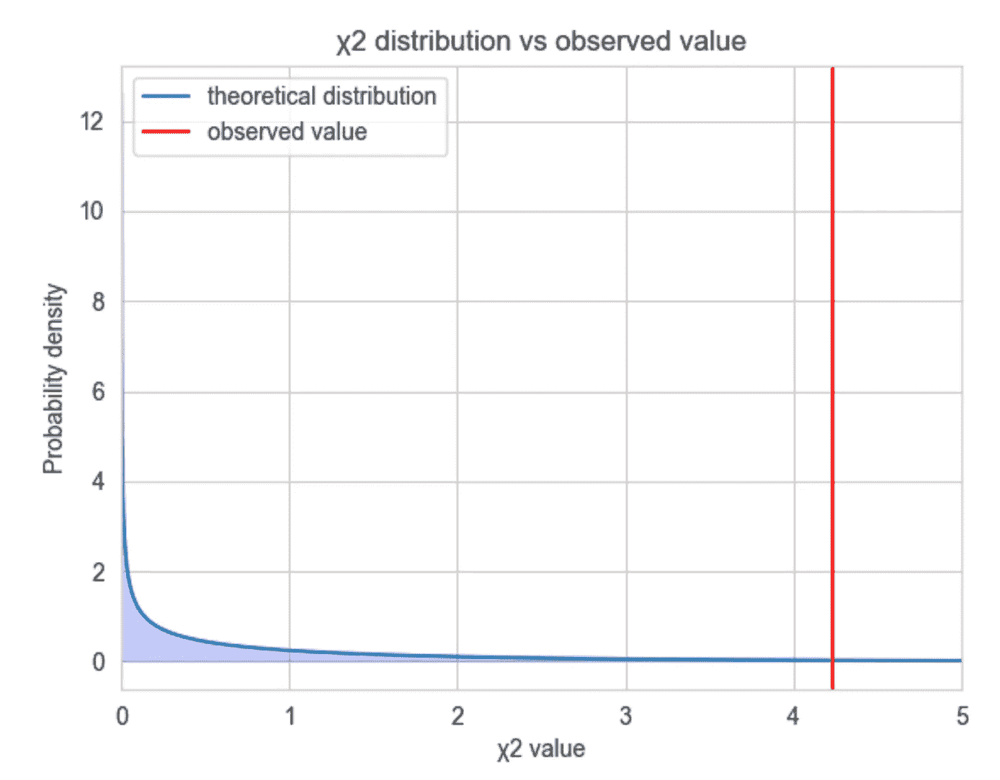

# 如何通过假设检验检测数据漂移

> 原文：[`towardsdatascience.com/how-to-detect-data-drift-with-hypothesis-testing-1a3be3f8e625`](https://towardsdatascience.com/how-to-detect-data-drift-with-hypothesis-testing-1a3be3f8e625)

## MLOps

## 提示：忘记 p 值吧

[](https://michaloleszak.medium.com/?source=post_page-----1a3be3f8e625--------------------------------)[](https://towardsdatascience.com/?source=post_page-----1a3be3f8e625--------------------------------) [Michał Oleszak](https://michaloleszak.medium.com/?source=post_page-----1a3be3f8e625--------------------------------)

·发布于 [Towards Data Science](https://towardsdatascience.com/?source=post_page-----1a3be3f8e625--------------------------------) ·18 分钟阅读·2023 年 5 月 17 日

--


数据漂移是任何使用机器学习模型进行实时预测的人的一个担忧。世界在不断变化，随着消费者的口味或人口统计特征的变化，模型开始接收到与训练时不同的特征值，这可能导致意外的输出。检测特征漂移看起来很简单：我们只需确定训练和服务中相关特征的分布是否相同即可。确实有统计测试可以进行，但你确定你使用它们的方式是正确的吗？


# 单变量漂移检测

监控机器学习模型的部署后性能是其生命周期的关键部分。随着世界的变化和数据的漂移，[许多模型往往会随着时间的推移表现出性能下降](https://www.nature.com/articles/s41598-022-15245-z)。保持警觉的最佳方法是实时计算性能指标，或者在地面真实数据不可用时[进行估算](https://medium.com/towards-artificial-intelligence/estimating-model-performance-without-ground-truth-453b850dad9a)。

观察到的性能下降的一个可能原因是数据漂移。[数据漂移](https://medium.com/towards-data-science/dont-let-your-model-s-quality-drift-away-53d2f7899c09)是指模型输入在训练数据和生产数据之间分布的变化。检测和分析数据漂移的性质可以帮助将降级的模型恢复到正常状态。根据受影响的特征的数量和方式，数据漂移可以分为两种形式：应区分多变量数据漂移和单变量数据漂移。

多变量漂移是指单个特征的分布不一定发生变化，但它们的联合分布发生了变化。这种情况很难察觉，因为单独观察每个模型特征无法发现它。如果你对检测多变量漂移感兴趣，可以查看[这篇关于如何基于 PCA 重构误差进行检测的文章](https://medium.com/towards-data-science/detecting-covariate-shift-a-guide-to-the-multivariate-approach-c099bd1891b9)。

今天，我们关注单变量数据漂移，这是一种在生产环境中一个或多个特征的分布与模型训练数据中的分布发生变化的情况。

单变量数据漂移似乎比多变量漂移更容易检测：你不需要考虑多个变量之间的复杂统计关系。相反，对于每个特征，你只需比较两个数据样本——训练和服务——以检查它们是否以类似的方式分布。让我们看看在假设检验框架中通常如何执行这一操作。


# 假设检验入门

为了让内容更具体，我们关注卡方检验，它经常用于比较分类变量的分布。卡方检验广泛应用于[A/B/C 测试](https://medium.com/towards-data-science/6-useful-probability-distributions-with-applications-to-data-science-problems-2c0bee7cef28)，用于验证用户在不同处理下（例如，展示广告 A、B 或 C）是否表现出不同的行为模式（例如，购买频率）。

同样的检验通常应用于单变量数据漂移检测，以检查在两个状态（训练和服务，即市场设置中的购买和非购买）下测量的分类变量是否具有相同的类别频率。如果不相同，数据可能已经漂移。让我们来看一个具体的例子。

假设一个机器学习模型负责向用户推荐内容。假设模型的一个输入是用户的设备。假设设备是一个具有两个类别的分类变量：桌面和移动。以下是训练数据和服务数据中的类别计数。


由于服务样本远小于训练集，因此我们将类别计数表示为相对频率，以便于比较。


类别频率在训练集和服务集之间确实非常相似，但它们并不完全相同。由于随机抽样，即使在没有数据漂移的情况下，我们也很少观察到完全相同的频率。

所以问题变成了：我们观察到的类别频率差异是由随机抽样变异造成的，还是由*设备*变量的结构性变化造成的？后者意味着我们正在处理数据漂移。

为了回答这个问题，我们可以使用统计假设检验框架。

## 卡方检验

我们首先定义假设，即两个假设。原假设声称我们观察到的训练与服务之间的差异仅由随机机会造成——两个数据样本来自相同的基础分布（总体）。另一方面，备择假设则声称这些差异不是由随机性驱动的，而是由数据漂移造成的。

**H₀：训练/服务之间的差异是随机噪声的结果。

H₁：训练/服务之间的差异是数据漂移的结果。**

我们现在将使用数据来检验原假设。如果我们可以拒绝原假设，我们将声明数据漂移已经发生。如果不能，我们将说由于差异可能是由随机机会产生的，没有数据漂移的证据。

在我们的案例中，传统的测试方法依赖于这样一个事实：在原假设下，某个量被知道遵循卡方分布。这个量被恰当地称为卡方统计量。

## 卡方统计量

卡方统计量被定义为期望频率和观察频率之间平方差的标准化总和。现在让我们解读这个声明。

期望频率是我们在没有数据漂移的原假设下会观察到的频率。它们被定义为列联表的边际和相乘，并按总数进行缩放。

以下列联表表示我们*设备*变量在测试和服务数据中的频率，如之前定义的。

```py
cont_table = pd.DataFrame([
  [35_252, 30_299],
  [3_516, 3_187]
])
```

然后我们可以沿着两个轴计算边际和，如下所示。

```py
margsums = [cont_table.values.sum(axis=x) for x in [1, 0]]
```

最后，我们将它们相乘（我们需要转置第一个元素以使乘法可能），并按全局总和进行缩放。

```py
from functools import reduce

margsums[0] = margsums[0].reshape(2, -1)
expected = reduce(np.multiply, margsums) / cont_table.values.sum()
```

在我们的特殊情况下，变量下只有两个类别，检验将只有一个自由度。这要求对观察值进行调整，这被称为[耶茨连续性校正](https://en.wikipedia.org/wiki/Yates%27s_correction_for_continuity)。如果有更多类别，你可以跳过以下四行代码。

```py
diff = expected - cont_table.values
direction = np.sign(diff)
magnitude = np.minimum(0.5, np.abs(diff))
observed = cont_table.values + magnitude * direction
```

知道了期望值，我们可以根据之前定义的方式计算卡方统计量：即期望频率和观察频率之间的平方差的总和，经过期望频率的标准化。

```py
chisq = np.sum(((observed - expected) ** 2) / expected)
```

这给出了 4.23，我们也知道这个统计量遵循卡方分布。这就是验证我们原假设所需的全部信息。

## 验证假设

让我们绘制出我们的测试统计量遵循的理论卡方分布。这是一个自由度为 1 的卡方分布。红线表示测试统计量的观察值。



蓝色阴影区域显示了在原假设下，即在没有数据漂移的情况下，检验统计量所遵循的分布。我们刚刚观察到的是红线标记的值。这一观察是否足够强烈以拒绝原假设？

比如说，卡方值为 10，在原假设下是非常不可能出现的。如果我们看到了这个值，我们可能会得出结论，认为原假设必须是错误的，数据已经发生了漂移。

另一方面，如果我们得到了 0.5 的卡方值，我们会认为在原假设下这个观察值并不令人惊讶，换句话说，训练数据和服务数据之间的*设备*频率差异可能只是偶然产生的。一般来说，这意味着没有理由拒绝原假设。

但我们得到了 4.23。我们如何决定是否拒绝原假设呢？

## p 值

引入了臭名昭著的 p 值。它是一个回答以下问题的数字：在原假设为真的情况下，观察到我们获得的卡方值或更极端值的概率是多少？或者，使用某种符号，p 值表示在假设原假设为真的情况下观察到数据的概率：P(数据|H₀)（准确地说，p 值定义为 P(test_static(数据) > T | H₀)，其中 T 是选择的检验统计量阈值）。请注意，这与我们实际感兴趣的内容不同，我们关心的是在给定我们观察到的数据的情况下，原假设为真的概率：P(H₀|数据)。

**p 值表示的内容：P(数据|H₀)

我们通常希望的：P(H₀|数据)**

从图形上讲，p 值是红线右侧的蓝色概率密度的总和。计算它的最简单方法是计算观察值的累积分布的一减，即左侧的概率质量减去 1。

```py
1 - chi2.cdf(chisq, df=1)
```

这给我们带来了 0.0396。如果没有数据漂移，我们在大约 4%的情况下会得到我们所获得的检验统计量或更大的统计量。毕竟，这并不那么少见。在大多数使用情况下，p 值通常与 1%或 5%的显著性水平进行比较。如果它低于这个水平，则拒绝原假设。让我们保守一点，遵循 1%的显著性阈值。在我们这个接近 4%的 p 值的情况下，没有足够的证据来拒绝它。因此，没有检测到数据漂移。

为了确保我们的检验是正确的，让我们用 scipy 的内置测试函数确认一下。

```py
from scipy.stats import chi2_contingency

chisq, pvalue, df, expected = chi2_contingency(cont_table)
print(chisq, pvalue)
```

`4.232914541135393 0.03964730311588313`

这就是假设检验的工作原理。但这对生产环境中的机器学习系统的数据漂移检测有多重要？


# 统计显著性与监控显著性

从广义上讲，统计学是基于小样本对整个总体做出推断的科学。当著名的 t 检验在 20 世纪初首次发布时，所有的计算都是用笔和纸完成的。即使在今天，STATS101 课程的学生也会了解到，“大样本”从 30 个观察值开始。

在数据难以收集和存储且手动计算繁琐的时代，统计上严谨的测试是回答有关广泛总体问题的好方法。然而，如今，随着数据的丰富，许多测试的实用性减少了。

特点是许多统计测试将数据量视为证据。数据越少，观察到的效应更容易受到采样误差的随机变动的影响，而数据越多，其方差则减少。因此，相同的观察效应在数据更多时对零假设的证据更为强烈。

为了说明这一现象，考虑比较两家公司 A 和 B 在员工性别比例上的差异。让我们设想两个情境。首先，随机抽取每家公司 10 名员工。在公司 A 中，10 人中有 6 人为女性，而在公司 B 中，10 人中有 4 人为女性。其次，增加我们的样本量到 1000。在公司 A 中，1000 人中有 600 人为女性，而在公司 B 中，1000 人中有 400 人为女性。在这两个情境中，性别比例是相同的。然而，更多的数据似乎为公司 A 雇佣比例上更多女性提供了更强的证据，不是吗？

这种现象通常在大数据样本的假设检验中表现出来。数据越多，p 值越低，因此我们更有可能拒绝零假设，并声明发现某种统计效应，例如数据漂移。

让我们看看这是否适用于我们的类别变量频率差异的卡方检验。在原始示例中，服务集的大小大约是训练集的十分之一。让我们将服务集中的频率乘以 1/100 到 10 之间的一组缩放因子，并每次计算卡方统计量和检验的 p 值。请注意，将服务集中的所有频率乘以相同的常数不会影响它们的分布：我们唯一改变的只是其中一个集合的大小。

```py
training_freqs = np.array([10_322, 24_930, 30_299])
serving_freqs = np.array([1_015, 2_501, 3_187])

p_values, chi_sqs = [], []
multipliers = [0.01, 0.03, 0.05, 0.07, 0.1, 0.3, 0.5, 0.7, 1, 3, 5, 7, 10]
for serving_size_multiplier in multipliers:
  augmented_serving_freqs = serving_freqs * serving_size_multiplier
  cont_table = pd.DataFrame([
  training_freqs,
  augmented_serving_freqs,
  ])
  chi_sq, pvalue, _, _ = chi2_contingency(cont_table)
  p_values.append(pvalue)
  chi_sqs.append(chi_sq)
```


乘数等于一的值是我们之前计算的值。注意，当服务规模增加到仅为原来的 3 倍（标记为垂直虚线）时，我们的结论完全改变：我们得到的卡方统计量为 11，p 值接近零，在我们的案例中这对应于指示数据漂移。

这导致了虚假警报的数量增加。尽管这些效果在统计上可能显著，但从性能监控的角度来看，它们不一定具有重要意义。拥有足够大的数据集，即使是微小的数据漂移也会被指示出来，即使它的强度不足以恶化模型的性能。

学习到这一点后，你可能会想建议将服务数据划分为多个块，并对较小的数据集进行多次测试。不幸的是，这也不是一个好主意。要理解原因，我们需要深入理解 p 值的真正含义。


# p 值的含义

我们已经将 p 值定义为在原假设为真的情况下，观察到至少与我们实际观察到的统计量一样不太可能的测试统计量的概率。让我们尝试解读这个复杂的表述。

原假设意味着没有效果，在我们的例子中：没有数据漂移。这意味着，无论训练数据和服务数据之间存在什么差异，它们都是随机抽样的结果。因此，p 值可以视为在这些差异仅来源于随机性的前提下，得到我们所观察到的差异的概率。

因此，我们的 p 值大约为 0.1，这意味着在完全没有数据漂移的情况下，10% 的测试将由于随机机会错误地发出数据漂移信号。这与我们之前介绍的 p 值表示的符号一致：P(data|H₀)。如果这个概率是 0.1，那么在 H₀ 为真（无漂移）的情况下，我们有 10% 的机会观察到的数据至少与我们观察到的数据一样不同（根据测试统计量）。

这就是为什么在较小的数据样本上进行更多测试不是一个好主意的原因：如果我们不是对每天的整个服务数据进行测试，而是将其分为 10 个块，每天进行 10 次测试，我们每天平均会出现一个虚假警报！这可能导致所谓的警报疲劳，即你被大量警报轰炸到停止关注它们的程度。当数据漂移真的发生时，你可能会错过它。


# 贝叶斯来拯救我们

我们已经看到，根据测试的 p 值检测数据漂移可能不可靠，从而导致许多虚假警报。我们该如何做得更好？一个解决方案是完全转变思路，采用贝叶斯测试，这让我们能够直接估计我们需要的 P(H₀|data)，而不是 p 值 P(data|H₀)。

## 贝叶斯是什么

贝叶斯统计方法与传统的经典统计方法不同。在贝叶斯方法的基本假设[值得单独讨论](https://medium.com/towards-data-science/the-gentlest-of-introductions-to-bayesian-data-analysis-74df448da25)的情况下，为了讨论数据漂移，我们先考虑贝叶斯方法的最重要特征：*统计参数是随机变量*。

## 参数是随机变量

参数是我们感兴趣的未知值，用于描述一个总体。在我们之前的例子中，我们模型用户使用移动设备的比例就是一个参数。如果我们知道在任何给定时间段内这个比例，我们就能自信地声明设备变量是否随时间漂移。不幸的是，我们不知道所有可能成为模型输入的用户的设备；我们必须使用模型所接收到的服务数据样本。

经典方法将我们感兴趣的参数视为一个固定值。我们不知道它的具体值，但它是存在的。基于样本数据，我们可以尽量估计它，但任何这样的估计都会因采样偏差而有一定的方差。简而言之，我们正在尝试用一个具有偏差和方差的随机变量来估计我们认为是未知的固定值。

贝叶斯方法将我们感兴趣的参数视为由某种概率分布描述的随机变量。我们尝试估计的是这个分布的参数。一旦完成这些，我们就可以对参数做出概率性的陈述，比如“我们的模型用户使用移动设备的比例在 0.2 到 0.6 之间的概率是 55%”。

这种方法非常适合数据漂移检测：与依赖模糊的 p 值，P(data|H₀)不同，使用贝叶斯检验，我们可以直接计算数据漂移的概率和幅度，即 P(H₀|data)！


# 数据漂移的贝叶斯检验

让我们尝试使用贝叶斯方法测试用户使用移动设备的频率是否在训练数据和服务数据之间发生了漂移。

## 获取我们需要的概率

那么，如何获得数据漂移的概率呢？可以使用所谓的贝叶斯规则，这是一条整洁的概率公理，允许我们在知道反向关系的情况下计算某事的条件概率。例如，如果我们知道 P(B|A)，我们可以计算 P(A|B)：

*P(A|B) = P(B|A) * P(A) / P(B)*

我们可以使用这个公式来估计移动用户的频率的概率分布，*freq*：

*P(freq|data) = P(data|freq) * P(freq) / P(data)*

在贝叶斯术语中，上述方程中的所有元素都有其名称：

+   P(freq|data) 是我们追求的目标——即移动用户比例在看到数据后的后验分布或概率分布；

+   P(data|freq) 是似然或在给定特定移动用户频率的情况下观察到数据的概率；

+   P(freq) 是先验：我们在看到任何数据之前对移动用户比例的信念；

+   P(data) 可以看作是一个缩放因子，确保右边的结果作为概率分布总和为一。

如果我们将上述公式应用两次，一次用于训练数据，另一次用于服务数据，我们将获得两个频率参数的分布：一个基于分析数据，另一个基于参考数据。然后我们可以检查这两个分布如何比较以测试我们的假设：

*P(H₀|data) = P(freq_ref|data) == P(freq_anal|data)*

所以，为了计算后验，我们需要将先验与似然相乘，并将它们缩放到总和为一。概率分布上的算术运算不是一个简单的任务。我们该如何进行呢？

在某些特定情况下，当两个分布匹配得很好时，它们的公式会相互抵消，结果是一个已知的分布。在更复杂的情况下，使用马尔科夫链蒙特卡洛模拟方法来从后验分布中抽样值，而不是尝试计算其分布形式。还有第三种方法：在像我们这样简单的情况下，我们可以使用一种称为网格近似的方法。

## 数据漂移概率

让我们从定义数据开始。在训练数据中，我们有 65,551 个观察值，其中 30,299 个是移动用户。

```py
num_obs = 65_551
num_mobile_obs = 30_299
```

我们感兴趣的参数是移动用户的频率。从理论上讲，它可以是 0%到 100%之间的任何值。我们将在从 0.0001 到 1 的网格上进行近似：

```py
mobile_freq = np.arange(0, 1.0001, 0.0001)
```

我们现在可以创建一个包含所有移动用户频率及其观察数量的网格：

```py
devices = pd.DataFrame([(x, y) for x in [num_mobile_obs] for y in mobile_freq])
devices.columns = ["num_mobile", "mobile_freq"]
```

是时候定义先验了：在看到任何数据之前，我们对我们的参数知道或假设了什么。可能是我们什么也不知道，或者我们不想用我们的信念过多地影响结果。在这种情况下，我们会采用无信息先验，例如均匀分布。这对应于将先验设置为全 1，表示对每个可能的移动用户百分比表达相同的先验概率。

```py
devices["prior"] = 1.
```

接下来，我们的最后一个构建块，似然。在我们的问询中，用户可以是移动用户或非移动用户。这需要使用二项分布。对于数据框中的每一行，我们将计算给定观察到的移动用户数量、总用户数量和假设的移动用户频率的二项概率质量。

```py
devices["likelihood"] = binom.pmf(
  devices["num_mobile"], 
  num_obs, 
  devices["mobile_freq"]
)
```

我们剩下的就是遵循贝叶斯公式：将先验与似然相乘，并将结果缩放到总和为一，以得到后验。

```py
devices["posterior"] = devices["prior"] * devices["likelihood"]
devices["posterior"] /= devices["posterior"].sum()
```

让我们切分网格，选择与我们观察到的移动用户数量相匹配的后验分布。

```py
mobile_obs = devices[devices["num_mobile"] == num_mobile_obs]
mobile_obs["posterior"] /= mobile_obs["posterior"].sum()
```

我们现在可以绘制训练数据中移动用户频率的后验概率。


我们现在可以对我们的服务数据做完全相同的操作。在此过程中，我们将向代码中添加一项内容：在一个名为*samples*的字典中，我们将存储来自后验分布的样本，包括训练和服务数据。以下是实现这一任务的代码片段。

```py
results = {}
for dataset, num_obs, num_mobile_obs, color in zip(
  ["training", "serving"], [65_551, 6703], [30_299, 3187], ["blue", "green"]
):
  # Set up grid
  num_mobile = np.arange(0, num_obs + 1, 1)
  mobile_freq = np.arange(0, 1.0001, 0.0001)
  devices = pd.DataFrame([(x, y) for x in num_mobile for y in mobile_freq])
  devices.columns = ["num_mobile", "mobile_freq"]

  # Follow Bayes rule to compute posterior
  devices["prior"] = 1.
  devices["likelihood"] = binom.pmf(
    devices["num_mobile"], 
    num_obs,
    devices["mobile_freq"],
  )
  devices["posterior"] = devices["prior"] * devices["likelihood"]
  devices["posterior"] /= devices["posterior"].sum()

  # Ger posterior for observed number of mobile users
  mobile_obs = devices[devices["num_mobile"] == num_mobile_obs]
  mobile_obs["posterior"] /= mobile_obs["posterior"].sum()

  # Sample from posterior and store the draws
  samples[dataset] = random.choices(
    mobile_obs["mobile_freq"].tolist(),
    weights=mobile_obs["posterior"].tolist(),
    k=10_000,
  )

  # Plot the posterior
  sns.lineplot(
    mobile_obs["mobile_freq"],
    mobile_obs["posterior"], 
    color=f"dark{color}",
    label=dataset,
  )
  plt.fill_between(
    mobile_obs["mobile_freq"],
    0,
    mobile_obs["posterior"],
    color=f"light{color}",
  )
  plt.xlim(0.45, 0.50)
  plt.xlabel("Proportion of users using a mobile device")
  plt.ylabel("Probability density")
```


## 测试时间

对于训练和服务数据，我们已经估计了移动用户比例的概率分布。这个比例有不同吗？如果有，我们就有一些数据漂移发生。由于上图中两个分布仅有少量重叠，它们似乎不同。不过，让我们尝试获得定量确认。

我们可以使用从两个分布中获取的样本进行此操作：我们只需检查服务数据的比例比训练数据中的比例更大多少次。这是我们对数据漂移概率的估计。

```py
np.mean([
  serving > training
  for serving, training in
  zip(samples["serving"], samples["training"])
])
```

`0.977`

*device* 变量发生漂移的概率为 97.7%。漂移几乎肯定已经发生！但其规模有多大呢？

```py
np.mean([
  serving - training
  for serving, training in
  zip(samples["serving"], samples["training"])
])
```

`0.013`

服务数据中移动用户的比例比训练数据中的相应比例高出 1.3 个百分点，期望值如此。


# 收获

+   依赖假设检验的单变量数据漂移检测方法并不总是可靠：结果可能依赖于样本大小，而 p 值实际上并不能直接测量数据漂移的概率或大小。

+   依赖这种假设检验往往会导致许多虚假警报和警报疲劳。

+   一种替代方法是使用贝叶斯方法，这允许我们直接估计数据漂移的概率和大小，而没有传统测试的许多缺陷。

*本文也发表在* [*NannyML 博客*](http://www.nannyml.com/blog/hypothesis-testing-for-ml-performance)*上。*


感谢阅读！

如果你喜欢这篇文章，为什么不[**订阅电子邮件更新**](https://michaloleszak.medium.com/subscribe)以获取我新文章的通知呢？通过[**成为 Medium 会员**](https://michaloleszak.medium.com/membership)，你可以支持我的写作，并获得对其他作者及我的所有故事的无限访问权限。

需要咨询？你可以随时问我任何问题或[**在这里**](https://topmate.io/michaloleszak)预约一对一咨询。

你还可以尝试阅读[我其他的文章](https://michaloleszak.github.io/blog/)。不知道选择哪个？可以从这些中选一个：

[](/model-optimization-with-tensorflow-629342d1a96f?source=post_page-----1a3be3f8e625--------------------------------) ## TensorFlow 的模型优化

### 使用量化和剪枝减少模型的延迟、存储和推断成本

[towardsdatascience.com [](https://pub.towardsai.net/forget-about-chatgpt-f17a7f5089c3?source=post_page-----1a3be3f8e625--------------------------------) [## 忘掉 ChatGPT

### Bard、Sparrow 和多模态聊天机器人很快将使其过时，原因如下。

[pub.towardsai.net](https://pub.towardsai.net/forget-about-chatgpt-f17a7f5089c3?source=post_page-----1a3be3f8e625--------------------------------) [](/self-supervised-learning-in-computer-vision-fd43719b1625?source=post_page-----1a3be3f8e625--------------------------------) ## 自监督学习在计算机视觉中的应用

### 如何仅用少量标记示例来训练模型

[towardsdatascience.com

所有图片，除非另有说明，均由作者提供。
