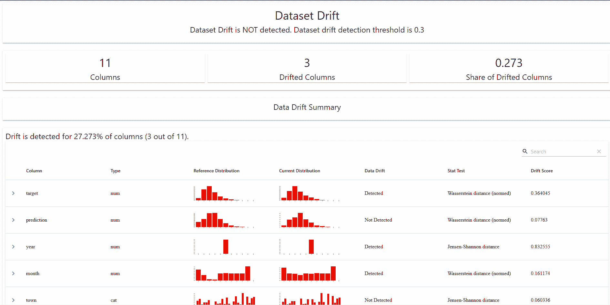
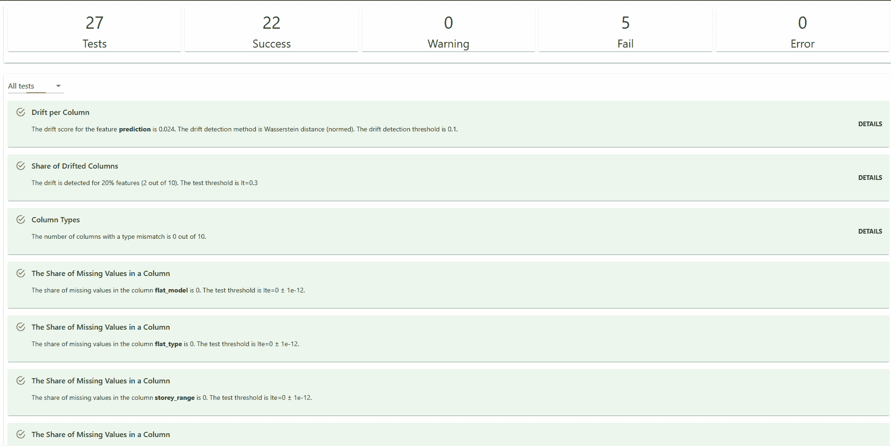

# 如何检测机器学习模型中的漂移

> 原文：[`towardsdatascience.com/how-to-detect-drift-in-machine-learning-models-8a0be4049eed`](https://towardsdatascience.com/how-to-detect-drift-in-machine-learning-models-8a0be4049eed)

## *这可能是为什么你的模型在生产环境中性能下降的原因*

[](https://medium.com/@edwin.tan?source=post_page-----8a0be4049eed--------------------------------)[](https://towardsdatascience.com/?source=post_page-----8a0be4049eed--------------------------------) [Edwin Tan](https://medium.com/@edwin.tan?source=post_page-----8a0be4049eed--------------------------------)

·发表于[Towards Data Science](https://towardsdatascience.com/?source=post_page-----8a0be4049eed--------------------------------) ·8 分钟阅读·2023 年 2 月 6 日

--

# 介绍

你是否曾在测试集上获得了出色的结果，却发现你的模型在生产环境中经过一段时间后表现不佳？如果是这样，你可能正在经历模型衰退。模型衰退是指机器学习模型性能随着时间的推移逐渐下降。在本文中，我们将讨论数据漂移如何导致模型衰退，以及我们如何设置早期检测漂移的机制。


照片由[Samuel Wong](https://unsplash.com/@samuelwong?utm_source=medium&utm_medium=referral)拍摄，来源于[Unsplash](https://unsplash.com/?utm_source=medium&utm_medium=referral)

**机器学习中的漂移是什么？**

在机器学习中，模型漂移指的是模型训练所用数据的基础分布发生变化，从而导致模型在新数据上的性能下降。这可能发生在模型部署到现实环境中时，遇到的数据分布随时间变化。例如，训练于疫情前的数据的模型可能在 Covid19 大流行期间的数据上表现不佳，因为数据的基础分布发生了变化。

**为什么追踪模型漂移很重要？**

跟踪漂移很重要，因为它有助于确保机器学习模型随着时间的推移继续做出准确的预测。随着模型在实际世界中的部署，它遇到的数据分布可能会发生变化，这可能导致模型性能下降。通过跟踪漂移，我们可以检测到这种情况并采取适当的措施来适应模型，例如在新数据上重新训练模型。这有助于防止模型做出越来越不准确的预测，这在某些应用中如欺诈检测、信用评分和医疗诊断中可能产生严重后果。跟踪模型漂移对于合规和监管原因也很重要。组织可能需要维护准确的记录，并有模型性能的可审计记录。

# 漂移的类型

这里是可能影响您模型的不同类型的漂移。

1.  **概念漂移** 是独立变量与目标变量之间关系的变化。这发生在模型试图学习的基础概念或任务随着时间发生变化时。例如，如果欺诈信用卡交易的类型随时间改变，则一个用于检测欺诈信用卡交易的模型可能会经历概念漂移。

1.  **协变量偏移** 是独立变量的偏移。这发生在输入变量的分布随着时间变化时，但基础概念或任务保持不变。例如，如果在一个地理位置上训练的模型被部署到另一个具有不同输入变量分布的位置，它可能会经历协变量偏移。

1.  **先验概率偏移** 是目标变量的偏移。例如，如果在一个类别平衡的数据集上训练的模型被部署到一个某一类别远比另一类别更普遍的数据集上，它可能会经历先验概率偏移。

# 检测漂移的方法

这里是一些检测模型衰退和漂移的常见方法。

**监控模型性能**

这包括计算回归模型的 MSE、RMSE 以及分类模型的 AUC ROC、准确率、精确度、召回率和 F1 分数。生产环境和测试环境之间的大偏差可能会引发潜在漂移的警报。

然而，当预测时间与获取真实情况之间存在较长时间间隔时，这种方法可能不切实际。例如，在一个银行电话营销活动中，机器学习模型预测客户购买特定产品的倾向。该活动可能持续几个月，我们只能在活动结束时得知客户是否在活动期间进行购买。如果我们仅依赖模型性能作为模型漂移的指标，我们只能在活动结束时获得漂移警报。

虽然模型性能是一个有用的指标，但它是滞后的指标。我们可以通过监控输入特征采取主动方法来检测漂移。

**监控输入特征的变化**

监控输入特征变化的一种简单方法是通过描述性统计。描述性统计是用来总结数据集的数字。常见的描述性统计包括均值、中位数、众数、最小值和最大值。描述性统计的变化可能会引发潜在漂移的警报。

我们还可以监控输入特征分布的变化。常用的统计测试来监控分布变化包括 Kolmogorov-Smirnov 检验、人口稳定性指数（PSI）、Wasserstein 距离，也称为地球搬运工距离、Kullback-Leibler 散度和 Jensen-Shannon 距离。

在本文中，我们将通过一个示例来讲解如何使用 Evidently，这是一款利用各种统计测试的 Python 模型监控工具，以检测机器学习模型中的漂移。

# 示例

在以下示例中，我们将：

1.  训练一个模型来预测房屋转售价格。

1.  使用 Evidently AI 的预构建报告来监控拟合的模型。

# 设置

+   Visual Studio Code

+   Python 3.8

+   所需的 Python 包

```py
evidently==0.2.2
scikit-learn==1.1.2
pandas==1.4.3
```

# 获取数据

我们将使用新加坡转售房价数据集的一个子集[1]。由住房发展委员会提供的数据集显示了转售房屋的交易情况，包括交易的年月、单元类型、位置、单元面积和转售价格。

```py
import pandas as pd
import re

df = pd.read_csv('path/to/data/resale-flat-prices-based-on-registration-date-from-jan-2017-onwards.csv')
def convert_to_years(x):

    str_split = x.split(' ')
    years = int(str_split[0])

    if len(str_split) == 4:
        months = int(x.split(' ')[2])
        total_years = round((years*12 + months)/12,2)

    else:

        total_years = years

    return total_years
df['year_month'] = pd.to_datetime(df['month'])
df['year'] = df['year_month'].dt.year
df['month'] = df['year_month'].dt.month
df = df.drop(columns = ['block', 'street_name'])
df['remaining_lease'] = df['remaining_lease'].apply(convert_to_years)
df = df.rename(columns = {'resale_price':'target'})
```

我们执行以下预处理步骤：

+   创建日期特征`year`和`month`。

+   将`remaining_lease`列从字符串类型转换为浮点型。

+   将`resale_price`列重命名为`target`。

让我们根据交易日期将数据分成 3 个集合。

+   `Train`：这是用于训练的集，包含 2020 年的数据。我们已知该集中的标签。

+   `Test`：这是保留集，我们用来获取测试结果。它包含 2021 年的数据。我们已知该集中的标签。

+   `Score`：这是用于生产中评分的未见记录集合。我们不应该拥有此集的标签，因此我们将删除`target`列以模拟真实世界情况。它包含 2022 年的数据。

```py
# split data

df_train = df.loc[(df['year_month'] >= '2020-01-01') & (df['year_month'] < '2021-01-01')].drop(columns = ['year_month']).sample(n=10000)
df_test = df.loc[(df['year_month'] >= '2021-01-01') & (df['year_month'] < '2022-01-01')].drop(columns = ['year_month']).sample(n=5000)
df_score = df.loc[df['year_month'] >= '2022-01-01'].drop(columns = ['year_month', 'target']).sample(n=5000)
y_train = df_train['target'].copy()
X_train = df_train.drop(columns='target').copy()
y_test = df_test['target'].copy()
X_test = df_test.drop(columns='target').copy()
X_score = df_score.copy()
```

# 训练模型

```py
from sklearn.ensemble import GradientBoostingRegressor
from sklearn.pipeline import Pipeline
from sklearn.compose import ColumnTransformer
from sklearn.preprocessing import OneHotEncoder
from sklearn.impute import SimpleImputer

categorical_features = ['town', 'flat_type', 'storey_range', 'flat_model']
categorical_transformer = Pipeline(steps=[('encoder', OneHotEncoder(handle_unknown='ignore'))])
numerical_features = ['floor_area_sqm', 'lease_commence_date', 'remaining_lease']
numerical_transformer = Pipeline(steps=[('impute', SimpleImputer())])
preprocessor = ColumnTransformer(
    transformers=[
        ('cat', categorical_transformer, categorical_features),
        ('num', numerical_transformer, numerical_features)])
gbr = GradientBoostingRegressor()
regressor = Pipeline([('processing', preprocessor), ('regr', gbr)])
regressor.fit(X_train, y_train)
```

# 预测

我们使用训练好的回归模型对测试集、评分集和训练集进行预测。请注意，此时我们只有训练集和测试集的目标列，而没有评分集。

```py
df_test['prediction'] = regressor.predict(X_test)
df_score['prediction'] = regressor.predict(X_score)
df_train['prediction'] = regressor.predict(X_train)
```

# 预构建报告

Evidently AI 提供了各种预构建的指标和测试，称为指标和测试预设。这些是一组相关的指标或测试，以单一报告形式呈现给你。

以下是一些[指标预设](https://docs.evidentlyai.com/reference/all-metrics)：

+   `DataQualityPreset`：评估数据质量并提供描述性统计。

+   `DataDriftPreset`：评估各个列和数据集的数据漂移。

+   `TargetDriftPreset`：评估预测或目标漂移。

+   `RegressionPreset`：评估回归模型的质量。

+   `ClassificationPreset`：评估分类模型的质量。

以下是一些[测试预设](https://docs.evidentlyai.com/reference/all-tests)：

+   `NoTargetPerformanceTestPreset`: 评估预测列中的数据漂移以及所有列的数据质量检查。

+   `DataDriftTestPreset`: 评估单独列和数据集中的数据漂移

+   `DataQualityTestPreset`: 评估数据质量并提供描述性统计

# 预构建指标

让我们来看看这些指标预设是如何工作的。

```py
report = Report(metrics=[
  DataDriftPreset(drift_share=0.3),
  TargetDriftPreset()
])

report.run(reference_data=df_train, current_data=df_test)
report.save_html('evidently_metrics_report.html')
```

我们将训练集和测试集分别设置为参考数据集和当前数据集。请注意，我们没有选择要对列执行的统计测试。显然，Evidently 已根据输入数据的特征为我们做出了选择。了解更多有关他们如何做出这种决策的内容，请参阅[这里](https://docs.evidentlyai.com/reference/data-drift-algorithm)。

我们可以将 HTML 显示为 Jupyter Notebook 单元格输出，或将其保存为 HTML 文件。以下是我们在浏览器中打开 HTML 文件时的样子。



作者制作的 GIF

报告包含以下内容：

+   检测到漂移的列的数量和比例的总结。

+   每一列的数据分布和漂移幅度

+   特征与目标/预测之间的相关性

结果也可以以 Json 或 Python 字典的形式输出，格式如下：

```py
report.json()
#OR
report.as_dict()
```

# 预构建测试

我们可以以类似的方式使用测试预设。我们将训练集和评分集分别设置为参考数据集和当前数据集。

```py
tests = TestSuite(tests=[
    NoTargetPerformanceTestPreset()
])

tests.run(reference_data=df_train.drop(columns='target'), current_data=df_score)
tests.save_html('evidently_tests_report.html')
```

请注意，评分集仅有预测值，而没有实际值（即目标列），因此参考数据集中的目标列已被删除。以下是结果的样子。



作者制作的 GIF

`NoTargetPerformanceTestPreset`提供了数据漂移、质量和完整性的简明总结。结果也可以以 Json 或 Python 字典的形式输出，格式如下：

```py
tests.json()
#OR
tests.as_dict()
```

# 结论

总结来说，机器学习中的模型漂移指的是数据的基础分布发生变化，这可能导致性能下降。跟踪模型漂移非常重要，以确保预测的准确性以及符合合规和监管要求。漂移有不同的类型，包括概念漂移、协变量偏移和先验概率偏移。检测漂移的方法包括监控模型性能和输入特征的描述性统计，以及使用统计测试监控输入特征分布的变化。通过使用像 Evidently AI 这样的工具，我们可以主动检测并解决模型漂移问题，以确保机器学习模型的性能和可靠性。

[加入 Medium](https://medium.com/@edwin.tan/membership) 阅读更多类似的文章！

# 参考

[1] *包含来自 HDB 转售价格的信息，该信息于 2023 年 1 月 31 日访问自* [转售公寓价格-Data.gov.sg](https://data.gov.sg/dataset/resale-flat-prices)，根据新加坡开放数据许可 1.0 版的条款提供* [新加坡开放数据许可-Data.gov.sg](https://data.gov.sg/open-data-licence)。
