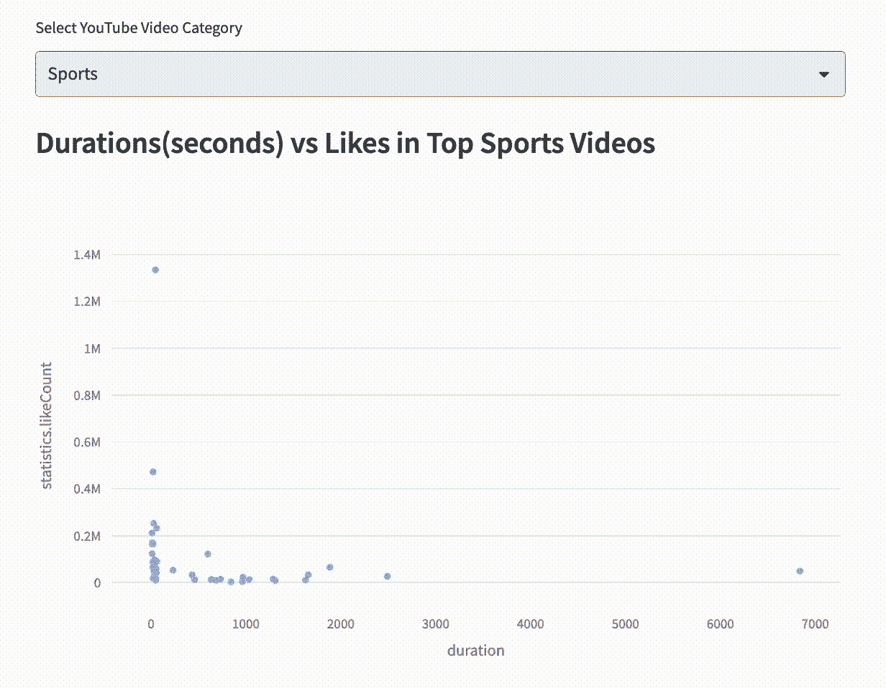
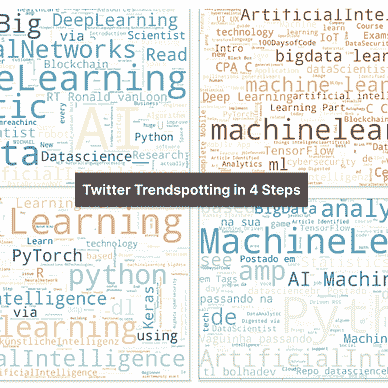

# 如何在 3 个步骤中开发 Streamlit 数据分析 Web 应用

> 原文：[`towardsdatascience.com/how-to-develop-a-data-analytics-web-app-in-3-steps-92cd5e901c52`](https://towardsdatascience.com/how-to-develop-a-data-analytics-web-app-in-3-steps-92cd5e901c52)

## 构建你的第一个 YouTube 分析应用的逐步指南

[](https://destingong.medium.com/?source=post_page-----92cd5e901c52--------------------------------)[](https://towardsdatascience.com/?source=post_page-----92cd5e901c52--------------------------------) [Destin Gong](https://destingong.medium.com/?source=post_page-----92cd5e901c52--------------------------------)

·发表于 [Towards Data Science](https://towardsdatascience.com/?source=post_page-----92cd5e901c52--------------------------------) ·8 分钟阅读·2023 年 2 月 25 日

--


图片来源：[Tran Mau Tri Tam](https://unsplash.com/@tranmautritam?utm_source=medium&utm_medium=referral) 在 [Unsplash](https://unsplash.com/?utm_source=medium&utm_medium=referral)

大多数情况下，数据科学/数据分析项目最终会交付一个静态报告或仪表板，这大大降低了投入过程中的努力和思考。另一方面，Web 应用是展示你的数据分析工作的绝佳方式，之后可以进一步扩展为自服务和互动平台上的服务。然而，作为数据科学家或数据分析师，我们没有开发软件或网站的训练。在这篇文章中，我将介绍像 Streamlit 和 Plotly 这样的工具，这些工具使我们能够通过 Web 应用轻松开发和服务你的数据分析项目，步骤如下：


在 3 个步骤中开发数据分析 Web 应用（图像来自作者的 [网站](https://www.visual-design.net/)）

1.  提取数据并建立数据库

1.  将数据分析过程定义为函数

1.  构建 Web 应用界面

之后，我们将能够创建一个像这样的简单 Web 应用：


Web 应用演示（图像由作者提供）

# 第一步：提取数据并建立数据库


开发数据分析 Web 应用的第一步（图像由作者提供）

我们将在这里使用 YouTube 数据作为示例，因为它与我们的日常生活相关。YouTube 数据 API 允许我们获取公共 YouTube 数据，例如视频统计数据（如点赞数、观看次数）或内容详细信息（如标签、标题、评论）。要设置 YouTube API，需要注册 Google 开发者账户并设置 API 密钥。以下是一些对我开始使用 YouTube API 很有帮助的资源。

+   [Python YouTube API 教程：入门 — 创建 API 密钥和查询 API](https://www.youtube.com/watch?v=th5_9woFJmk&t=1036s&ab_channel=CoreySchafer)

+   [YouTube 数据 API 文档](https://developers.google.com/youtube/v3/docs)

+   [Google API Python 客户端](https://github.com/googleapis/google-api-python-client/blob/main/docs/start.md)

这些资源带我们了解如何创建 YouTube API 密钥和安装所需的库（例如 googleapiclient.discovery）。解决这些依赖关系后，我们使用 Python 和自己的 API 密钥设置与 API 的连接，使用以下命令：

```py
from googleapiclient.discovery import build
youtube = build('youtube', 'v3', developerKey=<your_api_key>)
```

建立连接后，是时候探索你的数据科学项目可以使用的数据了。为此，请查看 [YouTube 数据 API 文档](https://developers.google.com/youtube/v3/docs)，它提供了可以访问的不同类型数据的概述。


YouTube 数据 API 参考列表（截图由作者提供）

我们将使用 “[Videos](https://developers.google.com/youtube/v3/docs/videos/list)” 作为此项目的示例，`list()` 方法允许我们通过传递 *part* 参数和几个 *filters* 请求 “[Video Resource](https://developers.google.com/youtube/v3/docs/videos#resource)”。*part* 参数指定要从视频资源中提取哪些组件，这里我选择了 *snippet, statistics, and contentDetails*。请查看这份 [文档](https://developers.google.com/youtube/v3/docs/videos#resource)，它详细列出了你可以从 `videos().list()` 方法中获取的所有字段。我们还指定了以下 *filter* 参数来限制此请求返回的结果。

+   `chart='mostPopular'`：获取最受欢迎的视频

+   `regionCode='US'`：来自美国的视频

+   `videoCategoryId=1`：从特定视频类别获取视频（例如，1 代表电影和动画），可以在 [视频类别 ID](https://gist.github.com/dgp/1b24bf2961521bd75d6c) 目录中找到。

+   `maxResults=20`：返回最多 20 个视频

```py
video_request = youtube.videos().list(
                part='snippet,statistics,contentDetails',
                chart='mostPopular',
                regionCode='US',
                videoCategoryId=1,
                maxResults=20
		      )
response = video_request.execute()
```

然后我们使用 `video_request.execute()` 执行请求，响应将以 JSON 格式返回，通常如下图所示。


JSON 格式的响应（图像由作者提供）

所有信息都存储在响应中的 “items” 中。然后，我们提取 ‘items’ 键，并通过标准化 JSON 格式创建数据框 `video_df`。

```py
video_df = json_normalize(response['items'])
```

结果是，我们成功将输出整理成更易于操作的结构。


video_df（图像来源：作者）

为了更进一步地使用 Python 处理 JSON，我推荐阅读文章 “如何在 Python 中最好地处理 JSON”。

# 第 2 步。将数据分析过程定义为函数


开发数据分析 Web 应用的第 2 步（图像来源：作者）

我们可以将多行代码语句打包成一个函数，以便它可以被迭代执行，并且在后续阶段容易与其他 Web 应用组件嵌入。

## 定义 extractYouTubeData()

例如，我们可以将上述数据提取过程封装到一个函数中：`extractYouTubeData(youtube, categoryId)`，这允许我们传递一个 `categoryId` 变量，并输出该类别下的前 20 个热门视频作为 `video_df`。这样，我们可以获取用户选择的类别，然后将输入传递给该函数，获得相应的前 20 个视频。

```py
def extractYouTubeData(youtube, categoryId):
    video_request = youtube.videos().list(
    part='snippet,statistics,contentDetails',
    chart='mostPopular',
    regionCode='US',
    videoCategoryId=categoryId,
    maxResults=20
    )
    response = video_request.execute()
    video_df = json_normalize(response['items'])
    return video_df
```

我们可以使用 `video_df.info()` 来获取该数据框中的所有字段。


video_df 中的字段（图像来源：作者）

利用这个宝贵的数据集，我们可以进行各种分析，如探索性数据分析、情感分析、主题建模等。

我想从设计一个用于对这些最热门的 YouTube 视频进行探索性数据分析的应用开始。

+   视频时长与点赞数

+   最常出现的标签

在未来的文章中，我将探索更多技术，如主题建模和自然语言处理，以分析视频标题和评论。因此，如果你希望阅读我在 Medium 上的更多文章，非常感谢你通过注册 [Medium 会员](https://destingong.medium.com/membership) ☕ 来支持我。

## 定义 plotVideoDurationStats()

我想了解视频时长是否与这些热门视频的点赞数有相关性。为此，我们首先需要将 `contentDetails.duration` 从 ISO 日期时间格式转换为数值，使用 `isodate.parse_duration().total_seconds()`。然后，我们可以使用散点图来可视化视频时长与点赞数的关系。这是通过 Plotly 完成的，它为最终用户提供了更互动的体验。下面的代码片段返回 Plotly 图形，这将被嵌入到我们的 Web 应用中。

```py
import isodate
import plotly.express as px

def plotVideoDurationStats(video_df):
    video_df['contentDetails.duration'] = video_df['contentDetails.duration'].astype(str)
    video_df['duration'] = video_df['contentDetails.duration'].apply(lambda x: isodate.parse_duration(x).total_seconds())
    fig = px.scatter(video_df, x="duration", y='statistics.likeCount', color_discrete_sequence=px.colors.qualitative.Safe)
    return fig
```


plotVideoDurationStats 生成的图像（图像来源：作者）

若要探索更多基于 Plotly 的教程，请查看下面这些博客：

[](/an-interactive-guide-to-hypothesis-testing-in-python-979f4d62d85?source=post_page-----92cd5e901c52--------------------------------) ## Python 中假设检验的互动指南

### T 检验、ANOVA、卡方检验示例

towardsdatascience.com [](/dynamic-eda-for-qatar-world-cup-teams-8945970f16be?source=post_page-----92cd5e901c52--------------------------------) ## 如何使用 Plotly 进行更深入和互动的数据探索

### 案例研究：卡塔尔世界杯队伍的动态 EDA

towardsdatascience.com

## 定义 plotTopNTags()

此函数创建某一视频类别的前 N 个标签的图形。首先，我们遍历所有 `snippet.tags` 并将所有标签收集到标签列表中。然后我们创建描述前 N 个最常见标签计数的 `tags_freq_df`。最后，我们使用 `px.bar()` 显示图表。

```py
def plotTopNTags(video_df, topN):
    tags = []
    for i in video_df['snippet.tags']:
        if type(i) != float:
            tags.extend(i)
    tags_df = pd.DataFrame(tags)
    tags_freq_df = tags_df.value_counts().iloc[:topN].rename_axis('tag').reset_index(name='frequency')
    fig = px.bar(tags_freq_df, x='tag', y='frequency')
    return fig
```


plotTopNTags() 生成的图形（作者提供的图片）

# 第 3 步：构建 Web 应用界面


开发数据分析 Web 应用的第 3 步（作者提供的图片）

我们将使用 [Streamlit](https://docs.streamlit.io/library/get-started) 来开发 Web 应用界面。这是我迄今为止发现的最简单的 Web 应用开发工具，它运行在 Python 之上，省去了处理 HTTP 请求、定义路由或编写 HTML 和 CSS 代码的麻烦。

运行 `!pip install streamlit` 将 Streamlit 安装到你的计算机上，或使用此 [文档](https://docs.streamlit.io/library/get-started/installation) 在你首选的开发环境中安装 Streamlit。

使用 Streamlit 创建 Web 应用组件非常简单。例如，显示标题如下所示：

```py
import streamlit as st
st.title('Trending YouTube Videos')
```

在这里，我们需要几个组件来构建 Web 应用。

**1) 输入：一个下拉菜单供用户选择视频类别**


下拉菜单（作者提供的图片）

此代码片段允许我们创建一个下拉菜单，提示“选择 YouTube 视频类别”，并提供‘电影与动画’、‘音乐’、‘体育’、‘宠物与动物’等选项。

```py
videoCategory = st.selectbox(
    'Select YouTube Video Category',
    ('Film & Animation', 'Music', 'Sports', 'Pets & Animals')
)
```

**2) 输入：一个滑块供用户选择标签数量**


滑块（作者提供的图片）

这定义了滑块并指定了滑块范围从 0 到 20。

```py
topN = st.slider('Select the number of tags to display',0, 20)
```

**3) 输出：一个显示视频时长与点赞数的图形**



视频时长与点赞数（作者提供的图片）

我们首先创建 `videoCategoryDict` 将类别名称转换为 `categoryId`，然后通过我们之前定义的 `extractYouTubeData()` 函数传递 `categoryId`。请查看此 [页面](https://gist.github.com/dgp/1b24bf2961521bd75d6c) 获取视频类别及其对应的 categoryId**。**

然后我们调用 `plotVideoDuration()` 函数，并使用 `st.plotly_chart()` 显示 plotly 图表。

```py
videoCategoryDict = {'Film & Animation': 1, 'Music': 10, 'Sports': 17, 'Pets & Animals': 15}
categoryId = videoCategoryDict[videoCategory]
video_df = extractYouTubeData(youtube, categoryId)
duration_fig = plotVideoDurationStats(video_df)
fig_title1 = 'Durations(seconds) vs Likes in Top ' + videoCategory + ' Videos'
st.subheader(fig_title1)
st.plotly_chart(duration_fig)
```

**4) 输出：一个显示该视频类别中热门标签的图形**


视频类别中的热门标签（作者提供的图片）

最后一个组件要求我们将用户输入的标签数量传递给函数`plotTopNTags()`，并通过调用该函数来创建图表。

```py
tag_fig = plotTopNTags(video_df, topN)
fig_title2 = 'Top '+ str(topN) + ' Tags in ' + videoCategory + ' Videos'
st.subheader(fig_title2)
st.plotly_chart(tag_fig)
```

这些代码语句可以包含在一个 Python 文件中（例如 YoutTubeDataApp.py）。然后我们导航到命令行，使用`!streamlit run YouTubeDataApp.py`在网络浏览器中运行应用程序。

# 重点信息

对于数据分析师和数据科学家来说，构建一个网络应用程序可能看起来令人望而生畏。本文涵盖了三个步骤，帮助你开始构建你的第一个网络应用程序，并将数据分析项目扩展到自助服务平台：

+   提取数据并构建数据库

+   将数据分析过程定义为函数

+   构建网络应用程序界面

## 更多类似资源


[Destin Gong](https://destingong.medium.com/?source=post_page-----92cd5e901c52--------------------------------)

## 数据科学入门

[查看列表](https://destingong.medium.com/list/get-started-in-data-science-8006bb4ba3ad?source=post_page-----92cd5e901c52--------------------------------)9 个故事

[Destin Gong](https://destingong.medium.com/?source=post_page-----92cd5e901c52--------------------------------)

## EDA 和特征工程技术

[查看列表](https://destingong.medium.com/list/eda-and-feature-engineering-techniques-e0696974ed54?source=post_page-----92cd5e901c52--------------------------------)9 个故事[](/dynamic-eda-for-qatar-world-cup-teams-8945970f16be?source=post_page-----92cd5e901c52--------------------------------) ## 如何使用 Plotly 进行更深入和互动的数据探索

### 案例研究：卡塔尔世界杯队伍的动态 EDA

towardsdatascience.com

*最初发表于* [*https://www.visual-design.net*](https://www.visual-design.net/post/semi-automated-exploratory-data-analysis-process-in-python) *于 2023 年 2 月 23 日。*
