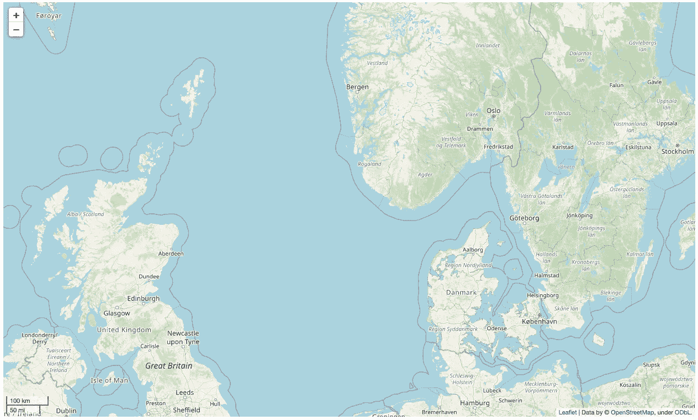
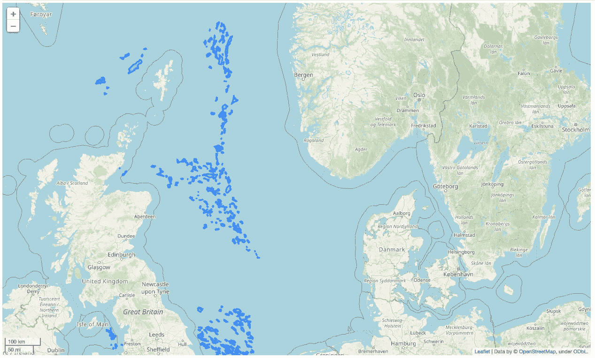
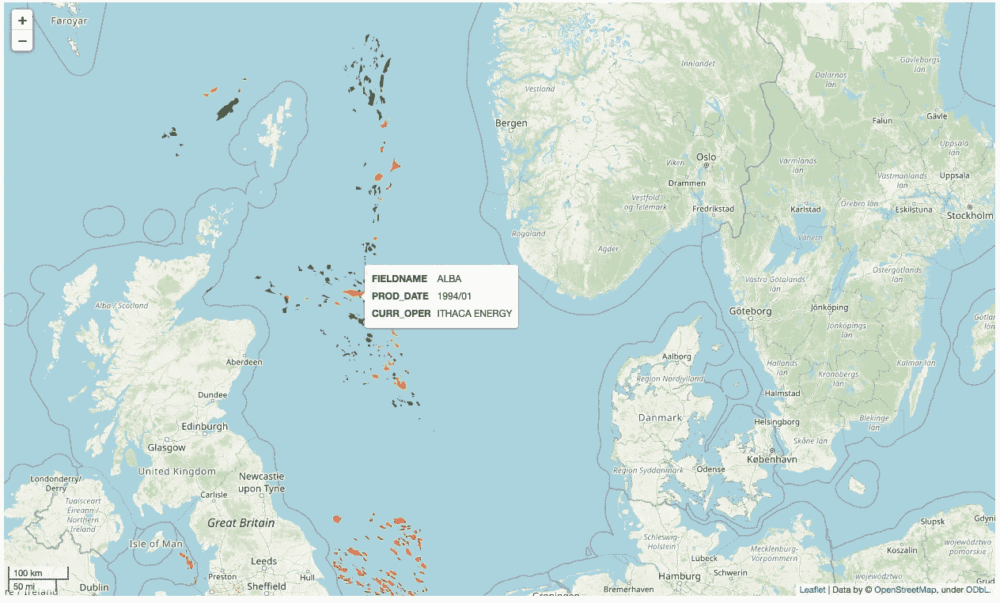

# 如何使用 Folium Python 库显示 GeoJSON 文件中的数据

> 原文：[`towardsdatascience.com/how-to-display-data-from-geojson-files-using-the-folium-python-library-f7284cb2a256`](https://towardsdatascience.com/how-to-display-data-from-geojson-files-using-the-folium-python-library-f7284cb2a256)

## 创建英国大陆架石油和天然气田轮廓的互动地图

[](https://andymcdonaldgeo.medium.com/?source=post_page-----f7284cb2a256--------------------------------)[](https://towardsdatascience.com/?source=post_page-----f7284cb2a256--------------------------------) [Andy McDonald](https://andymcdonaldgeo.medium.com/?source=post_page-----f7284cb2a256--------------------------------)

·发表于 [Towards Data Science](https://towardsdatascience.com/?source=post_page-----f7284cb2a256--------------------------------) ·阅读时间 5 分钟·2023 年 2 月 24 日

--


[由 Aksonsat Uanthoeng 拍摄](https://www.pexels.com/photo/close-up-photo-of-assorted-color-of-push-pins-on-map-1078850/)，下载自 Pexels。

[**Folium**](https://python-visualization.github.io/folium/) 是一个优秀的 Python 库，它利用 [**Leaflet.js**](https://leafletjs.com/) 的强大功能，使得在交互式地图上可视化地理空间数据变得简单。 在我之前的 [**文章**](https://medium.com/towards-data-science/folium-mapping-displaying-markers-on-a-map-6bd56f3e3420) 中，我介绍了如何在 Folium 地图上显示单独的标记，但我们也可以使用 Folium 来显示存储在 GeoJSON 文件中的数据。

[**GeoJSON 是一种常用的文件格式**](https://stevage.github.io/geojson-spec/) 用于存储地理空间数据，使用 JavaScript 对象表示法。这些文件可以存储位置数据、形状、点、表面等。

在本文中，我们将学习如何显示存储在 GeoJSON 文件格式中的英国北海石油和天然气田的多边形。

本文的数据来源于 data.gov.uk，并且遵循 [**开放政府许可证**](https://www.nationalarchives.gov.uk/doc/open-government-licence/version/3/)**。** 数据可以从以下网站查看和下载。

[## OGA 离岸油田 WGS84

### 我们使用 cookies 收集有关您如何使用 data.gov.uk 的信息。我们使用这些信息来使网站正常运行…

[www.data.gov.uk](https://www.data.gov.uk/dataset/c544e9ee-ceab-417b-a872-20ddb4d10912/oga-offshore-fields-wgs84?source=post_page-----f7284cb2a256--------------------------------)

# 设置库并显示基本的 Folium 地图

## 安装 Folium

如果您尚未安装 Folium，可以通过 pip 进行安装：

```py
pip install folium
```

或者 Anaconda：

```py
conda install folium
```

一旦你安装了库，第一步是将 folium 库导入到我们的 Jupyter Notebook 中：

```py
import folium
```

为了简单起见，我们将 GeoJSON 文件的位置分配给一个变量。当我们以后想调用它或者更改为另一个文件时，这样做会使事情更简单，而不需要直接修改其余代码。

```py
field_locations = 'geodata/NSTA_Offshore_Fields_WGS84.geojson'
```

接下来，我们需要用一些基本参数初始化一个 folium 地图。

创建的地图将以北纬 58 度和东经 5 度为中心。我们还将`zoom_start`设置为 6，以便能够查看大部分英国北海。

在创建 folium 地图时，我们可以使用几个其他参数。如果你想了解更多，请查看[**folium.map**](https://python-visualization.github.io/folium/modules.html)类的帮助文档。

```py
m = folium.Map(location=[58, 5], 
                 zoom_start=6, control_scale=True)
m
```

当我们使用变量`m`调用 folium 地图对象时，我们将看到以下地图：



以北海为中心的基础 folium 地图。图片由作者提供。

生成的地图看起来很空旷，因此下一步是添加一些形状来标识英国海上油气田。

# 向 Folium 地图添加 GeoJSON 数据

为了显示 GeoJSON 文件中的数据，我们需要调用`folium.geojson`并传入几个参数。

第一个参数是 GeoJSON 文件的位置，我们将其分配给变量`field_locations`。接下来是`tooltip`参数，这允许我们在任何形状悬停时显示信息。在这个例子中，我们将字段设置为显示油气田的名称（`FIELDNAME`）。

最后，为了使对象显示，我们需要在末尾添加扩展`add_to(m)`。

```py
folium.GeoJson(field_locations,
               tooltip=folium.GeoJsonTooltip(fields=['FIELDNAME'])
              ).add_to(m)
```

当我们调用 folium 地图对象`m`时，我们会看到以下地图：

从生成的地图中，我们可以看到所有英国北海油气田的位置。



Folium 地图展示了英国北海油气田的轮廓。图片由作者提供。

# 在 Folium 中应用自定义颜色到 GeoJson 形状

如果我们想为地图上的形状添加一些样式，可以通过首先创建一个用于控制形状颜色的函数来实现。

从这个数据集中，我们将使用字段类型来选择我们想要显示的颜色。任何油田将显示为绿色，气田显示为红色，凝析油田将显示为橙色。

以下代码源于这个[**StackOverflow 帖子**](https://stackoverflow.com/questions/63960271/folium-geojson-custom-color-map)**。**

```py
def field_type_colour(feature):
    if feature['properties']['FIELDTYPE'] == 'COND':
        return 'orange'
    elif feature['properties']['FIELDTYPE'] == 'OIL':
        return 'green'
    elif feature['properties']['FIELDTYPE'] == 'GAS':
        return 'red'
```

既然我们已经设置好了条件函数，我们需要在调用`folium.GeoJson`时添加一个新的参数，称为`style_function`。在这个参数中，我们传入一个包含样式属性字典的 lambda 函数。

关于 `fillColor` 属性，我们调用上面创建的函数，并传入我们的 `feature`。

我们还可以将额外的样式属性传递到字典中。对于这个例子，我们将 `fillOpacity` 设置为 0.9，将控制形状周围线条的权重设置为 0。

如果我们不想包括上一节中的形状，我们需要重新创建 folium 地图。

```py
m = folium.Map(location=[58, 5], 
                 zoom_start=6, control_scale=True)

folium.GeoJson(field_locations, name='geojson', 
               tooltip=folium.GeoJsonTooltip(fields=['FIELDNAME']),
               style_function= lambda feature: {'fillColor':field_type_colour(feature), 
                                                'fillOpacity':0.9, 'weight':0}
              ).add_to(m)
m
```

当我们调用 `m` 时，我们会看到以下地图。


英国北海油气田的 folium 地图，按油田类型着色。图片由作者提供。

我们现在可以看到，地图上的每个形状/油田根据储层部分包含的主要碳氢化合物类型进行着色。

# 向 Folium 工具提示中添加额外信息

在 GeoJSON 文件中，我们为每个形状有几个额外的属性。这些可以通过将它们包含在 `fields` 参数的列表中，轻松地添加到现有的工具提示中。

```py
m = folium.Map(location=[58, 5], 
                 zoom_start=6, control_scale=True)

folium.GeoJson(field_locations, name='geojson', 
               tooltip=folium.GeoJsonTooltip(fields=['FIELDNAME', 
                                                     'PROD_DATE',
                                                     'CURR_OPER']),
               style_function= lambda feature: {'fillColor':field_type_colour(feature), 
               'fillOpacity':0.9, 'weight':0}).add_to(m)
m
```

当我们重新运行代码时，我们现在可以看到，当我们悬停在每个形状上时，显示了额外的属性。在这种情况下，我们可以看到油田名称、生产开始日期和油田当前的运营商。



Folium 地图显示了英国油气田的轮廓，悬停在每个区域时会出现额外的属性——图片由作者提供。

# 摘要

在这篇简短的文章中，我们已经看到如何轻松地在交互式 folium 地图上显示存储在 GeoJSON 文件中的数据。这使我们能够快速显示可能存储在这种文件类型中的形状和轮廓。

*感谢阅读。在你离开之前，你一定要订阅我的内容，获取我的文章到你的邮箱中。* [***你可以在这里订阅！***](https://andymcdonaldgeo.medium.com/subscribe)*或者，你可以* [***注册我的新闻通讯***](https://fabulous-founder-2965.ck.page/2ca286e572) *，免费将额外内容直接发送到你的邮箱中。*

*其次，你可以通过注册会员来获得完整的 Medium 体验，并支持我和成千上万其他作者。每月仅需 $5，你就可以完全访问所有精彩的 Medium 文章，并有机会通过你的写作赚取收入。如果你使用* [***我的链接***](https://andymcdonaldgeo.medium.com/membership)***，*** *你将直接用你的一部分费用支持我，而且不会增加额外费用。如果你这样做了，非常感谢你的支持！*
