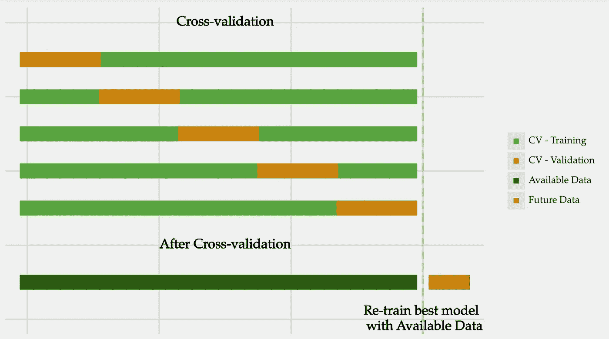

# 如何有效进行交叉验证

> 原文：[`towardsdatascience.com/how-to-do-cross-validation-effectively-1bbeb1d69ee8?source=collection_archive---------7-----------------------#2023-02-06`](https://towardsdatascience.com/how-to-do-cross-validation-effectively-1bbeb1d69ee8?source=collection_archive---------7-----------------------#2023-02-06)

## 交叉验证最佳实践指南：再训练和嵌套

 [Vitor Cerqueira](https://vcerq.medium.com/?source=post_page-----1bbeb1d69ee8--------------------------------)

·

[跟随](https://medium.com/m/signin?actionUrl=https%3A%2F%2Fmedium.com%2F_%2Fsubscribe%2Fuser%2Fefb5f27c836d&operation=register&redirect=https%3A%2F%2Ftowardsdatascience.com%2Fhow-to-do-cross-validation-effectively-1bbeb1d69ee8&user=Vitor+Cerqueira&userId=efb5f27c836d&source=post_page-efb5f27c836d----1bbeb1d69ee8---------------------post_header-----------) 发表在 [Towards Data Science](https://towardsdatascience.com/?source=post_page-----1bbeb1d69ee8--------------------------------) ·6 分钟阅读·2023 年 2 月 6 日

--

[5 折蒙特卡罗交叉验证](https://medium.com/towards-data-science/monte-carlo-cross-validation-for-time-series-ed01c41e2995)。图片来源于作者。

交叉验证是构建强大机器学习模型的关键因素。但它往往未被充分应用。

在这篇文章中，我们将探讨两种重要的实践，以最大限度地发挥交叉验证的作用：再训练和嵌套。

让我们开始吧！

# 什么是交叉验证？

交叉验证是一种评估模型性能的技术。

这个过程通常涉及测试几种技术，或对特定方法进行超参数优化。在这种情况下，你的目标是检查哪种替代方案最适合输入数据。

这个想法是选择能够最大化性能的方法。这是将部署到生产环境中的模型。此外，你还需要获得对该模型性能的可靠估计。

# 交叉验证后的重新训练

交叉验证之后，你应该使用所有可用数据重新训练最佳模型。图片来源：作者。
