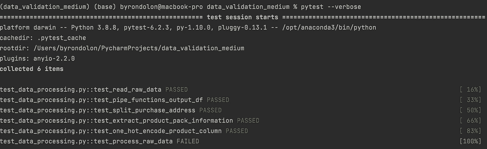
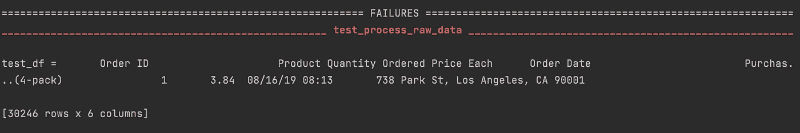
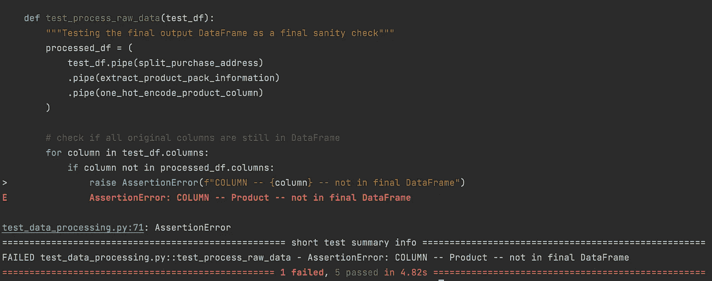

# 如何使用 pytest 对 Pandas 中的数据进行数据验证

> 原文：[`towardsdatascience.com/how-to-do-data-validation-on-your-data-on-pandas-with-pytest-d5dda51ad0e4`](https://towardsdatascience.com/how-to-do-data-validation-on-your-data-on-pandas-with-pytest-d5dda51ad0e4)

## 数据

## 在处理的 DataFrame 上实施基本的数据验证

[](https://byrondolon.medium.com/?source=post_page-----d5dda51ad0e4--------------------------------)[](https://towardsdatascience.com/?source=post_page-----d5dda51ad0e4--------------------------------) [Byron Dolon](https://byrondolon.medium.com/?source=post_page-----d5dda51ad0e4--------------------------------)

·发表在[Towards Data Science](https://towardsdatascience.com/?source=post_page-----d5dda51ad0e4--------------------------------) ·10 分钟阅读·2023 年 5 月 26 日

--


图片由我才华横溢的妹妹[ohmintyartz](https://www.instagram.com/ohmintyartz/)授权使用

在大规模机器学习中处理数据是令人兴奋的，但在开始训练模型之前，有一步你不应忘记：**数据验证**。

数据验证是指验证你收集和转换的数据是否正确且可用。你应始终确保你在机器学习模型或数据分析中使用的数据符合你的期望。

这个过程可能涉及从检查原始数据是否符合你的期望（例如，你收集的来源如何定义输出）开始，到检查你的数据处理函数是否按预期工作。

我们可以看看如何在数据处理管道中使用**pytest**在 Pandas 上实现基本的测试和数据验证。我们将从查看一组初始的数据处理函数开始，然后看看如何实现一些测试，以确保我们的处理函数和数据按预期行为。

你可以在自己的笔记本或 IDE 中跟随操作。你可以从 Kaggle[这里](https://www.kaggle.com/datasets/deepanshuverma0154/sales-dataset-of-ecommerce-electronic-products?resource=download)下载数据集，使用 CC0 1.0 通用（CC0 1.0）公共领域献身许可证免费提供。

# 介绍 — 使用 Pytest 进行初步数据处理和简单数据验证

我们将在本文中使用的代码是一组使用 Pandas 读取和处理数据的 Python 函数。它包括一个函数来分块读取原始数据，然后是几个对原始数据进行转换的函数。

```py
# data_processing.py
import pandas as pd
from pandas import DataFrame

def read_raw_data(file_path: str, chunk_size: int = 1000) -> DataFrame:
    csv_reader = pd.read_csv(file_path, chunksize=chunk_size)
    processed_chunks = []

    for chunk in csv_reader:
        chunk = chunk.loc[chunk["Order ID"] != "Order ID"].dropna()
        processed_chunks.append(chunk)

    return pd.concat(processed_chunks, axis=0)

def split_purchase_address(df_to_process: DataFrame) -> DataFrame:
    df_address_split = df_to_process["Purchase Address"].str.split(
        ",", n=3, expand=True
    )
    df_address_split.columns = ["Street Name", "City", "State and Postal Code"]

    df_state_postal_split = (
        df_address_split["State and Postal Code"]
        .str.strip()
        .str.split(" ", n=2, expand=True)
    )
    df_state_postal_split.columns = ["State Code", "Postal Code"]

    return pd.concat([df_to_process, df_address_split, df_state_postal_split], axis=1)

def extract_product_pack_information(df_to_process: DataFrame) -> DataFrame:
    df_to_process["Pack Information"] = (
        df_to_process["Product"].str.extract(r".*\((.*)\).*").fillna("Not Pack")
    )

    return df_to_process

def one_hot_encode_product_column(df_to_process: DataFrame) -> DataFrame:
    return pd.get_dummies(df_to_process, columns=["Product"])

def process_raw_data(file_path: str, chunk_size: int) -> DataFrame:
    df = read_raw_data(file_path=file_path, chunk_size=chunk_size)

    return (
        df.pipe(split_purchase_address)
        .pipe(extract_product_pack_information)
        .pipe(one_hot_encode_product_column)
    )
```

接下来，我们可以开始实现我们的第一个数据验证测试。如果你打算在笔记本或 IDE 中跟随，应该在新文件（或笔记本中的另一个单元格）中导入以下内容：

```py
import pandas as pd
import numpy as np
import pytest
from pandas import DataFrame
from data_processing import (
    read_raw_data,
    split_purchase_address,
    extract_product_pack_information,
    one_hot_encode_product_column,
)
from pandas.testing import assert_series_equal, assert_index_equal
```

你可以阅读更多关于如何实际运行 pytest（文件命名约定和如何发现测试[这里](https://docs.pytest.org/en/7.1.x/explanation/goodpractices.html#test-discovery)），但在我们的案例中，你只需创建一个名为`test_data_processing.py`的新文件，并在你的 IDE 中添加到文件后，你可以运行`pytest`，可选地加上“--verbose”。

## Pytest 简介和简单的数据验证检查

Pytest 是一个 Python 中的测试框架，它使你能够轻松地为你的数据管道编写测试。你可以主要使用 assert 语句，它本质上检查在`assert`后面放置的条件是否为 True 或 False。如果条件为 False，它将引发异常`AssertionError`（并且在与 pytest 一起使用时会导致测试失败）。

所以首先，让我们测试一些简单的东西。我们要做的只是检查我们其中一个函数（第一个读取原始数据的函数）的输出是否返回一个 DataFrame。

顺便提一下，你会注意到在原始函数中，我们写了箭头`->`语法来为函数添加类型提示，我们说函数应该返回一个 DataFrame。这意味着如果你在函数中写了返回其他类型的内容，你的 IDE 会标记为返回无效输出（但这不会从技术上破坏你的代码或阻止它运行）。

为了实际检查函数是否返回一个 DataFrame，我们将实现一个函数来测试`read_raw_data`函数，并将其命名为`test_read_raw_data`。

```py
def test_read_raw_data():
    """Testing output of raw table read in is DataFrame"""
    test_df = read_raw_data(file_path="Updated_sales.csv", chunk_size=1000)
    assert isinstance(test_df, DataFrame)  # checking if it's a DataFrame
```

在这个函数中，我们添加了一行文档字符串来解释我们的测试函数只是检查输出是否为一个 DataFrame。然后，我们将现有的`read_raw_data`函数的输出分配给一个变量，并使用`isinstance`来返回 True 或 False，如果指定的对象是你放入的类型。在这种情况下，我们检查`test_df`是否是一个`DataFrame`。

我们可以类似地对剩余的函数进行处理，这些函数仅接受 DataFrame 作为输入，并且预期返回一个 DataFrame 作为输出。实现可能如下所示：

```py
def test_pipe_functions_output_df():
    """Testing output of raw table read in is DataFrame"""
    test_df = read_raw_data(file_path="Updated_sales.csv", chunk_size=1000)
    all_pipe_functions = [
        split_purchase_address,
        extract_product_pack_information,
        one_hot_encode_product_column,
    ]
    for function in all_pipe_functions:
        assert isinstance(function(test_df), DataFrame)
```

注意，你还可以在 for 循环中使用`assert`语句，因此我们只需遍历每个函数，传入一个 DataFrame 作为输入，并检查输出是否也是 DataFrame。

## 在 pytest 中实现 fixture 以提高测试效率

你可以看到，上面我们不得不在两个不同的测试函数中写完全相同的行：

```py
test_df = read_raw_data(file_path="Updated_sales.csv", chunk_size=1000)
```

这是因为对于两个测试函数，我们都需要一个 DataFrame 作为输入来检查我们的数据处理函数的输出是否结果为一个 DataFrame。因此，为了避免在所有测试函数中复制相同的代码，你可以使用 fixtures，这让你编写一些**pytest 允许你在不同测试中重用的代码。** 这样做的方式如下：

```py
@pytest.fixture
def test_df() -> DataFrame:
    return read_raw_data(file_path="Updated_sales.csv", chunk_size=1000)

def test_read_raw_data(test_df):
    """Testing output of raw table read in is DataFrame"""
    assert isinstance(test_df, DataFrame)  # checking if it's a DataFrame

def test_pipe_functions_output_df(test_df):
    """Testing output of raw table read in is DataFrame"""
    all_pipe_functions = [
        split_purchase_address,
        extract_product_pack_information,
        one_hot_encode_product_column,
    ]
    for function in all_pipe_functions:
        assert isinstance(function(test_df), DataFrame)
```

我们这次在函数中定义`test_df`，该函数返回原始 DataFrame。然后，在我们的测试函数中，我们只需将`test_df`作为参数包含在内，就可以像之前一样使用它。

# 测试一个函数是否转换了 DataFrame

接下来，我们将检查我们的`split_purchase_address`函数，该函数实际上输出的是与输入相同的 DataFrame，但增加了额外的地址列。我们的测试函数将如下所示：

```py
def test_split_purchase_address(test_df):
    """Testing multiple columns in output and rows unchanged"""
    split_purchase_address_df = split_purchase_address(test_df)
    assert len(split_purchase_address_df.columns) > len(test_df.columns)
    assert split_purchase_address_df.index.__len__() == test_df.index.__len__()
    assert_index_equal(split_purchase_address_df.index, test_df.index)  # using the Pandas testing
```

在这里，我们将检查两个主要方面：

1.  输出的 DataFrame 是否比原始 DataFrame 有更多列？

1.  输出的 DataFrame 是否具有与原始 DataFrame 不同的索引？

首先，我们运行`split_purchase_address`函数，将`test_df`作为输入传递，并将结果分配给一个新变量。这会给我们原始函数的输出，然后我们可以对其进行测试。

要实际进行测试，我们可以检查输出的 DataFrame 中是否存在特定列，但一种更简单（不一定更好）的方法是仅使用`assert`语句检查输出 DataFrame 是否比原始 DataFrame 有更多列。类似地，我们可以使用`assert`语句检查每个 DataFrame 的索引长度是否相同。

你还可以查看[Pandas 测试文档](https://pandas.pydata.org/docs/reference/testing.html)以了解一些内置的测试函数，但实际上只有少数几个函数用于检查 DataFrame、索引或 Series 的两个对象是否相等。我们使用`assert_index_equal`函数来完成与`index.__len__()`相同的操作。

# 测试 DataFrame 在输出中是否具有特定列

如前所述，我们还可以检查 DataFrame 是否包含特定列。接下来我们将讨论`extract_product_pack_information`函数，该函数应始终输出带有额外名为“Pack Information”列的原始 DataFrame。我们的测试函数将如下所示：

```py
def test_extract_product_pack_information(test_df):
    """Test specific output column in new DataFrame"""
    product_pack_df = extract_product_pack_information(test_df)
    assert "Pack Information" in product_pack_df.columns
```

在这里，我们所做的就是在原始函数的输出上再次调用`columns`，但这次特别检查“Pack Information”列是否在列列表中。如果由于某种原因我们修改了原始的`extract_product_pack_information`函数以返回额外的列或重命名了输出列，则此测试将失败。这将是一个很好的提醒，检查我们最终用于什么（如机器学习模型）是否也考虑了这一点。

然后我们可以做两件事：

1.  在我们的代码管道下游进行更改（例如引用“Pack Information”列的代码）；

1.  编辑我们的测试以反映处理函数中的更改。

# 测试 DataFrame 的列是否具有正确的数据类型

我们还应检查由函数返回的 DataFrame 是否具有我们所需的数据类型。例如，如果我们在数值列上进行计算，我们应检查这些列是以 `int` 还是 `float` 类型返回，这取决于我们的需要。

让我们测试一下 `one_hot_encode_product_column` 函数的数据类型，其中我们在原始 DataFrame 的一个分类列上进行常见的特征工程步骤。我们期望所有列的数据类型都是 `uint8`（`get_dummies` 函数在 Pandas 中默认返回的数据类型），所以我们可以这样进行测试。

```py
def test_one_hot_encode_product_column(test_df):
    """Testing if column types are correct"""
    encoded_df = one_hot_encode_product_column(test_df)
    encoded_columns = [column for column in encoded_df.columns if "_" in column]
    for encoded_column in encoded_columns:
        assert encoded_df[encoded_column].dtype == np.dtype("uint8")
```

`get_dummies` 函数的输出还会返回带有下划线的列（当然，这可以通过检查实际列名来更好地完成——就像在之前的测试函数中我们检查特定列一样）。

在这里，我们所做的只是通过循环检查所有目标列是否都是 `np.dtype("uint8")` 数据类型。我之前在笔记本中通过检查其中一列的 `column.dtype` 来完成了这项检查。

# 对最终输出进行额外的数据验证

除了测试你拥有的构成数据处理和转换管道的单个函数外，另一个好习惯是测试管道的最终输出。

为此，我们将在测试中模拟运行整个管道，然后检查结果 DataFrame。

```py
def test_process_raw_data(test_df):
    """Testing the final output DataFrame as a final sanity check"""
    processed_df = (
        test_df.pipe(split_purchase_address)
        .pipe(extract_product_pack_information)
        .pipe(one_hot_encode_product_column)
    )

    # check if all original columns are still in DataFrame
    for column in test_df.columns:
        if column not in processed_df.columns:
            raise AssertionError(f"COLUMN -- {column} -- not in final DataFrame")

    assert all(
        element in list(test_df.columns) for element in list(processed_df.columns)
    )

    # check if final DataFrame doesn't have duplicates
    assert assert_series_equal(
        processed_df["Order ID"].drop_duplicates(), test_df["Order ID"]
    )
```

我们的最终 `test_process_raw_data` 将检查两个最终点：

1.  **检查最终 DataFrame 是否仍然包含原始列——**这并不总是一个要求，但可能你希望所有原始数据仍然可用（而不是转换）在输出中。做到这一点很简单——我们只需要检查 `test_df` 中的列是否仍然存在于 `processed_df` 中。最后，如果列不存在，我们可以这次引发 `AssertionError`（类似于使用 `assert` 语句）。这是一个很好的示例，展示了如何在需要时在测试中输出特定的消息。

1.  **检查最终 DataFrame 是否没有重复项**——有很多不同的方法可以做到这一点——在这种情况下，我们只使用“订单 ID”（我们期望它像索引一样）和 `assert_series_equal` 来检查输出 DataFrame 是否没有生成重复行。

## 检查 pytest 输出

要快速查看运行 pytest 的情况，只需在 IDE 中运行：

```py
pytest --verbose
```

Pytest 将检查包含所有测试函数的新测试文件并运行它们！这是对数据处理管道进行一系列数据验证和测试检查的简单实现。如果你运行上述代码，输出应该类似于：



pytest 输出 1 —— 作者提供的图片



pytest 输出 2 —— 作者提供的图片



pytest 3 的输出— 作者图片

你可以看到我们最终的测试失败了，特别是在测试中我们检查初始 DataFrame 的所有列是否存在于最终 DataFrame 中。此外，我们之前定义的`AssertionError`中的自定义错误消息是否正确显示——我们原始 DataFrame 中的“Product”列没有出现在最终的 DataFrame 中（请查看我们的初始数据处理函数，看看能否找到原因）。

这个测试还有很大的改进空间——我们现在只有一个非常简单的实现，包含基本的测试和数据验证案例。对于更复杂的管道，你可能需要更多的测试，不仅是对单个数据处理函数的测试，还包括对原始和最终输出 DataFrame 的测试，以确保你使用的数据是可以信赖的。

感谢你花时间阅读这篇文章！如果你喜欢我的内容，我希望你能通过下面的推荐链接注册 Medium。这样我可以获得你每月订阅的一部分，同时你也能访问 Medium 会员专属的某些功能。如果你已经在关注我，非常感谢你的支持！

[](https://byrondolon.medium.com/membership?source=post_page-----d5dda51ad0e4--------------------------------) [## 使用我的推荐链接加入 Medium — Byron Dolon

### 作为 Medium 会员，你的一部分会费将用于支持你阅读的作者，同时你将获得对每篇故事的完全访问权限……

byrondolon.medium.com](https://byrondolon.medium.com/membership?source=post_page-----d5dda51ad0e4--------------------------------)

> M**ore by me:** *-* [*5 个实用技巧，助你成为数据分析师*](https://byrondolon.medium.com/5-practical-tips-for-aspiring-data-analysts-9917006d4dae?sk=019edbddaca4d313665caafe4b747d26) *-* [*掌握电商数据分析*](https://python.plainenglish.io/mastering-analysis-for-e-commerce-with-pandas-e4219a87b10c?sk=9aa8fd1024b89e89e4b0904c8d00d242) *-* *在 Pandas DataFrame 中检查子字符串* *-* [*学习 Python 的 7 个最佳 Github 资源库*](https://medium.com/towards-data-science/top-7-repositories-on-github-to-learn-python-44a3a7accb44) *-* *用 Pandas 理解数据的 5（又半）行代码*
