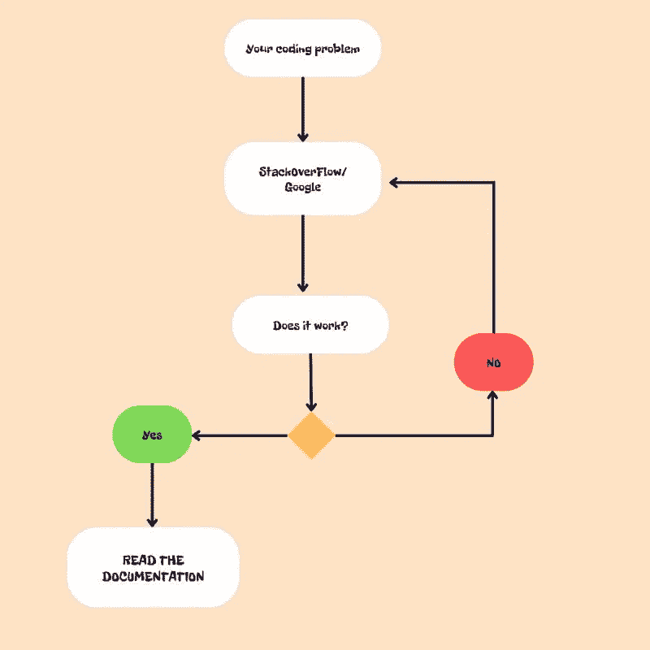

# 如何在 ChatGPT 时代有效开始编码

> 原文：[`towardsdatascience.com/how-to-effectively-start-coding-in-the-era-of-chatgpt-cfc5151e1c42`](https://towardsdatascience.com/how-to-effectively-start-coding-in-the-era-of-chatgpt-cfc5151e1c42)

## 一些使用 ChatGPT 学习编程的建议，同时实际进行学习

[](https://federicotrotta.medium.com/?source=post_page-----cfc5151e1c42--------------------------------)[](https://towardsdatascience.com/?source=post_page-----cfc5151e1c42--------------------------------) [Federico Trotta](https://federicotrotta.medium.com/?source=post_page-----cfc5151e1c42--------------------------------)

·发表于 [Towards Data Science](https://towardsdatascience.com/?source=post_page-----cfc5151e1c42--------------------------------) ·阅读时间 11 分钟·2023 年 6 月 5 日

--


图片由 [StockSnap](https://pixabay.com/it/users/stocksnap-894430/?utm_source=link-attribution&utm_medium=referral&utm_campaign=image&utm_content=2557468) 提供，来自 [Pixabay](https://pixabay.com/it//?utm_source=link-attribution&utm_medium=referral&utm_campaign=image&utm_content=2557468)

如果你想开始编程但担心人工智能会抢走你的工作，那么这篇文章绝对适合你。特别是如果你在考虑换职业成为软件工程师或数据专业人士，我真的能感受到你现在的不安。

我大约在三年前，当时我 30 岁，没有任何经验，这帮助我找到了我的第一份 IT 远程工作。

现在，3 年前 ChatGPT 并不存在，我知道你可能会有这样的疑问：“如果我花几个月时间学习和实践编程，结果却因为人工智能找不到实际工作怎么办？”。

好吧，让我告诉你一件事：不要害怕最近大科技公司的裁员：这些裁员与人工智能的增长并没有直接关系。而且，没有人真正知道人工智能是否会在 5 年内取代开发人员，所以我的看法是：人工智能会取代那些实际上不能编程的开发人员。因此，如果你有效地学习如何编码，你会发现人工智能是一个帮助你加快日常任务的工具，而不是一个会取代你的敌人。

因此，在这篇文章中，我们将看到，如果你今天打算开始编程，无论你多大年龄或当前的职业状态如何，ChatGPT 实际上可以为你带来额外的价值。

这就是你在这里会发现的内容：

```py
**Table of Contents:** 
Rule number 1: how to correctly ask questions to ChatGPT
Rule number 2: always refer to the documentation
Rule number 3: troubleshooting and debugging
Examples in Python
```

# 规则第 1 条：如何正确向 ChatGPT 提问

首先要学习的是如何正确地向 ChatGPT 提问。

当我开始学习编程时，我认为开发者是那些从五岁开始编程、拥有丰富编程知识的人，他们心中装满了所有需要的代码。

你知道吗？我之前的想法完全错误。这里有一个严酷的事实：

1.  许多开发者在他们的 20 岁和 30 岁时开始学习编程。

1.  大多数开发者通过在 Google 和 StackOverflow 上搜索信息来工作（如今，他们也向 ChatGPT 提问）。

所以，首先，如果你现在刚开始编程，不要羞于花大量时间在 Google、StackOverflow 或 ChatGPT 上。这是完全正常的。你只需要知道如何正确地使用这些资源，因为你永远不会记住所有你需要的代码（你只会记住你最常用的方法和函数，当然）。

无论如何，今天和 90 年代的区别在于，90 年代互联网几乎不存在，所以开发者没有像今天这样通过全球社区、论坛、网站和 AI 获得的支持。

这导致开发者不得不艰难地学习编程，通常需要花费数天时间来解决一个问题（找出错误或找到合适的代码）。

现在，你有一个绝佳的机会：你可以 24/7 使用一位高级开发者，那就是 ChatGPT，但你需要像对待高级开发者一样对待它，而不是像对待神谕一样。

所以，这里有一些关于如何正确地询问 ChatGPT 的指导原则，适合今天刚开始编程的人：

1.  **首先学习基础知识**。在使用 ChatGPT 之前，我的建议是你需要首先学习基础知识，原因很简单：ChatGPT 经常会给你需要重构的代码，无论是什么原因。这意味着你需要具备一定的编程知识：你不能仅仅让 ChatGPT 为你创建一些代码来解决实际问题。将会被 AI 替代的开发者是那些没有（或知识贫乏的）编程基础的人。所以，在提出问题之前，先报一个课程并开始实践吧。

1.  **提出问题，然后学习**。当我们还是孩子时，我们非常好奇，我们的问题让我们成长，因为我们对答案真的感兴趣。这就是我们作为软件专业人员应始终保持的心态：仅仅得到一个答案并复制粘贴并不会让我们学会编程。如果我们从 ChatGPT 获得的代码能够工作，你应该至少要求它解释使用的代码及其原因。作为一个初学者，你的角色实际上是学习，以便将来你可以减少对 ChatGPT 的依赖，更加独立：这就是为什么你应该始终要求代码解释的原因。

1.  **解决实际问题**。在编程时，我们可以用不同的方法解决同一个问题：这就是为什么仅仅让 ChatGPT 生成一些随机代码没有任何意义的原因。我们绝对需要询问它与我们正在做的项目或需要解决的问题相关的内容。

1.  **不要盲目相信它**。作为一个生成性 AI 系统，ChatGPT 容易出错。虽然今天使用 GPT-4 模型我们看到了很好的改进，但代码中仍然存在错误。此外，错误通常是由于提示可能不完整或某种程度上具有误导性。这就是为什么，即使代码有效，你也不能盲目相信答案，需要深入理解你获得的代码。

# 规则第 2 条：始终参考文档



编码时的学习流程。图像来源：Federico Trotta。

我创建了上面的图片用于几个月前我在 LinkedIn 上写的一些内容（哦，顺便说一下：[这是我的个人资料](https://www.linkedin.com/in/federico-trotta/)如果你想联系我）。

故事的寓意是：无论你在哪里寻找解决编码问题的信息，你始终需要阅读文档。永远。

这对于我们开发者/数据专业人员来说是福音。我们总是需要阅读文档。

实际上，如果我们找到一个可以解决我们面临问题的代码片段，如果我们不理解这些代码，我们将无法概括我们正在使用的代码。这意味着将来我们将无法解决类似的问题，因为我们没有学到任何东西：我们只是复制和粘贴了代码。

这对于 ChatGPT 尤其如此，特别是因为有时它会发明一些不存在的库。是的，你没看错：有时 ChatGPT 会发明库。

我们必须说，感谢 GPT-4，OpenAI 做了很多改进。但在过去几个月里，我至少遇到过几次 ChatGPT 发明了一些不存在的库。

你知道我们如何查看一个库是否存在吗？有一些可能性：

1.  你知道自己在做什么并询问 ChatGPT。但这将在你经过几个月的实践并积累一些经验后发生。

1.  你从 ChatGPT 那里获取代码，阅读它，尝试理解它，询问 ChatGPT 关于使用的解释，在线查阅文档却找不到参考。

1.  你尝试代码并遇到错误，你会通过实际经验学到教训。但不要感到羞愧：我也遇到过这种情况。

记住：急于尽快解决问题没有什么不好。所以，你甚至可以尝试代码并遇到错误。实际上，错误甚至可能是由于不好的提示，这种情况非常频繁。

无论如何，记住：如果你的工作已经完成，因为你解决了实际问题，那么，请：去阅读文档以获取更多理解。你也可能发现你的问题可以用更少的代码解决。

# 规则第 3 条：故障排除和调试

ChatGPT 是一个很棒的工具，即使是在故障排除和调试你的代码时。然而，即使在这种情况下，你也必须学会如何正确使用它，如果你刚刚开始学习编码。

首先，如果你使用的是像 VS CODE 或 PYCHARM 这样的 IDE 编程，那么使用它们的调试功能。它们集成了调试功能，你只需按下一个按钮，它们就会调试你的代码，显示代码中的（可能的）问题。

在这个阶段，甚至在后面（我仍在使用这种方法），最好的办法是遵循这条路径：

1.  编写你的程序。

1.  在 IDE 中调试你的代码。

1.  如果有警告从调试器中获得，请阅读它们，如果某些功能不起作用。

1.  如果你不知道如何解决它们，可以将警告粘贴到 Google 上。

1.  如果谷歌搜索没有解决你的问题，可以将警告粘贴到 ChatGPT 上。

1.  如果你仍未解决问题，将完整代码粘贴到 ChatGPT 中。

1.  如果前一个点解决了你的问题，请查看文档。

我会不断重复：我们**总是**需要参考文档，当谷歌或 ChatGPT 解决了我们代码中的问题时。

所以，请：不要盲目将代码粘贴到 ChatGPT 中，要求查找代码中的问题：首先，努力自己找到它们，因为这是你学习的唯一途径。没有其他学习方法，我知道你也知道这一点。

最后，**重要说明**：记住，ChatGPT 在云端运行，并且它可能会使用你的提示来训练其算法（根据最近的数据隐私使用更改，你应该能够更改设置，选择不允许 OpenAI 使用你的提示来训练其算法）。

然而，需要记住的是，不要将包含敏感信息的代码粘贴到 ChatGPT 中进行调试：由于数据泄露和其他相关安全问题，最好保护自己。

# Python 中的示例

现在，让我们看看一些我们应该在 ChatGPT 上写的提示，以学习如何编程。

我问了 ChatGPT 以下问题：“*我们如何在 Python 中打印？*”

这是答案：

> 在 Python 中，你可以使用`print()`函数在控制台或终端上显示输出。`print()`函数接受一个或多个参数，并将它们打印为文本。
> 
> 这里有几个使用`print()`函数的示例：
> 
> 打印简单的字符串：

```py
print("Hello, world!")

>>>

Hello, world!
```

> 2. 打印变量：

```py
name = "Alice"
age = 25
print("My name is", name, "and I am", age, "years old.")

>>>

My name is Alice and I am 25 years old.
```

> 3. 打印多个用特定字符分隔的参数：

```py
print("One", "Two", "Three", sep="-")

>>>

One-Two-Three
```

> 4. 使用 f-strings 打印格式化输出（Python 3.6 及以上）：

```py
name = "Bob"
age = 30
print(f"My name is {name} and I am {age} years old.")

>>>

My name is Bob and I am 30 years old.
```

> 这些只是展示`print()`函数用法的一些示例。你可以将各种类型的对象作为参数传递给`print()`函数，它会自动将它们转换为字符串表示形式，然后进行打印。

现在，有一个问题：你会使用哪种方法？

正是这里出现了问题！我们做的提示太笼统，所以 ChatGPT 给了我们一个泛泛的回答。

所以，这里有另一个教训：**提示必须非常具体**。例如：*“我在 Python 中有一个包含一些字符串的列表：我如何有效地打印它们？”*

这是答案：

> 要在 Python 中有效地打印一个字符串列表，你可以使用 `join()` 方法与 `print()` 函数结合使用。`join()` 方法将列表中的所有字符串连接成一个单独的字符串，使用指定的分隔符。然后你可以将这个连接后的字符串传递给 `print()` 函数以显示它。
> 
> 这里有一个例子：

```py
my_list = ['Hello', 'World', 'Python']

# Using join() to concatenate the strings in the list with a space separator
result = ' '.join(my_list)

# Printing the result
print(result)

>>>

Hello World Python
```

> 在上面的例子中，`join()` 方法使用空格 `' '` 作为分隔符来连接 `my_list` 中的字符串。然后使用 `print()` 函数来显示连接后的字符串。
> 
> 通过使用 `join()` 方法，你可以避免多次调用 `print()` 函数的开销，从而实现更高效的字符串连接和打印。

这里我们来了：有了具体的问题，我们得到了具体的答案。

现在，你知道我们需要做什么了吗？是的，你知道：如果我们不知道它是如何工作的，我们需要向 ChatGPT 询问更多关于 `join()` 方法的解释。我们可以在同一个聊天中这样做：“*`join()` 方法是什么，它是如何工作的？*”

这里是答案：

> `join()` 方法是 Python 中的一个字符串方法，用于将可迭代对象（如列表、元组或集合）的元素连接成一个单独的字符串，使用指定的分隔符。它返回一个新的字符串，包含所有连接在一起的元素。
> 
> 使用 `join()` 方法的语法如下：

```py
separator.join(iterable)
```

> 在这里，`separator` 是将元素连接起来的字符串，`iterable` 是要连接的元素集合。
> 
> 当 `join()` 在分隔符字符串上被调用时，它遍历可迭代对象的元素并将它们连接起来，在每对元素之间插入分隔符字符串。分隔符不会添加到结果字符串的开头或结尾。
> 
> 这是一个例子，说明 `join()` 方法是如何工作的：

```py
my_list = ['Hello', 'World', 'Python']

# Using join() to concatenate the strings in the list with a space separator
result = ' '.join(my_list)

print(result)

>>>

Hello World Python
```

> 在上面的例子中，`join()` 方法在分隔符字符串 `' '` 上被调用。它遍历 `my_list` 中的元素并将它们连接起来，在每对元素之间插入一个空格。结果字符串 `'Hello World Python'` 被打印出来。
> 
> 值得注意的是，`join()` 方法是一种比在循环中使用 `+` 运算符连接多个字符串更高效的方法。这是因为 `join()` 内部优化了连接过程，从而提高了性能，特别是在处理大量字符串时。

现在，在这一点上，你应该做其他两件事：

1.  在 Google 上搜索“join() Python”，查看其他一些例子并阅读文档。

1.  正如我们所见，ChatGPT 告诉我们这种方法比使用 `+` 运算符和循环解决这个问题更高效。你应该继续聊天并请求一个例子（然后，阅读可能会随下一个例子附带的文档）。

# 结论

希望你觉得这篇文章对如何开始编程之旅有用，尤其是借助 ChatGPT。

记住：不要把任何事情视为理所当然。用它来学习，而不是作为预言。解决问题后，写一个具体的提示，阅读文档，学习代码，并在可能的情况下，练习你得到的代码。

**免费 Python 电子书：**

开始学习 Python 数据科学但遇到困难？[***订阅我的通讯并获得我的免费电子书：这将为你提供正确的学习路径，帮助你通过实践经验学习 Python 数据科学。***](https://federico-trotta.ck.page/a3970f33f4)

享受了这个故事吗？每月只需 5$ [通过我的推荐链接](https://medium.com/@federicotrotta/membership) 成为 Medium 会员：我将获得少量佣金，而不会增加你的费用：

[](https://federicotrotta.medium.com/membership?source=post_page-----cfc5151e1c42--------------------------------) [## 通过我的推荐链接加入 Medium - Federico Trotta

### 阅读 Federico Trotta 的每一个故事（以及 Medium 上成千上万其他作家的故事）。你的会员费直接支持…

federicotrotta.medium.com](https://federicotrotta.medium.com/membership?source=post_page-----cfc5151e1c42--------------------------------)
