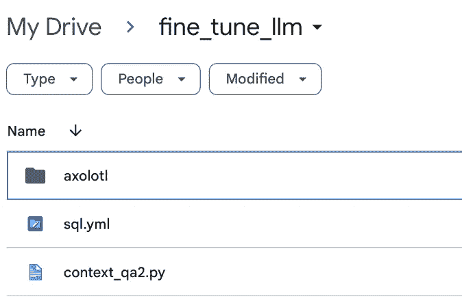

# 使用最新技术微调你的开源 LLM

> 原文：[`towardsdatascience.com/how-to-efficiently-fine-tune-your-own-open-source-llm-using-novel-techniques-code-provided-03a4e67d1b48`](https://towardsdatascience.com/how-to-efficiently-fine-tune-your-own-open-source-llm-using-novel-techniques-code-provided-03a4e67d1b48)

## 在这篇文章中，我调整了一个基础的 LLama2 LLM，以输出 SQL 代码。我使用了参数高效微调技术来优化这一过程。

[](https://medium.com/@christopher_karg?source=post_page-----03a4e67d1b48--------------------------------)[](https://towardsdatascience.com/?source=post_page-----03a4e67d1b48--------------------------------) [Christopher Karg](https://medium.com/@christopher_karg?source=post_page-----03a4e67d1b48--------------------------------)

·发表于[数据科学前沿](https://towardsdatascience.com/?source=post_page-----03a4e67d1b48--------------------------------) ·13 分钟阅读·2023 年 12 月 15 日

--


来源: [`www.pexels.com/photo/calm-body-of-lake-between-mountains-346529/`](https://www.pexels.com/photo/calm-body-of-lake-between-mountains-346529/)

在[上一篇文章](https://medium.com/towards-data-science/quantisation-and-co-reducing-inference-times-on-llms-by-80-671db9349bdb)中，我开始阐述为何你应该考虑训练自己的 LLM。我还简要介绍了硬件要求以及优化训练和推理的方法。在本文中，我将详细介绍如何微调一个开源 LLM，并提供代码片段供你跟随和重现结果。我们将调整一个 Llama2–7B 模型，使其根据自然语言输入提供 SQL 输出——换句话说，模型将把我们用自然语言提出的问题转换为 SQL 查询：

*“在 11 月份，有多少客户决定购买鸡蛋？”*

到一个 SQL 查询，该查询获取相应的结果：

```py
SELECT COUNT(DISTINCT customer_id) AS num_customers
FROM purchases
WHERE product_name = 'eggs'
AND EXTRACT(MONTH FROM purchase_date) = 11;
```

在每种情况下，数据库（DB）的架构将作为 LLM 的工作上下文提供：

```py
CREATE TABLE purchases (
    purchase_id INT PRIMARY KEY,
    customer_id INT,
    product_name VARCHAR(255),
    purchase_date DATE
);
```

我们将在调整过程中使用[这个数据集](https://huggingface.co/datasets/knowrohit07/know_sql)。虽然这篇文章主要集中在实现上述任务上，但方法将以一种你可以调整以满足你要求的方式提供。

在这篇文章中，我将使用[Google Colab](https://colab.google/)来微调 LLM。我们将使用之前提到的[know_sql 数据集](https://huggingface.co/datasets/knowrohit07/know_sql)（OpenRAIL 许可证）。我们还将使用[axolotl 框架](https://github.com/OpenAccess-AI-Collective/axolotl)来处理微调过程。他们在 GitHub 页面上有一些很好的文档。与其编写约 100 行代码来手动处理微调过程，axolotl 允许我们简单地编辑相应模型的 YAML 配置文件。我将在本文中详细介绍具体过程，但如果有任何不清楚的地方，建议查看 axolotl 文档。

微调 LLM 的过程比仅在现有 LLM 上运行推理要计算密集得多（再此提供[链接](https://medium.com/towards-data-science/quantisation-and-co-reducing-inference-times-on-llms-by-80-671db9349bdb)到我的上一篇文章，涵盖了运行推理和优化现有 LLM 的各个阶段）。因此，我们无法使用 Google Colab 的免费版，因为任务需要[NVIDIA 的 Ampere GPU 架构](https://www.nvidia.com/en-us/data-center/ampere-architecture/)（或更高版本）。此架构可通过 Google Colab 上的“A100 GPU”运行时类型获得。有关与运行时类型交互的更多信息，我建议查看我的[上一篇文章](https://medium.com/towards-data-science/quantisation-and-co-reducing-inference-times-on-llms-by-80-671db9349bdb)。

在这个阶段，我应该提到 Google 提供 A100 GPU 是“先到先得”或“视情况而定”。我发现有时获取 A100 GPU 的访问权限比较麻烦，因为它们不常有。如果不可用，你将自动切换到一个较旧的架构，这不足以完成这个任务。你的体验可能会有所不同。如果你不想等待正确的 GPU 变得可用，我建议你查看我在[上一篇文章](https://medium.com/towards-data-science/quantisation-and-co-reducing-inference-times-on-llms-by-80-671db9349bdb)中提到的一些硬件建议。

工作流程如下：

· 设置 Google Colab 并挂载 GDrive（我们需要挂载 GDrive，因为需要从 Colab 笔记本中访问某些文件）。

· 安装依赖项

· 通过 HuggingFace CLI 进行身份验证（如果你从未获得 Meta 授权使用 Llama-2 LLMs，我再次建议你查看我的[上一篇文章](https://medium.com/towards-data-science/quantisation-and-co-reducing-inference-times-on-llms-by-80-671db9349bdb)，该文章涵盖了获取访问权限的过程）。

· 加载数据集

· 将 axolotl 仓库克隆到 Gdrive

· 更新 axolotl 配置文件

· 微调 Llama-7B 模型（这大约需要 2 小时。你的体验可能会有所不同）。

· 在微调后的模型上运行推理

在进入代码之前，我希望澄清微调到底是什么，以及你可能何时考虑微调你的 LLM。

微调可以通过多种方式进行。你选择的方法取决于你可用的资源和你想要实现的任务。可能‘基础’模型已经能产生令人满意的结果，这种情况下你可以完全跳过微调过程。

再次，我的 [上一篇文章](https://medium.com/towards-data-science/quantisation-and-co-reducing-inference-times-on-llms-by-80-671db9349bdb) 讨论了为什么你可能会选择使用开源的 LLM，而不是像 OpenAI 的 ChatGPT 这样的产品。考虑是否应微调 LLM 的一个通用原则如下：

· 我的任务是否需要领域特定的知识/专业技能？

· 我是否会向我的 LLM 输入专有数据？

· 我是否有足够的领域特定数据来训练/调整我的模型？

· 我是否有足够的时间和计算资源来完成任务？

如果你对一个或多个以上的问题回答是，你应该考虑微调 LLM。如果你对所有问题都回答是，可能值得从头开始训练一个 LLM。可以采用逐步的方法：初始使用一个‘基础’ LLM，然后尝试一个微调过的 LLM，再尝试一个你从头训练的 LLM。每一步的成本（时间和计算资源）逐渐增加，只有当你当前的 LLM 未能产生令人满意的结果时，才会进入下一步。训练 LLM 从零开始的过程超出了本文的范围，但我很乐意回答你关于这个话题的任何问题。

现在我们已经决定是否微调我们的 LLM，我将详细介绍这个过程实际上包括什么。

我们的‘基础’ LLM 是一个预训练模型，拥有来自初始训练的一组权重和偏置。这些权重和偏置使得模型能够‘学习’到广泛的基本语言模式和一般知识。在微调过程中，我们使用标记的数据集来更新这些权重和偏置。

之前，典型的微调过程如下：

**前向传播**

· 模型尝试基于输入数据进行预测

**损失计算** · 模型计算预测结果的偏差。

**反向传播** · 模型基本上是在弄清楚每个参数对损失的贡献程度。

**更新参数** · 在这一步，参数将被更新和调整以减少损失。更新的大小（学习率）是一个可以调整的超参数。

**重复** · 上述步骤会重复进行一定次数（训练轮次）。通常这个次数非常少。像 BERT 这样的常见 LLM 在经过 2 个轮次的微调后表现最佳。在本文中，我们将仅使用 1 个轮次来微调 Llama2–7B 模型。

随着非常大型 LLM 的出现，已经确定了使这一过程更加高效的新策略。引入 LoRA（低秩适配）和 QLoRA（量化 LoRA）。我们将在后续的 SQL 示例中使用 LoRA，所以我将重点介绍它。这两种策略可以归入参数高效微调（PEFT）的范畴。这些技术使我们能够成功地微调非常大的语言模型，同时最小化执行所需的计算要求。它通过减少微调过程中的可训练参数数量来实现这一点。

> 尽管减少内存使用、存储成本和推理延迟是使用 PEFT 方法的好处，但需要注意的是，在此过程中训练时间可能会增加，性能可能对超参数选择更加敏感。

我们可以使用各种 PEFT 技术。有关这些技术的更多阅读，我强烈推荐[这篇博客文章](https://www.leewayhertz.com/parameter-efficient-fine-tuning/)。

使用 LoRA 时，假设现有模型的权重接近最优解。这些权重随后被固定，因此在微调过程中不能再更新。相反，低秩矩阵被引入到我们的大型语言模型（LLM）的每一层中。这些矩阵作为适配器，替代了我们冻结的可训练参数。更新这些低秩矩阵的计算要求显著低于如果我们仍使用原始参数时的计算要求。换句话说，由于原始参数中的冗余以及原始参数与低秩矩阵之间的相关性，原始参数可以被低秩矩阵很好地近似。这在所谓的‘Rank-Deficiency’中得到了体现——相关论文可以在[这里](https://arxiv.org/abs/2106.09685)找到。

所有这些结果减少了参数开销，从而带来了我之前列出的优势。值得注意的一点是减少了推理延迟。通过将这些低秩矩阵引入我们的模型，我们实际上创建了一个线性设计。与完全微调的模型相比，推理延迟显著减少。这使得该方法适用于实时应用。

我们可以通过引入量化进一步优化推理时间——这是我在[上一篇文章](https://medium.com/towards-data-science/quantisation-and-co-reducing-inference-times-on-llms-by-80-671db9349bdb)中广泛讨论的主题。

[Axolotl](https://github.com/OpenAccess-AI-Collective/axolotl)提供了一个非常易于使用的工具，使我们能够实现上述所有功能。

让我们开始吧。

首先我们将设置我们的 [colab notebook](https://colab.google/)。你现在需要选择 A100 GPU 运行时类型。如果你使用的是免费版本，你需要升级到付费版本。请注意，A100 GPUs 可能不可用。我建议运行一个包含“hello world”示例的单元，以确保你不会被转移到较旧的 V100 GPU。如果 A100 GPU 不可用，你可以等待一个可用的 GPU（我不幸的是无法确定 GPU 可用性的高峰和低峰时间）。或者你可以查看我[上一篇文章](https://medium.com/towards-data-science/quantisation-and-co-reducing-inference-times-on-llms-by-80-671db9349bdb)中列出的其他硬件选项。

接下来让我们挂载 Gdrive。你可以通过输入以下代码来完成：

```py
from google.colab import drive
drive.mount('/content/drive')
```

然后你会收到一个弹出窗口，需要通过你的 Google 账户进行身份验证。我们正在挂载驱动器，因为我们需要处理存储在 Gdrive 中的文件。

接下来，我们将通过 HuggingFace CLI 进行 Llama2–7B 的访问认证。这将是我们将要微调的基础模型。如果你之前从未通过 Meta 的官方网站申请过该模型的访问权限，请参阅我之前的文章中的说明。

要进行认证，请在一个新单元中输入以下代码：

```py
!huggingface-cli login
```

然后系统会要求你输入访问密钥（我在我的[上一篇文章](https://medium.com/towards-data-science/quantisation-and-co-reducing-inference-times-on-llms-by-80-671db9349bdb)中解释了如何获取此密钥）。

接下来，我们将处理我们的安装。我发现这通常是运行 LLM 实验时最大的障碍。某些包是为特定硬件构建的，如果你没有该特定硬件，可能会很麻烦地处理安装和更新。幸运的是，axolotl 错误输出非常详细，你应该能够相对容易地跟踪任何兼容性问题。如果你按照 axolotl readme 中的说明操作，你应该可以顺利进行。如果你遇到困难，请告诉我。

让我们运行安装，我们将安装正确版本的 CUDA 驱动程序以及 axolotl 库的依赖项。我们还将安装 HuggingFace 的数据集库，以访问我们的 SQL 训练集：

```py
!pip install torch torchvision torchaudio
!pip install "axolotl[flash-attn,deepspeed] @ git+https://github.com/OpenAccess-AI-Collective/axolotl"
!pip install accelerate
!pip install datasets
!pip install torch==2.0.1+cu118 -f https://download.pytorch.org/whl/torch_stable.html
!pip uninstall xformers
!pip install xformers
!pip uninstall flash_attn -y
!pip install flash_attn
```

接下来我们将把 axolotl 仓库克隆到我们的 Gdrive。如果出现目录不存在的错误，只需使用 Gdrive UI 创建这些目录即可：

```py
!git clone https://github.com/OpenAccess-AI-Collective/axolotl /content/drive/MyDrive/fine_tune_llm/axolotl
```

运行一些进一步的安装：

```py
!cd /content/drive/MyDrive/fine_tune_llm/axolotl && pip install packaging && pip install -e '.[flash-attn,deepspeed]'
```

接下来我们将获取数据集并检查其是否正确加载：

```py
ds = datasets.load_dataset('knowrohit07/know_sql')
ds
trn = ds['validation']
trn[4500]

###output###
# {'answer': 'SELECT MAX(field_goals) FROM table_19722233_5 WHERE assists = 27',
# 'question': 'what is the highest number of goals did the player with 27 asists score',
# 'context': 'CREATE TABLE table_19722233_5 (field_goals INTEGER, assists VARCHAR)'}
```

很好，目前我们已经安装了所有依赖项，克隆了 axolotl 仓库，并获得了访问 Llama-2 7B 模型的授权。在这个阶段，我们需要进一步配置，更新 YAML 文件。Axolotl 使用这个 YAML 文件作为微调模型的指令集。我建议查看一些 Axolotl 提供的示例，这些示例位于克隆仓库时创建的 axolotl 目录中。这将帮助你了解可以更改哪些设置以及可以使用哪些超参数。同样，仓库的 readme 对这里非常有帮助。

以下是我最终的 YAML 配置文件副本：

```py
base_model: meta-llama/Llama-2-7b-hf
base_model_config: meta-llama/Llama-2-7b-hf
model_type: LlamaForCausalLM
tokenizer_type: LlamaTokenizer
is_llama_derived_model: true

load_in_8bit: false
load_in_4bit: true
strict: false

datasets:
  - path: knowrohit07/know_sql
    type: context_qa.load_v2
    train_on_split: validation
dataset_prepared_path: last_run_prepared
val_set_size: 0.01
output_dir: ./qlora-out

adapter: qlora
lora_model_dir:

sequence_len: 2048
sample_packing: false
pad_to_sequence_len: true

lora_r: 32
lora_alpha: 16
lora_dropout: 0.05
lora_target_modules:
lora_target_linear: true
lora_fan_in_fan_out:

wandb_project:
wandb_entity:
wandb_watch:
wandb_run_id:
wandb_log_model:

gradient_accumulation_steps: 4
micro_batch_size: 2
num_epochs: 1
optimizer: paged_adamw_32bit
lr_scheduler: cosine
learning_rate: 0.0002

train_on_inputs: false
group_by_length: false
bf16: false
fp16: true
tf32: false

gradient_checkpointing: true
early_stopping_patience:
resume_from_checkpoint:
local_rank:
logging_steps: 1
xformers_attention:
flash_attention: true

warmup_steps: 10
eval_steps: 20
eval_table_size: 5
save_steps:
debug:
deepspeed:
weight_decay: 0.0
fsdp:
fsdp_config:
special_tokens:
  bos_token: "<s>"
  eos_token: "</s>"
  unk_token: "<unk>"
```

你会注意到我们可以更新之前文章中讨论的参数（fp16: true），以优化训练过程并限制该模型微调所需的内存。如果你使用的是不同的硬件，建议查看文档和初始化微调过程时的任何错误信息。根据你的目标，axolotl 提供了许多示例配置文件供你使用和调整。

将配置文件保存到之前创建的 fine_tune_llm 目录中，命名为 *sql.yml*。还需要一个额外的 Python 脚本来处理分词策略。这个脚本也应该保存在 fine_tune_llm 目录中，命名为 *context_qa2.py*。这是脚本：

```py
"""Module containing the classes for Context QA Prompt Tokenization Strategies"""
from typing import Tuple
from axolotl.prompt_tokenizers import InstructionPromptTokenizingStrategy
from axolotl.prompters import AlpacaPrompter, PromptStyle

# article, unanswerable_question, question, answer
def load_404(tokenizer, cfg):
    return AlpacaMissingInfoContextPromptTokenizingStrategy(
        AlpacaContextPrompter(PromptStyle.CHAT.value),
        tokenizer,
        cfg.train_on_inputs,
        cfg.sequence_len,
    )

def load(tokenizer, cfg):
    return AlpacaContextPromptTokenizingStrategy(
        AlpacaContextPrompter(PromptStyle.CHAT.value),
        tokenizer,
        cfg.train_on_inputs,
        cfg.sequence_len,
    )

class AlpacaContextPrompter(AlpacaPrompter):
    """
    Customized system prompted for concise QA
    """

    system_prompt = (
        "Use the following contextual information to concisely answer the question.\n"
    )
    system_no_input_prompt = (
        "Use the following contextual information to concisely answer the question.\n"
    )

class AlpacaContextPromptTokenizingStrategy(InstructionPromptTokenizingStrategy):
    """
    Tokenization Strategy to combine in-context article with a question and answer
    """

    def parse_instruction_fields(self, prompt) -> Tuple[str, str, str]:
        return (
            prompt["context"] + "\n===\n" + prompt["question"],
            "",
            prompt["answer"],
        )

class AlpacaMissingInfoContextPromptTokenizingStrategy(
    InstructionPromptTokenizingStrategy
):
    """
    Tokenization Strategy to combine in-context article with a question that can't be answered
    from the context and a default response to that effect
    """

    def parse_instruction_fields(self, prompt) -> Tuple[str, str, str]:
        return (
            prompt["context"] + "\n===\n" + prompt["unanswerable_question"],
            "",
            "The context provided does not contain any information about your inquiry. "
            "Therefore, I'm unable to answer your question based on the given context.",
        )
```

很好——现在我们应该已经准备好初始化微调过程。我们的依赖项已经安装好，配置文件也都在 Gdrive 的各自位置中。你应该有一个看起来像这样的 fine_tune_llm 文件夹：



使用 Axolotl 微调 LLama2–7B 的目录布局

*.yml* 文件是我们的配置文件。*.py* 文件是处理分词的脚本。axolotl 目录是我们之前从仓库克隆的目录。

现在我们需要做的就是运行：

```py
!accelerate launch -m axolotl.cli.train /content/drive/MyDrive/fine_tune_llm/sql.yml
```

这将初始化使用 *sql.yml* 配置文件来微调我们指定的模型。这个过程对我来说大约花了 2 小时。你的情况可能会有所不同。如果此阶段出现任何错误，很可能是由于依赖错误。我遇到过几次问题，需要手动安装正确的 cuda 驱动程序和 flash_attn：

```py
!pip install torch==2.0.1+cu118 -f https://download.pytorch.org/whl/torch_stable.html
!pip uninstall flash_attn -y
!pip install flash_attn
```

很好——我们使用了 Axolotl 提供的相当简单的配置来初始化我们 LLM 的微调。

让我们对微调后的模型进行推理，看看它的表现如何。

由于用于调整模型的数据具有相当特定的布局，我们需要手动创建一些模型可以处理的提示词。让我们创建一个基于现有数据库模式的问题。我们将使用之前检查数据集是否正确加载时的相同示例，但我们将覆盖问题：

```py
tst = dict(**trn[4500])
tst['question'] = 'What is the highest number of goals for any player with less than 5 assists'
tst
###output###
# {'answer': 'SELECT MAX(field_goals) FROM table_19722233_5 WHERE assists = 27',
# 'question': 'What is the highest number of goals for any player with less than 5 assists',
# 'context': 'CREATE TABLE table_19722233_5 (field_goals INTEGER, assists VARCHAR)'}
```

现在我们需要确保格式正确：

```py
fmt = """SYSTEM: Use the following contextual information to concisely answer the question.

USER: {}
===
{}
ASSISTANT:"""
```

我们还将创建一个快速函数来处理这些格式：

```py
def sql_prompt(d):
  return fmt.format(d["context"], d["question"])
```

让我们检查一下以上内容：

```py
print(sql_prompt(tst))
###output###
# SYSTEM: Use the following contextual information to concisely answer the question.

# USER: CREATE TABLE table_19722233_5 (field_goals INTEGER, assists VARCHAR)
# ===
# What is the highest number of goals for any player with less than 5 assists
# ASSISTANT:
```

很好，现在我们的提示词已经准备好可以输入到模型中。

现在我们需要对保存在 qlora-out 目录中的模型进行推断（如 yaml 配置文件中指定的）。首先，我们需要安装运行推断所需的依赖项，并对提示进行分词，以便模型可以处理它。我们需要从 HuggingFace 获取 Llama2–7B 分词器。工作流程将与我在[上一篇文章](https://medium.com/towards-data-science/quantisation-and-co-reducing-inference-times-on-llms-by-80-671db9349bdb)中介绍的非常相似。以下是代码：

```py
import torch
from peft import PeftModel
from transformers import AutoTokenizer, AutoModelForCausalLM, BitsAndBytesConfig

fine_tuned_model = '/content/drive/MyDrive/fine_tune_llm/axolotl/qlora-out'

tokr = AutoTokenizer.from_pretrained('meta-llama/Llama-2-7b-hf')

model = AutoModelForCausalLM.from_pretrained('meta-llama/Llama-2-7b-hf',
                                             torch_dtype=torch.bfloat16, device_map=0)
model = PeftModel.from_pretrained(model, fine_tuned_model)
model = model.merge_and_unload()
model.save_pretrained('sql-model')

toks = tokr(sql_prompt(tst), return_tensors="pt")

res = model.generate(**toks.to("cuda"), max_new_tokens=250).to('cpu')

print(tokr.batch_decode(res)[0])
###output###
# SYSTEM: Use the following contextual information to concisely answer the question.

# USER: CREATE TABLE table_19722233_5 (field_goals INTEGER, assists VARCHAR)
# ===
# What is the highest number of goals for any player with less than 5 assists
# ASSISTANT:
# SELECT MAX(field_goals) FROM table_19722233_5 WHERE assists < 5</s>
```

太棒了！正如你从助手的输出中看到的，它提供了正确的答案。

虽然这可以说是一个非常简单的问题，但你可以看到我们成功训练了一个基础 LLM，这个 LLM 之前只能用于一般语言查询，现在它可以写 SQL 代码了！

通过熟悉以上内容并查看 axolotl 文档，你将能够了解如何将我的方法适应到不同的 LLM 任务中，例如问答。只需输入一个特定主题的问题数据集及其相应答案，使用 axolotl 提供的示例更新你的 yaml 配置文件，然后开始另一个微调实验😊

我希望你阅读这篇文章时的感受与我写作时一样愉快。像往常一样，如果你有任何问题，请随时联系我。

*除非另有说明，否则所有图像均属于作者。*
