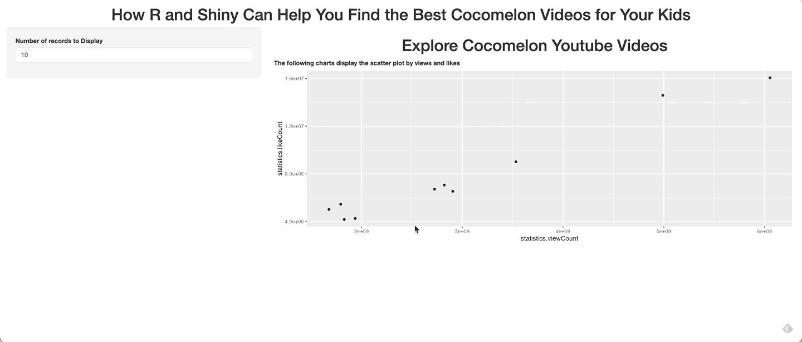

# 如何通过讲故事与用户互动：展示 R 和 Shiny 中的数据分析

> 原文：[`towardsdatascience.com/how-to-engage-with-users-by-storytelling-show-data-analytics-in-r-and-shiny-e7205c06ccea?source=collection_archive---------20-----------------------#2023-03-13`](https://towardsdatascience.com/how-to-engage-with-users-by-storytelling-show-data-analytics-in-r-and-shiny-e7205c06ccea?source=collection_archive---------20-----------------------#2023-03-13)

## 如何利用 R 和 Shiny 帮助你找到适合孩子的最佳 Youtube 视频

 [Chengzhi Zhao](https://chengzhizhao.medium.com/?source=post_page-----e7205c06ccea--------------------------------)

·

[关注](https://medium.com/m/signin?actionUrl=https%3A%2F%2Fmedium.com%2F_%2Fsubscribe%2Fuser%2Ff956c63a9571&operation=register&redirect=https%3A%2F%2Ftowardsdatascience.com%2Fhow-to-engage-with-users-by-storytelling-show-data-analytics-in-r-and-shiny-e7205c06ccea&user=Chengzhi+Zhao&userId=f956c63a9571&source=post_page-f956c63a9571----e7205c06ccea---------------------post_header-----------) 发布于 [Towards Data Science](https://towardsdatascience.com/?source=post_page-----e7205c06ccea--------------------------------) ·9 min 阅读·2023 年 3 月 13 日

--

如何通过讲故事与用户互动：展示 R 和 Shiny 中的数据分析 | 作者图片

数据与讲故事更加紧密。作为一名数据专业人士，我寻求更简单的方法来传达数据分析与沟通之间的差距。仪表板传统上是可视化和共享数据的默认方式。它也承担了沟通的责任。然而，我发现了仪表板的局限性：图表选择有限，自定义自由度较低。我探索了更多互动方式来阐述想法并与用户互动 — *为你的数据构建一个网页应用程序*。

[**Shiny**](https://shiny.rstudio.com/) 是一个用于直接从 R 代码构建交互式网页应用程序的 R 包。使用 R 而不必担心切换到 HTML、CSS 和 JavaScript 是令人兴奋的。这节省了始终使用一种语言的时间。我们可以重用 R 的数据框，并使用 dply 和 ggplot2 等 R 包来处理数据而不会出现问题。Hadley Wickham 的书 — [*Mastering Shiny*](https://www.amazon.com/Mastering-Shiny-Interactive-Reports-Dashboards/dp/1492047384) 对此有深入的内容。

使用 R 和 Shiny 更令人兴奋的是，现在我们可以构建一个应用程序，让最终用户可以与我们完成的数据分析进行互动。他们可以通过自主探索获得更多见解，而无需了解背后的复杂性。在这方面……
