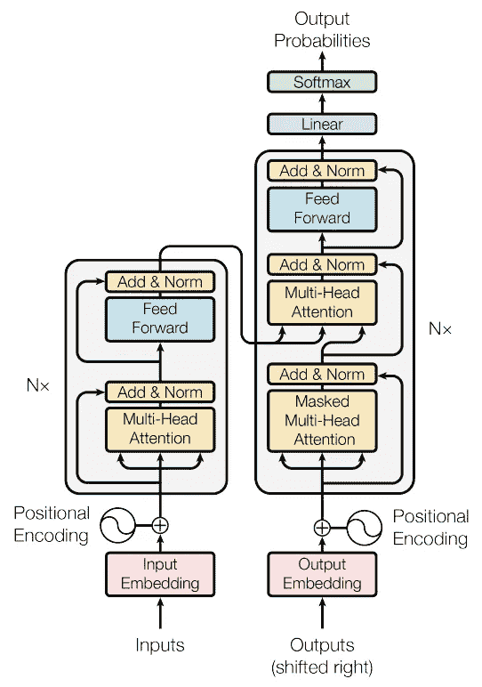

# 如何估算 Transformer 模型中的参数数量

> 原文：[`towardsdatascience.com/how-to-estimate-the-number-of-parameters-in-transformer-models-ca0f57d8dff0?source=collection_archive---------3-----------------------#2023-01-13`](https://towardsdatascience.com/how-to-estimate-the-number-of-parameters-in-transformer-models-ca0f57d8dff0?source=collection_archive---------3-----------------------#2023-01-13)

## 深入了解 Transformer 编码器/解码器的构建模块

 [Dmytro Nikolaiev (Dimid)](https://medium.com/@andimid?source=post_page-----ca0f57d8dff0--------------------------------)

·

[关注](https://medium.com/m/signin?actionUrl=https%3A%2F%2Fmedium.com%2F_%2Fsubscribe%2Fuser%2F97b5279dad26&operation=register&redirect=https%3A%2F%2Ftowardsdatascience.com%2Fhow-to-estimate-the-number-of-parameters-in-transformer-models-ca0f57d8dff0&user=Dmytro+Nikolaiev+%28Dimid%29&userId=97b5279dad26&source=post_page-97b5279dad26----ca0f57d8dff0---------------------post_header-----------) 发表在[Towards Data Science](https://towardsdatascience.com/?source=post_page-----ca0f57d8dff0--------------------------------) ·10 分钟阅读·2023 年 1 月 13 日

--

预览。图像由作者提供

> 感谢[Regan Yue](https://medium.com/u/84ea27feb7de?source=post_page-----ca0f57d8dff0--------------------------------)，你可以在[mp.weixin.qq.com](https://mp.weixin.qq.com/s/-zAqPfR-RVeRYjX5raehtA)、[juejin.cn](https://juejin.cn/post/7243435843145924667)、[segmentfault.com](https://segmentfault.com/a/1190000043888810) 和[xie.infoq.cn](https://xie.infoq.cn/article/3d1edc1049f34d0f797231c2c)阅读这篇文章的中文版本！

理解新的机器学习架构（以及一般的新技术）的最有效方式是*从零开始实现它*。这是一种最佳方法，有助于你理解实现的*每一个细节*，尽管这非常复杂、耗时，并且有时**简直不可能**。例如，如果你没有类似的计算资源或数据，你将无法确保你的解决方案中没有隐藏的错误。

然而，还有一种更简单的方法 —— 计算参数数量。这并不比仅仅阅读论文更困难，但它允许你深入挖掘，检查你是否完全理解新架构的构建模块（在我们的例子中是 Transformer 编码器和解码器模块）。

你可以通过以下图示来思考这个问题，该图示展示了理解新机器学习架构的三种方法 —— *圆圈的大小表示理解的程度*。

理解机器学习架构的方法。计算参数数量并不比简单阅读论文更困难，但它会让你更深入地了解这个话题。图片由作者提供

在本文中，我们将查看著名的 Transformer 架构，并考虑**如何计算** PyTorch [*TransformerEncoderLayer*](https://pytorch.org/docs/stable/generated/torch.nn.TransformerEncoderLayer.html)和[*TransformerDecoderLayer*](https://pytorch.org/docs/stable/generated/torch.nn.TransformerDecoderLayer.html)类中的参数数量。这样，我们可以确保对这个架构的组成没有任何神秘之处。

## TL;DR

所有公式总结在**结论**部分。欢迎你现在就查看它们。

我不仅展示了确切的公式，还展示了它们的不那么准确的*近似版本*，这将帮助你**快速估算**任何基于 Transformer 的模型中的参数数量。

# Transformer 架构

著名的 Transformer 架构在 2017 年的震撼[“Attention Is All You Need” 论文](https://arxiv.org/abs/1706.03762)中首次提出，并因其有效捕捉长期依赖关系的能力而成为大多数自然语言处理和计算机视觉任务的事实标准。

> 现在，在 2023 年初，[扩散](https://techcrunch.com/2022/12/22/a-brief-history-of-diffusion-the-tech-at-the-heart-of-modern-image-generating-ai/)正在获得极大的关注，主要是由于[文本到图像生成模型](https://www.washingtonpost.com/technology/interactive/2022/ai-image-generator/)。也许，很快**它们**将成为各种任务中的新一代最先进技术，正如之前 Transformers 与 LSTMs 和 CNNs 的对比。但让我们先来看一下 Transformers…

我的文章并不是试图解释 Transformer 架构，因为已经有足够多的文章做得很好。它可能会让你*从不同的角度看待它*，或*澄清一些细节*，如果你还没有完全弄清楚的话。因此，如果你想了解更多关于这个架构的资源，我会推荐一些；否则，你可以继续阅读。

## 了解更多关于 Transformer 的资源

如果你想要更详细的 Transformer 架构概述，可以看看这些资料（请注意，互联网上有很多其他资源，我个人只是喜欢这些）：

+   首先，[官方论文](https://arxiv.org/abs/1706.03762)。虽然这可能不是第一次阅读的最佳方式，但它并不像看起来那么复杂。你可以尝试[Explainpaper 来帮助你阅读](https://www.explainpaper.com/papers/attention)或者[其他论文](https://www.explainpaper.com/)（*这是一个基于 AI 的工具，可以解释你高亮的文本*）。

+   极好的[Jay Alammar 的插图 Transformer 文章](https://jalammar.github.io/illustrated-transformer/)。如果你不喜欢阅读，可以看看同一作者的[YouTube 视频](https://youtu.be/-QH8fRhqFHM)。

+   精彩的[Google Brain 的 Lukasz Kaiser 讲解的 Tensor2Tensor 讲座](https://www.youtube.com/watch?v=rBCqOTEfxvg)。

+   如果你想直接进行实践并使用各种 Transformer 模型来构建实际应用，可以查看[Hugging Face 课程](https://huggingface.co/course/chapter1/1)。

## 原始 Transformer

首先，让我们回顾一下 Transformer 的基础。

Transformer 的架构由两个组件组成：编码器（左侧）和解码器（右侧）。编码器接收一系列输入标记并生成一系列隐藏状态，而解码器则接收这些隐藏状态并生成一系列输出标记。

Transformer 架构。图 1 来自[公共领域论文](https://arxiv.org/pdf/1706.03762.pdf)

编码器和解码器都由一堆相同的层组成。对于编码器，这一层包括***多头注意力*** *(1 — 这里和后续数字指的是下图)* 和一个***前馈神经网络*** *(2)*，以及一些***层归一化*** *(3)* 和跳跃连接。

解码器类似于编码器，但除了*第一个* ***多头注意力*** *(4)*（在机器翻译任务中进行*掩蔽*，以防止解码器通过查看未来标记来作弊）和一个***前馈网络 (5)***外，它还具有*第二个* ***多头注意力*** *机制 (6)*。它允许解码器在生成输出时使用编码器提供的上下文。与编码器一样，解码器也有一些***层归一化*** *(7)* 和跳跃连接组件。

带有符号组件的 Transformer 架构。改编自 [公共领域论文](https://arxiv.org/pdf/1706.03762.pdf) 的图 1。

> 我将不考虑带有位置编码的输入嵌入层和最终输出层（线性 + softmax）作为 Transformer 组件，只关注编码器和解码器模块。我这样做是因为这些组件特定于任务和嵌入方法，而编码器和解码器堆栈后来形成了许多其他架构的基础。
> 
> 这类架构的例子包括用于编码器的 BERT 基础模型（[BERT](https://arxiv.org/abs/1810.04805)，[RoBERTa](https://arxiv.org/abs/1907.11692)，[ALBERT](https://arxiv.org/abs/1909.11942)，[DeBERTa](https://arxiv.org/abs/2006.03654) 等），用于解码器的 GPT 基础模型（[GPT](https://paperswithcode.com/paper/improving-language-understanding-by)，[GPT-2](https://paperswithcode.com/paper/language-models-are-unsupervised-multitask)，[GPT-3](https://arxiv.org/abs/2005.14165v4)，[ChatGPT](https://openai.com/blog/chatgpt/)），以及基于完整编码器-解码器框架的模型（[T5](https://arxiv.org/abs/1910.10683v3)，[BART](https://arxiv.org/abs/1910.13461) 等）。

尽管我们在这个架构中计数了 *七* 个组件，但我们可以看到其中只有 *三个* 是独特的：

1.  多头注意力；

1.  前馈网络；

1.  层归一化。

Transformer 构建模块。改编自 [公共领域论文](https://arxiv.org/pdf/1706.03762.pdf) 的图 1。

它们共同构成了 Transformer 的基础。让我们更详细地了解它们！

# Transformer 构建模块

让我们考虑每个模块的内部结构及其所需的参数数量。在本节中，我们还将开始使用 [PyTorch](https://pytorch.org/) 来验证我们的计算。

要检查某个模型模块的参数数量，我将使用 [以下一行函数](https://discuss.pytorch.org/t/how-do-i-check-the-number-of-parameters-of-a-model/4325/9)：

在我们开始之前，请注意所有模块 **都经过标准化** 并且使用跳跃连接。这意味着 ***所有输入和输出的形状*** *(更准确地说，是最后一个数字，因为批量大小和令牌数量可能会有所变化)* ***必须相同***。对于原始论文，这个数字 (*d_model*) 是 512。

## 多头注意力

一个著名的注意力机制是 Transformer 架构的关键。但撇开所有动机和技术细节，它实际上只是一些矩阵乘法。

Transformer 多头注意力。改编自 [公共领域论文](https://arxiv.org/pdf/1706.03762.pdf) 的图 2。

计算每个*head*的注意力后，我们将所有 heads 拼接在一起，并通过一个线性层（*W_O 矩阵*）进行处理。每个 head 是*scaled dot-product attention*，包括三个分别用于查询、键和值的矩阵乘法（*W_Q*、*W_K*、*W_V 矩阵*）。这三个矩阵*对于每个 head 都是不同的*，这就是为什么存在下标*i*。

最终线性层（*W_O*）的形状是*d_model 到 d_model*。其余三个矩阵（*W_Q*、*W_K*、*W_V*）的形状是相同的：*d_model 到 d_qkv*。

> 注意，上图中的**d_qkv**在原论文中表示为**d_k**或**d_v**。我发现这个名称更直观，因为尽管这些矩阵可能有不同的形状，但几乎总是相同的。
> 
> 还要注意**d_qkv** = **d_model** / **num_heads**（论文中的**h**）。这就是为什么**d_model**必须能够被**num_heads**整除：以确保后续的正确拼接。

你可以通过检查上图中所有中间阶段的形状（正确的形状在右下角标示）来测试自己。

结果是，我们需要为每个 head 准备三个较小的矩阵和一个大的最终矩阵。我们需要多少参数（不要忘记偏置）？

计算 Transformer 注意力模块中参数数量的公式。图片来源：作者

我希望这不会太枯燥——我尽力使推导尽可能清晰。不要担心！未来的公式会小得多。

近似参数数量是这样的，因为我们可以忽略`4*d_model`相对于`4*d_model²`。让我们使用 PyTorch 进行测试。

数字匹配，这意味着我们做得很好！

## 前馈网络

Transformer 中的前馈网络由两个全连接层组成，中间夹着一个 ReLU 激活函数。网络的内部部分比输入和输出更具表现力（正如我们所记得的，输入和输出必须是相同的）。

一般情况下，它是*MLP(d_model, d_ff) -> ReLU -> MLP(d_ff, d_model)*，而在原论文中，*d_ff* = 2048。

前馈神经网络描述。 [公共领域论文](https://arxiv.org/pdf/1706.03762.pdf)

一点可视化永远不会有害。

Transformer 前馈网络。图片来源：作者

参数的计算非常简单，主要的，还是不要被偏置搞混。

计算 Transformer 前馈网络中参数数量的公式。图片来源：作者

我们可以描述这样一个简单的网络，并使用以下代码检查其参数数量（*请注意，官方 PyTorch 实现也使用* ***dropout****，稍后我们将在编码器/解码器代码中看到。但如我们所知，dropout 层没有可训练的参数，因此为了简洁起见，我在这里省略了它）：

数字再次匹配，只剩下一个组件。

## 层归一化

Transformer 架构的最后一个构建块是[层归一化](https://arxiv.org/abs/1607.06450)。简而言之，它只是一个智能（即*可学习的*）*带有缩放的归一化*方法，改善了训练过程的稳定性。

Transformer 层归一化。图片由作者提供

这里的可训练参数是两个向量 *gamma* 和 *beta*，每个向量都有一个 *d_model* 维度。

计算 Transformer 层归一化模块参数数量的公式。图片由作者提供

让我们用代码验证我们的假设。

好的！在近似计算中，这个数字可以忽略，因为层归一化的参数远少于前馈网络或多头注意力块（尽管这个模块出现了几次）。

# 推导完整公式

现在我们拥有计算整个编码器/解码器块参数所需的一切！

## **PyTorch 中的编码器和解码器**

让我们记住，编码器由一个注意力块、前馈网络和两个层归一化组成。

Transformer Encoder。改编自[公共领域论文](https://arxiv.org/pdf/1706.03762.pdf)中的图 1

我们可以通过查看 PyTorch 代码内部来验证所有组件是否到位。这里的*多头注意力*标记为*红色*（左侧），*前馈网络*标记为*蓝色*，*层归一化*标记为绿色（PyCharm 中的 Python 控制台截图）。

PyTorch TransformerEncoderLayer. 图片由作者提供

如上所述，这个实现包括了前馈网络中的*dropout*。现在我们也可以看到与层归一化相关的 dropout 层。

解码器则由两个注意力块、一个前馈网络和三个层归一化组成。

Transformer Decoder。改编自[公共领域论文](https://arxiv.org/pdf/1706.03762.pdf)中的图 1

让我们再次查看 PyTorch（颜色相同）。

PyTorch TransformerDecoderLayer. 图片由作者提供

## 最终公式

确认后，我们可以编写以下函数来计算参数数量。实际上，这只是三行代码，甚至可以合并为一行。其余部分是文档字符串，用于说明。

现在是测试的时候了。

精确公式是正确的，意味着我们已经正确识别了所有构建块并将其分解为组成部分。有趣的是，由于我们在近似公式中忽略了相对较小的值（*与百万相比的几千*），**误差仅约为 0.2%**，与精确结果相比！但还有一种方法可以使这些公式更简单。

注意力块的近似参数数量是`4*d_model²`。考虑到*d_model*是一个重要的超参数，这听起来相当简单。但对于前馈网络，我们需要知道*d_ff*，因为公式是`2*d_model*d_ff`。

*d_ff*是一个需要在公式中记住的单独超参数，因此让我们考虑如何摆脱它。实际上，正如我们上面所看到的，当*d_model = 512*时，*d_ff = 2048*，所以***d_ff = 4*d_model***。

对于许多 Transformer 模型，这样的假设是有意义的，*大大简化了公式*，同时仍然给出一个**参数数量的估计**。毕竟，没有人想知道确切的数量，只需了解这个数字是在*几十万*还是*几千万*就足够了。

近似的编码器-解码器公式。图片由作者提供

要了解您处理的*数量级*，您也可以对乘数进行四舍五入，得到每个编码器/解码器层为`10*d_model²`。

# 结论

这里是我们今天推导出的所有公式的总结。

公式回顾。图片由作者提供

在本文中，我们计算了 Transformer 编码器/解码器块的参数数量，但当然，我并不邀请您去计算所有新模型的参数。我之所以选择这种方法，是因为当我开始学习 Transformers 时，发现没有找到这样的文章，这让我感到惊讶。

尽管参数数量可以给我们提供模型复杂性及其训练所需数据量的指示，但这只是深入了解架构的一种方式。我鼓励您探索和实验：查看实现，运行不同超参数的代码等。所以，继续学习并享受其中的乐趣！

# 感谢您的阅读！

+   希望这些材料对您有帮助。请[在 Medium 上关注我](https://medium.com/@andimid)，获取更多类似的文章。

+   如果您有任何问题或意见，我很高兴收到任何反馈。请在评论中问我，或通过[LinkedIn](https://www.linkedin.com/in/andimid/)或[Twitter](https://twitter.com/dimid_ml)与我联系。

+   支持我作为作者，并获取访问数千篇其他 Medium 文章的权限，请使用[我的推荐链接](https://medium.com/@andimid/membership)获得 Medium 会员（对您没有额外收费）。
