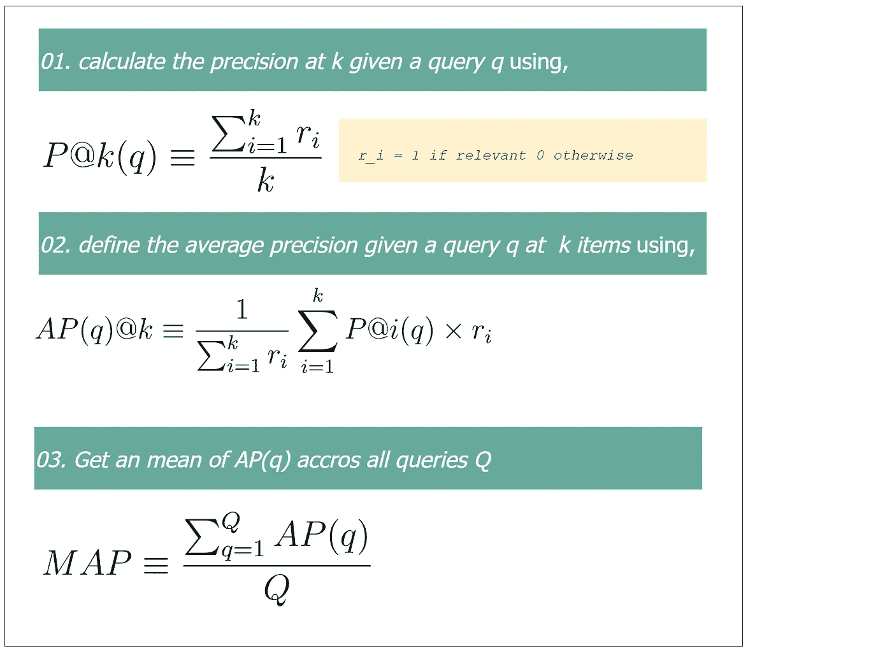

# 如何评估学习排序模型

> 原文：[`towardsdatascience.com/how-to-evaluate-learning-to-rank-models-d12cadb99d47?source=collection_archive---------14-----------------------#2023-01-17`](https://towardsdatascience.com/how-to-evaluate-learning-to-rank-models-d12cadb99d47?source=collection_archive---------14-----------------------#2023-01-17)

## 关于如何评估机器学习中 LTR 模型的实用指南

 [Ransaka Ravihara](https://ransakaravihara.medium.com/?source=post_page-----d12cadb99d47--------------------------------)

·

[关注](https://medium.com/m/signin?actionUrl=https%3A%2F%2Fmedium.com%2F_%2Fsubscribe%2Fuser%2F61b4d96de932&operation=register&redirect=https%3A%2F%2Ftowardsdatascience.com%2Fhow-to-evaluate-learning-to-rank-models-d12cadb99d47&user=Ransaka+Ravihara&userId=61b4d96de932&source=post_page-61b4d96de932----d12cadb99d47---------------------post_header-----------) 发布于 [Towards Data Science](https://towardsdatascience.com/?source=post_page-----d12cadb99d47--------------------------------) ·4 min read·Jan 17, 2023

--

照片由[Markus Spiske](https://unsplash.com/@markusspiske?utm_source=medium&utm_medium=referral)拍摄，来源于[Unsplash](https://unsplash.com/?utm_source=medium&utm_medium=referral)

我之前的文章解释了处理学习排序问题的三种主要方法。在这篇文章中，我们将专注于如何评估 LTR 模型。让我们开始吧。

我们有几个选择来评估 LTR 模型。然而，这些选项与我们使用的方法有所不同。如果目标是给每个文档分配一个二元相关性评分，我们应该使用***binary relevance***指标。如果目标是为每个文档设定一个连续尺度上的相关性评分，我们应该使用***graded relevance***。让我们讨论一下广泛使用的三种评估矩阵。

**平均准确率 (MAP)**

计算排名结果的 MAP 可能比较棘手且常常令人困惑。让我们一步一步地查看下面的图示。

MAP 步骤 | 作者提供的图像

MAP 有一些潜在的缺点，

1.  它不考虑检索到的项目的排名，只考虑相关文档的存在或缺失。

1.  对于那些项目相关性不明确的数据集，这可能不适用…
