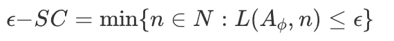

# 如何评估表示

> 原文：[`towardsdatascience.com/how-to-evaluate-representations-886ce5ef7a66`](https://towardsdatascience.com/how-to-evaluate-representations-886ce5ef7a66)

## 从无监督指标到监督指标

 [Mina Ghashami](https://medium.com/@mina.ghashami?source=post_page-----886ce5ef7a66--------------------------------)

·发表于 [Towards Data Science](https://towardsdatascience.com/?source=post_page-----886ce5ef7a66--------------------------------) ·8 分钟阅读·2023 年 9 月 14 日

--

credit: 图片来源于 unsplash.com

*嵌入表示*，也称为*表示*，是诸如单词、文档、产品等实体的稠密向量表示。它们旨在捕捉语义含义并突出实体之间的相似性。一组好的表示不仅应有效地编码实体的基本特征，还应具有紧凑性、意义性和在各种任务中表现出的鲁棒性。本文将探讨评估表示质量的各种指标。让我们开始吧。

# 评估框架

任何评估框架由三个主要组件组成：

1.  **基准方法**：这作为一个基准，与新方法或模型进行比较。它提供了评估提出的方法性能的参考点。

1.  **一组评估指标**：评估指标是用于评估模型性能的定量度量。这些指标可以是监督的或无监督的，并定义了如何评估输出的成功。

1.  **评估数据集**：评估数据集是一个标注/注释或未标注的数据集合，用于评估模型的性能。该数据集应能代表模型预期处理的现实场景。它需要覆盖各种各样的例子，以确保全面的评估。

根据评估指标是否需要真实标签，我们可以将其分为*无监督指标*和*监督指标*。通常，使用无监督指标更为有利，因为它们不需要标签，而标签的收集在实践中非常昂贵。

下面，我们将深入探讨最先进的指标。对于每个指标，选择一个基线方法以对比你的评估结果。基线可以简单到`*随机嵌入生成器*`！

# 监督评估指标

监督指标需要一个标记的评估数据集。一个常见的策略是选择一个预测器，例如分类器或回归器。然后在来自特定任务的有限标记数据集上训练预测器。接下来，使用监督指标测量预测器在持出数据集上的表现。

在这里值得提到两点有价值的内容：

1️⃣ `*验证准确率*`，一个常用的指标，被证明对训练探测器的数据集大小很敏感[3]！！研究表明，*验证准确率*对训练数据集的大小很敏感；当数据集大小不同时，他们可能会为相同任务选择不同的表示[3]！理想情况下，这种评估必须独立于数据集大小，并且*仅依赖于数据分布*[3]。

下面的图展示了这一现象：两个表示，一个是红色的（表示 A），另一个是蓝色的（表示 B）。x 轴表示用于训练预测器（称为探测器）的训练数据的大小。y 轴显示了训练好的探测器的验证损失。注意探测器是在每种方法的表示上训练的。正如我们所见，当 x 轴上的训练数据大小增加时，探测器的验证损失在 y 轴上减少。然而，在某些时候，这两条损失曲线交叉了！！因此，在小数据集上，表示 A 的损失较少，而在大数据集上，表示 B 的损失较少。文献[3]将这一曲线称为*损失-数据曲线*，因为它衡量了预测器的损失与用于训练探测器的训练数据大小的关系。

图 1：损失-数据曲线 — 来源于[3]，由作者修改

2️⃣ *线性预测器*（线性分类器/回归器）被广泛批评为评估表示的方法[4]；研究表明，在线性分类任务上表现强劲的模型在更复杂的任务上可能表现较弱[4]。

文献中提出了许多监督指标；**互信息（MI）、F1 得分、BLEU、精确度、召回率、最小描述长度（MDL）**等，但在监督评估领域的 SOTA 指标[3,9]是**多余描述长度（SDL）**和**ϵ−样本复杂度**。

**多余描述长度（SDL）**和**ϵ−样本复杂度**的灵感来源于“*最佳表示是允许最有效地学习预测器以解决任务的表示*” [3,9]*。正如[3]提到的*“这一立场受实际问题的驱动；在部署阶段，解决任务所需的标签越多，使用成本越高，表示的适用范围也越小。”*

**直观理解**：为了给出直观的理解，**SDL**和**ϵ−样本复杂度**指标不是在固定数据大小上衡量一个量，而是估计损失数据曲线，并根据曲线测量量[3]。为此，对于这两个指标，用户指定一个容差ϵ，以便小于ϵ的总体损失被视为解决任务。一个ϵ损失预测器是任何实现损失小于ϵ的预测器[3]。然后，这些指标计算学习一个实现该损失的预测器的成本。

让我们深入了解每个指标的细节：

## 剩余描述长度 (SDL)

如[3]中所述，该指标对应于计算损失数据曲线与 y = ϵ所设基线之间的区域。换句话说，它衡量了使用表示[3]重新创建一个ϵ损失预测器的成本。从数学上讲，它定义如下

图 2：SDL 定义 — 图片来源于 [3]

在这里，A 是一个算法，它可以是任何预测算法，如分类或回归，L(A, i)指的是在前 i 个数据点上训练算法 A 所导致的预测器损失[3]。计算该指标通常需要无限的数据，因此在实践中总是进行估计[3]。有关此指标的实现，请参见 GitHub 仓库[8]。

图 3：SDL 指标对应于计算损失数据曲线与基线之间的区域 — 图片由作者提供

## ϵ−样本复杂度

如[3]中所述，该指标通过找到ϵ损失预测器所需的样本数量来衡量学习一个ϵ损失预测器的复杂度。定义为：

图 4：epsilon-样本复杂度定义 — 图片来源于 [3]

该指标允许通过首先选择一个目标函数进行学习（例如，一个 epsilon 损失的 2 层 MLP 分类器），然后测量哪些表示可以使用更少的数据来学习该函数，从而比较两个表示[3]。

图 5：epsilon-样本复杂度对应于实现 epsilon 损失所需的数据点数量 — 图片由作者提供

# **无监督评估指标：**

这些指标是每个科学家最喜欢的，因为它们不需要标记数据。一些常见的无监督指标包括以下内容：

## 1) 聚类可学习性 (CL)：

该指标[1]评估表示的可学习性。较高的聚类可学习性 (CL) 分数表示学到的表示在输入数据空间中更好地分离了不同的簇。CL 的测量是训练一个 K-最近邻（KNN）分类器的学习速度，该分类器用于预测通过 K 均值聚类表示获得的标签。

图片由作者提供

它由三个主要步骤组成，工作如下：

1.  选择超参数 *k=簇的数量* 和 *k′ = 邻居的数量*。设 x_i​ 表示第 i 个数据点的表示。

1.  对数据集运行 k-means 以获得 k 个簇；将簇 id 分配给每个数据点 x_i​ 作为其标签。记作 y^_i$​。

1.  在每个数据点上以预检验方式运行 KNN，通过多数规则获得预测标签。如果一个数据点是 {x_i​, y_​i}​，则取所有编号小于 i 的数据点，即 {x_j​ | j<i }，并对其运行 KNN 以获得其类别标签的多数投票。这将是 y~_i​。

那么 Cluster Learnability (CL) 指标为

图 6：Cluster-Learnability 指标 — 图片由作者提供

该指标的直观解释如下： “预检验”方法是一种在在线学习环境中评估机器学习模型性能的方法，例如 KNN。在这种情况下，“预检验”结合了“预测”和“序列”的词汇。在 KNN 计算的预检验方式中，模型是按顺序评估和更新的，一次处理一个实例，使用数据流。由于数据是未标记的，这种方法使用第 2 步中的聚类来合成生成标签（即簇 id）并使用它们以在线（预检验）方式计算簇的学习速度。

以下代码计算该指标：

## 2) *轮廓系数*

类似于 CL 指标，轮廓系数指标测量固有属于一个簇的实体的簇聚合性。该指标通过簇的内聚性和分离性来衡量簇的质量。换句话说，它衡量簇内每个样本与其他簇中的样本的分离程度，并提供簇的紧凑性和良好分离性的指示。轮廓系数的范围从 -1 到 1：

+   值接近 1 表示样本在簇内聚合良好，并且远离邻近簇中的样本。

+   值接近 0 表示簇之间重叠或样本位于簇之间的决策边界上或非常接近。

+   值接近 -1 表示样本可能被分配到错误的簇中。

以下代码计算该指标：

# 3) 簇纯度

该指标评估从表示中获得的簇的质量。它衡量簇中包含来自单一类别的数据点的程度。计算簇纯度的步骤如下：

1.  对每个簇，识别该簇中的多数类别。统计每个簇中多数类别的数据点数量。

1.  将所有簇的这些计数相加。将总和除以数据点的总数。

该值的范围从 0 到 1\. 较高的值表示更好的簇，其中 1 表示完美的聚类，每个簇仅包含一个类别的点。

以下代码计算该指标：

# 总结

在将表示输入任何机器学习模型之前，评估表示的质量是至关重要的。为了评估它们的质量，我们必须有一个由三个组件组成的框架：基线方法、评估指标和评估数据集。指标分为监督型和无监督型，取决于是否需要标记数据集。通常，无监督指标更具优势，因为它们不需要标记数据集，而收集/整理标签既困难又耗时。无监督指标包括集群纯度、集群能力和集群可学习性。另一方面，先进的监督指标是过剩描述符长度（SDL）和ϵ-样本复杂度。无论选择何种指标，保持一致并使用一个单一指标来比较两个表示集是重要的。

如果你有任何问题或建议，请随时与我联系：

邮箱：mina.ghashami@gmail.com

LinkedIn: [`www.linkedin.com/in/minaghashami/`](https://www.linkedin.com/in/minaghashami/)

# 参考文献

1.  [表达能力与可学习性：评估自监督学习的统一视角](https://arxiv.org/pdf/2206.01251.pdf)

1.  [自监督表示学习：简介、进展与挑战](https://arxiv.org/pdf/2110.09327.pdf)

1.  [通过学习低损失预测器的复杂性来评估表示](https://arxiv.org/abs/2009.07368)

1.  [审视最前沿：对视觉表示评估的批判性观察](https://arxiv.org/pdf/1912.00215.pdf)

1.  [对比预测编码的表示学习](https://arxiv.org/abs/1807.03748)

1.  [通过最大化视图间的互信息来学习表示](https://arxiv.org/abs/1906.00910)

1.  [关于互信息最大化的表示学习](https://arxiv.org/abs/1907.13625)

1.  [`github.com/willwhitney/reprieve`](https://github.com/willwhitney/reprieve)
