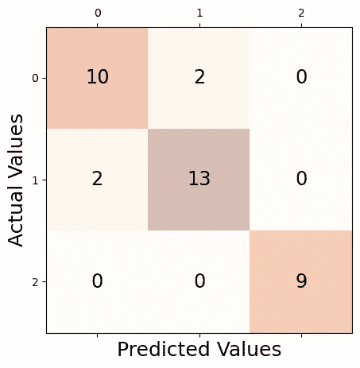

# 如何评估你的 ML/AI 模型的表现

> 原文：[`towardsdatascience.com/how-to-evaluate-the-performance-of-your-ml-ai-models-ba1debc6f2fa`](https://towardsdatascience.com/how-to-evaluate-the-performance-of-your-ml-ai-models-ba1debc6f2fa)

## 准确的评估是性能改进的唯一途径

[](https://saraametwalli.medium.com/?source=post_page-----ba1debc6f2fa--------------------------------)[](https://towardsdatascience.com/?source=post_page-----ba1debc6f2fa--------------------------------) [Sara A. Metwalli](https://saraametwalli.medium.com/?source=post_page-----ba1debc6f2fa--------------------------------)

·发表于[Towards Data Science](https://towardsdatascience.com/?source=post_page-----ba1debc6f2fa--------------------------------) ·阅读时间 8 分钟·2023 年 5 月 20 日

--


[Scott Graham](https://unsplash.com/@homajob?utm_source=medium&utm_medium=referral)拍摄于[Unsplash](https://unsplash.com/?utm_source=medium&utm_medium=referral)

通过实践学习是学习任何事物的最佳方法之一，无论是技术、新语言还是烹饪新菜肴。一旦你掌握了一个领域或应用的基础知识，你可以通过行动来进一步加深理解。构建各种应用的模型是将你对机器学习和人工智能知识变得具体化的最佳方式。

尽管这两个领域（或者说子领域，因为它们确实有重叠）在各种上下文中都有应用，但学习如何构建模型的步骤在不同的目标应用领域中或多或少是相同的。

AI 语言模型如[ChatGPT](https://openai.com/blog/chatgpt)和[Bard](https://bard.google.com/)正受到科技新手和普通观众的广泛关注，因为它们在我们的日常生活中非常有用。

随着更多模型的发布和展示，人们可能会问，什么才是一个“*好的*”AI/ML 模型，我们如何评估它的表现？

这就是我们在本文中将要涵盖的内容。但我们假设你已经构建了一个 AI 或 ML 模型。现在，你想要评估并改善其表现（如有必要）。但无论你拥有何种模型和最终应用，你都可以采取措施来评估你的模型并提高其性能。

为了帮助我们理解这些概念，我们将使用来自 sklearn 的[Wine](https://archive.ics.uci.edu/ml/datasets/Wine)数据集[1]，应用支持向量分类器（SVC），然后测试其指标。

那么，让我们马上开始吧…

首先，让我们导入我们将使用的库（现在不必担心每个库的功能，我们稍后会讲解！）。

```py
import pandas as pd
import numpy as np
from sklearn import datasets
from sklearn.model_selection import train_test_split
from sklearn.preprocessing import StandardScaler
from sklearn.svm import SVC
from sklearn.metrics import confusion_matrix
from sklearn.metrics import precision_score, recall_score, f1_score, accuracy_score
import matplotlib.pyplot as plt
```

现在，我们读取数据集，应用分类器，并对其进行评估。

```py
wine_data = datasets.load_wine()
X = wine_data.data
y = wine_data.target 
```

# 1. 将数据集拆分以便更好地分析。

根据你学习过程的阶段，你可能需要访问大量的数据来进行训练、测试和评估。此外，你可以使用不同的数据来训练和测试你的模型，因为这将防止你真正评估模型的性能。

为了克服这个挑战，将数据分成三个较小的随机集，并将它们用于训练、测试和验证。

一个好的经验法则是采用 60、20、20 的方法进行拆分。你可以将 60%的数据用于训练，20%用于验证，20%用于测试。你需要在拆分之前打乱数据，以确保数据的更好表示。

我知道这可能听起来很复杂，但幸运的是，`scikit-learn`提供了一个函数来为你执行这个拆分操作，即 train_test_split()。

因此，我们可以将数据集拆分如下：

```py
X_train, X_test, Y_train, Y_test = train_test_split(X, y, test_size=0.20, train_size=0.60, random_state=1, stratify=y)
```

然后将训练部分作为输入传递给分类器。

```py
#Scale data
sc = StandardScaler()
sc.fit(X_train)
X_train_std = sc.transform(X_train)
X_test_std = sc.transform(X_test)
#Apply SVC model
svc = SVC(kernel='linear', C=10.0, random_state=1)
svc.fit(X_train, Y_train)
#Obtain predictions
Y_pred = svc.predict(X_test)
```

到目前为止，我们已经有一些结果可以“评估”。

# 2. 定义你的评估指标。

在开始评估过程之前，我们必须问自己一个关于我们使用的模型的关键问题：***什么会使这个模型变得优秀？***

这个问题的答案取决于模型和你打算如何使用它。也就是说，当数据科学家想要测试 AI/ML 模型的性能时，会使用一些标准的评估指标，包括：

1.  **准确率**是模型在所有预测中正确预测的百分比。这意味着，当我运行模型时，所有预测中有多少是正确的？这篇文章深入探讨了模型准确率的测试。

1.  **精确度**是模型在所有正例预测中真实正例预测的百分比。不幸的是，精确度和准确率经常被混淆；区分它们的一种方法是将准确率视为预测值与实际值的接近程度，而精确度则是正确预测之间的接近程度。因此，准确率是一个绝对指标，但两者都对评估模型性能非常重要。

1.  **召回率**是数据集中所有实际正例中真实正例预测的比例。召回率旨在找到数据集中相关的预测。从数学上讲，如果我们提高召回率，就会降低模型的精确度。

1.  **F1 分数**是精确度和召回率的加权均值，提供了使用精确度和召回率来衡量模型性能的平衡指标。由[CodeBasics](https://codebasics.io/)制作的视频讨论了精确度、召回率和 F1 分数之间的关系，以及如何找到这些评估指标的最佳平衡。

视频由[CodeBasics](https://codebasics.io/)制作

现在，让我们计算预测数据的不同指标。我们将通过首先显示混淆矩阵来实现这一点。混淆矩阵只是数据的实际结果与预测结果的对比。

```py
conf_matrix = confusion_matrix(y_true=y_test, y_pred=y_pred)
#Plot the confusion matrix
fig, ax = plt.subplots(figsize=(5, 5))
ax.matshow(conf_matrix, cmap=plt.cm.Oranges, alpha=0.3)
for i in range(conf_matrix.shape[0]):
    for j in range(conf_matrix.shape[1]):
        ax.text(x=j, y=i,s=conf_matrix[i, j], va='center', ha='center', size='xx-large')
plt.xlabel('Predicted Values', fontsize=18)
plt.ylabel('Actual Values', fontsize=18)
plt.show()
```

我们数据集的混淆矩阵看起来像这样，



如果我们查看这个混淆矩阵，我们可以看到实际值在某些情况下是“1”，而预测值是“0”。这意味着分类器的准确率不是百分之百。

我们可以使用这段代码计算这个分类器的准确率、精确度、召回率和 F1 分数。

```py
print('Precision: %.3f' % precision_score(Y_test, Y_pred, average='micro'))
print('Recall: %.3f' % recall_score(Y_test, Y_pred, average='micro'))
print('Accuracy: %.3f' % accuracy_score(Y_test, Y_pred))
print('F1 Score: %.3f' % f1_score(Y_test, Y_pred, average='micro'))
```

对于这个特定的例子，这些结果是：

1.  精确度 = 0.889

1.  召回率 = 0.889

1.  准确率 = 0.889

1.  F1 分数 = 0.889

尽管你可以使用不同的方法来评估你的模型，但一些评估方法会根据模型类型更好地估计模型的性能。例如，除了上述方法之外，如果你评估的模型是回归模型（或包括回归），你还可以使用：

**- 均方误差 (MSE)** 从数学上讲，是预测值与实际值之间平方差的平均值。

**- 平均绝对误差 (MAE)** 是预测值与实际值之间绝对差异的平均值。

这两个指标密切相关，但在实现上，MAE（平均绝对误差）比 MSE（均方误差）更简单（至少在数学上）。然而，MAE 对于显著错误表现不佳，而 MSE 强调了这些错误（因为它将误差平方）。

# 3\. 验证和调整模型的超参数。

在讨论超参数之前，让我们首先区分一下超参数和参数。参数是定义模型以解决问题的方式。与之相对的是，超参数用于测试、验证和优化模型的性能。超参数通常由数据科学家（或在某些情况下由客户）选择，以控制和验证模型的学习过程，从而影响其性能。

你可以使用不同类型的超参数来验证你的模型；其中一些是通用的，可以用于任何模型，例如：

+   **学习率：** 这个超参数控制模型在更新或更改其参数时需要多少响应来修正某些错误。选择最佳学习率是一个与训练过程所需时间的权衡。如果学习率过低，可能会使训练过程变慢。相反，如果学习率过高，训练过程会更快，但模型性能可能会受到影响。

+   **批量大小：** 你的训练数据集的大小将显著影响模型的训练时间和学习率。因此，找到最佳批量大小是一项随着你构建更多模型和积累经验而逐渐培养的技能。

+   **训练轮数：** 一次训练轮是训练机器学习模型的一个完整周期。使用的训练轮数因模型而异。从理论上讲，更多的训练轮数会导致验证过程中的错误减少。

除了上述超参数，还有一些特定于模型的超参数，如正则化强度或实现神经网络时的隐藏层数。这个由[APMonitor](https://apmonitor.com/pds/index.php/Main/HyperparameterOptimization) 制作的 15 分钟视频探讨了各种超参数及其差异。

[APMonitor](https://apmonitor.com/pds/index.php/Main/HyperparameterOptimization) 制作的视频

# 4. 迭代和优化

验证 AI/ML 模型不是一个线性过程，而是一个迭代过程。你需要经过数据划分、超参数调优、分析和验证结果的过程，这一过程往往需要多次重复。你重复这个过程的次数取决于结果的分析。对于某些模型，你可能只需做一次；而对于其他模型，你可能需要做几次。

如果需要重复过程，你将利用之前评估的洞察来改进模型的架构、训练过程或超参数设置，直到你对模型的性能感到满意为止。

# 结语

当你开始构建自己的 ML 和 AI 模型时，你会迅速意识到，选择和实现模型是工作流中较简单的部分。然而，测试和评估是开发过程中的关键部分。评估 AI/ML 模型是一个迭代且通常耗时的过程，需要仔细分析、实验和微调，以达到预期的性能。

幸运的是，随着你构建更多模型的经验积累，评估模型性能的过程将变得更加系统化。考虑到评估模型的重要性，这是一项值得掌握的技能，例如：

1.  评估我们的模型使我们能够客观地衡量模型的指标，这有助于了解其优缺点，并提供对其预测或决策能力的洞察。

1.  如果存在可以解决相同问题的不同模型，那么评估它们使我们能够比较它们的性能，并选择最适合我们应用的模型。

1.  评估提供了对模型弱点的洞察，通过分析错误和模型表现不佳的领域，允许进行改进。

所以，要有耐心，继续构建模型；随着你构建的模型越来越多，模型的效果和效率也会越来越好。不要让过程中的细节让你气馁。虽然过程看起来复杂，但一旦你了解了步骤，它将变成你的第二天性。

# 参考资料

[1] Lichman, M. (2013). [UCI 机器学习库](https://archive.ics.uci.edu/ml) 加州尔湾：加州大学，

信息与计算机科学学院。（CC BY 4.0）
