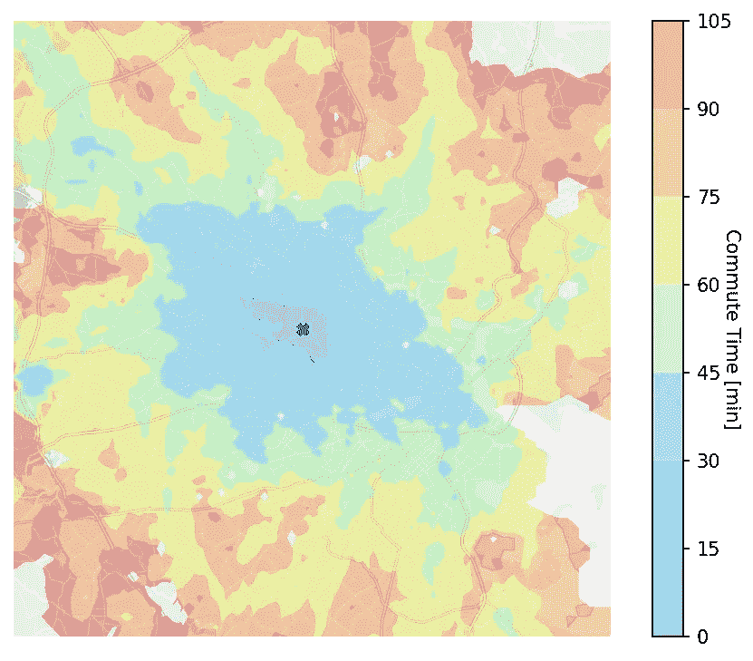
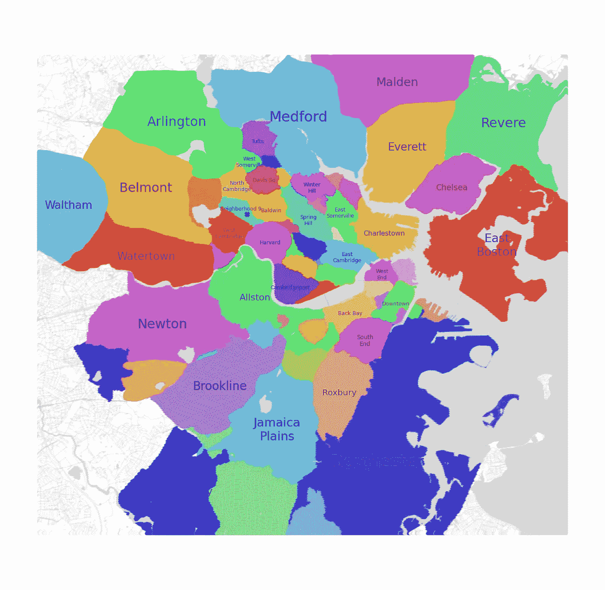
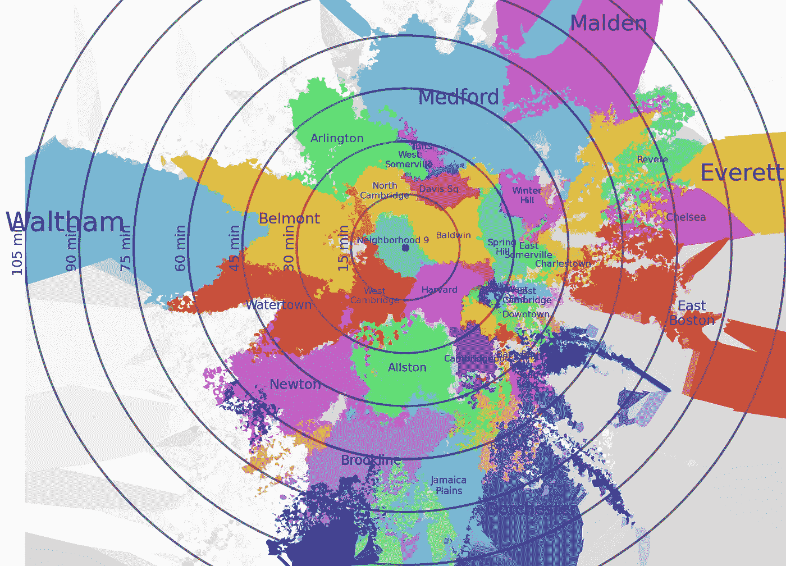

# 如何找到一个通勤时间短的公寓

> 原文：[`towardsdatascience.com/how-to-find-an-apartment-with-a-short-commute-4680e10689d9?source=collection_archive---------8-----------------------#2023-03-09`](https://towardsdatascience.com/how-to-find-an-apartment-with-a-short-commute-4680e10689d9?source=collection_archive---------8-----------------------#2023-03-09)

## 如何利用数据科学和 Google Maps API 制作自定义的通勤地图

[](https://medium.com/@guszejnov.david?source=post_page-----4680e10689d9--------------------------------)[](https://towardsdatascience.com/?source=post_page-----4680e10689d9--------------------------------) [Dávid Guszejnov](https://medium.com/@guszejnov.david?source=post_page-----4680e10689d9--------------------------------)

·

[关注](https://medium.com/m/signin?actionUrl=https%3A%2F%2Fmedium.com%2F_%2Fsubscribe%2Fuser%2Fac1da7f879f1&operation=register&redirect=https%3A%2F%2Ftowardsdatascience.com%2Fhow-to-find-an-apartment-with-a-short-commute-4680e10689d9&user=D%C3%A1vid+Guszejnov&userId=ac1da7f879f1&source=post_page-ac1da7f879f1----4680e10689d9---------------------post_header-----------) 发表在 [Towards Data Science](https://towardsdatascience.com/?source=post_page-----4680e10689d9--------------------------------) · 5 分钟阅读 · 2023 年 3 月 9 日[](https://medium.com/m/signin?actionUrl=https%3A%2F%2Fmedium.com%2F_%2Fvote%2Ftowards-data-science%2F4680e10689d9&operation=register&redirect=https%3A%2F%2Ftowardsdatascience.com%2Fhow-to-find-an-apartment-with-a-short-commute-4680e10689d9&user=D%C3%A1vid+Guszejnov&userId=ac1da7f879f1&source=-----4680e10689d9---------------------clap_footer-----------)

--

[](https://medium.com/m/signin?actionUrl=https%3A%2F%2Fmedium.com%2F_%2Fbookmark%2Fp%2F4680e10689d9&operation=register&redirect=https%3A%2F%2Ftowardsdatascience.com%2Fhow-to-find-an-apartment-with-a-short-commute-4680e10689d9&source=-----4680e10689d9---------------------bookmark_footer-----------)

去年我在马萨诸塞州的[剑桥天体物理中心](https://goo.gl/maps/9qcyQbRtNFHk7M3V8)找到了工作。在寻找附近的公寓时，我的一个关键要求是通勤时间不应过长。由于波士顿拥有相当完善的公共交通系统（MBTA）和多个地铁线路，因此并不明显应该在什么样的社区寻找公寓。因此，我决定制作一张大波士顿地区的地图，显示早高峰期间通勤到我的工作地点所需的时间。本文详细介绍了我如何制作这张地图以及你如何为自己制作一张类似的地图。你可以在[GitHub](https://github.com/guszejnovdavid/Commute_Map/blob/main/Boston_Transit_Map.ipynb)上找到源代码。

**警告**：如果你想做一个类似的项目（即为不同的目的地/城市制作地图），你必须获得自己的 API 密钥。Google Maps 允许你每月进行一定数量的免费调用，因此可以免费完成类似的项目。然而，你必须**非常小心**，因为超出限制后可能会被收取数百美元的费用。

## 计算通勤时间

第一步是获取[波士顿地区](https://goo.gl/maps/sTRqtX5dfJNTDxY2A)的地图，并在地图上创建与 GPS 坐标（即每个像素的纬度和经度）之间的映射。在这张地图上，我们可以定义一个点网格来计算旅行时间。为了减少 API 调用次数，我选择在中心附近使网格点更密集，而在边缘地区则较为稀疏。请注意，Google Maps 会自动“贴合”到附近的道路，因此我们不需要担心网格点是否真正位于道路上。

一旦我们有了网格，我们只需调用[Google Maps](https://mapsplatform.google.com/)并使用其[距离矩阵 API](https://developers.google.com/maps/documentation/distance-matrix/overview)来计算到达目的地的旅行时间。然而，计算旅行时间时需要注意一些细节：

1.  我们需要指定一天中的时间。由于我将在早高峰期间通勤到我的工作地点，所以我设置了到达时间为上午 9 点。

1.  Google Maps 可以提供驾车、骑行和乘坐公共交通的旅行时间。对于我的项目，我只选择了公共交通。

1.  美国的大多数公共交通形式即使在高峰期间也相当不频繁（例如，公交车每 15 分钟才来一次）。这可能会引入旅行时间计算中的误差，因此为了减少其影响，我决定计算另外两个到达时间（8:45，8:52）的旅行时间，并取三个值中的最小值。这基本上意味着，如果可以避免在公交站等 20 分钟，我愿意稍早一点到工作。

## 城市地图上的通勤时间叠加图

一旦我们拥有了每个网格点的通勤时间，我们可以通过填充等高线图在城市地图上可视化它们。



根据通勤时间对大波士顿地区的地图进行着色，以剑桥的天体物理中心为蓝色十字标记；图片由作者提供

正如预期的那样，通勤时间随着距离的增加而增加，但我们也可以注意到一些异常情况，某些物理距离更远的点在通勤时间上反而更近。甚至还有一些通勤时间较短的嵌入区域。这是由于 MBTA 网络的结构。例如，住在肯德尔/MIT 地铁站附近，我们可以在 30 分钟内到达目的地，但如果我们住在离目的地更近的几条街道上，我们可能需要乘坐公交车，时间反而更长。还有一些小区域无法到达我们的目的地（例如，东剑桥的火车维修中心）。

## 波士顿邻里通勤距离

尽管这张地图很有帮助，但如果我们能有一些工具来筛选公寓列表网站上的结果会更好。这些网站大多数会列出每个公寓所属的邻里，让我们可以进行筛选。因此，将我们的通勤时间地图转换为邻里地图是有意义的。首先，我们来制作一张波士顿邻里的地图。



波士顿地区的邻里地图，x 标记了我工作地点的位置；图片由作者提供

我们可以尝试绘制一张波士顿邻里地图，其中任何点到我工作地点（新的原点）的距离与通勤时间成正比（而不是物理距离）。我们可以通过将每个像素相对原点的距离改变为与通勤时间成正比，同时保持其相对方向不变来实现这一点。

```py
phi = np.arctan2(y_image,x_image)
x_new = commute_time * np.cos(phi)
y_new = commute_time * np.sin(phi)
```

这会导致图像失真，并导致像素大小不均匀（即，一些像素会互相挤在一起，一些则之间有间隙）。我们可以通过制作一个[Voronoi 图](https://en.wikipedia.org/wiki/Voronoi_diagram)并根据相应像素的颜色为结果单元上色来纠正这一点。

```py
from scipy.spatial import Voronoi, voronoi_plot_2d
vor = Voronoi(np.vstack((x_new,y_new)).T)
voronoi_plot_2d(vor,ax=ax,show_points=False,show_vertices=False,line_width=0.0)
...
#Colorize the Voronoi plot
for i,region in enumerate(vor.regions):
  color = ...
  polygon = [vor.vertices[k] for k in region]
  plt.fill(*zip(*polygon),c=color)
```



根据通勤时间缩放的波士顿邻里地图；图片由作者提供

有了这张地图，我们可以快速看到哪些邻里离我们通勤足够近。请注意，相邻邻里的一些区域可能会混合在一起（例如，市中心地区）。这是由于高速公共交通（例如地铁）的存在，使得从离站一站的地方通勤比从离当前站仅 5 分钟步行的公寓通勤更快。

这个项目开始时，我在寻找一个通勤时间不会太长（< 45 分钟）的公寓。这意味着我应该主要寻找位于剑桥、索美维尔、贝尔蒙特、阿灵顿、奥尔斯顿、沃特镇和市中心的公寓。当然，买房时还有其他考虑因素（租金、噪音等）。最终，我租了一套位于剑桥和阿灵顿交界处的公寓。

如果你想尝试在你的城市做同样的事情，请查看[GitHub](https://github.com/guszejnovdavid/Commute_Map/blob/main/Boston_Transit_Map.ipynb)上的源代码。
