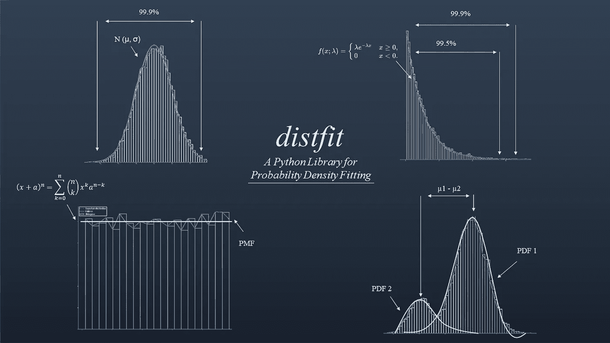

# 如何找到最适合你数据的理论分布

> 原文：[`towardsdatascience.com/how-to-find-the-best-theoretical-distribution-for-your-data-a26e5673b4bd?source=collection_archive---------0-----------------------#2023-02-03`](https://towardsdatascience.com/how-to-find-the-best-theoretical-distribution-for-your-data-a26e5673b4bd?source=collection_archive---------0-----------------------#2023-02-03)

## 了解基础数据分布是数据建模的一个关键步骤，并且在异常检测、合成数据创建和数据压缩等许多应用中都发挥着重要作用。

 [Erdogan Taskesen](https://erdogant.medium.com/?source=post_page-----a26e5673b4bd--------------------------------)

·

[关注](https://medium.com/m/signin?actionUrl=https%3A%2F%2Fmedium.com%2F_%2Fsubscribe%2Fuser%2F4e636e2ef813&operation=register&redirect=https%3A%2F%2Ftowardsdatascience.com%2Fhow-to-find-the-best-theoretical-distribution-for-your-data-a26e5673b4bd&user=Erdogan+Taskesen&userId=4e636e2ef813&source=post_page-4e636e2ef813----a26e5673b4bd---------------------post_header-----------) 发表在 [Towards Data Science](https://towardsdatascience.com/?source=post_page-----a26e5673b4bd--------------------------------) · 19 min read · 2023 年 2 月 3 日

--

图片由作者提供。

了解数据的潜在（概率）分布有很多建模优势。确定潜在分布的最简单方法是通过直方图视觉检查随机变量。使用候选分布，可以创建各种图表，如概率分布函数图（PDF/CDF）和 QQ 图。然而，为了确定确切的分布参数（例如，loc、scale），必须使用定量方法。在本博客中，我将描述*为什么确定数据集的潜在概率分布很重要。参数分布和非参数分布之间的区别是什么。如何使用定量方法确定最佳拟合，并如何通过视觉检查确认。* 分析使用*distfit*库进行，并附带了一个笔记本以便于访问和实验。

*如果你觉得这篇文章有帮助，欢迎你* [*关注我*](https://erdogant.medium.com/subscribe) *，因为我会写更多关于数据科学的内容。如果你在考虑*…
