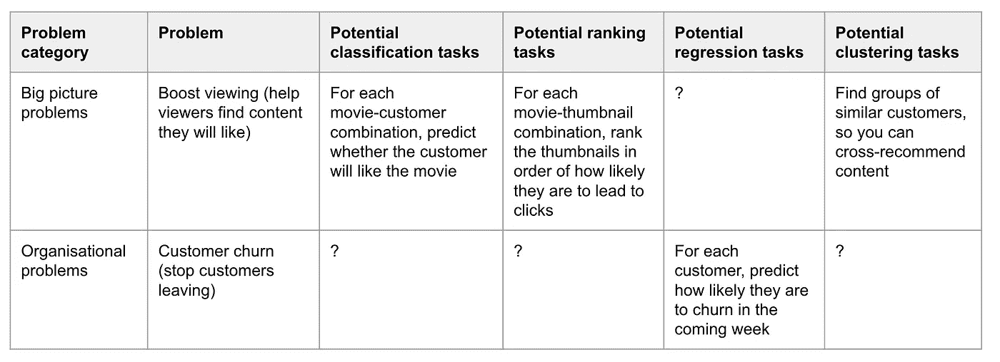
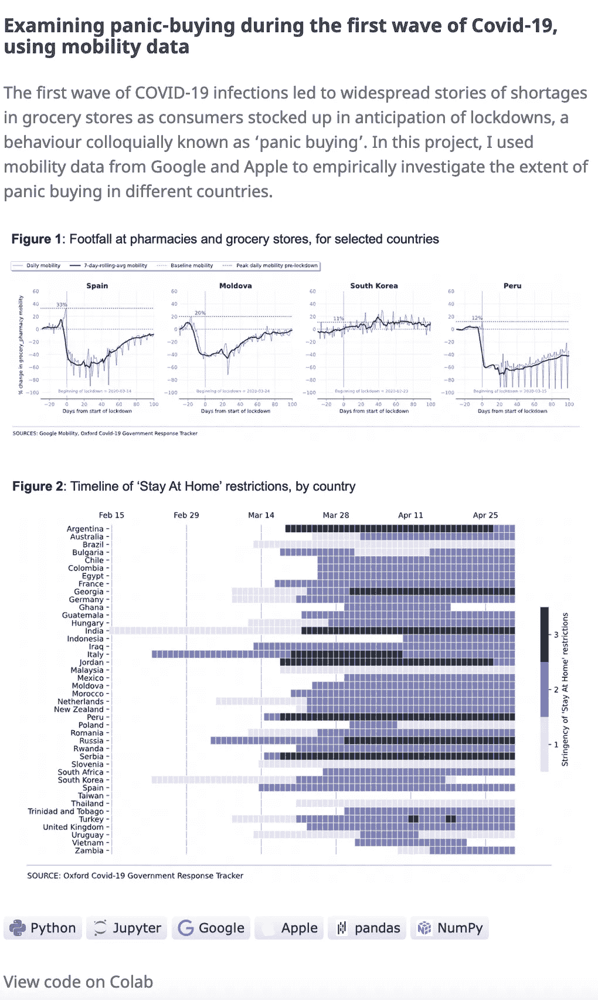

# 如何寻找独特的数据科学项目创意，使你的作品集脱颖而出

> 原文：[`towardsdatascience.com/how-to-find-unique-data-science-project-ideas-that-make-your-portfolio-stand-out-1c2ddfdbefa6`](https://towardsdatascience.com/how-to-find-unique-data-science-project-ideas-that-make-your-portfolio-stand-out-1c2ddfdbefa6)

## 忘记泰坦尼克号和 MNIST 吧：选择一个独特的项目，提升你的技能并帮助你从人群中脱颖而出

 [马特·查普曼](https://medium.com/@mattchapmanmsc?source=post_page-----1c2ddfdbefa6--------------------------------)

·发表于[Towards Data Science](https://towardsdatascience.com/?source=post_page-----1c2ddfdbefa6--------------------------------) ·10 分钟阅读·2023 年 4 月 25 日

--

图片由[鲁珀特·布里顿](https://unsplash.com/@rupert_britton)在[Unsplash](https://unsplash.com/photos/l37N7a1lL6w)提供

如果你想在数据科学领域建立职业生涯，副项目是展示你的技能和提高获得工作或晋升机会的可靠方式。

然而，到 2023 年，仅仅制作一个泰坦尼克号生存预测器或 MNIST 数字分类器已不再足够。这些项目已经做了无数次，并且对你的个人档案贡献很小，因为雇主无法验证这些工作是否是你自己的。对他们来说，你可能只是从某个随机的 Kaggle Grandmaster 那里复制并粘贴了代码。

从人群中脱颖而出的最佳方式是通过一系列独特有趣的项目来展示你的技能和兴趣。但是，如果你像我一样，你会知道提出项目创意和寻找独特数据来源是*困难*的。

在这篇文章中，我将展示我如何处理这个问题。在简要概述什么是一个好的数据科学项目后，我会解释我的项目创意生成系统，并通过[我的作品集](https://medium.com/towards-data-science/the-portfolio-that-got-me-a-data-scientist-job-513cc821bfe4)中的大量例子进行说明。我的目标是为你提供一个生成自己创意的系统，最终给你一个帮助你构建独特作品集和推动数据科学职业发展的工具。

# 什么样的数据科学项目才算好？

数据科学项目可以有多种形式，但所有最好的项目都有三个特征：

1.  它们有一个狭窄的范围

1.  它们是原创的（以某种小方式）

1.  它们与现实世界问题相关

让我们逐一讨论这些。

## **狭窄的范围**

根据我的经验，一个好的数据科学项目在范围上是狭窄的：它专注于解决一个非常具体的问题（或问题的一部分）。

我知道这可能看起来有些违背直觉。毕竟，在现实世界中，一个典型的数据科学任务会有很多阶段，从问题定义和数据收集到分析和可视化。

然而，当你构建一个作品集时，每个独立的数据科学副项目并不需要涵盖所有这些内容。不要误解我的意思：在你的整个作品集中，你需要展示你对这些阶段的理解。然而，每个*单独的*项目需要非常具体。它不需要证明你能做所有事情；只需要填补你作品集和简历中未覆盖的特定空白。

## **原创性**

这么多数据科学家警告你不要过度依赖“经典”项目，例如泰坦尼克号生存预测：这些项目很无聊，而且很难通过做这些项目来脱颖而出，因为许多人已经尝试过了。相比之下，最好的项目展示了一些作者的个性和兴趣，并提供了在方法上展示一些创造性的空间。

我不是说使用现有数据集是个坏主意，也绝对不是说你必须重新发明轮子。有很多时候，一个简单的线性回归模型和一个知名数据集就足够了。但——这才是关键——如果你打算使用一个知名数据集，你仍然需要展示你能以创造性和批判性的方式使用它。不要只是重复他人的工作；尝试识别你可以采取的新方法和/或展示它如何与目标行业相关。我很快会解释我如何处理这个问题。

## **相关性**

一个好的数据科学项目的第三个标志是它与你目标行业或公司的相关性。这不仅表明你能够解决实际问题；通过做这些类型的项目，你将建立对行业挑战的理解，为面试提供很好的素材。

*相关性*之所以如此重要，是因为作为技术人员，我认为我们有时可能会过于专注于算法和技术栈的细节，以至于忘记向非技术人员明确我们解决了哪些问题。这是个问题，因为如果我们不能清晰表达这一点，我们不太可能说服别人采用我们的解决方案，也不太可能创造价值。

# 我个人生成项目想法的方法

我怎么找到满足这三种条件的项目？我的过程基本上可以总结为四个步骤：

1.  列出你感兴趣的行业面临的问题

1.  对于每个问题，确定机器学习可以用来解决部分问题的方法。

1.  寻找一个数据集

1.  找到一个将你的独特视角融入其中的方法

让我们更详细地讨论这些问题。

## 写出你感兴趣的行业中面临的问题清单。

所有组织本质上都是解决问题的机器——它们存在的全部理由就是解决人们的问题。

具体来说，所有组织都面临两种类型的问题：（a）**大局问题**，和（b）**操作性问题**。

一个组织的**大局问题**是其存在的理由。以 Netflix 为例。Netflix 的大局问题是什么？[讲故事](https://about.netflix.com/en)。Netflix 试图解决的根本问题包括决定讲什么故事，如何讲述这些故事，以及如何确保尽可能多的人被这些故事打动。

与此相反，组织的**操作性问题**往往不那么具体。操作性问题是企业在尝试解决大局问题时遇到的日常问题。例如，Netflix 面临的操作性问题包括用户流失（人们取消合同）、市场营销（如何吸引新客户）、招聘、需求预测、绩效衡量等，当然还有更多其他问题。如你所见，操作性问题实际上并不特定于 Netflix；在某种程度上，所有组织都会面临类似的问题。

图片来自 [Venti Views](https://unsplash.com/@ventiviews) 在 [Unsplash](https://unsplash.com/photos/lI7dlA5VBp8)

由于组织非常专注于解决问题，因此在尝试提出一个好的数据科学项目想法时，我做的第一件事是列出我感兴趣的组织面临的所有问题。我如何识别这些问题？一个好的起点是公司的愿景声明和*关于*页面，这些页面通常是他们试图用自己的话阐明他们正在尝试解决的问题的地方。

然后，打开 Google 搜索诸如“{我感兴趣的行业，例如媒体、金融、编织篮子等} 行业趋势”之类的内容。很可能你会找到一些由顾问或行业分析师撰写的华丽报告，这些报告会为你整洁地总结主要问题。非常感谢，德勤！

## 对于每个问题，确定机器学习可以用来解决部分问题的方法。

现在你已经有了问题清单，花些时间思考机器学习如何用于解决这些问题。你怎么做呢？首先，从写下一个常见的机器学习任务列表开始。例如，四个最常见的任务是：

1.  **分类**：将事物分类到不同的类别中

1.  **排序**：将一些选项排序成最佳顺序

1.  **回归**：预测连续值

1.  **社区检测**：识别数据中的隐藏模式或聚类

现在，回顾一下你列出的行业问题，尝试找出这些机器学习方法如何应用。你的目标是制作一个类似于以下的简单表格（以 Netflix 为例）：

两个示例问题及一些对应的机器学习用例。图片作者提供

从我的表格中你可以看到，出现很多问号是没问题的！在这个阶段，你不需要知道所有的答案。

如果你在起步阶段遇到困难，并且不确定哪些机器学习*任务*可能相关，可以先考虑一些相关的*数据集*，然后查看像 Kaggle 这样的站点，看是否有人在类似的数据集上使用过机器学习。例如，如果你确定*流失*是目标公司面临的组织问题之一，可以去 Kaggle 搜索与流失相关的数据集，看看其他人在这些数据集上做了什么。

另一个获取创意的方法是查看目标公司是否有博客记录他们的数据科学和工程工作。在这里，你可以看到他们解决过的问题的例子以及机器学习是如何被用来解决这些问题的。当然，小公司可能没有这样的博客，但大公司通常会有。我的一些个人最爱包括[Netflix](https://netflixtechblog.com/)、[Tripadvisor](https://www.tripadvisor.com/engineering/)、[Duolingo](https://blog.duolingo.com/tag/engineering/)、[Meta](https://medium.com/meta-analytics)和[Spotify](https://engineering.atspotify.com/category/data-science/)。通过阅读这些博客，你可以迅速了解他们的数据科学团队是如何将公司的大局和组织问题框架成机器学习问题的。

如果这两种方法都没有结果，可以尝试在 Google Scholar 上搜索类似“机器学习 {你感兴趣的行业，例如媒体、金融、编织等}”的内容。你很可能会找到一些人尝试在这一领域应用机器学习的例子。

## 找到一个数据集

你现在已经有了一份机器学习任务的列表，你*可以*尝试。决定你*应该*将哪一个任务发展成项目将取决于很多因素，尤其是数据集的可用性。

正如我常说的，[生活中还有很多东西比数据科学更重要](https://medium.com/towards-data-science/11-practical-things-that-helped-me-land-my-first-data-science-job-be5d2036d49)，你不应该花费过多时间寻找好的数据集。对于我的项目，我几乎总是使用现有的公共数据集，因为很难获得那些由大公司紧密（且往往是合理地）保护的有价值的数据。

你可以在哪里找到好的数据？ [Kaggle](https://www.kaggle.com/datasets) 是一个明显的起点，但如果你在寻找更定制化的东西，你可能想查看 [BigQuery Public Datasets](https://cloud.google.com/bigquery/public-data) 和 [Harvard Dataverse](https://library.harvard.edu/services-tools/harvard-dataverse) 等资源。我还发现，查看数据科学学者的 GitHub 页面也很成功，这些页面通常包含可以自由使用的定制数据集。这就是我发现 [Fragile Families](https://www.fragilefamilieschallenge.org/) 数据集和 [Hate Speech Data](https://github.com/leondz/hatespeechdata) 的方法。

## 给项目添加你独特的视角

一旦你决定了任务和数据集，你需要仔细考虑如何在项目中加入你独特的视角。关键是要认识到 **你不需要重新发明轮子**。从过去的工作中获得灵感，使用现有的数据集并运用常见算法（如线性回归和随机森林）来解决问题是完全可以的。你的目标不是让项目在每个方面都独特；你的目标是找到一种有意义的方式来加入你的独特视角。

从实际操作的角度来看，这意味着选择以下一种方式来使你的项目与其他项目有所区别：

+   **建模方法** — 使用一种新的/少用的模型类型，例如来自 [HuggingFace](https://huggingface.co/) 的微调模型

+   **特征工程** — 找到从数据集中提取特征的新方法

+   **可视化** — 摒弃 `matplotlib` 或 `seaborn` 的默认图表，创建一些真正引人注目或互动的视觉效果

+   **代码组织** — 与其将代码作为连续的意识流组织，不如将其重构成合适的管道

例如，当我在 [我的作品集](https://medium.com/towards-data-science/the-portfolio-that-got-me-a-data-scientist-job-513cc821bfe4) 中构建了一个仇恨言论分类器时，我没有使用特别创新的数据源或可视化/工程方法，但通过使用来自 [HuggingFace](https://huggingface.co/) 的前沿 NLP 模型，仍然能够使项目有所区别。另一方面，当我完成 Fragile Families Challenge 项目时，我的建模方法非常简单（线性回归和随机森林）。我使我的工作与众不同的方法是使用 NLP 技术提取更细致的特征，并使用 `sklearn.pipeline.Pipeline` 来整齐地组织我的代码并打包起来。在另一种情况下，当我完成最陈词滥调的项目（当时）——分析 Covid-19 封锁期间的移动模式时——我通过制作一些定制的可视化来展示我在传达数据洞察方面的才能，从而使其有所区别。

作者提供的图像

# 结论

我想表达的观点是，“好的”数据科学项目不需要是突破性的或艰难的。它们只需要是有针对性的、相关的，并且具有一定的原创性/创造性。

如果这些想法让你觉得有些超出舒适区，不用担心。数据科学项目既关乎你自身的学习和发展，也关乎向雇主展示你的能力，所以不要害怕接受那些看起来*有挑战性的*挑战。

当然，仅凭数据科学项目还不足以让你获得工作或晋升。为此，你需要采取更广泛的方法，专注于网络建设、学习和验证你的技能。如果你想了解我如何处理这些问题，可以查看我最近的一些文章：

 ## 11 个实际的技巧帮助我获得了我的第一份数据科学工作

### 剧透：Kaggle 并不在其中

towardsdatascience.com [## 2023 年转行数据科学：值得吗？

### 一名数据科学家对 2023 年转行数据科学的诚实反思。

medium.com](https://medium.com/@mattchapmanmsc/career-change-into-data-science-in-2023-was-it-worth-it-9e0c47b3b416?source=post_page-----1c2ddfdbefa6--------------------------------)

如果你希望无限访问我所有的故事（以及 Medium.com 的其他内容），你可以通过我的[推荐链接](https://medium.com/@mattchapmanmsc/membership)以每月$5 进行注册。这对你没有额外费用，相比通过一般注册页面，帮助支持我的写作，因为我会获得小额佣金。如果你负担不起（我完全理解！），如果你能关注我，将会对我意义重大。感谢阅读！
