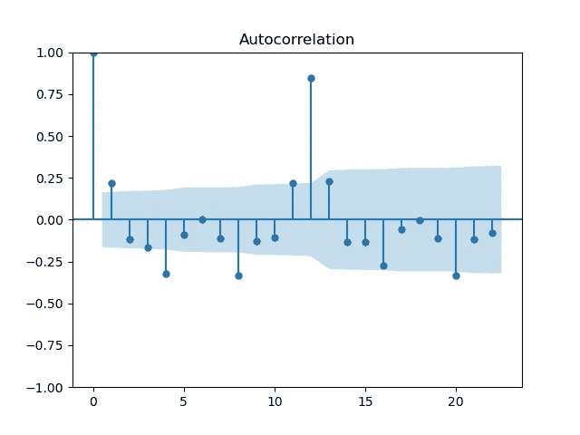

# 什么是 ARIMA？

> 原文：[`towardsdatascience.com/how-to-forecast-with-arima-96b3d4db111a`](https://towardsdatascience.com/how-to-forecast-with-arima-96b3d4db111a)

## ARIMA 预测模型简介及其在时间序列中的应用

 [Egor Howell](https://medium.com/@egorhowell?source=post_page-----96b3d4db111a--------------------------------)

·发布在 [Towards Data Science](https://towardsdatascience.com/?source=post_page-----96b3d4db111a--------------------------------) ·7 分钟阅读·2023 年 1 月 31 日

--

图片由 [Markus Spiske](https://unsplash.com/@markusspiske?utm_source=medium&utm_medium=referral) 提供，来源于 [Unsplash](https://unsplash.com/?utm_source=medium&utm_medium=referral)

# 背景

在我之前的文章中，我们已经涵盖了[***自回归 (AR)***](https://medium.com/towards-data-science/how-to-forecast-time-series-using-autoregression-1d45db71683)和[***移动平均 (MA)***](https://medium.com/towards-data-science/how-to-forecast-with-moving-average-models-6f3c9cbba60d)模型。然而，你知道比这两个模型更好的是什么吗？一个将它们结合在一起的单一模型！

[***自回归积分移动平均***](https://en.wikipedia.org/wiki/Autoregressive_integrated_moving_average)，更常被称为 ARIMA，可能是使用最广泛的时间序列预测模型，它是上述各个模型的组合。在本文中，我将深入探讨 ARIMA 模型的理论和框架。然后，我们将通过一个简单的 Python 示例，使用 `statsmodels` [包](https://www.statsmodels.org/dev/generated/statsmodels.tsa.arima.model.ARIMA.html)来进行 ARIMA 预测！

补充视频。

# 什么是 ARIMA？

## 概述

如上所述，ARIMA 代表**自回归**（**A**uto**R**egressive）**积分**（**I**ntegrated）**移动平均**（**M**oving **A**verage），基本上只是这三者（实际上是两者）组件的组合：

**自回归 (AR):**

这只是自回归，我们使用以前观察到的值的线性组合来预测未来值：

由作者生成的 LaTeX 方程。

这里 ***y*** 是我们在多个时间步预测的时间序列，***ϕ*** 是滞后项的系数，***ε*** 是 [误差项](https://en.wikipedia.org/wiki/White_noise)（通常 [**服从正态分布**](https://en.wikipedia.org/wiki/Normal_distribution)），***p*** 是滞后组件的数量，也称为 ***阶数。***

如果你想了解更多关于自回归的内容，可以查看我之前的帖子：

 ## 如何使用自回归预测时间序列

### 如何在 Python 中使用自回归模型进行预测的教程。

towardsdatascience.com

**集成 (I)：**

ARIMA 模型的中间部分被称为 [***集成***](https://en.wikipedia.org/wiki/Order_of_integration)***。*** 这是使时间序列 ***平稳*** 所需的差分次数 (顺序 ***d***)。

平稳性是指时间序列具有恒定的均值和方差，即序列的统计特性不会随时间变化。差分 ***去趋势化*** 时间序列，并倾向于使均值恒定。你可以多次应用差分，但通常在一次差分步骤后，序列已经足够平稳。

重要的是要注意，这个集成部分只是使均值恒定。我们需要应用其他变换，如 [***对数和 Box-Cox 变换***](https://en.wikipedia.org/wiki/Power_transform)，以生成恒定的方差（稍后会详细介绍）。

如果你想了解更多关于平稳性的内容，可以查看我之前的博客帖子：

 ## 时间序列平稳性简单解释

### 对时间序列建模中需要平稳性的一个简单而直观的解释。

towardsdatascience.com  ## Box-Cox 变换用于时间序列

### 如何使用 Box-Cox 变换创建平稳时间序列。

towardsdatascience.com

**移动平均 (MA)：**

最后的组件是移动平均，其中你使用过去的预测误差进行预测，而不是实际观察值：

由作者在 LaTeX 中生成的方程。

这里 ***y*** 是我们在多个时间点进行预测的时间序列，***μ*** 是均值，***θ*** 是滞后预测误差的系数，***ε*** 是预测误差项，***q*** 是滞后误差组件的数量。

如果你想了解更多关于移动平均模型的信息，请查看我之前的帖子：[这里](https://example.org/how-to-forecast-with-moving-average-models-6f3c9cbba60d?source=post_page-----96b3d4db111a--------------------------------)。

 ## 如何使用移动平均模型进行预测

### 使用移动平均模型进行预测的教程和理论

towardsdatascience.com

**最终形式**

将所有这些组件结合起来，我们可以写出完整的模型：

方程由作者在 LaTeX 中生成。

其中 ***y’*** 指的是时间序列的**差分**版本。

这是完整的 ARIMA 方程，仅仅是三个组件的线性求和。模型通常以简短的形式写为 ***ARIMA(p, d, q)***，其中 ***p***、***d*** 和 ***q*** 分别指自回归项、差分项和移动平均项的阶数。

## 需求

正如我们之前提到的，差分组件是为了使时间序列变得平稳。这是因为 ARIMA 模型要求数据必须是平稳的，才能对其进行充分建模。通过差分可以稳定均值，通过我们之前提到的 Box-Cox 变换可以稳定方差。

## 阶数选择

预处理步骤之一是确定 ARIMA 模型的最佳阶数（***p, d, q***）。最简单的是差分的阶数 ***d***，因为可以通过进行平稳性统计测试来验证。最常用的是 [***增强型迪基-福勒***](https://en.wikipedia.org/wiki/Augmented_Dickey%E2%80%93Fuller_test) ***(ADF)***，其原假设是时间序列**不**平稳。

自回归和移动平均的阶数（***p, q***）可以通过分析 [***偏自相关函数 (PACF)***](https://online.stat.psu.edu/stat510/lesson/2/2.2) 和 ***自相关函数*** 来推断。这种方法的要点是绘制时间序列的不同滞后/预测误差的 [***相关图***](https://en.wikipedia.org/wiki/Correlogram)，以确定哪些是 [***统计显著的***](https://en.wikipedia.org/wiki/Statistical_significance)。如果现在觉得这有些随意，不要担心，稍后在 Python 教程中我们会详细讲解这个过程。

 ## 时间序列分析的自相关

### 描述自相关是什么以及它在时间序列分析中的重要性。

[towardsdatascience.com  ## 时间序列分析的偏自相关

### 描述偏自相关是什么以及它在时间序列分析中的重要性。

[towardsdatascience.com

然而，更彻底的方法是遍历所有可能的组合，并选择在像[***Akaike 信息准则（AIC）***](https://en.wikipedia.org/wiki/Akaike_information_criterion)或[***贝叶斯信息准则（BIC）***](https://en.wikipedia.org/wiki/Bayesian_information_criterion)等指标下得分最好的模型。这类似于常规的超参数调优，显然是更稳健的方法，但计算开销更大。

## 估计

在选择了我们的阶次之后，我们需要找到它们的最佳对应系数。这就是为何需要平稳性的原因。如上所述，平稳时间序列具有恒定的统计特性，如均值和方差。因此，所有数据点都属于同一概率分布，这使得拟合模型变得更加容易。此外，预测被视为***随机变量***，将属于与新生成的平稳时间序列相同的概率分布。总体来说，这有助于**使未来的数据与过去有所相似**。

> 查看这个[statsexchange](https://stats.stackexchange.com/questions/19715/why-does-a-time-series-have-to-be-stationary)线程，了解平稳性对 ARIMA 的重要性。

由于平稳数据属于某种分布（通常是正态分布），我们可以使用***最大似然估计（MLE）***来估计系数。MLE 推导出产生数据最高概率的系数的最佳值。对于正态分布的数据，MLE 结果与执行[**普通最小二乘法**](https://en.wikipedia.org/wiki/Ordinary_least_squares)相同。因此，最小二乘法也常因这一原因而被使用。

> 点击这里查看 MLE 的精彩解释。

# ARIMA Python 教程

## 数据

本教程中使用的数据是经典的美国航空乘客数据集：

> 数据[来自 Kaggle](https://www.kaggle.com/datasets/ashfakyeafi/air-passenger-data-for-time-series-analysis)并具有 CC0 许可证。

作者提供的 GitHub Gist。

图由作者在 Python 中生成。

数据不是平稳的，因为存在**强烈的正趋势**和**年度季节性波动随时间增加**，因此方差在增加。对于此建模任务，我们将使用[statsmodel](https://www.statsmodels.org/dev/generated/statsmodels.tsa.arima.model.ARIMA.html) [包](https://www.statsmodels.org/dev/generated/statsmodels.tsa.arima.model.ARIMA.html)，该包便利地为我们执行差分操作并产生稳定的均值。然而，我们仍需应用 Box-Cox 变换以获得稳定的方差：

GitHub Gist 由作者提供。

图由作者在 Python 中生成。

> 季节性波动现在保持在一个一致的水平！

## 建模

在之前的部分中，我提到了如何通过绘制自相关和偏自相关函数来找到自回归和移动平均的阶数。让我们在这里展示一个如何做到这一点的示例：

GitHub Gist 由作者提供。

图由作者在 Python 中生成。

蓝色区域表示这些点**不再具有统计学意义**，从图中我们看到最后一个滞后在两个图中都是~***12th***。因此，我们将***p***和***q***的阶数设为***12***。

现在，让我们使用`ARIMA`函数来拟合模型并生成预测：

GitHub Gist 由作者提供。

## 分析

绘制预测：

GitHub Gist 由作者提供。

图由作者在 Python 中生成。

> ARIMA 模型很好地捕捉了数据！

# 总结与进一步思考

在本文中，我们讨论了实际中使用的最常见的预测模型之一，ARIMA。该模型将：自回归、差分和移动平均模型合并为一个单变量模型。ARIMA 在 Python 中应用非常简单，通过`statsmodels`包，大大简化了 ARIMA 模型的拟合过程。

本文使用的完整代码可以在我的 GitHub 上找到：

 [## Medium-Articles/arima.py at main · egorhowell/Medium-Articles

### 我在我的 medium 博客/文章中使用的代码。通过创建一个帐户来贡献 egorhowell/Medium-Articles 的开发…

github.com](https://github.com/egorhowell/Medium-Articles/blob/main/Time%20Series/ARIMA/arima.py?source=post_page-----96b3d4db111a--------------------------------)

# 另一个事项！

我有一个免费的新闻通讯，[**Dishing the Data**](https://dishingthedata.substack.com/)，在其中每周分享成为更好数据科学家的技巧。没有“废话”或“点击诱饵”，只有来自实践数据科学家的纯粹可操作的见解。

[## 数据探讨 | Egor Howell | Substack](https://newsletter.egorhowell.com/?source=post_page-----96b3d4db111a--------------------------------)

### 如何成为更好的数据科学家。点击阅读由 Egor Howell 撰写的《数据探讨》，这是一个 Substack 出版物…

[newsletter.egorhowell.com](https://newsletter.egorhowell.com/?source=post_page-----96b3d4db111a--------------------------------)

# 与我联系！

+   [**YouTube**](https://www.youtube.com/@egorhowell)

+   [**LinkedIn**](https://www.linkedin.com/in/egor-howell-092a721b3/)

+   [**Twitter**](https://twitter.com/EgorHowell)

+   [**GitHub**](https://github.com/egorhowell)

# 参考资料和进一步阅读

+   *预测：原理与实践*：[`otexts.com/fpp2/`](https://otexts.com/fpp3/arima.html)
