# 如何生成和评估知识图谱嵌入的表现？

> 原文：[`towardsdatascience.com/how-to-generate-and-evaluate-the-performance-of-knowledge-graph-embeddings-95789abcb0c1`](https://towardsdatascience.com/how-to-generate-and-evaluate-the-performance-of-knowledge-graph-embeddings-95789abcb0c1)

## 知识图谱嵌入训练与评估的详细指南

[](https://medium.com/@rohithtejam?source=post_page-----95789abcb0c1--------------------------------)[](https://towardsdatascience.com/?source=post_page-----95789abcb0c1--------------------------------) [Rohith Teja](https://medium.com/@rohithtejam?source=post_page-----95789abcb0c1--------------------------------)

·发布在 [Towards Data Science](https://towardsdatascience.com/?source=post_page-----95789abcb0c1--------------------------------) ·7 分钟阅读·2023 年 4 月 10 日

--


图片由 [Alina Grubnyak](https://unsplash.com/it/@alinnnaaaa?utm_source=unsplash&utm_medium=referral&utm_content=creditCopyText) 提供，来源于 [Unsplash](https://unsplash.com/s/photos/network?orientation=landscape&utm_source=unsplash&utm_medium=referral&utm_content=creditCopyText)

在你开始阅读本文之前，我假设你对知识图谱嵌入有一些基本了解。如果没有，我建议你查看以下文章，它会给你一个关于这个概念的很好的介绍：

[](/knowledge-graph-embedding-a-simplified-version-e6b0a03d373d?source=post_page-----95789abcb0c1--------------------------------) ## 知识图谱嵌入 — 简化版！

### 解释了知识图谱嵌入到底是什么以及如何计算它们。

towardsdatascience.com

现在这些内容都处理完了，在这篇文章中，我将展示如何生成知识图谱嵌入、解释它们以及评估它们在基于图的任务中的表现。

# 知识图谱

考虑一个 [国家](https://pykeen.readthedocs.io/en/stable/api/pykeen.datasets.Countries.html#pykeen.datasets.Countries) 的知识图谱。在这个图谱中，我们将国家和地区的名称视为实体。关系由两个属性表示，即“neighbor”和“locatedin”。

> 该图是 PyKEEN Python 库的内置数据集。

查看以下知识图谱三元组作为数据框的截图：

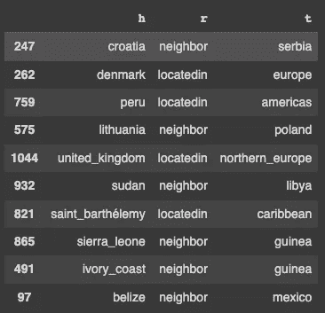

知识图谱三元组（作者提供的图像）

三元组的形式为`(croatia, neighbor, serbia)`和`(denmark, locatedin, europe)`。下面是使用 NetworkX Python 库的图的完整可视化：

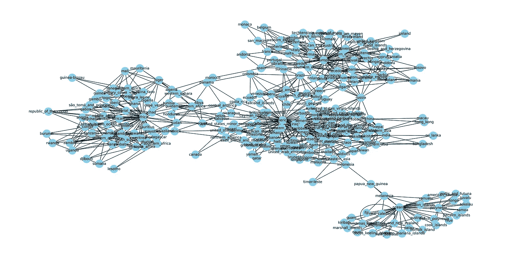

“国家”知识图谱（作者图片）

由于图很大，因此可视化不是很清晰。让我们查看这个知识图谱的一个子图。

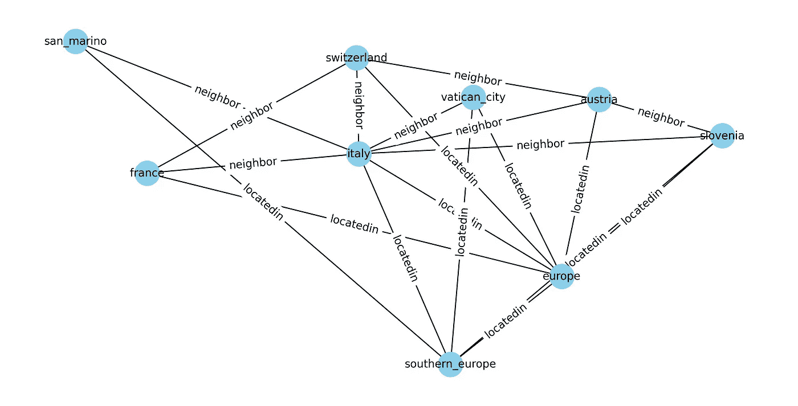

“国家”知识图谱的子图（作者图片）

上述子图清晰地展示了三元组，显示了实体和关系。

现在我们有了知识图谱。让我们了解如何使用[PyKEEN](https://pykeen.readthedocs.io/en/stable/) Python 库生成知识图谱嵌入。

# 知识图谱嵌入

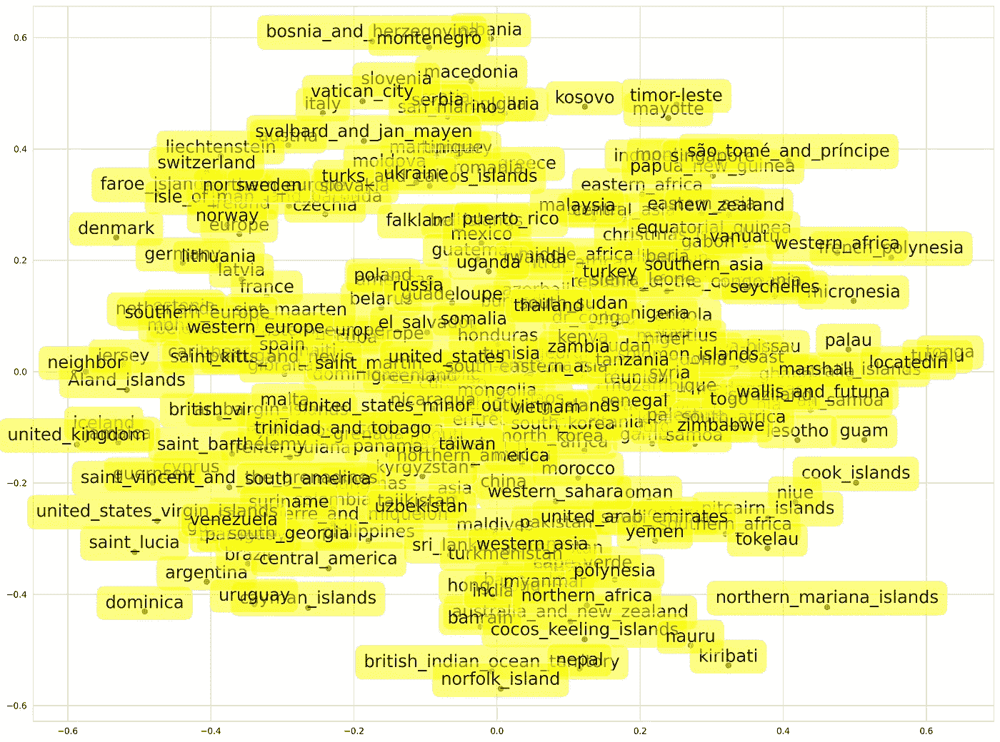

使用 PCA 进行嵌入可视化（作者图片）

上述图示为使用`TransR`算法训练的知识图谱嵌入的可视化。观察各国如何被聚集在一起。在可视化的顶部，我们看到波斯尼亚、黑山和阿尔巴尼亚彼此接近。这表明嵌入算法能够将具有相似属性的国家聚集在一起。

可视化使用 PCA 进行，其中 128 维的嵌入被缩减到 2 维。这可能会影响国家分组的准确性。此外，嵌入算法可以进行调整以提高性能。

这是生成嵌入的代码：

## 前提条件

```py
pip install pykeen -q # install PyKEEN library
```

## 读取数据

```py
from pykeen.datasets import Countries
import pandas as pd

# read data from pykeen dataset method
df = pd.DataFrame(Countries().training.triples)
df.columns = ['h', 'r', 't']
df.sample(10)
```

## 生成嵌入

```py
from pykeen.triples import TriplesFactory
from pykeen.pipeline import pipeline

# Generate triples from the graph data
tf = TriplesFactory.from_labeled_triples(df.values)

# split triples into train and test
training, testing = tf.split([0.8, 0.2], random_state=42)

# generate embeddings using PyKEEN's pipeline method
result = pipeline(
        training=training,
        testing=testing,
        model = "TransR",
        model_kwargs=dict(embedding_dim=128),
        training_kwargs=dict(num_epochs=200),
        random_seed=42)
```

在上面的代码中，`TriplesFactory`类提供了知识图谱中三元组的标准化表示。PyKEEN 有不同的方法来读取和操作三元组。此外，也可以将数据划分为训练集、验证集和测试集。在这里，我仅将数据划分为训练集和测试集，因为我没有进行任何超参数调整。

我选择了`TransR`模型，并将嵌入维度设置为 128，轮次设置为 200。

损失与轮次图如下所示：

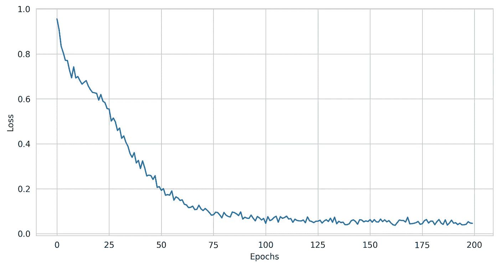

损失与轮次（作者图片）

损失在 100 轮次后减少，并且保持几乎不变。100 轮次对于这个训练过程来说已经足够了。哎呀！

# 检索嵌入

训练过程已完成，现在我们可以从 PyKEEN 的`pipeline()`函数的`result`对象中检索嵌入。我们学习了实体和关系的嵌入。这些嵌入可以使用任何降维方法如 PCA 或 t-SNE 进行可视化（与上面部分的可视化相同）。

以下是训练过程完成后获取嵌入的代码：

## 实体嵌入

```py
# get entity labels from training set
entity_labels = training.entity_labeling.all_labels()
# convert entities to ids
entity_ids = torch.as_tensor(training.entities_to_ids(entity_labels))
# retrieve the embeddings using entity ids
entity_embeddings = result.model.entity_representations0
# create a dictionary of entity labels and embeddings
entity_embeddings_dict = dict(zip(entity_labels, entity_embeddings.detach().numpy()))
```

## 关系嵌入

```py
# get relation labels from training set
relation_labels = training.relation_labeling.all_labels()
# convert relations to ids
relation_ids = torch.as_tensor(training.relations_to_ids(relation_labels))
# retrieve the embeddings using relation ids
relation_embeddings = result.model.relation_representations0
# create a dictionary of relation labels and embeddings
relation_embeddings_dict = dict(zip(relation_labels, relation_embeddings.detach().numpy()))
```

# 嵌入的评估

我们已经看到嵌入的生成以及如何检索它们。现在，让我们检查它们在链接预测中的表现。链接预测是一个基于图的任务，涉及预测图中节点之间的缺失或未来链接。

> 查看我的[文章](https://medium.com/towards-data-science/a-quick-note-on-graphs-and-the-formulation-of-their-downstream-tasks-d8a8c808c93f)来详细了解图形任务，如链接预测和节点分类。

PyKEEN 提供了一种简单的方法来执行链接预测任务的评估。

我将创建一个数据框架来展示训练和测试集，以便更容易理解评估过程。

```py
# create a train df
df_train = pd.DataFrame(training.triples)
df_train.columns = ['h','r','t']
# create a test df
df_test = pd.DataFrame(testing.triples)
df_test.columns = ['h','r','t']
```

我将使用基于评分的评估来执行尾预测任务（链接预测的一种变体）。模型必须从测试集中预测尾部实体。我考虑了 3 个案例来展示这一评估过程的工作情况。

## 案例 1：墨西哥

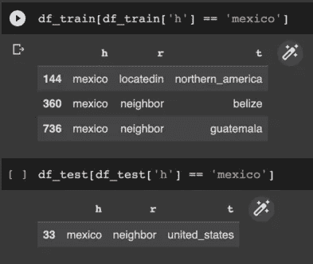

尾预测：墨西哥（作者图片）

在上面的图像中，我们看到模型在涉及`Mexico`作为头实体的三个三元组上进行了训练。测试集有一个实例，关系为`neighbor`。我们的目标是正确预测测试集的尾实体，即从三元组`(mexico, neighbor, united_states)`中预测`united_states`。

```py
from pykeen import predict

# tail prediction
predict.predict_target(model=result.model,
                       head="mexico",
                       relation="neighbor",
                       triples_factory=result.training).df.head(20)
```

上述代码块对“缺失”三元组`(mexico, neighbor, **?**)`执行尾预测。

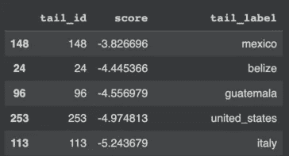

尾预测：墨西哥（作者图片）

在上述输出中，我们看到模型根据基于评分的方法将`belize`、`guatemala`和`united_states`排在前列。`belize`和`guatemala`已存在于训练集中，而模型正确预测了`united_states`。请观察排名前列的预测结果得分更高。

这是链接预测任务的一个应用案例。

## 案例 2：塞内加尔

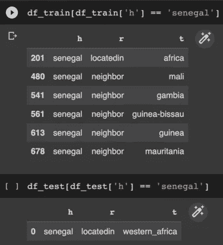

尾预测：塞内加尔（作者图片）

在这里，我们预测测试三元组`(senegal, locatedin, **?**)`的尾部。测试集中只有一个实例。预测结果如下：

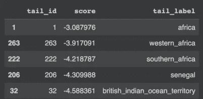

尾预测：塞内加尔（作者图片）

## 案例 3：不丹

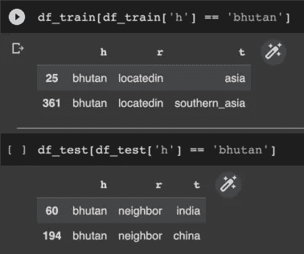

尾预测：不丹（作者图片）

在这里，测试集中有两个实例。让我们看看预测结果：

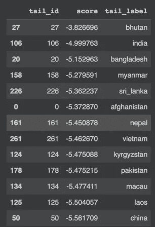

尾预测：不丹（作者图片）

模型正确地对第一个尾预测实例（`india`）进行了评分，但未能将第二个实例（`china`）列入前列。它成功预测了尾标签，但信心较低。

这是因为模型未能完美捕捉嵌入中的网络关系。请记住，在训练模型时我没有进行超参数优化，这可能影响了性能。

# 评估指标

在上节中，我展示了一个基本的评估过程。我们有[基于排名的评估](https://pykeen.readthedocs.io/en/stable/tutorial/understanding_evaluation.html)方法来量化模型性能。基于排名的方法有多个指标，其中一个重要的指标是平均排名。

平均排名是所有测试三元组中正确预测的平均排名。在上述 3 个案例中，平均排名可以按如下方式计算：

案例 1：排名 = 4

案例 2：排名 = 2

案例 3：排名 = 2（第一次实例）

案例 3：排名 = 13（第二次实例）

因此，平均排名是`(4+2+2+13)/4` = 5.25

整个测试集的平均排名如下：

```py
rank_metrics = result.metric_results.to_df()
rank_metrics[rank_metrics.Metric=='arithmetic_mean_rank']
```

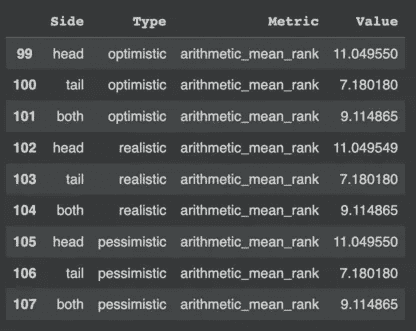

平均排名（图片由作者提供）

我们在上述 3 个案例中进行了尾部预测。对于整个测试集，尾部预测的平均排名约为 7.2，这还不错。

我们训练了一个相当不错的知识图谱嵌入模型！

感谢阅读，干杯！

**想要联系？**

通过 [LinkedIn](https://www.linkedin.com/in/rohithteja/)、[Twitter](https://twitter.com/rohithtejam)、[GitHub](https://github.com/rohithteja) 或 [Website](https://rohithteja.github.io/) 联系我！
