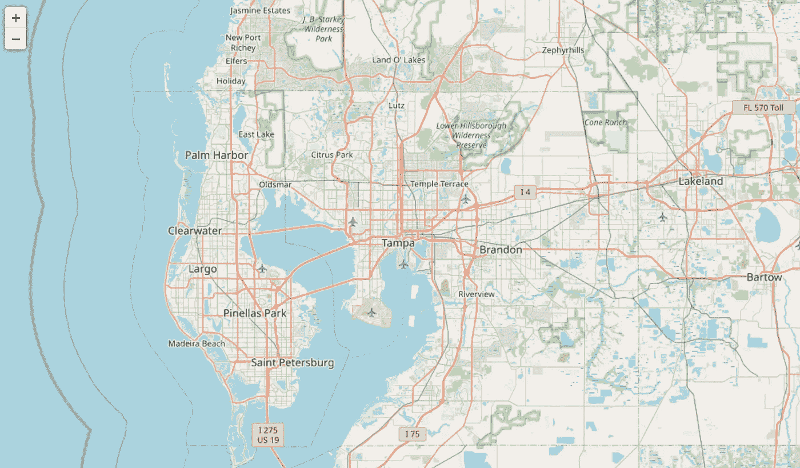
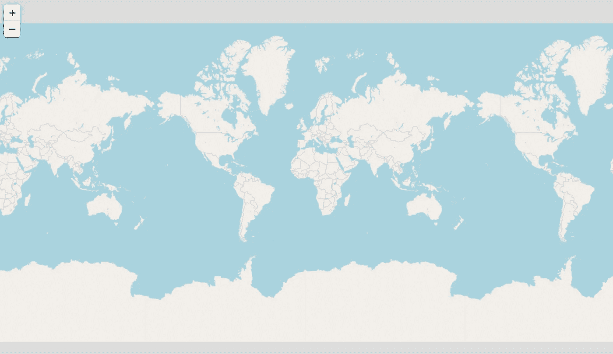
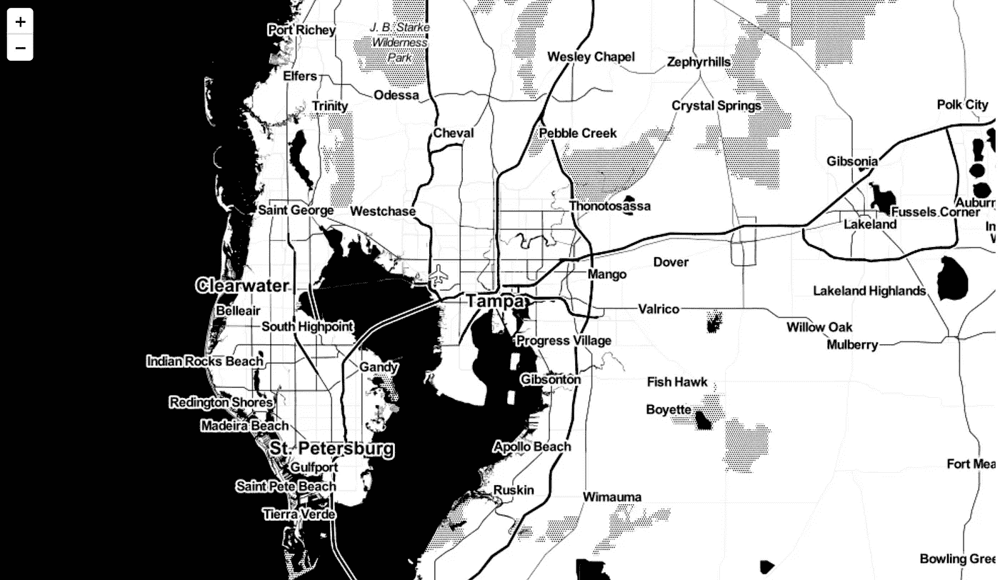
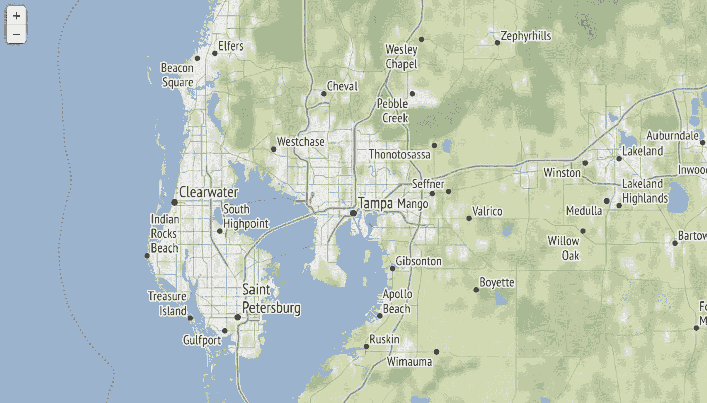
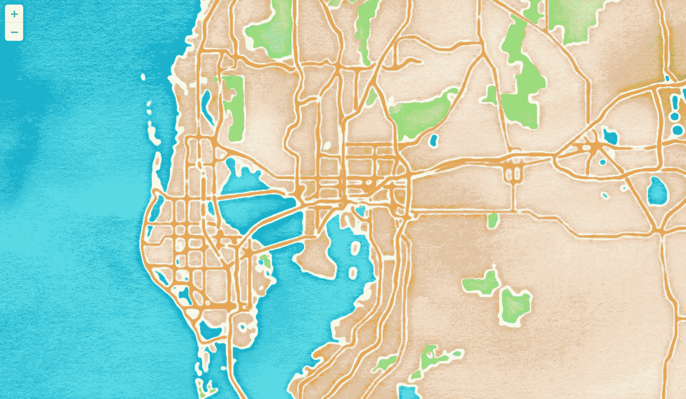
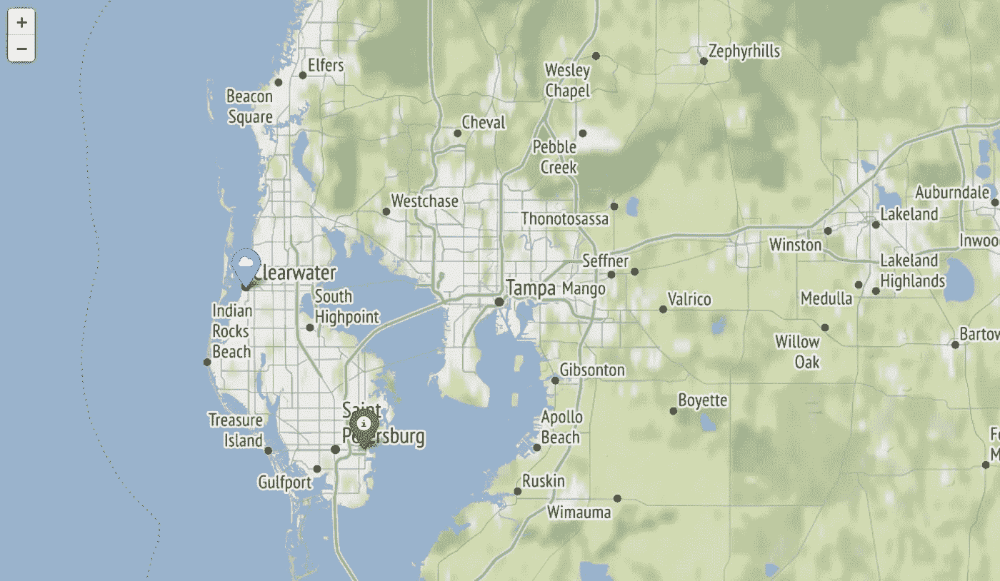
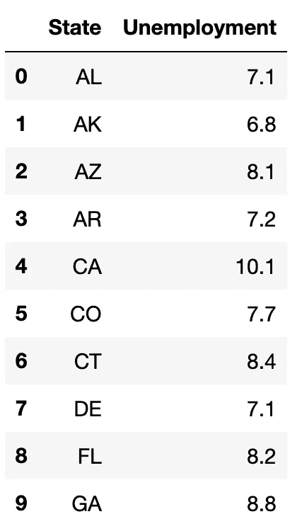
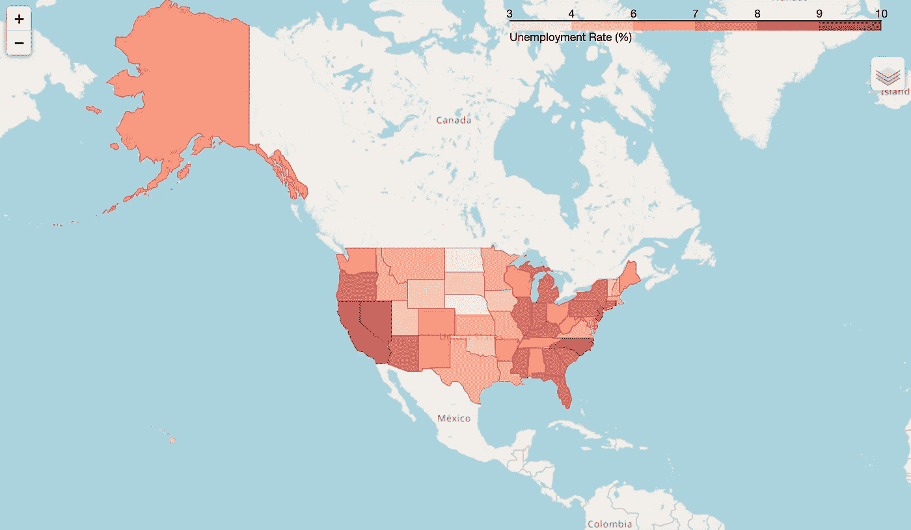

# 如何使用 Folium 生成交互式地图

> 原文：[`towardsdatascience.com/how-to-generate-interactive-maps-with-folium-b232778758c4`](https://towardsdatascience.com/how-to-generate-interactive-maps-with-folium-b232778758c4)

## 使用这个 Python 库来创建地图可视化

[](https://amolmavuduru.medium.com/?source=post_page-----b232778758c4--------------------------------)[](https://towardsdatascience.com/?source=post_page-----b232778758c4--------------------------------) [Amol Mavuduru](https://amolmavuduru.medium.com/?source=post_page-----b232778758c4--------------------------------)

·发表于 [Towards Data Science](https://towardsdatascience.com/?source=post_page-----b232778758c4--------------------------------) ·阅读时间 5 分钟·2023 年 6 月 26 日

--



佛罗里达州坦帕市地图。图片使用 Folium 和 Open Street Map 数据创建。

数据可视化是数据科学中最被忽视的领域之一。机器学习和统计分析固然重要，但能够可视化数据，尤其是不同类型的数据，是数据讲述的关键方面。虽然许多入门数据科学的培训课程和课程会介绍如何使用 matplotlib 和 seaborn 创建基本图表，但其中许多并未涉及如何在地图上可视化地理数据。

Folium 是一个 Python 库，它使用 Leaflet.js 和 Open Street Map 数据来创建高质量的地图可视化。**在这篇文章中，我将演示如何使用 Folium 生成交互式地图可视化。**

# 安装

我们可以通过以下演示，轻松地使用 pip 安装 Folium。

```py
pip install folium
```

# 导入库

像往常一样，在开始之前，我将导入一些 Folium 和其他可能需要的库。请记住，您可以在 [GitHub](https://github.com/AmolMavuduru/FoliumTutorial) 上找到本教程的所有代码。

```py
import numpy as np
import pandas as pd
import folium
```

# 绘制默认的世界地图

Folium 提供了一个 Map 函数，我们可以调用该函数而不带任何参数，以生成默认的世界地图。

```py
folium.Map()
```



默认的世界地图投影。图片使用 Folium 和 Open Street Map 数据创建。

注意到默认地图是一个投影图，并且在左上角包含了缩放控件，这样我们可以与地图互动，并在需要时聚焦于特定区域。

# 按坐标绘制位置

我们可以通过在 Map 函数的 location 参数中添加一组坐标，来创建一个围绕特定位置的地图。使用下面的代码，我们可以生成一个以佛罗里达州坦帕市为中心的地图。

```py
folium.Map(location=[27.950575, -82.457176])
```


坦帕佛罗里达地图。图像使用 Folium 和 Open Street Map 数据创建。

# 更改地图瓦片

我们还可以通过“tiles”参数更改地图瓦片，以创建不同样式的地图。我们可以使用详细描述的 Stamen Toner 瓦片 [这里](http://maps.stamen.com/#watercolor/12/37.7706/-122.3782)。

```py
folium.Map(location=[27.950575, -82.457176],  tiles="Stamen Toner")
```



使用 Stamen Toner 瓦片的地图。图像使用 Folium 和 Open Street Map 数据创建。

注意同一张坦帕地图现在是黑白色的。我们还可以创建地形图，如下所示。

```py
folium.Map(location=[27.950575, -82.457176],  tiles="Stamen Terrain")
```



使用 Stamen Terrain 瓦片的地图。图像使用 Folium 和 Open Street Map 数据创建。

我们还可以使用 Stamen 瓦片创建一张美丽的水彩地图，如下方代码所示。

```py
folium.Map(location=[27.950575, -82.457176],  tiles="Stamen Watercolor")
```



坦帕水彩地图。图像使用 Folium 和 Open Street Map 数据创建。

# 添加地图标记

如果我们想在地图上添加标记，可以使用 Folium 的 Marker 类创建标记对象，并将其添加到地图中，如下所示。正如预期的那样，我们可以使用坐标指定标记的位置。

```py
m = folium.Map(location=[27.950575, -82.457176], tiles="Stamen Terrain")

folium.Marker(
    location=[27.9658533, -82.8001026],
    popup="Clearwater",
    icon=folium.Icon(icon="cloud")
).add_to(m)

folium.Marker(
    location=[27.773082733154297, -82.64020538330078],
    popup="St. Petersburg",
    icon=folium.Icon(color='green')
).add_to(m)

m
```



带有标记的坦帕地图。图像使用 Folium 和 Open Street Map 数据创建。

注意我在上面的地图中在 Clearwater 和 Saint Petersburg 创建了标记。

# 创建分级填色图

虽然创建地图是一个有用的功能，但能够在地图上绘制和可视化数据及趋势更为重要。Folium 还提供了创建分级填色图的功能。在这一部分，我将演示如何使用美国失业数据创建分级填色图。

## 读取数据

我们将使用的数据集可以在 Folium GitHub 仓库的 examples 目录中找到。我们将读取一个包含 2012 年 10 月各州失业统计数据的 CSV 文件，以及一个用于生成地图的 GeoJSON 文件。

```py
url = (
    "https://raw.githubusercontent.com/python-visualization/folium/main/examples/data"
)
state_geo = f"{url}/us-states.json"
state_unemployment = f"{url}/US_Unemployment_Oct2012.csv"
state_data = pd.read_csv(state_unemployment)
state_data.head(10)
```



各州失业数据。

上图显示了使用 pandas head 函数展示的前十行各州失业数据。

## 生成地图

现在我们有了失业数据，可以生成分级填色图。我们将向 Choropleth 构造函数提供以下参数：

+   **geo_data:** 用于生成地图的 GeoJSON 数据文件路径。

+   **name**: 地图的名称

+   **data**: 用于生成分级填色图颜色的实际数据。

+   **columns**: 将使用的数据列。

+   **key_on**: 在 GeoJSON 文件中将数据绑定到的变量（必须以 feature 开头，例如 feature.id）

+   **fill_color**: 用于分级填色图的颜色方案

+   **fill_opacity**: 填充颜色的透明度。

+   **line_opacity**: 地图中线条的透明度。

+   **legend_name**: 地图中图例的名称。

```py
m = folium.Map(location=[46, -102], zoom_start=3)

folium.Choropleth(
    geo_data=state_geo,
    name="choropleth map",
    data=state_data,
    columns=["State", "Unemployment"],
    key_on="feature.id",
    fill_color="Reds",
    fill_opacity=0.7,
    line_opacity=0.2,
    legend_name="Unemployment Rate (%)",
).add_to(m)

folium.LayerControl().add_to(m)

m
```



显示美国失业情况的分级填色图。

正如上面所示，我们能够生成一个可视化每个美国州失业率的分级地图。

# 将地图保存为 HTML 文件

我们还可以将地图保存为 HTML 文件，这对将 Folium 地图嵌入到 web 应用程序中非常有帮助。

```py
m.save('choropleth_unemployment.html')
```

# 摘要

Folium 是一个用于可视化地理数据的有用 Python 库。它允许我们创建互动式地图可视化，还可以将其保存为 HTML 文件，并嵌入到 web 应用程序中。我在这篇文章中仅覆盖了 Folium 的一些基本功能，你可以在 [Folium 文档页面](https://python-visualization.github.io/folium/index.html) 上找到更详细的功能列表。你还可以在 [GitHub](https://github.com/AmolMavuduru/FoliumTutorial) 上找到本文使用的所有代码。

# 加入我的邮件列表

加入我的 [邮件列表](https://mailchi.mp/e8dd82679724/amols-data-science-blog)，获取我数据科学内容的更新。当你 [注册](https://mailchi.mp/e8dd82679724/amols-data-science-blog) 时，还会收到我免费的 **逐步解决机器学习问题指南**。你也可以在 [Twitter](https://twitter.com/amolmavuduru1) 上关注我，获取内容更新。

在此期间，考虑 [加入 Medium 社区](https://amolmavuduru.medium.com/membership)，阅读来自成千上万其他作者的文章。

# 来源

1.  Rob Story, [Folium 0.14.0 文档](https://python-visualization.github.io/folium/index.html)，（2013），GitHub。
