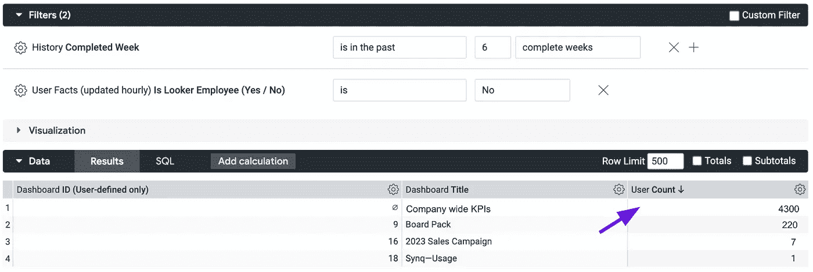
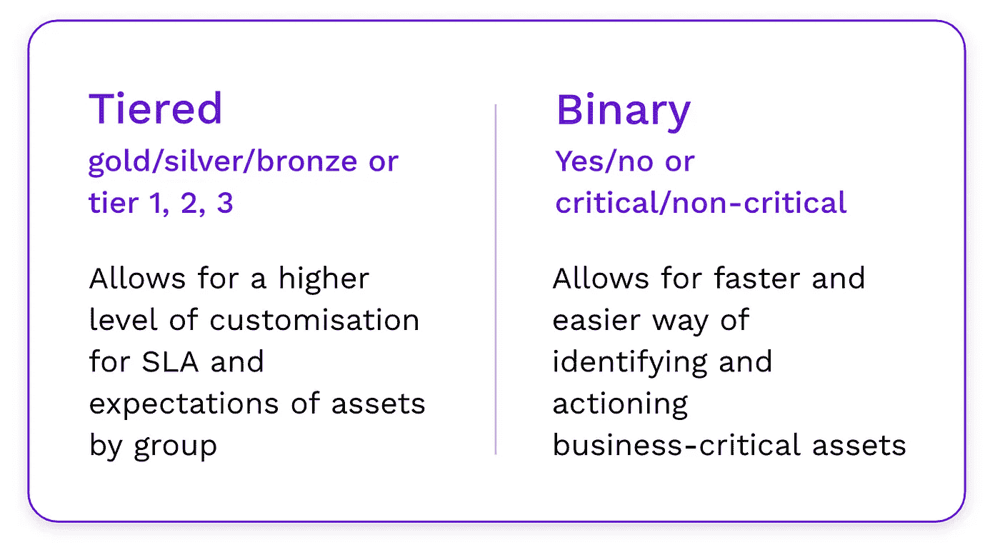
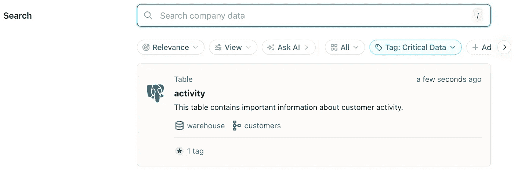

# 如何识别业务关键数据

> 原文：[`towardsdatascience.com/how-to-identify-your-business-critical-data-c58506116a41?source=collection_archive---------4-----------------------#2023-06-14`](https://towardsdatascience.com/how-to-identify-your-business-critical-data-c58506116a41?source=collection_archive---------4-----------------------#2023-06-14)

## 实用步骤以识别业务关键数据模型和仪表盘，并提升对数据的信心

[](https://medium.com/@mikldd?source=post_page-----c58506116a41--------------------------------)[](https://towardsdatascience.com/?source=post_page-----c58506116a41--------------------------------) [Mikkel Dengsøe](https://medium.com/@mikldd?source=post_page-----c58506116a41--------------------------------)

·

[关注](https://medium.com/m/signin?actionUrl=https%3A%2F%2Fmedium.com%2F_%2Fsubscribe%2Fuser%2Fc05fafadc01d&operation=register&redirect=https%3A%2F%2Ftowardsdatascience.com%2Fhow-to-identify-your-business-critical-data-c58506116a41&user=Mikkel+Dengs%C3%B8e&userId=c05fafadc01d&source=post_page-c05fafadc01d----c58506116a41---------------------post_header-----------) 发表于 [Towards Data Science](https://towardsdatascience.com/?source=post_page-----c58506116a41--------------------------------) ·9 分钟阅读·2023 年 6 月 14 日[](https://medium.com/m/signin?actionUrl=https%3A%2F%2Fmedium.com%2F_%2Fvote%2Ftowards-data-science%2Fc58506116a41&operation=register&redirect=https%3A%2F%2Ftowardsdatascience.com%2Fhow-to-identify-your-business-critical-data-c58506116a41&user=Mikkel+Dengs%C3%B8e&userId=c05fafadc01d&source=-----c58506116a41---------------------clap_footer-----------)

--

[](https://medium.com/m/signin?actionUrl=https%3A%2F%2Fmedium.com%2F_%2Fbookmark%2Fp%2Fc58506116a41&operation=register&redirect=https%3A%2F%2Ftowardsdatascience.com%2Fhow-to-identify-your-business-critical-data-c58506116a41&source=-----c58506116a41---------------------bookmark_footer-----------)

来源：synq.io

*本文由* [*Lindsay Murphy*](https://ca.linkedin.com/in/lindsaymurphy4) *共同撰写*

不是所有数据都是平等的。如果你在数据团队工作，你会知道如果某个仪表盘出现问题，你会立刻停下手头的一切去解决，而其他问题可能要等到周末才能处理。这有其充分的理由。前者可能意味着整个公司都在缺少数据，而后者可能没有显著影响。

然而，随着团队的扩展以及数据模型和仪表板数量的增加，跟踪所有业务关键数据可能会变得困难。这就是为什么会发生这些情况的原因

*“我完全不知道财务部门依赖于这个仪表板来进行他们的月度审计报告”*

或

*“到底怎么回事，我们的 CEO 竟然收藏了我在六个月前匆忙制作的这个仪表板”*

在这篇文章中，我们将探讨

+   为什么你应该识别你的关键数据资产

+   如何识别关键的仪表板和数据模型

+   为关键数据创建一种正常运行的文化

# 为什么你应该识别你的业务关键数据

当你已经绘制出你的业务关键资产时，你可以获得一个端到端的概览，显示哪些数据模型或仪表板是业务关键的，它们的使用地点，以及它们的最新状态。

这在多种不同的方式中都非常有用：

+   它可以成为一份重要的文档，帮助推动整个业务在最重要的数据资产上的一致性

+   这会增强数据团队的信心，使他们在更改和更新现有模型或功能时不必担心破坏下游的关键内容

+   当问题出现时，它能够使决策、速度和优先级管理更为高效

+   它允许你的团队将更多的精力集中在关键资产上，并让一些不那么重要的事情随之而去


*查看重要受影响的数据模型和仪表板的示例。来源：synq.io*

在这篇文章中，我们将探讨如何识别你的业务关键数据模型和仪表板。你可以将大部分相同的原则应用于其他对你的业务可能至关重要的数据资产。

# 什么数据是对业务至关重要的

用于决策的数据是重要的，如果数据不正确，可能会导致错误的决策，并随着时间推移失去对数据的信任。但数据驱动的企业拥有真正关键的业务数据。如果这些数据不正确或过时，你会面临紧急情况，如果不修复，可能会立即对业务产生影响，比如…

+   成千上万的客户可能会收到错误的电子邮件，因为反向 ETL 工具正在从过时的数据模型中读取数据

+   你向监管机构报告了不正确的数据，而你的高管们可能会承担个人责任

+   你的预测模型没有运行，数百名客服人员在假期前无法获取他们的下一班次排班


来源：synq.io

绘制这些用例需要你对公司运作有深刻的理解，了解对利益相关者最重要的事项以及问题的潜在影响。

# 识别你的业务关键仪表板

Looker 在预构建的探索中暴露了有关内容使用的元数据，你可以用自己的数据来丰富这些数据，使其更有用。在以下示例中，我们将使用 Looker，但大多数现代 BI 工具都以某种形式支持基于使用的报告（Lightdash 也内置了 [Usage Analytics](https://docs.lightdash.com/references/usage-analytics)，Tableau Cloud 提供 [Admin Insights](https://help.tableau.com/current/online/en-us/adminview_insights.htm)，而 Mode 的 [Discovery Database](https://mode.com/developer/discovery-database/introduction/) 提供对使用数据的访问，仅举几个例子）。

# 基于业务关键用例的重要性

当你与你的业务领导交谈时，你可以问一些问题，例如：

+   你接下来三个月的首要任务是什么？

+   你如何衡量你领域的成功？

+   你过去一年中遇到的最关键问题是什么？

你的业务领导可能不知道，平均客户支持响应时间从两小时跳升到圣诞节的 24 小时，是由于过时的上游数据预测错误，但他们会向你描述这段痛苦的经历。如果你能够绘制出最关键的操作和工作流程，并理解数据的使用方式，你将开始揭示真正的业务关键数据。

# 基于仪表盘使用的重要性

最明显的重要仪表盘是公司所有人都在使用的仪表盘。你可能已经知道其中的一些，例如“公司范围 KPIs”、“产品使用仪表盘”或“客户服务指标”。但有时你会惊讶地发现，许多人依赖于你之前不知道存在的仪表盘。



来源：synq.io

在大多数情况下，你应该过滤掉最近的使用情况，避免包括那些六个月前有很多用户但最近一个月没有使用的仪表盘。也有例外情况，比如一个每三个月才使用一次的季度 OKR 仪表盘。

# 基于仪表盘 C-suite 使用的重要性

不管你愿意与否，如果你的首席执行官经常使用某个仪表盘，那么它就很重要，即使只有少数其他用户。在最糟糕的情况下，你可能会发现 C-suite 的某个成员已经使用了几个月的仪表盘，而你对这个仪表盘的存在一无所知。

> *“我们发现我们的首席执行官每天都会查看一份包含收入报告的电子邮件，但它被错误地过滤以包含特定的细分，因此与中央公司 KPI 仪表盘不匹配。” — 加拿大医疗保健初创公司*

如果你有员工记录系统，你可能能够轻松获得人员职位的标识符，并用这些标识符来丰富你的使用数据。如果没有，你可以维护一个手动的映射，并在执行团队更换时进行更新。


来源：synq.io

虽然使用频率与重要性高度相关，但你的首要任务应该是绘制业务关键用例。例如，一家较大的金融科技公司有一个仪表板由监管报告负责人使用，与监管机构共享关键信息。这些数据的准确性对你的首席执行官来说可能比他们每天查看的仪表板更为重要。

# 识别你的业务关键数据模型。

随着许多 dbt 项目超出数百或数千个数据模型，了解哪些是业务关键模型很重要，以便你知道何时优先处理运行或测试失败，或建立额外的强健测试。

# 具有许多下游依赖的数据模型。

你可能有一组数据模型，如果它们出现故障，其他所有模型都会受到延迟或影响。这些通常是所有其他模型依赖的模型，如 `users`、`orders` 或 `transactions`。

你可能已经知道这些模型是什么。如果不知道，你也可以使用 dbt 生成的 [manifest.json](https://docs.getdbt.com/reference/artifacts/manifest-json) 文件以及每个节点的 `depends_on` 属性，遍历所有模型并计算依赖于它们的模型总数。

在大多数情况下，你会发现一些模型具有不成比例的许多依赖项。这些应标记为关键。

# 关键路径上的数据模型。

数据模型本身很少是关键的，通常是由于其下游依赖的关键性，比如一个重要的仪表板或用于向网站用户提供推荐的机器学习模型。


*所有位于业务关键仪表板上游的数据模型都在关键路径上。来源：synq.io*

一旦你完成了识别业务关键下游依赖和用例的艰巨工作，你可以使用 dbt 中的 exposures 手动映射这些，或者使用一个工具自动连接你在不同工具中的数据血缘。

任何位于关键资产上游的内容都应该标记为关键或处于关键路径上。

# 如何保持关键数据模型定义的更新。

尽可能自动化标记关键数据模型。例如：

+   使用 [check-model-tags](https://github.com/dbt-checkpoint/dbt-checkpoint/blob/main/HOOKS.md#check-model-tags) 来自 [pre-commit](https://github.com/dbt-checkpoint/dbt-checkpoint) dbt 包，强制每个数据模型都有关键性标签。

+   构建一个脚本，或者使用 [一个工具](https://docs.secoda.co/resource-and-metadata-management/editing-metadata/propagating-metadata)，自动为所有位于业务关键资产上游的模型添加 `critical-path` 标签。

# 定义关键性标签。

没有一个唯一的正确答案来定义关键性，但你应该问自己两个问题。

1.  你打算如何不同地处理关键数据资产？

1.  如何确保在关键领域中维持一致的定义，以便所有人都在同一页面上

大多数公司采用分层方法（例如青铜、银、金）或二进制方法（例如关键、非关键）。这两种选择都可以运作，最佳解决方案取决于您的情况。



来源：synq.io

您应该在定义关键性和编写[新员工入职培训](https://www.secoda.co/blog/data-onboarding-best-practices)的一部分时保持一致，并避免推迟。例如，分层定义可以是

+   *一级*：用于机器学习系统的数据模型，用于确定允许哪些用户注册您的产品

+   *二级*：CMO 用于每周营销审查的仪表板

+   *三级*：产品经理用来跟踪每月产品参与度的仪表板

如果您不持续更新和标记资产，会导致缺乏信任，并假定您不能依赖定义。

# 关键性定义的位置

没有一个确定的地方来定义关键性，但通常在创建数据资产的工具中，或者在数据目录（例如 Secoda）中进行。

# 在创建数据资产的工具中定义关键性

在 dbt 中，您可以将关键性定义与数据模型定义一起保存在您的.yml 文件中。这有几个优点，例如在合并 PR 时能够强制执行关键性，或者轻松地在数据目录或可观察性工具等工具之间传递此信息。

```py
models:
 - name: fct_orders 
   description: All orders        
   meta:
     criticality: high
```

*在.yml 文件中定义关键性的示例*

在 BI 工具中，使每个人都能够透明地使用的一个选项是使用例如“*一级*”标签来标识仪表板的标题，以表明其关键性。此数据通常可以提取并在其他工具中使用。


来源：synq.io

# 在数据目录中定义关键性

在数据目录中，您可以轻松访问所有公司数据，并通过搜索整个堆栈找到常见问题的答案，这使得对齐指标和模型变得更加容易



*标记关键数据。来源：secoda.co*

# 根据关键性采取行动

如果由于此原因采取了不同的行动，映射您的业务关键资产将只会产生回报。以下是一些建立质量设计的流程示例。

仪表板：

+   一级仪表板在推送到生产之前需要进行代码审查

+   一级仪表板应遵循特定的性能指标，如加载时间，并具有一致的视觉布局

+   应该每月监控一次使用一级仪表板的情况，由所有者负责

数据模型：

+   对关键数据模型的测试或运行失败应在同一天内采取行动

+   关键数据模型的问题应发送给 PagerDuty（一名值班团队成员），以便他们能够快速采取行动

+   关键数据模型应至少具备唯一性和非空测试以及已定义的所有者

你可以在我们的指南[设计数据问题的严重程度级别](https://www.synq.io/blog/designing-severity-levels-for-data-issues)中阅读更多关于如何处理数据问题的信息。

# 摘要

如果你识别并绘制出你的业务关键数据资产的映射，你可以更快地处理重要问题，并有意地构建高质量的数据资产。

+   要识别业务关键的仪表板，首先从业务用例入手。然后考虑使用数据，例如用户数量或是否有高层管理人员在使用某个仪表板。

+   业务关键的数据模型通常具有许多下游依赖关系和/或关键的下游依赖关系。

+   定义关键性，可以直接在创建数据资产的工具中进行，或者使用数据目录。

+   明确你如何处理业务关键资产中的问题，并制定设计质量的程序。
