# 如何使用 Python 代码实现层次聚类

> 原文：[`towardsdatascience.com/how-to-implement-hierarchical-clustering-for-direct-marketing-campaigns-with-python-code-ef897f52d1c5`](https://towardsdatascience.com/how-to-implement-hierarchical-clustering-for-direct-marketing-campaigns-with-python-code-ef897f52d1c5)

## 了解层次聚类的方方面面，以及它如何应用于银行业的营销活动分析。

[](https://zoumanakeita.medium.com/?source=post_page-----ef897f52d1c5--------------------------------)[](https://towardsdatascience.com/?source=post_page-----ef897f52d1c5--------------------------------) [Zoumana Keita](https://zoumanakeita.medium.com/?source=post_page-----ef897f52d1c5--------------------------------)

·发表于 [Towards Data Science](https://towardsdatascience.com/?source=post_page-----ef897f52d1c5--------------------------------) ·阅读时间 11 分钟·2023 年 8 月 28 日

--


照片由 [Frederick Warren](https://unsplash.com/@carnations) 提供，来源于 [Unsplash](https://unsplash.com/photos/lOg_fQLHo7s)

# 动机

想象一下你是一家领先金融机构的数据科学家，你的任务是帮助团队将现有客户分类为不同的档案：`低`、`平均`、`中`和`白金`，以便进行贷款批准。

但这里有个关键点：

> 由于这些客户没有历史标签，你该如何进行这些类别的创建？

这就是聚类能够提供帮助的地方，它是一种无监督的机器学习技术，用于将未标记的数据分组到类似的类别中。

存在多种聚类技术，但本教程将更专注于`层次聚类`方法。

它首先提供了`层次聚类`的概述，然后带你一步步使用流行的`Scipy`库在`Python`中实现它。

# 什么是层次聚类？

`层次聚类` 是一种将数据分组为称为树状图的簇的技术，表示底层簇之间的层次关系。

层次聚类算法依赖于距离度量来形成簇，通常包括以下主要步骤：

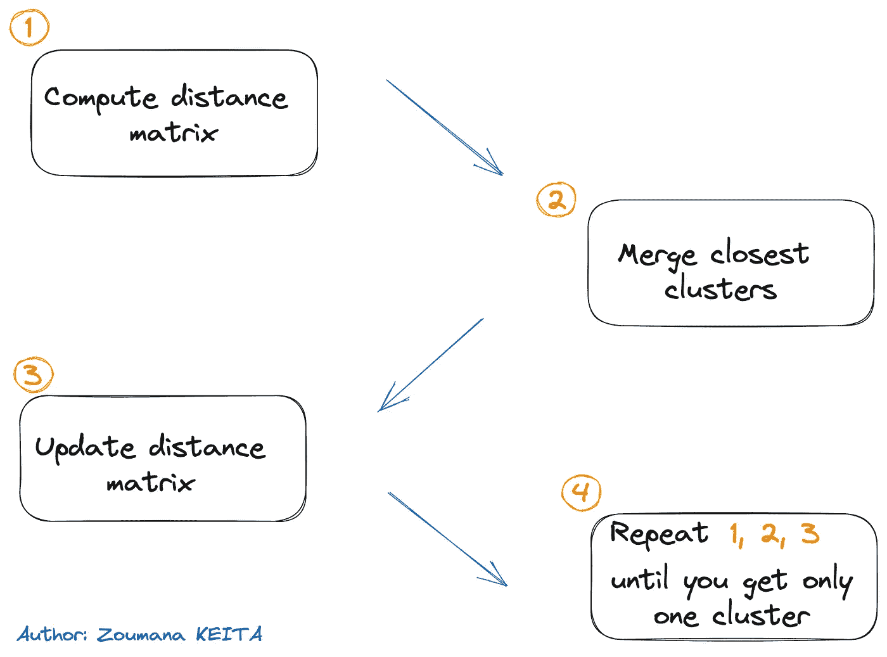

层次聚类的四个主要步骤（图片作者提供）

+   计算包含每对数据点之间距离的距离矩阵，使用如欧几里得距离、曼哈顿距离或余弦相似度等特定距离度量

+   合并两个距离最近的簇

+   更新距离矩阵以考虑新簇。

+   重复步骤 1、2 和 3，直到所有簇都合并在一起形成一个单一的簇。

## 层次聚类的一些图形示例

在深入技术实现之前，让我们了解两种主要的层次聚类方法：`agglomerative` 和 `divisive` 聚类。

**#1\. 聚合聚类**

聚合聚类也称为自下而上的方法，它开始时将每个数据点视为一个独立的簇。然后，它反复合并这些簇，直到只剩下一个。

让我们考虑下面的示意图，其中：

+   我们开始时将每个动物视为一个独立的簇。

+   然后根据动物列表，根据它们的相似性形成三个不同的簇：鹰和孔雀被分类为 `Birds`，狮子和熊为 `Mammals`，蝎子和蜘蛛为 `3+ legs`。

+   我们继续合并过程，通过将两个最相似的簇：`Birds` 和 `Mammals` 合并来创建 `Vertebrate` 簇。

+   最后，将剩下的两个簇 `Vertebrate` 和 `3+ legs` 合并成一个单一的 `Animals` 簇。

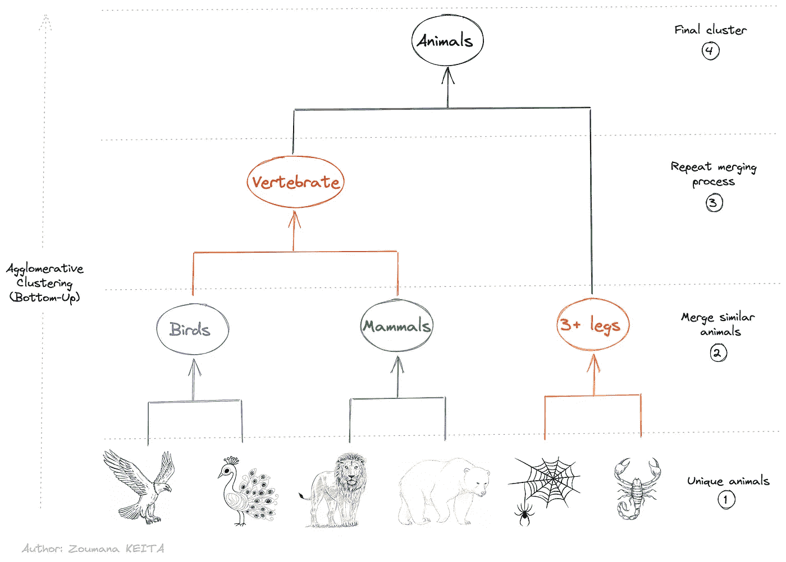

聚合聚类的示意图（图片由作者提供）

**#2\. 划分聚类**

另一方面，划分式聚类是自上而下的。它从将所有数据点视为一个统一的簇开始，然后逐渐将其拆分，直到每个数据点成为一个独立的簇。

通过观察划分方法的图形：

+   我们注意到整个 `Animal` 数据集被视为一个统一的块。

+   然后，这个块被拆分成两个不同的簇：`Vertebrate` 和 `3+ legs`

+   划分过程会反复应用于先前创建的簇，直到每个动物被区分为其自身的独特簇。

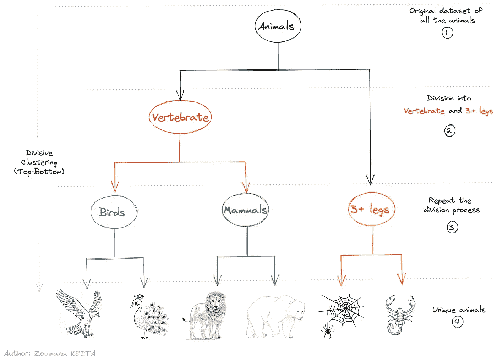

划分聚类的示意图（图片由作者提供）

## 选择正确的距离度量

选择合适的距离度量是聚类中的关键步骤，这取决于具体的问题。

例如，一组学生可以根据他们的原籍国、性别或先前的学术背景进行聚类。虽然这些标准都是有效的聚类依据，但它们传达了独特的意义。

欧几里得距离是许多聚类软件中最常用的度量。然而，还存在其他距离度量，如曼哈顿距离、堪培拉距离、皮尔逊相关性和闵可夫斯基距离。

## 如何在合并簇之前测量它们

聚类可能被认为是将数据分组的简单过程。但它不仅仅是这样。

在合并簇之前，有三种主要的标准方法来测量最近的一对簇：`(1) 单链聚类`，`(2) 完全链聚类` 和 `(3) 平均链聚类`。让我们更详细地探讨每一种。

**#1\. 单链聚类**

在单链接聚类中，两个给定簇 `**C1**` 和 `**C2**` 之间的距离对应于两个簇中所有项对之间的最小距离。

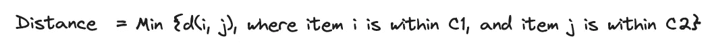

单链接的距离公式（图像来源：作者）

在两个簇中的所有项对中，`**b**` 和 `**k**` 具有最小距离。

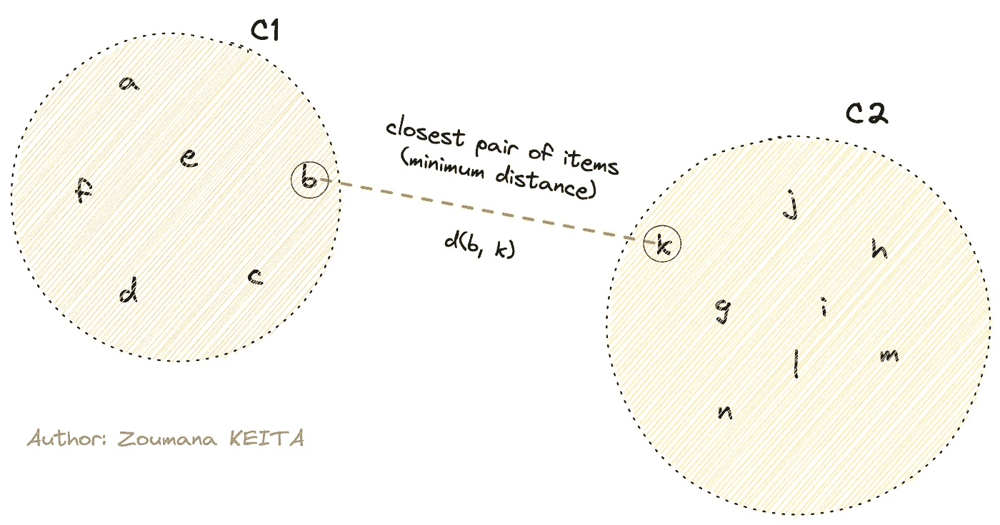

*单链接示意图（图像来源：作者）*

**#2\. 完整链接**

对于完整链接聚类，两个给定簇 `**C1**` 和 `**C2**` 之间的距离是两个簇中所有项对之间的最大距离。

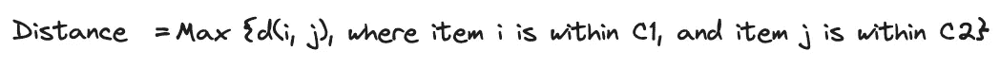

单链接的距离公式（图像来源：作者）

在两个簇中的所有项对中，用绿色突出显示的项（`**f**` 和 `**m**`）具有最大距离。

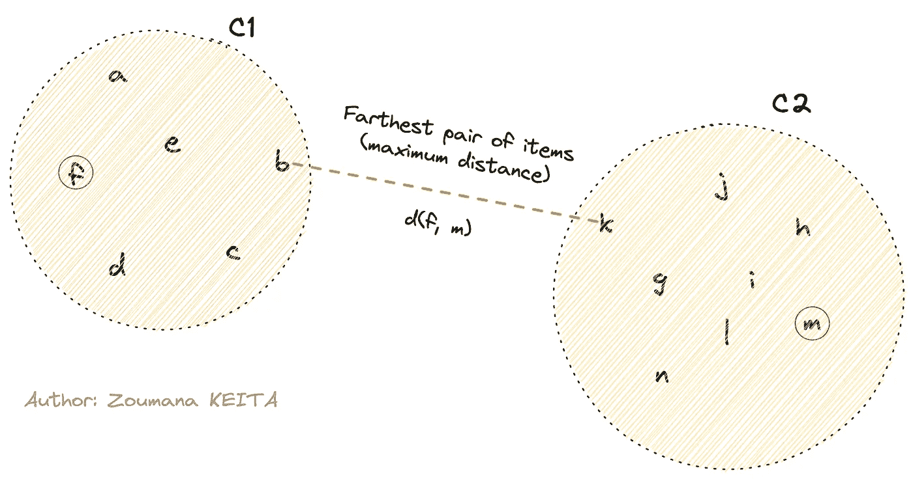

*完整链接示意图（图像来源：作者）*

**#3\. 平均链接**

在平均链接聚类中，两个给定簇 `**C1**` 和 `**C2**` 之间的距离是通过计算两个簇中每对项之间所有距离的平均值来得到的。

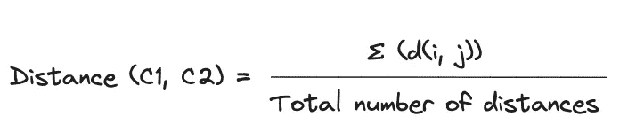

平均链接的距离公式（图像来源：作者）

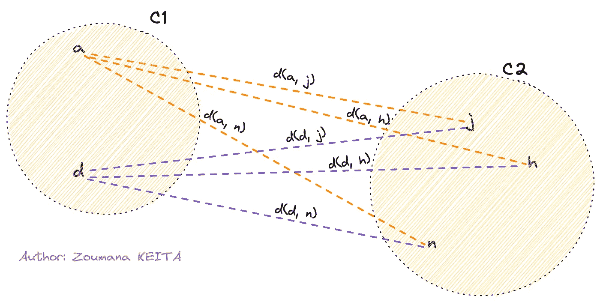

*平均链接示意图（图像来源：作者）*

从上述公式可以计算出平均距离如下：

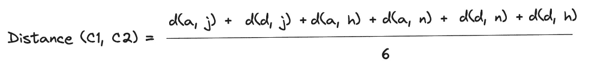

平均链接的距离计算（图像来源：作者）

# 在 Python 中实现层次聚类

现在你已经理解了层次聚类的工作原理，让我们深入探讨使用 `Python` 的技术实现。

我们首先配置环境，了解数据及相关预处理任务，最后应用聚类。

## 配置环境

`[Python](https://www.python.org/downloads/)` 是必需的，并且需要与以下库一起安装：

+   `Pandas` 用于加载数据框

+   `Scikit-learn` 用于数据归一化

+   `Seaborn 和 Matplotlib` 用于数据可视化

+   `Scipy` 用于应用聚类

所有这些库都通过以下 `pip` 命令从你的笔记本中安装：

```py
%%bash
pip install scikit-learn
pip install pandas
pip install matplotlib seaborn
pip install scipy
```

我们使用 `%%bash` 语句来代替逐个安装每个库的 `!pip [library]`，使得笔记本单元被视为 shell 命令，从而忽略 `!`，便于安装。

## 理解数据

我们使用了葡萄牙银行机构的银行营销活动（电话）的数据子集。

该数据集来自 [UCI](https://archive.ics.uci.edu/dataset/222/bank+marketing)，并且根据 [知识共享署名 4.0 国际](https://creativecommons.org/licenses/by/4.0/legalcode)（CC BY 4.0）许可证进行授权。

由于本教程的无监督性质，我们去掉了目标列 `y`，该列指定客户是否订阅了定期存款。

使用 `head` 函数仅返回前五条记录，这不足以提供有关数据结构的足够信息。

```py
import pandas as pd

URL = "https://raw.githubusercontent.com/keitazoumana/Medium-Articles-Notebooks/main/data/bank.csv"
bank_data = pd.read_csv(URL, sep=";")
bank_data.head()
```

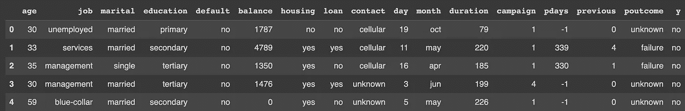

*加载数据的前五行（作者提供的图像）*

然而，如果我们使用 `info` 函数，我们可以获得有关数据集的更详细信息，例如：

+   总条目数（4,521）和列数（17）

+   每列的名称及其类型。我们可以观察到主要有两种列类型：`int64` 和 `object`

+   每列缺失值的总数

```py
bank_data.info()
```

输出：

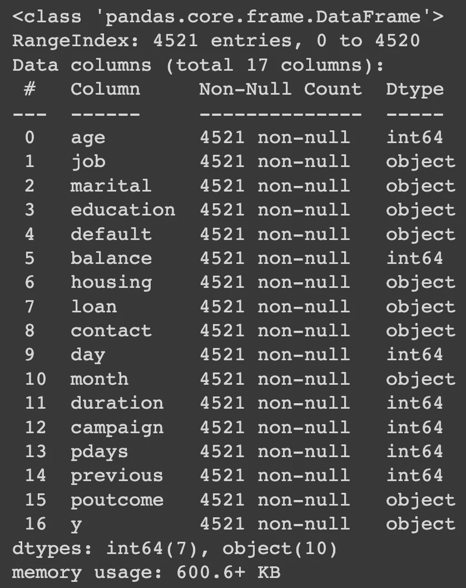

*关于数据的信息（作者提供的图像）*

## 数据预处理

数据预处理是每个数据科学任务中的主要步骤，聚类也不例外。对这些数据应用的主要任务包括：

+   填补缺失值的适当信息

+   规范化列值

+   最后，删除不相关的列

**#1\. 处理缺失值**

缺失值会严重影响分析的整体质量，可以应用多重插补技术来有效解决这些问题。

`percent_missing` 报告每一列中缺失值的百分比，幸运的是，数据中没有缺失值。

```py
percent_missing =round(100*(loan_data.isnull().sum())/len(loan_data),2)
percent_missing
```

输出：

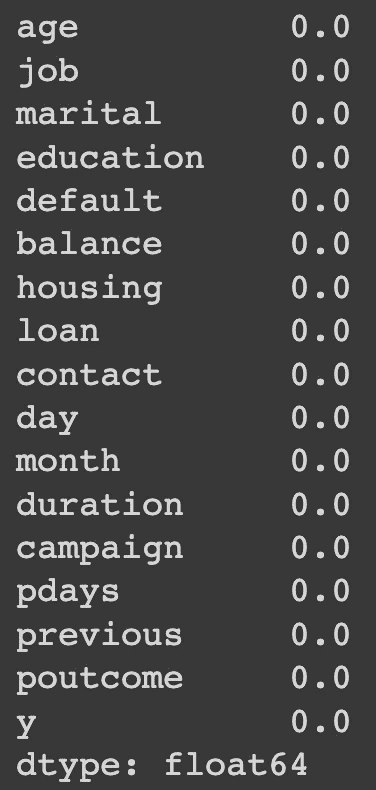

*数据中缺失值的百分比（作者提供的图像）*

**#2\. 删除不相关的列**

保留数据集中 `object` 列需要更多处理任务，如使用相关编码技术将分类数据编码为其数值表示。

为了简化分析，仅使用 `int64`（数值型）列。使用 `select_dtypes` 函数，我们选择要保留的列类型。

```py
import numpy as np 

cleaned_data = bank_data.select_dtypes(include=[np.int64])
cleaned_data.info()
```

输出：

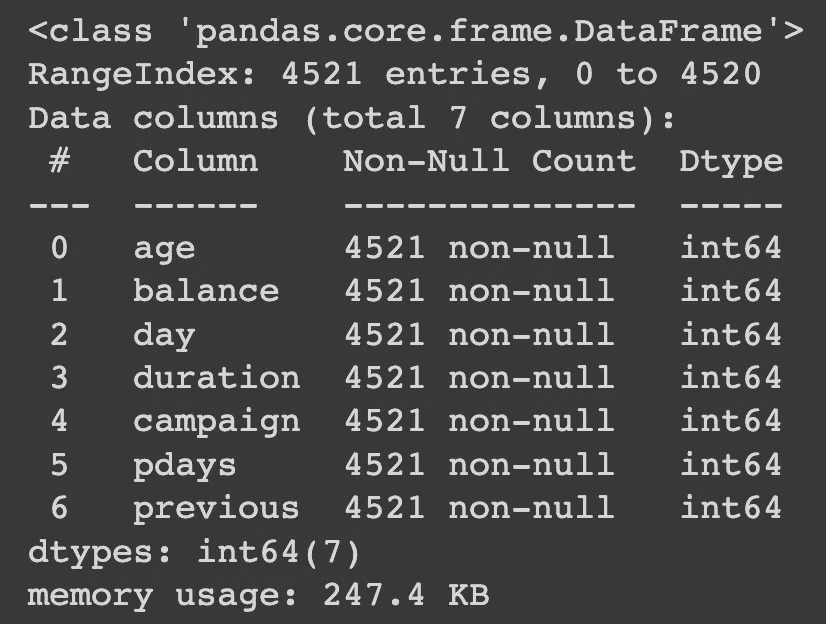

*去除不需要的列的新数据（作者提供的图像）*

**#3\. 分析离群值**

层次聚类的一个显著缺点是对离群值的敏感性，这可能会扭曲数据点或聚类之间的距离计算。

确定这些离群值的简单方法是分析数据的分布，使用 `boxplot` 如下所示的 `show_boxplot` 辅助函数，它利用了 `Seaborn` 内置的 `boxplot` 函数。

```py
import matplotlib.pyplot as plt
import seaborn as sns
```

```py
def show_boxplot(df):
  plt.rcParams['figure.figsize'] = [14,6]
  sns.boxplot(data = df, orient="v")
  plt.title("Outliers Distribution", fontsize = 16)
  plt.ylabel("Range", fontweight = 'bold')
  plt.xlabel("Attributes", fontweight = 'bold')

show_boxplot(cleaned_data)
```

输出：

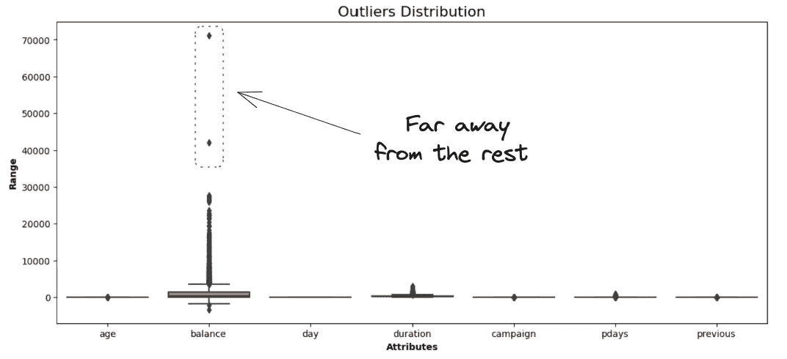

*数据中所有变量的箱形图（作者提供的图像）*

`balance` 属性代表客户的年平均余额，是唯一一个与其他数据点相差较远的。

通过使用四分位数范围方法，我们可以删除所有超出四分位数定义范围 `+/-1.5*IQR` 的点，其中 `IQR` 是 `四分位数范围`。

整体逻辑在 `remove_outliers` 辅助函数中实现。

```py
def remove_outliers(data):

  df = data.copy()

  for col in list(df.columns):

        Q1 = df[str(col)].quantile(0.05)
        Q3 = df[str(col)].quantile(0.95)
        IQR = Q3 - Q1
        lower_bound = Q1 - 1.5*IQR
        upper_bound = Q3 + 1.5*IQR

        df = df[(df[str(col)] >= lower_bound) & (df[str(col)] <= upper_bound)]

  return df
```

然后，我们可以将该函数应用于数据集，并比较新箱型图与去除异常值前的箱型图。

```py
without_outliers = remove_outliers(cleaned_data)

# Display the new boxplot
show_boxplot(without_outliers)
```

输出：

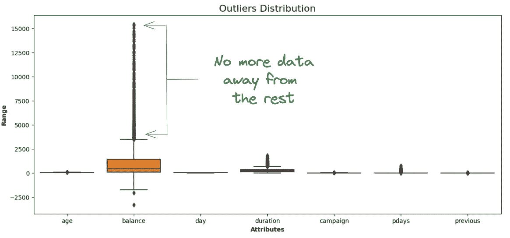

不再有数据点位于四分位数范围之外（作者提供的图片）

```py
without_outliers.shape

# (4393, 7)
```

我们最终得到了一个 4,393 行和 7 列的数据集，这意味着从数据中剔除的剩余 127 个观测值是异常值。

**#4\. 重新缩放数据**

由于层次聚类使用的欧几里得距离对不同尺度的变量敏感，因此在计算距离之前最好重新缩放所有变量。

`StandardScaler`类的`fit_transform`函数将原始数据转换，使每列具有零均值和单位标准差。

```py
from sklearn.preprocessing import StandardScaler

data_scaler = StandardScaler()

scaled_data = data_scaler.fit_transform(without_outliers)
scaled_data.shape

# (4393, 7)
```

数据的形状保持不变（4,393 行和 7 列），因为归一化不会影响数据的形状。

## 应用层次聚类算法

我们已经准备好深入探讨聚类算法的实现！

此阶段，我们可以决定采用哪种链接方法用于`linkage()`函数的`method`属性的聚类。

不仅仅关注一种方法，我们将使用欧几里得距离涵盖所有三种链接技术。

```py
from scipy.cluster.hierarchy import linkage, dendrogram

complete_clustering = linkage(scaled_data, method="complete", metric="euclidean")
average_clustering = linkage(scaled_data, method="average", metric="euclidean")
single_clustering = linkage(scaled_data, method="single", metric="euclidean")
```

计算完所有三种聚类方法后，使用`scipy.cluster`模块中的`dendogram`函数和`matplotlib`中的`pyplot`函数可视化相应的树状图。

每个树状图的组织方式如下：

+   `x 轴`代表数据中的聚类

+   `y 轴`对应样本之间的距离。线条越高，聚类之间的差异越大

+   通过在该最高垂直线处绘制一条水平线，可以获得适当的聚类数

+   与水平线的交点数量对应于聚类数

```py
dendrogram(complete_clustering)
plt.show()
```

输出：

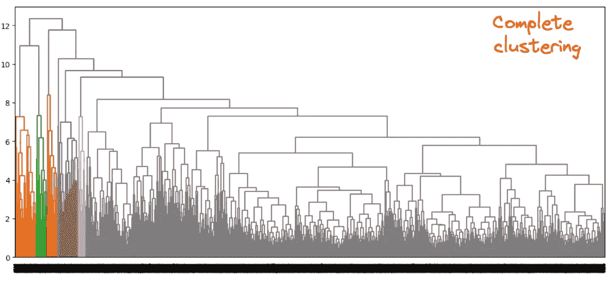

*完整聚类方法的树状图（作者提供的图片）*

```py
dendrogram(average_clustering)
plt.show()
```

输出：

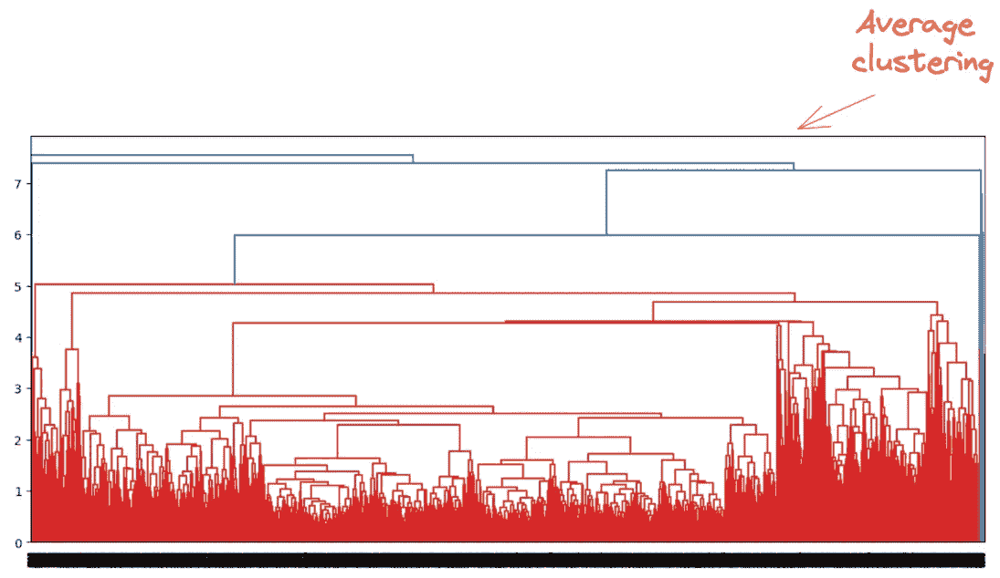

*平均聚类方法的树状图（作者提供的图片）*

当运行`单一聚类`时，我们可能会遇到`递归限制`问题。这可以通过使用`setrecursionlimit`函数并设置足够大的值来解决：

```py
import sys
sys.setrecursionlimit(1000000)
```

现在我们展示树状图：

```py
dendrogram(single_clustering)
plt.show()
```

输出：

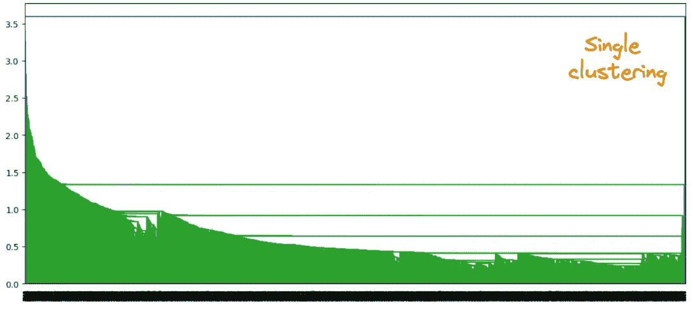

*单一聚类方法的树状图（作者提供的图片）*

## 确定树状图中的最佳聚类数

通过识别不与任何其他聚类（水平线）交叉的最高垂直线，可以获得最佳聚类数。这样的一条线在下面用红圈和绿勾标记。

+   对于完整链接法：生成的聚类数没有显著的变化

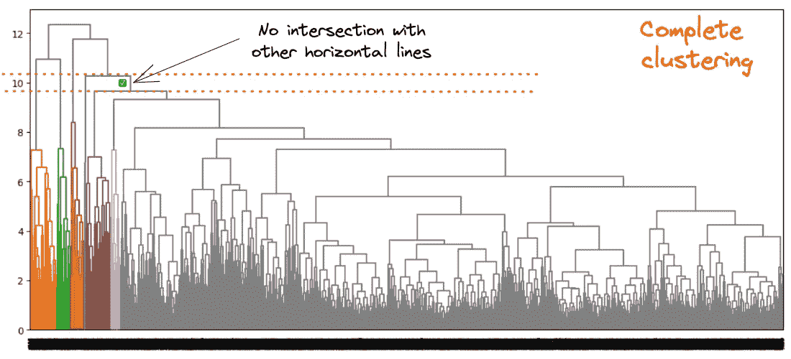

*完整链接法：从最高距离而无交集的最佳聚类数（作者提供的图片）*

+   对于平均链接法：两条水平橙线之间的差距稍微多于一个。因此，我们可以考虑两个簇。

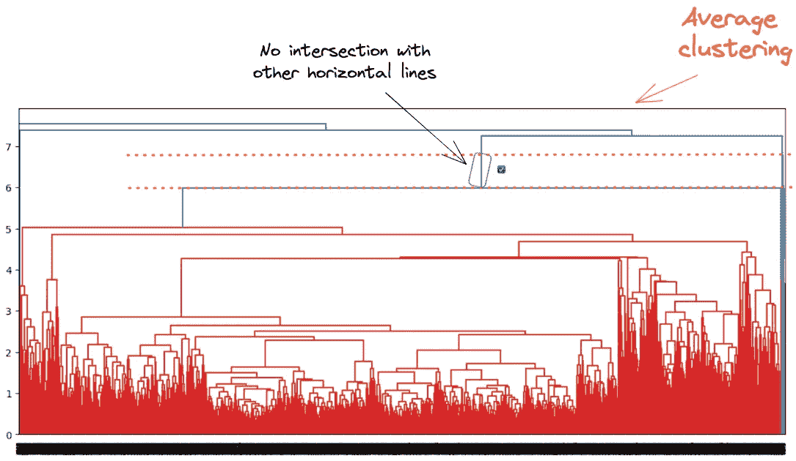

*平均链接法：从没有交集的最大距离得到的最佳聚类数（作者提供的图像）*

+   对于单链接法：无法确定明确的簇数

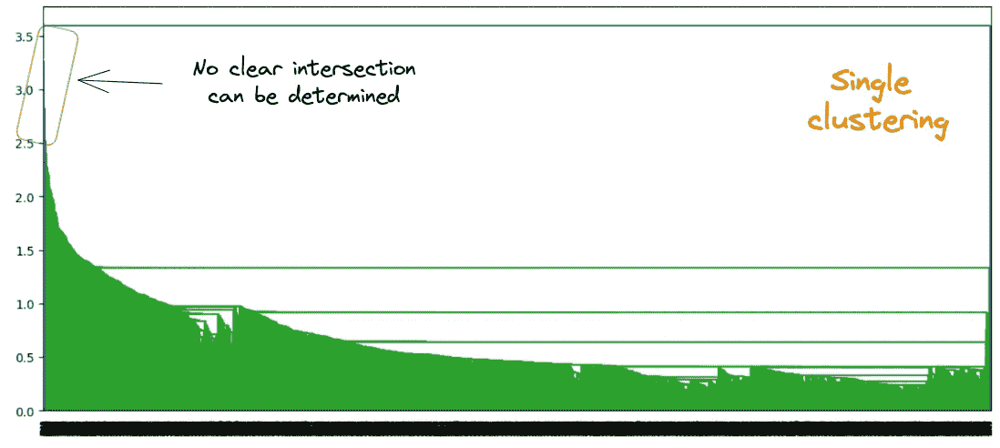

*单链接法：从没有交集的最大距离得到的最佳聚类数（作者提供的图像）*

根据上述分析，平均链接法似乎比单链接法和完全链接法提供了最佳的聚类数，因为后两者没有提供清晰的聚类数理解。

现在我们已经找到了最佳的簇数，让我们使用`cut_tree`函数在客户的平均年余额的背景下解释这些簇。

```py
cluster_labels = cut_tree(average_clustering, n_clusters=2).reshape(-1, )
without_outliers["Cluster"] = cluster_labels

sns.boxplot(x='Cluster', y='balance', data=without_outliers)
```


两种借款人的箱线图 *(作者提供的图像)*

从上面的`boxplot`中，我们可以观察到：

+   来自簇 0 的客户拥有最高的平均年余额

+   来自簇 1 的借款人平均年余额相对较低

# 结论

祝贺你！！！🎉

我希望这篇文章提供了足够的工具，帮助你将知识提升到一个新水平。代码可以在我的 [GitHub](https://github.com/keitazoumana/Medium-Articles-Notebooks/blob/main/Hierarchical_Clustering_Bank_Marketing.ipynb) 上找到。

同时，如果你喜欢阅读我的文章并希望支持我的写作，可以考虑成为 Medium 的会员。每月仅需 5 美元，你可以无限访问数千个 Python 指南和数据科学文章。

通过使用 [我的链接](https://zoumanakeita.medium.com/membership) 注册，我将获得一小笔佣金，而你不需要支付额外费用。

[](https://zoumanakeita.medium.com/membership?source=post_page-----ef897f52d1c5--------------------------------) [## 通过我的推荐链接加入 Medium - Zoumana Keita

### 作为 Medium 的会员，你的部分会员费用将直接支持你阅读的作者，并且你可以完全访问每一个故事…

[zoumanakeita.medium.com](https://zoumanakeita.medium.com/membership?source=post_page-----ef897f52d1c5--------------------------------)

欢迎关注我的 [YouTube](https://www.youtube.com/channel/UC9xKdy8cz6ZuJU5FTNtM_pQ)频道，或在 [LinkedIn](https://www.linkedin.com/in/zoumana-keita/)上打个招呼。如果你需要更多信息，也可以进行 [1 对 1 讨论](https://topmate.io/zoumanakeita)。
