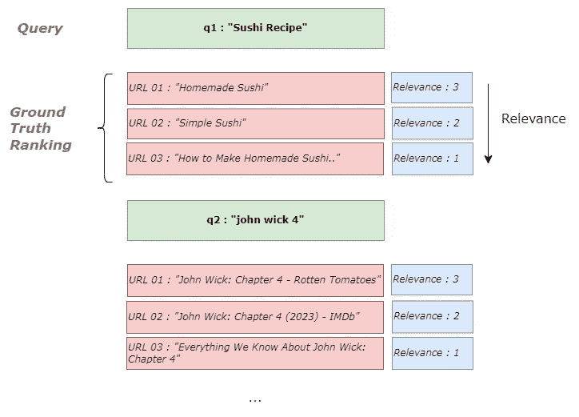
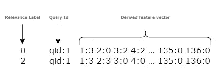
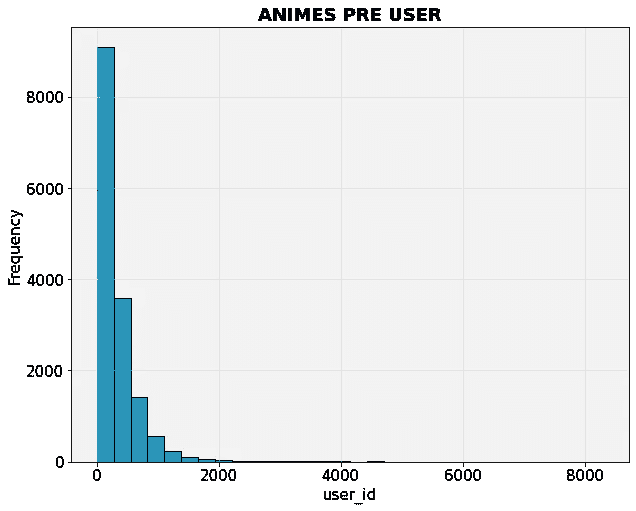
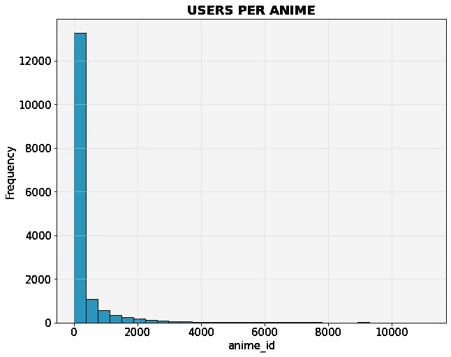
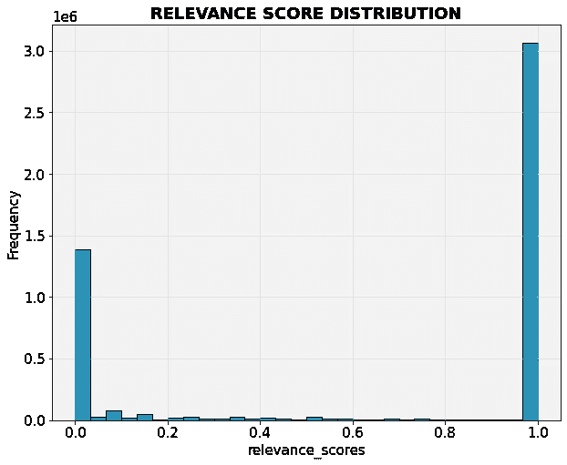
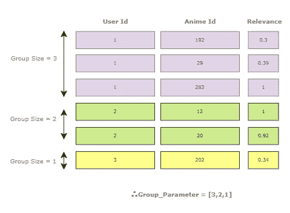
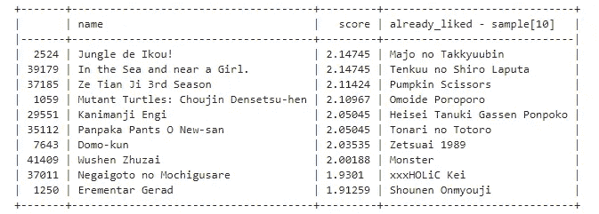
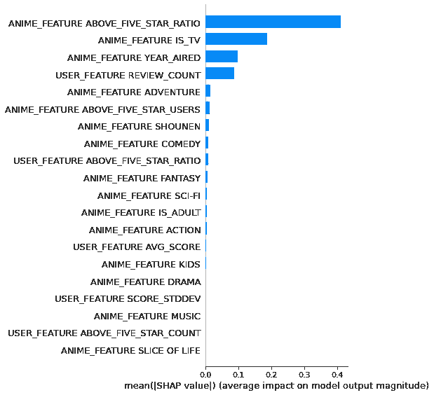
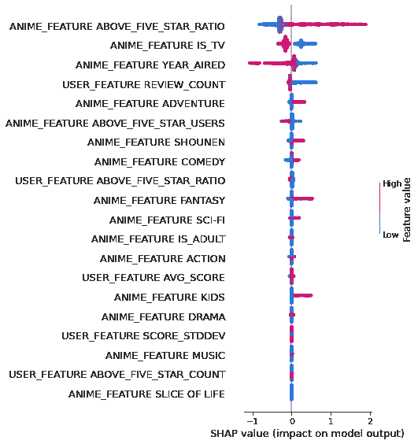

# 如何使用 Python 实现学习排序模型

> 原文：[`towardsdatascience.com/how-to-implement-learning-to-rank-model-using-python-569cd9c49b08`](https://towardsdatascience.com/how-to-implement-learning-to-rank-model-using-python-569cd9c49b08)

## 使用 Python 和 LightGBM 实现 lambdarank 算法的逐步指南

 [Ransaka Ravihara](https://ransakaravihara.medium.com/?source=post_page-----569cd9c49b08--------------------------------)

·发表于[数据科学前沿](https://towardsdatascience.com/?source=post_page-----569cd9c49b08--------------------------------) ·阅读时间 9 分钟·2023 年 1 月 18 日

--


图片来源：[安德里克·兰菲尔德](https://unsplash.com/@andriklangfield?utm_source=medium&utm_medium=referral) 在[Unsplash](https://unsplash.com/?utm_source=medium&utm_medium=referral)

在我之前的两篇文章中，我讨论了学习排序模型的基本概念以及评估 LTR 模型的广泛使用的评估指标。你可以通过下面列出的链接访问这些文章。

## 什么是学习排序：学习排序方法的初学者指南 

### 关于如何处理机器学习中的 LTR 问题的指南

## 如何评估学习排序模型

### 关于如何在机器学习中评估 LTR 模型的实用指南

如何评估学习排序模型

在本文中，我们将构建一个用于动漫推荐的 lambdarank 算法。LambdaRank 最初由一个研究小组在微软介绍，现在它已经在微软的 LightGBM 库中提供，并配有易于使用的 sklearn 包装器。让我们开始吧。

## 从搜索引擎到产品推荐

如上所述，排名在搜索引擎中被广泛使用。但它不仅限于搜索引擎；我们可以采用这一概念，并在适用时构建解决方案。假设我们想为搜索引擎开发一个排名模型，我们应该从一个包含查询、其相关文档（URLs）以及每个查询文档对的相关性评分的数据集开始，如下所示。



图片来源：作者

最后，我们可以基于每个查询和文档对推导特征。



图片来源：作者

这是著名的学习排名研究论文和数据集的数据集格式。好吧，这些是关于搜索引擎的内容。让我们讨论一下如何将这些概念适用于传统的产品推荐任务。有多种方法可以向用户推荐产品。你可以在用户购买物品时展示推荐，或在用户浏览页面时展示推荐等。但为了简单起见，我们将其缩小到一个具体场景。

本文将建立一个用于用户主页定制的动漫推荐模型。当用户登录账户时，我们需要根据排名模型预测的相关性评分来展示动漫。这里我将使用 Anime Recommendation LTR Dataset，它在公共许可下提供。你可以通过[这个 kaggle 链接](https://www.kaggle.com/datasets/ransakaravihara/anime-recommendation-ltr-dataset)访问它。

让我们读取数据集并快速检查其列。

```py
import zipfile
import pandas as pd

zipped_data = zipfile.ZipFile("anime-recommendation-ltr-dataset.zip")

anime_info_df = pd.read_csv(zipped_data.open('anime_info.csv'))
relavence_scores = pd.read_csv(zipped_data.open('relavence_scores.csv'))
user_info = pd.read_csv(zipped_data.open('user_info.csv'))

anime_info_df.columns.tolist()

# ['anime_id',
#  'Genres',
#  'is_tv',
#  'year_aired',
#  'is_adult',
#  'above_five_star_users',
#  'above_five_star_ratings',
#  'above_five_star_ratio']

user_info.columns.tolist()

# ['user_id',
#  'review_count',
#  'avg_score',
#  'score_stddev',
#  'above_five_star_count',
#  'above_five_star_ratio']

relevance_scores.columns.tolist()
#['anime_id', 'anime_name', 'user_id', 'relevance_score']
```

好的，让我解释一下我将在这里使用的方法。与搜索引擎数据不同，在这个用例中我们没有查询和文档对。因此，我们将用户视为查询，将他们感兴趣的动漫视为文档。一个搜索查询可以与多个文档关联；用户可以与许多动漫互动。你明白了，对吧 :)

我们在这里预测的目标标签是*relevance_score*，存储在*relevance_scores*数据集中。当我们建立排名模型时，它将学习一个函数，将这些动漫按最优顺序排序，使每个用户的相关性最高的动漫排在最前面。

接下来，我们需要通过合并上述三个数据集来创建一个新数据集。我还会基于动漫和用户特征创建新的特征。让我们开始创建数据集。

```py
from sklearn.preprocessing import MultiLabelBinarizer

popular_genres = ['Comedy',
 'Action',
 'Fantasy',
 'Adventure',
 'Kids',
 'Drama',
 'Sci-Fi',
 'Music',
 'Shounen',
 'Slice of Life']

def create_genre_flags(df, popular_genres):
    df = df.dropna(subset=['Genres'])
    df['Genres'] = df['Genres'].apply(lambda x:",".join(s.strip() for s in x.split(",")))
    # use MultiLabelBinarizer to create a one-hot encoded dataframe of the genres
    mlb = MultiLabelBinarizer()
    genre_df = pd.DataFrame(mlb.fit_transform(df['Genres'].str.split(',')),
                            columns=mlb.classes_,
                            index=df.index)
    # create a new dataframe with the movie id and genre columns
    new_df = pd.concat([df['anime_id'], genre_df[popular_genres]], axis=1)
    new_df.columns = ['anime_id'] + popular_genres
    return new_df

anime_genre_info_df = create_genre_flags(anime_info_df,popular_genres)
anime_info_df_final = anime_info_df.merge(anime_genre_info_df,on='anime_id')
anime_info_df_final.columns = [col if col=='anime_id' else f"ANIME_FEATURE {col}".upper() for col in anime_info_df_final.columns]
user_info.columns = [col if col=='user_id' else f"USER_FEATURE {col}".upper() for col in user_info.columns]

train_interim = relavence_scores.merge(anime_info_df_final)
train = train_interim.merge(user_info,how='inner')
```

让我们快速查看一下数据集的一些统计信息。数据集中总共有 4.8 百万条用户-动漫互动记录，15K 用户，和 16K 动漫。

这是用户和动漫互动分布情况。



图片来源：作者

下图显示了相关性评分的分布情况。



图片来源：作者

现在我们已经创建了用于模型训练的数据集。但学习排名模型的一个主要困惑点是*group*参数。因为*group*对我们来说是一个陌生的参数，因为它在其他机器学习算法中并不常见。*group*参数的思想是对每个查询和文档对的 数据集进行分区。它使模型能够学习每个组内不同特征的相对重要性，从而提高模型的整体性能。拥有十对用户-动漫意味着我们在 LTR 模型中有十个组。每个组的大小可以不同。但组的总和应该是我们拥有的样本数量。简单来说，我们必须使用*group*参数提供组边界。然后模型可以单独识别每个用户-动漫实例。

例如，如果你有一个包含 6 部动漫的数据集，`group = [3, 2, 1]`，这意味着你有三个组，其中前三条记录在第一个组中，记录 4–5 在第二个组中，记录 6 在第三个组中。



作者提供的图片

**因此，在创建组参数之前，按 *user_id(query_id)* 排序数据集是至关重要的。**

```py
na_counts = (train.isna().sum() * 100/len(train))
train_processed = train.drop(na_counts[na_counts > 50].index,axis=1)
train_processed.sort_values(by='user_id',inplace=True)
train_processed.set_index("user_id",inplace=True)

features = ['ANIME_FEATURE IS_TV',
       'ANIME_FEATURE YEAR_AIRED', 'ANIME_FEATURE IS_ADULT',
       'ANIME_FEATURE ABOVE_FIVE_STAR_USERS',
       'ANIME_FEATURE ABOVE_FIVE_STAR_RATINGS',
       'ANIME_FEATURE ABOVE_FIVE_STAR_RATIO', 'ANIME_FEATURE COMEDY',
       'ANIME_FEATURE ACTION', 'ANIME_FEATURE FANTASY',
       'ANIME_FEATURE ADVENTURE', 'ANIME_FEATURE KIDS', 'ANIME_FEATURE DRAMA',
       'ANIME_FEATURE SCI-FI', 'ANIME_FEATURE MUSIC', 'ANIME_FEATURE SHOUNEN',
       'ANIME_FEATURE SLICE OF LIFE', 'USER_FEATURE REVIEW_COUNT',
       'USER_FEATURE AVG_SCORE', 'USER_FEATURE SCORE_STDDEV',
       'USER_FEATURE ABOVE_FIVE_STAR_COUNT',
       'USER_FEATURE ABOVE_FIVE_STAR_RATIO']
target = 'relavence_score'

test_size = int(1e5)
X,y = train_processed[features],train_processed[target].apply(lambda x:int(x * 10))
test_idx_start = len(X)-test_size

xtrain,xtest,ytrain,ytest = X.iloc[0:test_idx_start],X.iloc[test_idx_start:],y.iloc[0:test_idx_start],y.iloc[test_idx_start:]
```

在上述代码片段中，我执行了以下步骤，

1.  丢弃了所有空值超过 50% 的列。

1.  根据 *user_id* 排序的数据集。否则，*group* 参数将在各处产生不一致的组。

1.  排序数据集后，我将最后 100,000 行声明为验证数据，其余的作为训练数据。

1.  由于 LightGBM 模型期望目标值为整数，我已将目标值缩放到 1–10 之间并转换为整数。 （如果你愿意，可以根据阈值尝试将其转换为 0 或 1。）

让我们定义组参数，并迅速拟合模型，如下所示。

```py
get_group_size = lambda df: df.reset_index().groupby("user_id")['user_id'].count()

train_groups = get_group_size(xtrain)
test_groups = get_group_size(xtest)

print(sum(train_groups) , sum(test_groups))
#(4764372, 100000)

model = LGBMRanker(objective="lambdarank")
model.fit(xtrain,ytrain,group=train_groups,eval_set=[(xtest,ytest)],eval_group=[test_groups],eval_metric=['ndcg'])

#....
# [97] valid_0's ndcg@1: 0.900624 valid_0's ndcg@2: 0.900015 valid_0's ndcg@3: 0.892648 valid_0's ndcg@4: 0.891373 valid_0's ndcg@5: 0.886585
# [98] valid_0's ndcg@1: 0.900624 valid_0's ndcg@2: 0.900015 valid_0's ndcg@3: 0.892648 valid_0's ndcg@4: 0.891895 valid_0's ndcg@5: 0.886632
# [99] valid_0's ndcg@1: 0.900624 valid_0's ndcg@2: 0.901216 valid_0's ndcg@3: 0.892839 valid_0's ndcg@4: 0.892053 valid_0's ndcg@5: 0.88677
# [100] valid_0's ndcg@1: 0.900624 valid_0's ndcg@2: 0.901216 valid_0's ndcg@3: 0.892839 valid_0's ndcg@4: 0.892053 valid_0's ndcg@5: 0.886363
```

好了，我们完成了训练。现在是对特定客户进行预测的时候了。

这里还有一个关键点需要注意。即模型预测是如何计算的。我感到困惑，因为调用 `.predict` 方法时，它不需要额外的参数，例如*group*。所以我从 GitHub 问题中找到了以下信息。根据 LightGBM 的创建者在 [这个问题](https://github.com/microsoft/LightGBM/issues/3326)中提到的，LightGBM 的 lambdarank 使用逐点方法生成预测。这意味着我们不需要提供额外的参数，如*group*。我们可以使用正确的特征向量调用 `.predict()` 方法。

然而，由于我们正在开发 LTR 模型，必须有一些候选产品，并根据预测的相关性评分对其进行排序。为了生成候选动漫，我将在这里使用一种简单的方法。即，选择未向给定用户展示的动漫。从未展示的动漫中选择一个 N 的随机子集。基于用户和选择的 N 部动漫子集生成特征。最后，使用生成的特征向量获取相关性评分，并根据相关性评分对动漫进行排序。但在实际应用中，我们应该使用一些有意义的方法。例如，你可以如下生成候选项，

+   选择用户最喜欢的*N*个类别。

+   对于上面选择的每个类别，选择评分最高的*m*部动漫。现在你有*M* N*部动漫需要为该用户排序。只需创建用户基础和动漫基础特征。最后，使用创建的特征向量调用`.predict()`方法。

```py
user_2_anime_df = relavence_scores.groupby("user_id").agg({"anime_id":lambda x:list(set(x))})
user_2_anime_map = dict(zip(user_2_anime_df.index,user_2_anime_df['anime_id']))

#create candidate pool, this will be a all the animes in the database
candidate_pool = anime_info_df_final['anime_id'].unique().tolist()

#anime_id to it's name mapping
anime_id_2_name = relavence_scores.drop_duplicates(subset=["anime_id","Name"])[['anime_id',"Name"]]
anime_id_2_name_map = dict(zip(anime_id_2_name['anime_id'],anime_id_2_name['Name']))

def candidate_generation(user_id:int,candidate_pool:list,user_2_anime_map:dict,N:int):
    """
    Note: this a totally random generation, only for demo purpose
    Generates a list of N anime candidates for a given user based on their previously liked animes.

    Parameters:
        user_id (int): The user's ID.
        candidate_pool (list): A list of all possible anime candidates.
        user_2_anime_map (dict): A dictionary that maps users to their liked animes.
        N (int): The number of anime candidates to generate.

    Returns:
        already_interacted (list): List of animes which user already liked
        candidates (list): A list of N anime candidates for the user.
    """

    #get the already liked animes
    already_interacted = user_2_anime_map[user_id]

    #candidates will be rest of animes which are not exposed to user
    candidates = list(set(candidate_pool) - set(already_interacted))

    return already_interacted,np.random.choice(candidates,size=N)

def generate_predictions(user_id,user_2_anime_map,candidate_pool,feature_columns,anime_id_2_name_map,ranker,N=100):
    """
    Generates predictions for anime recommendations for a given user.

    Parameters:
        user_id (int): The user's ID.
        user_2_anime_map (dict): A dictionary that maps users to their liked animes.
        candidate_pool (list): A list of all possible anime candidates.
        feature_columns (list): A list of feature columns to use for generating predictions.
        anime_id_2_name_map (dict): A dictionary that maps anime IDs to their names.
        ranker (object): A trained model object that is used to generate predictions.
        N (int): The number of anime predictions to generate.

    Returns:
        predictions (DataFrame): A dataframe containing the top N anime recommendations for the user.
    """
    already_liked,candidates = candidate_generation(user_id,candidate_pool,user_2_anime_map,N=10000)

    #Create dataframe for candidates
    candidates_df = pd.DataFrame(data=pd.Series(candidates,name='anime_id'))

    # Merge with feature dataframe
    features = anime_info_df_final.merge(candidates_df)

    #Add user id as a feature
    features['user_id'] = user_id

    # Merge with user information
    features = features.merge(user_info)

    # If number of already liked animes is less than number of candidates
    # Extend the already liked list with -1
    already_liked = list(already_liked)
    if len(already_liked) < len(candidates):
        append_list = np.full(fill_value=-1,shape=(len(candidates)-len(already_liked)))
        already_liked.extend(list(append_list))

    #Create dataframe for predictions
    predictions = pd.DataFrame(index=candidates)
    #Add anime names
    predictions['name'] = np.array([anime_id_2_name_map.get(id_) for id_ in candidates])
    #Generate predictions
    predictions['score'] = ranker.predict(features[feature_columns])
    predictions = predictions.sort_values(by='score',ascending=False).head(N)

    predictions[f'already_liked - sample[{N}]'] = [anime_id_2_name_map.get(id_) for id_ in already_liked[0:len(predictions)]]
    return predictions

#let's generate the predictions 
generate_predictions(123,user_2_anime_map,candidate_pool,feature_columns=features,anime_id_2_name_map=anime_id_2_name_map,ranker=model,N=10)
```



此外，我们可以使用 shap 来解释模型的预测结果。

```py
import shap

def generate_shap_plots(ranker, X_train, feature_names, N=3):
    """
    Generates SHAP plots for a pre-trained LightGBM model.

    Parameters:
        ranker (lightgbm.Booster): A trained LightGBM model
        X_train (np.ndarray): The training data used to fit the model
        feature_names (List): list of feature names
        N (int): The number of plots to generate

    Returns:
        None
    """
    explainer = shap.Explainer(ranker, X_train, feature_names=feature_names)
    shap_values = explainer(X_train.iloc[:N])

    # Create a figure with 2 subplots
    # fig, (ax1, ax2) = plt.subplots(1, 2, figsize=(15,5))

    # Plot the summary plot on the first subplot
    plt.subplot(1, 2, 1)
    shap.summary_plot(shap_values, feature_names=feature_names, plot_type='bar')

    # Plot the feature importance plot on the second subplot
    plt.subplot(1, 2, 2)
    shap.summary_plot(shap_values, feature_names=feature_names, plot_type='dot')

    plt.show()

generate_shap_plots(model,xtrain,features,N=10000)
```



作者提供的图片

## 结论

本文旨在为读者的特定用例提供一个良好的起点。因为当我开始为我的项目构建 LTR 模型时，没有好的初学者指南。然而，对于某些用例，训练 LTR 模型可能不是必要的。你可以使用简单的方法，如回归、多分类/标签分类或聚类。所以不要过度设计你的解决方案；明智地选择工具吧 ; )

感谢阅读！本文的笔记本可以在我的[GitHub repo](https://github.com/Ransaka/LTR-with-LIghtGBM)中找到。

参考文献：

+   [LightGBM 文档](https://lightgbm.readthedocs.io/en/latest/pythonapi/lightgbm.LGBMRanker.html#lightgbm.LGBMRanker)

+   [微软学习排序数据集](https://www.microsoft.com/en-us/research/project/mslr/)
