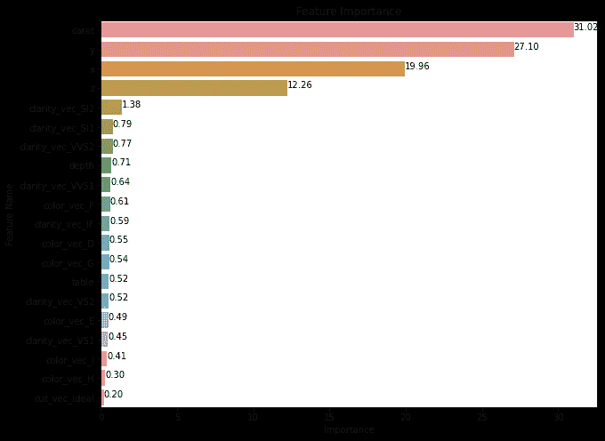

# 如何在 PySpark 中实现随机森林回归

> 原文：[`towardsdatascience.com/how-to-implement-random-forest-regression-in-pyspark-9582f4964285`](https://towardsdatascience.com/how-to-implement-random-forest-regression-in-pyspark-9582f4964285)

## 一个关于随机森林回归的 PySpark 教程

[](https://medium.com/@yazihejazi?source=post_page-----9582f4964285--------------------------------)[](https://towardsdatascience.com/?source=post_page-----9582f4964285--------------------------------) [Yasmine Hejazi](https://medium.com/@yazihejazi?source=post_page-----9582f4964285--------------------------------)

·发表于 [Towards Data Science](https://towardsdatascience.com/?source=post_page-----9582f4964285--------------------------------) ·6 分钟阅读·2023 年 9 月 25 日

--


图片来源：[Jachan DeVol](https://unsplash.com/@jachan_devol?utm_source=medium&utm_medium=referral) 在 [Unsplash](https://unsplash.com/?utm_source=medium&utm_medium=referral)

# 介绍

PySpark 是一个强大的数据处理引擎，建立在 Apache Spark 之上，旨在进行大规模数据处理。它提供了可扩展性、速度、多功能性、与其他工具的集成、易用性、内置的机器学习库以及实时处理能力。它是高效有效地处理大规模数据处理任务的理想选择，其用户友好的界面允许用 Python 轻松编写代码。

使用在 ggplot2 上找到的 [Diamonds 数据](https://ggplot2.tidyverse.org/reference/diamonds.html)（[来源](https://plotly.com/ggplot2/)，[许可证](https://ggplot2.tidyverse.org/LICENSE.html)），我们将演示如何在 PySpark 中实现随机森林回归模型并分析结果。如果你想查看线性回归如何应用于同一数据集，请 点击这里!

本教程将涵盖以下步骤：

1.  将数据加载并准备为向量化输入

1.  使用 MLlib 中的 RandomForestRegressor 训练模型

1.  使用 MLlib 中的 RegressionEvaluator 评估模型性能

1.  绘制并分析特征重要性以提高模型透明度


图片来源：[Martin de Arriba](https://unsplash.com/@martindearriba?utm_source=medium&utm_medium=referral) 在 [Unsplash](https://unsplash.com/?utm_source=medium&utm_medium=referral)

# 准备数据

`diamonds`数据集包含如`carat`、`color`、`cut`、`clarity`等特征，所有特征都列在[数据集文档](https://ggplot2.tidyverse.org/reference/diamonds.html)中。

我们试图预测的目标变量是`price`。

```py
df = spark.read.csv("/databricks-datasets/Rdatasets/data-001/csv/ggplot2/diamonds.csv", header="true", inferSchema="true")
display(df)
```


就像线性回归教程一样，我们需要预处理数据，以便我们得到一个数值特征向量作为模型输入。我们需要将分类变量编码为数值特征，然后将它们与数值变量结合起来，形成一个最终向量。

达到此结果的步骤如下：

1.  将数值特征和分类特征分开。

1.  使用[StringIndexer](https://spark.apache.org/docs/latest/api/python/reference/api/pyspark.ml.feature.StringIndexer.html)预处理分类特征：这本质上是为每个类别分配一个数值（即：Fair: 0, Ideal: 1, Good: 2, Very Good: 3, Premium: 4）。

1.  使用[OneHotEncoder](https://spark.apache.org/docs/3.1.1/api/python/reference/api/pyspark.ml.feature.OneHotEncoder.html)预处理分类特征：这将类别转换为二进制向量。结果是一个稀疏向量，表示 StringIndexer 中的哪个索引具有独热值 1。

1.  将你的数值特征与新的分类编码特征组合起来。

1.  使用[VectorAssembler](https://spark.apache.org/docs/3.1.3/api/python/reference/api/pyspark.ml.feature.VectorAssembler.html)组装特征向量。

你可以使用以下代码对分类特征进行索引和独热编码。这将完成步骤 1-3。

```py
from pyspark.ml import Pipeline
from pyspark.ml.feature import StringIndexer, OneHotEncoder

cat_cols= ["cut", "color", "clarity"]
stages = [] # Stages in Pipeline

for c in cat_cols:
    stringIndexer = StringIndexer(inputCol=c, outputCol=c + "_index")
    encoder = OneHotEncoder(inputCols=[stringIndexer.getOutputCol()], \
            outputCols=[c + "_vec"])    
    stages += [stringIndexer, encoder] # Stages will be run later on
```

你可以使用以下代码来组装你的最终特征向量。这将完成步骤 4-5。然后，我们可以将这些阶段作为管道运行。这会将数据经过我们到目前为止定义的所有特征转换。

```py
from pyspark.ml.feature import VectorAssembler

# Transform all features into a vector
num_cols = ["carat", "depth", "table", "x", "y", "z"]
assemblerInputs = [c + "_vec" for c in cat_cols] + num_cols
assembler = VectorAssembler(inputCols=assemblerInputs, outputCol="features")
stages += [assembler]

# Create pipeline and use on dataset
pipeline = Pipeline(stages=stages)
df = pipeline.fit(df).transform(df)
```

# 训练模型

首先，我们需要将数据集拆分为训练集和测试集。

```py
train, test = df.randomSplit([0.90, 0.1], seed=123)
print('Train dataset count:', train.count())
print('Test dataset count:', test.count())
```

接下来，我们导入 MLlib 中的随机森林回归模型（[pyspark.ml.regression.**RandomForestRegressor**](https://spark.apache.org/docs/latest/api/python/reference/api/pyspark.ml.regression.RandomForestRegressor.html)）。需要注意的一些默认参数是：`maxDepth=5`，`numTrees=20`。你可以在交叉验证期间或手动调整这些参数，以获得适合你问题的最佳参数集。然后调用`fit()`来将模型拟合到训练数据上。在将模型拟合到训练数据后，我们可以开始预测。要对数据进行预测，请调用`transform()`。

```py
from pyspark.ml.regression import RandomForestRegressor

rf = RandomForestRegressor(featuresCol='features', labelCol='price')
rf_model = rf.fit(train)

train_predictions = rf_model.transform(train)
test_predictions = rf_model.transform(test)
```

最后，你可以使用 MLlib 的[RegressionEvaluator](https://spark.apache.org/docs/latest/api/python/reference/api/pyspark.ml.evaluation.RegressionEvaluator.html)来评估模型。根据你的使用案例，有多种评估指标可以选择：

+   RMSE — 均方根误差（默认）

+   MSE — 均方误差

+   R2 — 决定系数

+   MAE — 平均绝对误差

+   Var — 解释的方差

```py
from pyspark.ml.evaluation import RegressionEvaluator

evaluator = RegressionEvaluator(predictionCol="prediction", \
                 labelCol="price", metricName="r2")

print("Train R2:", evaluator.evaluate(train_predictions))
print("Test R2:", evaluator.evaluate(test_predictions))
```

训练 R2: 0.9092 | 测试 R2: 0.9069

# 分析特征重要性

在构建随机森林时，算法尝试最小化**熵**，这是衡量不确定性的指标。熵在均匀分布中最大化（即我们不知道硬币是正面还是反面），而更多的不确定性需要更多的信息。随机森林算法使用信息增益（IG），其等于分裂前的熵减去分裂后的熵，加权实例数量。这帮助算法决定应该使用哪个特征来分裂数据。

你可能需要关注的是哪些特征在你的模型中最相关。随机森林算法内置特征重要性，可以[以不同方式计算](https://mljar.com/blog/feature-importance-in-random-forest/)。PySpark 随机森林遵循使用**基尼重要性**（或平均减少的不纯度）的 scikit-learn 实现。Scikit-learn 还提供了基于置换的特征重要性实现，但这在 PySpark 中没有内置。

如[文档](https://spark.apache.org/docs/latest/api/python/reference/api/pyspark.ml.regression.RandomForestRegressionModel.html#pyspark.ml.regression.RandomForestRegressionModel.featureImportances)中所述，特征重要性是通过以下方式计算的：

+   重要性（特征 j）= 对于在特征 j 上进行分裂的节点，增益的总和，其中增益由通过该节点的实例数量进行缩放

+   将特征重要性归一化，使其总和为 1。

我们可以使用`rf_model.featureImportances`从拟合的随机森林模型中提取特征重要性。然后，使用这些特征重要性并将其与提取的特征名称匹配，以便进行查看或绘图。这种视图对希望了解模型关键驱动因素的主要利益相关者特别重要。

```py
def extract_feature_imp(feature_imp, dataset, features_col):
    list_extract = []
    for i in dataset.schema[features_col].metadata["ml_attr"]["attrs"]:
        list_extract = list_extract + dataset.schema[features_col].metadata["ml_attr"]["attrs"][i]
    feature_list = pd.DataFrame(list_extract)
    feature_list['score'] = feature_list['idx'].apply(lambda x: feature_imp[x])
    return(feature_list.sort_values('score', ascending = False))
```

```py
import pandas as pd
```

```py
feature_list = extract_feature_imp(rf_model.featureImportances, train, "features")
top_20_features = feature_list.sort_values('score', ascending = False).head(20)# Then make your desired plot function to visualize feature importance
plot_feature_importance(top_20_features['score'], top_20_features['name'])
```



作者拍摄的照片

# 总结

在本教程中，我们介绍了使用 PySpark 实现随机森林的以下步骤。

1.  使用 StringIndexer 和 OneHotEncoder 对类别特征进行独热编码

1.  使用 VectorAssembler 创建输入特征向量列

1.  将数据拆分为训练集和测试集

1.  在训练数据上初始化并拟合 RandomForestRegressor 模型

1.  在测试数据上转换模型以进行预测

1.  使用 RegressionEvaluator 评估模型

1.  分析特征重要性以理解和改进模型

这些步骤允许我们将数据准备成向量化输入，从而可以在 PySpark 中使用 Apache Spark 的可扩展机器学习库 MLlib 实现随机森林模型。我们可以评估模型性能，并绘制和分析随机森林特征重要性，以更好地理解我们的模型。这使我们能够利用 PySpark 提供的可扩展性、速度和多功能性。
