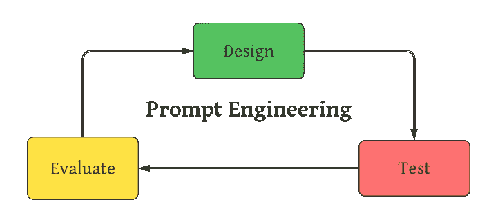

# 如何通过提示工程改进 ChatGPT 生成的代码

> 原文：[`towardsdatascience.com/how-to-improve-chatgpts-generated-code-with-prompt-engineering-cd131f9ab55d`](https://towardsdatascience.com/how-to-improve-chatgpts-generated-code-with-prompt-engineering-cd131f9ab55d)

## 提升 ChatGPT 作为编码助手表现的简单策略

[](https://medium.com/@aashishnair?source=post_page-----cd131f9ab55d--------------------------------)[](https://towardsdatascience.com/?source=post_page-----cd131f9ab55d--------------------------------) [Aashish Nair](https://medium.com/@aashishnair?source=post_page-----cd131f9ab55d--------------------------------)

·发表于 [Towards Data Science](https://towardsdatascience.com/?source=post_page-----cd131f9ab55d--------------------------------) ·阅读时间 7 分钟·2023 年 7 月 21 日

--


摄影师 cottonbro studio 提供的照片: [`www.pexels.com/photo/hands-typing-on-a-laptop-keyboard-5483077/`](https://www.pexels.com/photo/hands-typing-on-a-laptop-keyboard-5483077/)

## 介绍

虽然 ChatGPT 拥有无数功能，但有一个功能最受程序员青睐：生成代码的能力。

ChatGPT 已证明能够在几秒钟内生成有效代码。因此，它改变了程序员处理编码项目的方式，许多人通过使用聊天机器人来处理乏味或繁琐的部分，从而节省了时间和精力。

然而，ChatGPT 生成无效代码的记录并不罕见。实际上，StackOverflow 曾对 ChatGPT 和其他生成 AI 产生的内容施加了[临时禁令](https://meta.stackoverflow.com/questions/421831/temporary-policy-generative-ai-e-g-chatgpt-is-banned)，主要原因是它们的正确答案率较低。

尽管如此，这些结果往往与底层的大型语言模型（LLM）的质量关系不大，更与用户如何与聊天机器人互动有关。

一旦人们学会利用**提示工程**这一近年来备受关注的主题，他们将从聊天机器人中获得更多好处。

在这里，我们简要概述了为什么编写良好的提示对 ChatGPT 如此重要，以及数据科学家如何利用提示工程从这个聊天机器人中获得最大价值。

## 为什么提示很重要

ChatGPT 生成的代码由于各种原因被排斥，其中一些是次优的，另一些则完全与问题无关。然而，无论问题是什么，根本原因都是相同的：提示不足。

像 GPT-3.5 和 GPT-4.0 这样的模型非常强大，但它们对用户提供的提示非常敏感。由 GPT-3.5 驱动的 ChatGPT 只有在给定提供了足够上下文和适当语言的提示时才能成功操作。

幸运的是，即使你的提示返回了好的响应，你也可以通过利用**提示工程**看到更好的结果。

## 提示工程

提示工程是一种技术，涉及定制提示以获得聊天机器人期望的响应。该过程不仅涉及确定在用户提示中提供的理想上下文类型，还包括上下文应使用的理想语言和句子结构。

提示工程属于“工程”范畴，因为它是一种系统的方法来设计、测试和评估提示，通常是一个迭代的过程。



提示工程概述（由作者创建）

开发提示的过程应理想地进行文档记录。文档将帮助洞察哪些提示方面有助于高质量代码生成。此外，记录成功的提示将节省你每次需要使用 ChatGPT 解决类似问题时重复这一过程的麻烦。

## 数据科学家的提示工程

现在应该很清楚为什么提示工程在数据科学中如此相关。数据科学家在使用 ChatGPT 时可以享受生产力的激增，但只有在输入足够的提示时才行。

毕竟，在数据科学项目中，上下文至关重要。

项目中的预定义元素（例如目标、评估指标、限制/约束等）决定了在特定脚本中应使用哪些工具和技术。

如果没有一个能够充分捕捉相关要求的良好提示，聊天机器人更可能生成既无效又低效的代码。

因此，成功使用 ChatGPT 进行数据科学工作取决于数据科学家使用提示工程来设计产生令人满意代码的提示的能力。

## 案例研究

为了展示精心设计的提示的重要性，假设我们正在构建一个 XGBoost 模型，并希望创建一个执行超参数调优的 Python 脚本。训练数据既大又不平衡。

我们将测试两个不同的提示，旨在生成有助于超参数调优的代码。第一个提示提供了最基本的上下文，而第二个提示提供了一些额外的指示。

**提示 1：编写执行 XGBoost 分类器超参数调优的 Python 代码。**

这是 ChatGPT 生成的代码：

```py
import numpy as np
import pandas as pd
from xgboost import XGBClassifier
from sklearn.model_selection import GridSearchCV, train_test_split
from sklearn.metrics import accuracy_score

# Load your dataset here; X should contain the features, and y should contain the target variable

# Split the data into training and testing sets
X_train, X_test, y_train, y_test = train_test_split(X, y, test_size=0.2, random_state=42)

# Define the XGBoost classifier
xgb_model = XGBClassifier()

# Define the hyperparameters and their respective search space
param_grid = {
    'learning_rate': [0.1, 0.01, 0.001],
    'n_estimators': [100, 200, 300],
    'max_depth': [3, 5, 7],
    'min_child_weight': [1, 3, 5]
}

# Create the GridSearchCV object
grid_search = GridSearchCV(estimator=xgb_model, param_grid=param_grid, scoring='accuracy', cv=5)

# Perform hyperparameter tuning on the training data
grid_search.fit(X_train, y_train)

# Get the best hyperparameters and the corresponding model
best_params = grid_search.best_params_
best_model = grid_search.best_estimator_

# Make predictions on the test set using the best model
y_pred = best_model.predict(X_test)

# Evaluate the model performance
accuracy = accuracy_score(y_test, y_pred)
print("Best Hyperparameters:", best_params)
print("Test Accuracy:", accuracy)
```

第一个提示的输出是一个功能代码，可以对给定的 XGBoost 模型进行超参数调优。

然而，注意到提示本身在上下文中是有限的，并未指定某些因素，例如库、超参数调优方法、需要调整的超参数或评估指标。提示中的任何信息缺口都留给 ChatGPT 来填补。在这里，我们看到 ChatGPT 的代码使用了 *Scikit Learn* 模块进行 *网格搜索*，并使用 *7* 个超参数，以 *准确率* 作为评估指标。

这是一个有效的解决方案，但不适用于大规模、不平衡的数据。网格搜索是一种效率低下且耗时的技术，而在处理不平衡数据时，准确率指标极为不可靠。

总体来说，这证明了一个不足的提示会生成次优的代码。

这次，让我们在提示中添加更多的指令，看看返回什么类型的响应。

**提示 2：编写执行 XGBoost 分类器超参数调优的 Python 代码。使用 Optuna 库进行 50 次试验，以 f-1 分数作为评估指标。仅考虑以下超参数：n_estimators、learning_rate、gamma 和 max_depth。**

该提示生成了以下代码输出：

```py
import numpy as np
import pandas as pd
import optuna
import xgboost as xgb
from sklearn.model_selection import train_test_split
from sklearn.metrics import f1_score

# Define the objective function for Optuna optimization
def objective(trial):
    param = {
        'n_estimators': trial.suggest_int('n_estimators', 100, 500, step=100),
        'learning_rate': trial.suggest_float('learning_rate', 0.01, 0.1, log=True),
        'gamma': trial.suggest_float('gamma', 0.0, 1.0),
        'max_depth': trial.suggest_int('max_depth', 3, 10)
    }

    # Create an XGBoost classifier with the current hyperparameters
    xgb_model = xgb.XGBClassifier(**param)

    # Train and evaluate the classifier using cross-validation
    f1_scores = []
    for train_index, val_index in skf.split(X_train, y_train):
        X_train_fold, X_val_fold = X_train[train_index], X_train[val_index]
        y_train_fold, y_val_fold = y_train[train_index], y_train[val_index]

        xgb_model.fit(X_train_fold, y_train_fold)
        y_pred_fold = xgb_model.predict(X_val_fold)
        f1_scores.append(f1_score(y_val_fold, y_pred_fold))

    return np.mean(f1_scores)

# Load your dataset here; X should contain the features, and y should contain the target variable

# Split the data into training and testing sets
X_train, X_test, y_train, y_test = train_test_split(X, y, test_size=0.2, random_state=42)

# Create a StratifiedKFold object for cross-validation
skf = StratifiedKFold(n_splits=5, shuffle=True, random_state=42)

# Create an Optuna study and optimize the objective function
study = optuna.create_study(direction='maximize')
study.optimize(objective, n_trials=50)

# Get the best hyperparameters and the corresponding model
best_params = study.best_params
best_model = xgb.XGBClassifier(**best_params)
best_model.fit(X_train, y_train)

# Make predictions on the test set using the best model
y_pred = best_model.predict(X_test)

# Evaluate the model performance on the test set
f1_test = f1_score(y_test, y_pred)

print("Best Hyperparameters:", best_params)
print("Test F1 Score:", f1_test)
```

这个提示减少了更多的解释空间，明确了库、需要调整的超参数、试验次数和评估指标。第二个提示比第一个提示多出仅 2 句话，但却能够返回更为合适的代码！

在这里，我们看到 ChatGPT 的代码使用了 *Optuna* 模块进行 *贝叶斯搜索*，并使用 *4* 个超参数，以 *f1-score* 作为评估指标。这个解决方案比之前的方案更省时省力。

在检查代码之后，我们可以决定脚本是否符合所有标准，或是否未能满足某些要求。

如果生成的代码在某些方面有所欠缺，可以相应地修改提示并再次测试。如果生成的代码是理想解决方案，则应记录提示。这样，每当需要在不同项目中执行类似操作时，可以将该提示作为参考。

## 提示：浏览网络寻找公开可用的提示


[Campaign Creators](https://unsplash.com/@campaign_creators?utm_source=medium&utm_medium=referral) 的照片，来源于 [Unsplash](https://unsplash.com/?utm_source=medium&utm_medium=referral)

你是否不愿意花时间编写能够让 ChatGPT 生成有用的模板代码的提示？这是可以理解的。

如果是这种情况，考虑首先浏览网络寻找经过验证的提示。毕竟，如果别人已经为你完成了工作，就没有必要从头开始开发提示。

有无数的文章、社交媒体帖子和公共论坛，人们分享他们与 ChatGPT 互动的发现。

## 关键要点


图片来源：[Prateek Katyal](https://unsplash.com/@prateekkatyal?utm_source=medium&utm_medium=referral) 在 [Unsplash](https://unsplash.com/?utm_source=medium&utm_medium=referral)

随着我们在日常工作中逐渐使用像 ChatGPT 这样的聊天机器人，数据科学家的职责显然已从自己编写代码转变为与由 LLM 驱动的聊天机器人互动。

聊天机器人生成的代码质量与输入给它们的提示质量成正比，因此提示工程将逐渐成为数据科学领域的一个必备技能。因此，现在是熟悉为项目设计和开发有效提示的过程的好时机。

感谢阅读！
