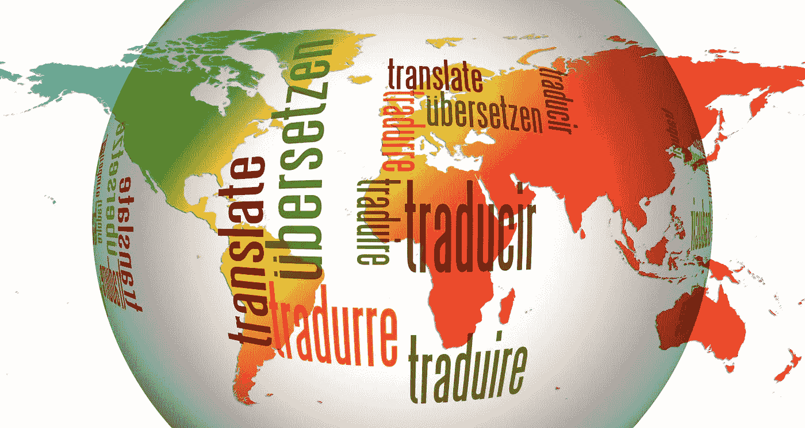

# 如何改进低资源语言的翻译

> 原文：[`towardsdatascience.com/how-to-improve-translation-for-low-resource-languages-8b19dbe7eb6b?source=collection_archive---------22-----------------------#2023-01-16`](https://towardsdatascience.com/how-to-improve-translation-for-low-resource-languages-8b19dbe7eb6b?source=collection_archive---------22-----------------------#2023-01-16)

## 非洲语言的评估案例

 [Magdalena Konkiewicz](https://medium.com/@konkiewicz.m?source=post_page-----8b19dbe7eb6b--------------------------------)

·

[关注](https://medium.com/m/signin?actionUrl=https%3A%2F%2Fmedium.com%2F_%2Fsubscribe%2Fuser%2F6ba7ed0ad871&operation=register&redirect=https%3A%2F%2Ftowardsdatascience.com%2Fhow-to-improve-translation-for-low-resource-languages-8b19dbe7eb6b&user=Magdalena+Konkiewicz&userId=6ba7ed0ad871&source=post_page-6ba7ed0ad871----8b19dbe7eb6b---------------------post_header-----------) 发表在 [Towards Data Science](https://towardsdatascience.com/?source=post_page-----8b19dbe7eb6b--------------------------------) ·7 min read·2023 年 1 月 16 日

--

图片来源于 [Gerd Altmann](https://pixabay.com/users/geralt-9301/?utm_source=link-attribution&utm_medium=referral&utm_campaign=image&utm_content=110775) 来自 [Pixabay](https://pixabay.com//?utm_source=link-attribution&utm_medium=referral&utm_campaign=image&utm_content=110775)

**引言**

近年来，机器翻译系统质量的提升使得使用这些系统的解决方案和设备能够普及到日常消费者手中。许多应用程序提供自动翻译文本、语音或图像的功能，使用户能够在不了解语言的情况下进行交流或理解语言。

然而，并非所有语言的情况都是如此。实际上，占世界语言约三分之一的非洲语言并没有同样受益于这些进展。这是因为近年来专门用于这些语言的自然语言处理和机器翻译资源较少。

最新的全球机器翻译大会（WMT2022）举办了一个特别任务，由 Meta、微软和 Toloka 的研究人员准备，以解决这一问题。该任务的结果是评估了 14 个不同机器翻译系统所生成的 24 种不同非洲语言，使用了自动评分和人工评估。

本文总结了该项目的主要成就。

**挑战**

这项研究包括了下图中展示的 24 种不同的非洲语言，以及使用的英语和法语…
