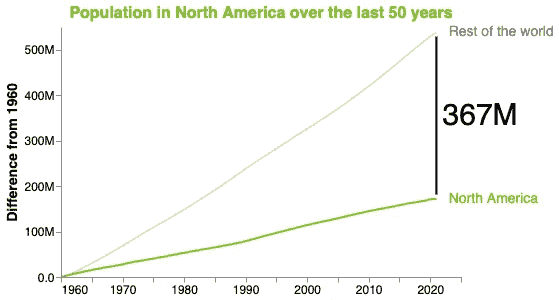
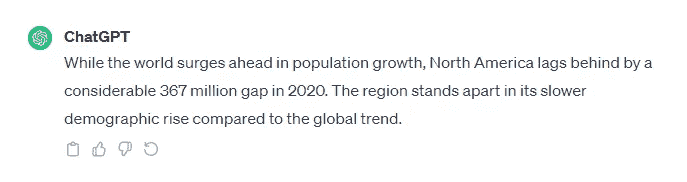
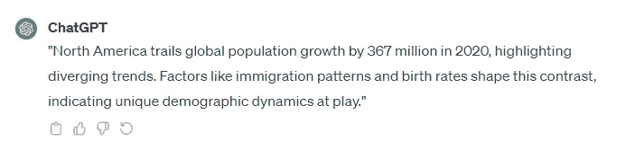
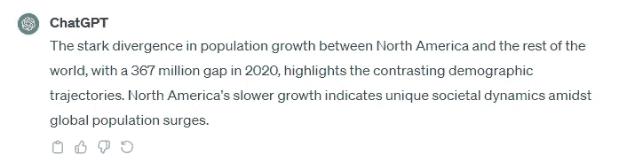
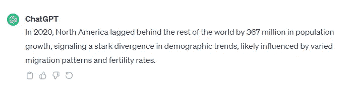
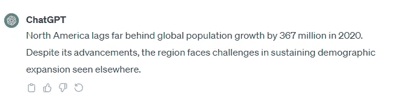
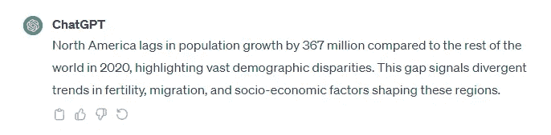
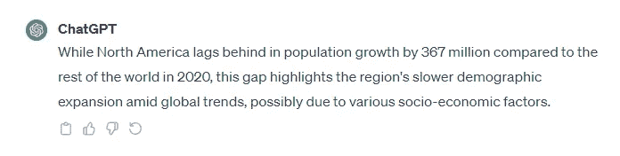

# 如何使用配置参数改进你的 ChatGPT 输出

> 原文：[`towardsdatascience.com/how-to-improve-your-chatgpt-outputs-using-configuration-parameters-0eebd575646e`](https://towardsdatascience.com/how-to-improve-your-chatgpt-outputs-using-configuration-parameters-0eebd575646e)

## ChatGPT，生成式 AI

## 专注于在你的 ChatGPT 提示中直接配置温度、Top P、频率惩罚和存在惩罚

 [Angelica Lo Duca](https://alod83.medium.com/?source=post_page-----0eebd575646e--------------------------------)

·发表于 [Towards Data Science](https://towardsdatascience.com/?source=post_page-----0eebd575646e--------------------------------) ·阅读时间 9 分钟·2023 年 12 月 13 日

--

图片来源于 [Growtika](https://unsplash.com/@growtika?utm_source=medium&utm_medium=referral) 在 [Unsplash](https://unsplash.com/?utm_source=medium&utm_medium=referral)

我最近读了一本非常有趣的书，作者是 [David Clinton](https://www.manning.com/books/the-complete-obsolete-guide-to-generative-ai)，书名为《[生成式 AI 完全过时指南](https://www.manning.com/books/the-complete-obsolete-guide-to-generative-ai)》，由 Manning Publications 出版。在第二章中，作者描述了 AI 模型的主要参数是什么以及如何配置这些参数以适应需求。这些配置参数包括温度、Top P 值、频率惩罚和存在惩罚。

配置这些参数可以帮助 ChatGPT 理解你希望生成的输出类型。例如，如果你希望 ChatGPT 生成更确定的输出（严格与输入相关），你可以设置一些参数。如果你希望 ChatGPT 在生成输出时更加具有创意，你可以设置其他参数。

为了理解输出类型如何工作，大卫·克林顿在他的书中提供了一个与天气相关的例子。更确定的输出可能是：*今天，天气晴朗，温度为 30°C*。而更具创意的输出可能是：*今天，天气晴朗，你可以去散步*。

根据我在书中找到的描述，我尝试自己实现一些例子，以查看如何在实际案例中应用书中的内容。我希望你也能从这篇文章中受益。

对于熟悉 OpenAI API 的人，配置参数可以直接作为 API 函数的参数传递。而在 ChatGPT 网页界面中使用它们则不那么直接。在本文中，我将展示如何在 ChatGPT 提示中直接包含这些参数。

为了进行实际测试，我们将使用一个假设场景和 ChatGPT 的免费版本，你可以在此链接中找到。我提醒你，在使用 ChatGPT 之前，你必须创建一个账户并阅读平台的使用政策。

在本文中，我们将涵盖：

+   场景设置

+   温度

+   **Top P 值**

+   **频率惩罚**

+   **存在惩罚**

# 场景设置

作为场景，我们将使用我书中第三章描述的用例，[《使用 Python 和 Altair 进行生成性 AI 的数据讲述》](https://www.manning.com/books/data-storytelling-with-generative-ai) 。如果你感兴趣，你可以从书中的[GitHub 库](https://github.com/alod83/Data-Storytelling-with-Generative-AI-Using-Python-and-Altair/tree/main/CaseStudies/population)免费下载与此场景相关的 Python 代码。

想象一下你想生成与以下图表相关的描述：

作者制作的图片

图表描述了北美（NA）与世界其他地区人口增长的比较。图表显示了每一年与基准 1960 年的差异。差距为 3.67 亿。你希望 ChatGPT 为你的图表生成一个描述。

我们将使用以下基准提示，然后将其调整为各种配置：

*对以下场景写 200 字符的评论：北美与世界其他地区人口增长的比较。2020 年的差距为 3.67 亿，北美的数值较低。*

# 温度

温度定义了生成输出时使用的随机程度。它使用户能够调整输出的创造性和不可预测性。温度范围从 0（高度结构化和保守的输出）到 2（高度创造性和不可预测的输出），默认值为 1。

让我们为我们的场景尝试不同的温度值。

## 温度 = 0（保守）

写下以下提示：

*使用* ***温度 = 0****: 对以下场景写 200 字符的评论：北美与世界其他地区人口增长的比较。2020 年的差距为 3.67 亿，北美的数值较低。*

下图展示了 ChatGPT 可能生成的输出：

作者通过 ChatGPT 界面制作的图片

生成的输出与原始文本非常相似，意味着文本非常保守。

## 温度 = 1（中等）

写下以下提示：

*使用一个* ***temperature = 1****编写 200 个字符的评论：比较北美和世界其他地区的人口增长。2020 年差距为 3.67 亿，北美的数值较低。*

下图展示了 ChatGPT 可能生成的输出：

作者使用 ChatGPT 界面制作的图像

ChatGPT 相比原始文本引入了一些新内容，包括这些对比的因素。

## 温度 = 2（高创造力）

写下以下提示：

*使用一个* ***temperature = 2****编写 200 个字符的评论：比较北美和世界其他地区的人口增长。2020 年差距为 3.67 亿，北美的数值较低。*

下图展示了 ChatGPT 可能生成的输出：

作者使用 ChatGPT 界面制作的图像

此处的创造力水平较高，因为它包含了与社会（社会动态）相关的方面。

# Top P

Top P 也称为核采样或无惩罚采样。它有助于控制生成文本的多样性。如果你希望生成的响应不完全偏离主题，可以使用此技术。范围在 0 到 1 之间。较高的 Top P 使输出更具多样性，而较低的值则使模型更具确定性。默认值为 1。

让我们尝试不同的 Top P 值来适应我们的场景。

## Top P = 0.1（更具确定性）

写下以下提示：

*使用一个* ***Top P = 0.1****编写 200 个字符的评论：比较北美和世界其他地区的人口增长。2020 年差距为 3.67 亿，北美的数值较低。*

下图展示了 ChatGPT 可能生成的输出：

作者使用 ChatGPT 界面制作的图像

生成的输出与原始输入提示非常相似。

## Top P = 0.9（更多样化）

写下以下提示：

*使用一个* ***Top P = 0.9****编写 200 个字符的评论：比较北美和世界其他地区的人口增长。2020 年差距为 3.67 亿，北美的数值较低。*

下图展示了 ChatGPT 可能生成的输出：

作者使用 ChatGPT 界面制作的图像

相比原始提示，文本更具多样性，因为它包含了不同的词汇。

# 频率惩罚

频率惩罚减少冗余输出。这使你能够控制生成多样化响应与避免重复模式之间的权衡。其值范围从-2.0（高重复）到 2.0（低重复）。

让我们尝试不同的 Frequency Penalty 值来分析我们的场景。

## Frequency Penalty = -2（高重复）

撰写以下提示：

*使用***Frequency Penalty = -2****撰写 200 字符的评论，内容为：北美与全球其他地区的人口增长比较。2020 年差距为 3.67 亿，北美的值较低。*

以下图示展示了 ChatGPT 可能产生的输出：

作者使用 ChatGPT 界面制作的图像

该文本与输入提示非常相似。

## Frequency Penalty = 0（中性）

撰写以下提示：

*使用***Frequency Penalty = 0****撰写 200 字符的评论，内容为：北美与全球其他地区的人口增长比较。2020 年差距为 3.67 亿，北美的值较低。*

以下图示展示了 ChatGPT 可能产生的输出：

作者使用 ChatGPT 界面制作的图像

在这种情况下，文本引入了一些新颖的内容，与原始文本相比。 

## Frequency Penalty = 2（低重复）

撰写以下提示：

*使用***Frequency Penalty = 2****撰写 200 字符的评论，内容为：北美与全球其他地区的人口增长比较。2020 年差距为 3.67 亿，北美的值较低。*

以下图示展示了 ChatGPT 可能产生的输出：

作者使用 ChatGPT 界面制作的图像

该文本与原始提示有所不同，介绍了许多新颖的元素。

# Presence Penalty

Presence Penalty 控制生成文本中短语和词汇的重复。它防止模型在生成的输出中过于频繁地重复相同的措辞或词汇。Presence Penalty 范围从-2（生成文本时更灵活）到 2（强烈抑制重复）。

看起来 Frequency Penalty 和 Presence Penalty 可能会重叠。然而，它们代表不同的概念。

在他的书《生成性 AI 完全过时指南》中，David Clinton 解释了差异：

> Frequency Penalty […] 避免模型在生成的文本中过于频繁地重复相同的词汇或短语。Presence Penalty […] 鼓励模型生成输入中未出现的词汇。

让我们尝试不同的 Presence Penalty 值来分析我们的场景。

## Presence Penalty = -2（更灵活）

撰写以下提示：

*使用***Presence Penalty = -2****撰写 200 字符的评论，内容为：北美与全球其他地区的人口增长比较。2020 年差距为 3.67 亿，北美的值较低。*

以下图示展示了 ChatGPT 可能产生的输出：

作者使用 ChatGPT 界面制作的图像

## Presence Penalty = 2（强烈抑制重复）

写下以下提示：

*用以下场景写一个 200 字的评论，使用***Presence Penalty = 2***：北美与世界其他地区的人口增长比较。在 2020 年，有 3.67 亿的差距，北美的值较低。*

以下图示显示了 ChatGPT 可能生成的输出：

作者使用 ChatGPT 界面制作的图像

高的 Presence Penalty 值会鼓励模型生成新的、未见过的词汇。

# 总结

恭喜！你刚刚学习了如何在 ChatGPT 提示中使用温度、Top P 值、频率惩罚和 Presence Penalty！

记住每次设置一个参数；否则，模型可能会感到困惑。

如果你读到这里，我对今天的内容已经很满意了。谢谢，下次见 :)

# 资源

+   我在这篇文章中详细阐述了 David Clinton 书中第二章描述的理论，[生成 AI 完整过时指南](https://www.manning.com/books/the-complete-obsolete-guide-to-generative-ai)。

+   我在这篇文章中详细阐述了我书中第三章描述的示例，[数据讲述与生成 AI：使用 Python 和 Altair](https://www.manning.com/books/data-storytelling-with-generative-ai)。

# 你也可能对以下内容感兴趣……

 [## 书评：生成 AI 与数据分析

### 对 Artur Guja、Marlena Siwiak 和 Marian Siwiak 的书《生成 AI 与数据分析》的初步评审……

[## 如何使用 ChatGPT 将文本转换为 PowerPoint 演示文稿](https://medium.com/it-books/book-review-generative-ai-for-data-analytics-5fb9142ef889?source=post_page-----0eebd575646e--------------------------------)  [## 如何使用 ChatGPT 将文本转换为 PowerPoint 演示文稿

### 一种使用 ChatGPT 将长文本快速转换为简短 PowerPoint 演示文稿的方法

[## 书评：Nathan B. Crocker 的《AI 驱动的开发者》](https://medium.com/geekculture/how-to-use-chatgpt-to-convert-text-into-a-powerpoint-presentation-4c152e5a968a?source=post_page-----0eebd575646e--------------------------------)  [## 书评：Nathan B. Crocker 的《AI 驱动的开发者》

### 对 Nathan B. Crocker 的书《AI 驱动的开发者》的初步评审，讨论如何使用生成式 AI 工具来……

[medium.com](https://medium.com/it-books/book-review-the-ai-powered-developer-by-nathan-b-crocker-5540d36aed89?source=post_page-----0eebd575646e--------------------------------)
