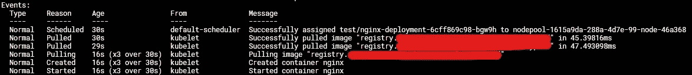

# 如何在 Kubernetes 中安装私有 Docker 容器注册表

> 原文：[`towardsdatascience.com/how-to-install-a-private-docker-container-registry-in-kubernetes-eadcfd6e0f27`](https://towardsdatascience.com/how-to-install-a-private-docker-container-registry-in-kubernetes-eadcfd6e0f27)

## 完全控制你图像存储的位置

[](https://medium.knulst.de/?source=post_page-----eadcfd6e0f27--------------------------------)[](https://towardsdatascience.com/?source=post_page-----eadcfd6e0f27--------------------------------) [Paul Knulst](https://medium.knulst.de/?source=post_page-----eadcfd6e0f27--------------------------------)

·发表于 [Towards Data Science](https://towardsdatascience.com/?source=post_page-----eadcfd6e0f27--------------------------------) ·阅读时间 7 分钟·2023 年 2 月 1 日

--


照片由 [Growtika](https://unsplash.com/@growtika?utm_source=unsplash&utm_medium=referral&utm_content=creditCopyText) 提供，刊登在 [Unsplash](https://unsplash.com/photos/wLknZfsKmxQ?utm_source=unsplash&utm_medium=referral&utm_content=creditCopyText)

# 介绍

托管一个 Docker 私有注册表使你可以完全控制图像的存储位置以及如何访问它们。如果你开发的是不应公开在 Docker Hub 上的私人项目，这一点尤为有用。

在本教程中，你将学习如何在任何 Kubernetes 集群中安装一个私有 Docker 注册表。这是 [之前在本博客发布的教程的后续内容](https://www.paulsblog.dev/how-to-install-traefik-ingress-controller-in-kubernetes/)，因为它将使用 Traefik Ingress Controller 来暴露 Docker 注册表。

# 准备工作

## 创建 Kubernetes 命名空间

第一步是创建一个 Kubernetes 命名空间，在本教程中所有资源都将在该命名空间中应用：

```py
kubectl create namespace docker-registry
```

## PersistentVolumeClaim

在本节中，你将使用 PersistentVolumeClaim 将一个卷挂载到一个专用的 Kubernetes Pod 中。PersistentVolumeClaim（`PVC`）是一个 Kubernetes 资源，用于使用预定义的抽象 PersistentVolume（`PV`）存储，而不暴露这些卷是如何实现的。

💡 **前提条件：** *Kubernetes 集群中应该存在一个 PersistentVolume。PersistentVolume（`*PV*`）是一个存储定义，可以是用户手动配置的，也可以是使用存储类动态配置的。* [*有关更多信息，请参见此链接*](https://kubernetes.io/docs/concepts/storage/persistent-volumes/)*。*

为了设置将在私有 Docker 注册表中使用的 PersistentVolumeClaim，本教程假设你已经有一个预配置的 PersistentVolume，名称为 `csi-cinder-classic`。

1\. 创建一个新文件（`registry-pvc.yaml`），包含使用 `csi-cinder-classic` 存储类的 PersistentVolumeClaim：

```py
apiVersion: v1
kind: PersistentVolumeClaim
metadata:
  name: docker-registry-pv-claim
  namespace: docker-registry
spec:
  accessModes:
    - ReadWriteOnce
  volumeMode: Filesystem
  resources:
    requests:
      storage: 60Gi
  storageClassName: csi-cinder-classic
```

2\. 将其应用到 Kubernetes 集群：

```py
kubectl apply -f registry-pvc.yamlb
```

3\. 验证持久卷声明是否成功创建：

```py
kubectl get pvc docker-registry-pv-claim -n docker-registry

# NAME                   STATUS   VOLUME  CAPACITY   ACCESS MODES   STORAGECLASS
# docker-registry-pv-claim  Bound    ***   60Gi       RWO            csi-cinder-classic
```

# 设置 Docker Registry

现在，你已创建了命名空间和 PersistentVolumeClaim，可以使用外部存储部署 Docker registry，并使其在整个 Kubernetes 集群中可用。

## 生成用户与密码

要设置 Docker registry，你需要生成一个用户和密码，用于推送和拉取镜像到 registry。

创建一个新文件 `gen-pass.sh`，包含以下内容：

```py
export REGISTRY_USER=admin
export REGISTRY_PASS=registryPass
export DESTINATION_FOLDER=./registry-creds

# Backup credentials to local files (in case you'll forget them later on)
mkdir -p ${DESTINATION_FOLDER}
echo ${REGISTRY_USER} >> ${DESTINATION_FOLDER}/registry-user.txt
echo ${REGISTRY_PASS} >> ${DESTINATION_FOLDER}/registry-pass.txt

docker run --entrypoint htpasswd registry:2.7.0 \
    -Bbn ${REGISTRY_USER} ${REGISTRY_PASS} \
    > ${DESTINATION_FOLDER}/htpasswd

unset REGISTRY_USER REGISTRY_PASS DESTINATION_FOLDER
```

💡 **注意：** *根据需要更改 REGISTRY_USER 和 REGISTRY_PASS。此外，由于`*htpasswd*` *在最新的 Docker 镜像中已被移除，我们将使用版本 2.7.0 来生成用户和密码。更多信息* [*请查看这个 stack overflow 文章*](https://stackoverflow.com/questions/62531462/docker-local-registry-exec-htpasswd-executable-file-not-found-in-path)*。*

执行脚本，这将创建在子文件夹 `./registry-creds` 中的凭据：

```py
sh gen-pass.sh
```

## 使用 Helm 安装 Docker Registry

在接下来的步骤中，你将使用 Helm 安装 Docker registry。

💡 **注意：** *Helm 是 Kubernetes 的包管理器，专注于自动化安装各种 Kubernetes 应用程序。*

1\. 添加 `twuni/docker-registry` Helm 仓库，该仓库是官方 Docker registry 的继任者：

```py
helm repo add twuni https://helm.twun.io
```

2\. 更新本地 Helm 图表仓库缓存：

```py
helm repo update
```

3\. 搜索 `twuni/docker-registry` Helm 图表的最新版本：

```py
helm search repo docker-registry
# NAME                    CHART VERSION   APP VERSION     DESCRIPTION
# twuni/docker-registry   2.2.2           2.8.1           A Helm chart for Docker Registry
```

4\. 创建一个 `registry-chart.yaml` 文件，用于在我们的 Kubernetes 集群中安装 Docker registry：

```py
---
replicaCount: 1
persistence:
  enabled: true
  size: 60Gi
  deleteEnabled: true
  storageClass: csi-cinder-classic
  existingClaim: docker-registry-pv-claim
secrets:
  htpasswd: admin:$2y$05$Gh/3ppmkuIXJIVyBBtHf0ug.wnnJvbtSEzlXz6z/7oO7XvF/xq7Ni
```

💡**注意：** *将* `*htpasswd*` *字符串替换为由* `*gen-pass.sh*` *脚本生成的文件内容 (*`*./registry-cred/htpasswd*`*)*

5\. 使用 `registry-chart.yaml` 安装 Docker registry Helm 图表：

```py
helm install -f .\registry-chart.yaml docker-registry --namespace docker-registry twuni/docker-registry
```

6\. 验证安装：

```py
kubectl get pods -n docker-registry
# NAME                              READY   STATUS    RESTARTS
# docker-registry-9fa1234ba-gaf16   1/1     Running   0
```

如果你想更改像 `replicaCount`、`htpasswd` 或存储之类的内容，可以通过调整 `registry-chart.yaml` 来完成，并通过执行以下命令重新应用：

```py
helm upgrade -f .\registry-chart.yaml docker-registry --namespace docker-registry twuni/docker-registry
```

## 如何卸载？

要卸载 Docker registry，你需要使用 Helm 将其从 Kubernetes 集群中移除：

```py
helm uninstall docker-registry --namespace docker-registry
```

然后从 Kubernetes 集群中删除 Docker registry 命名空间：

```py
kubectl delete namespace docker-registry
```

# 添加 Docker Registry Ingress

要暴露 Docker registry，你将使用 Traefik Ingress Controller 通过 HTTPS 和适当的 TLS 证书来允许访问 registry。

💡**注意：** *请阅读关于如何在任何 Kubernetes 集群中安装 Traefik Ingress Controller 的教程：* [*https://www.paulsblog.dev/how-to-install-traefik-ingress-controller-in-kubernetes/*](https://www.paulsblog.dev/how-to-install-traefik-ingress-controller-in-kubernetes/)

1\. 创建一个新文件（`ingressroute.yaml`），并确保将 YOUR_DOMAIN 替换为你的 Docker registry 域名：

```py
---
kind: IngressRoute
apiVersion: traefik.containo.us/v1alpha1
metadata:
  name: docker-registry
  namespace: docker-registry

spec:
  entryPoints:
    - websecure
  routes:
    - match: Host(`YOUR_DOMAIN`)
      kind: Rule
      services:
        - name: docker-registry
          port: 5000
```

2\. 通过执行来应用 IngressRoute：

```py
kubectl apply -f ingressroute.yaml
```

3\. 验证 Kubernetes 资源是否成功创建：

```py
kubectl describe ingressroute docker-registry -n docker-registry
```

# 将镜像推送到 Kubernetes 集群中的私有注册表

为了展示如何将 Docker 镜像推送到我们的新 Docker 注册表，本教程将展示如何拉取一个公共的 Docker Hub 镜像，对其进行标记，然后将其推送到你的注册表。

1\. 使用先前创建的凭据登录 Docker 注册表

```py
docker login \
   -u $(cat ./registry-creds/registry-user.txt) \
   -p $(cat ./registry-creds/registry-pass.txt) \
   YOUR_DOMAIN
```

2\. 拉取`nginx:latest` Docker 镜像：

```py
docker pull nginx
```

3\. 用自定义名称标记镜像，并在前面加上私有 Docker 注册表域名

```py
docker tag nginx YOUR_DOMAIN/my-nginx
```

4\. 将 Docker 镜像推送到注册表

```py
docker push YOUR_DOMAIN/my-nginx
```

# 使用 Docker 注册表在 Kubernetes 集群中拉取镜像

由于你在 Kubernetes 集群中部署了 Docker 注册表，你可以通过拉取之前推送的镜像来开始使用它，为你的 Kubernetes Pods。

要了解如何使用私有 Docker 注册表拉取镜像，你将创建一个新的`test`命名空间中的简单 Kubernetes pod。这个 Kubernetes Pod 将使用之前推送的镜像`YOUR_DOMAIN/my-nginx`。

首先，你必须创建`test` Kubernetes 命名空间：

```py
kubectl create namespace test
```

## 创建 Docker 注册表 Secret

**这是最重要的一步！**

你必须创建一个 Docker Secret，以便从 Kubernetes 集群访问 Docker 注册表。为此，使用上一步的凭据，在`test`命名空间中创建一个 Kubernetes Docker Secret：

```py
kubectl create secret docker-registry regcred --docker-server=YOUR_DOMAIN --docker-username=admin --docker-password=registryPass -n test
```

💡 **注意：这个 Kubernetes Docker secret 资源必须** *在正确的命名空间中创建！*

## 使用 Docker 注册表中的镜像创建 Kubernetes Pod

在创建包含 Docker 注册表凭据的 Kubernetes secret 后，你创建一个新的 Kubernetes Deployment（`test-nginx.yaml`），该 Deployment 使用你的注册表：

```py
apiVersion: apps/v1
kind: Deployment
metadata:
  name: nginx-deployment
  namespace: test
spec:
  selector:
    matchLabels:
      app: nginx
  replicas: 1
  template:
    metadata:
      labels:
        app: nginx
    spec:
      containers:
      - name: nginx
        image: YOUR_DOMAIN/my-nginx
        ports:
        - containerPort: 80
      imagePullSecrets:
        - name: regcred
```

如果仔细查看此文件，你会发现它与正常的`nginx`部署有三个基本的不同之处。

1.  `image: YOUR_DOMAIN/my-nginx`

1.  `imagePullSecrets: - name: regred`

这两个更改都是使用 Docker 注册表所必需的。第一个选项选择要在 pod 中使用的镜像（注册表 URL 作为前缀+镜像名称）。第二个选项设置用于拉取镜像的 Docker secret。如果你更改了凭据或名称，你必须更新这两个值。

现在，在你的集群中部署 Kubernetes Deployment：

```py
kubectl apply -f test-nginx.yaml
```

使用`kubectl describe podname -n test`查看镜像是否会被拉取，以及容器是否能够正确启动。输出应如下所示：



部署 my-nginx Kubernetes 部署后的 Pod 拉取镜像事件

# 结束语

希望这篇文章给你提供了一个关于如何在 Kubernetes 集群中设置私有 Docker 注册表的良好概述。

记住，如果部署的 Docker 服务不是开源的，拥有私有 Docker 注册表是至关重要的！

为了提供一个可以在任何 Kubernetes 集群上运行的简单、可重复的流程，我创建了 [一个包含所有必要文件的 GitHub Gist](https://gist.github.com/paulknulst/f077420faead4fd6e901d46eb9ba00d4)。如果你已经 [在你的 Kubernetes 集群中运行了 Traefik Ingress Controller](https://www.paulsblog.dev/how-to-install-traefik-ingress-controller-in-kubernetes/)，你可以简单地下载所有文件，调整到你的需求，然后通过执行来应用它们：

```py
kubectl create namespace docker-registry
kubectl apply -f registry-pvc.yaml
helm repo add twuni https://helm.twun.io
helm repo update
helm search repo docker-registry
helm install -f values.yaml docker-registry --namespace docker-registry twuni/docker-registry
kubectl apply -f registry-ingressroute.yaml
```

我很想听到你对这个教程的反馈。此外，如果你也设置了 Docker 注册表并使用了不同的方法，请在这里评论并解释你做了什么不同的操作。如果你有任何问题，请在评论中提出。我会尽可能回答。

随时通过 [我的博客](https://www.paulsblog.dev)、[LinkedIn](https://www.linkedin.com/in/paulknulst/)、[Twitter](https://twitter.com/paulknulst) 和 [GitHub](https://github.com/paulknulst) 与我联系。

*这篇文章最初发布在我的博客上* [*https://www.paulsblog.dev/how-to-install-a-private-docker-container-registry-in-kubernetes/*](https://www.paulsblog.dev/how-to-install-a-private-docker-container-registry-in-kubernetes/)
