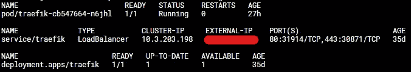

# 如何在 Kubernetes 中安装 Traefik Ingress Controller

> 原文：[`towardsdatascience.com/how-to-install-traefik-ingress-controller-in-kubernetes-fa2b9079e942`](https://towardsdatascience.com/how-to-install-traefik-ingress-controller-in-kubernetes-fa2b9079e942)

## 提供负载均衡、基于名称的虚拟主机和 SSL 终止

[](https://medium.knulst.de/?source=post_page-----fa2b9079e942--------------------------------)[](https://towardsdatascience.com/?source=post_page-----fa2b9079e942--------------------------------) [Paul Knulst](https://medium.knulst.de/?source=post_page-----fa2b9079e942--------------------------------)

·发表于 [Towards Data Science](https://towardsdatascience.com/?source=post_page-----fa2b9079e942--------------------------------) ·5 分钟阅读·2023 年 1 月 4 日

--


图片来源：[Growtika 开发者营销机构](https://unsplash.com/@growtika?utm_source=unsplash&utm_medium=referral&utm_content=creditCopyText) / [Unsplash](https://unsplash.com/s/photos/kubernetes-k8s?utm_source=unsplash&utm_medium=referral&utm_content=creditCopyText)

# 介绍

本教程将展示如何使用 Traefik 作为 Kubernetes（或 k8s）中的 Ingress Controller，以提供负载均衡、基于名称的虚拟主机和 SSL 终止。

要跟随本教程，你需要：

+   一个运行中的 Kubernetes 集群或一个托管的 Kubernetes

+   一个负载均衡器，它动态地将流量分配到标记为 [LoadBalancer](https://kubernetes.io/docs/tasks/access-application-cluster/create-external-load-balancer/) 的任何 Kubernetes 资源上

+   一个 PRIMARY_DOMAIN

注意：我在此帖子中使用的域名是 `PRIMARY_DOMAIN`，请相应更改。如果你的目标域名是 `paulsblog.dev`，请将 `PRIMARY_DOMAIN` 替换为 `paulsblog.dev`。

# 什么是 Ingress Controller？

Ingress Controller 是一个 API 对象，它将管理对 Kubernetes 集群中任何已部署服务的外部访问。通常使用 HTTP 或 HTTPS。此外，它提供负载均衡、基于名称的虚拟主机和 SSL 终止。

# 为什么你需要一个 Ingress Controller？

此列表将展示在 Kubernetes 集群中使用 Ingress Controller 的最重要的好处：

+   将任何流量负载均衡到部署在 Kubernetes 集群外的每个服务之间

+   允许集群内的服务之间进行 HTTP 流量，但强制要求从 Kubernetes 集群外部的 HTTPS 流量，同时终止加密。

+   简化内部服务之间的交互，并在需要时通过更改 Ingress 路由规则重新路由。

# 准备 Kubernetes 环境

# 安装 Helm，即 Kubernetes 包管理器

要在你的 Kubernetes 集群上安装 Helm，你可以使用官方的 Helm 安装脚本，它将自动安装最新版本。

在安装 Helm 之前，你可以通过阅读 [官方 Helm 文档](https://helm.sh/docs/) 来深入了解 Helm。之后，下载脚本并在本地执行。

```py
curl -fsSL -o get_helm.sh https://raw.githubusercontent.com/helm/helm/main/scripts/get-helm-3
chmod 700 get_helm.sh
./get_helm.sh
```

# 配置 `kubectl` 以访问 Kubernetes 集群

如果使用 `kubectl`，你可以使用三种不同的技术来操作集群：

**1\. 对每个命令使用** `**--kubeconfig**` **标志：**

```py
kubectl get pods --kubeconfig=config1
kubectl get pods --kubeconfig=config2
```

**2\. 使用** `**KUBECONFIG**` **环境变量：**

```py
export KUBECONFIG=config1 
kubectl get pods
kubectl get all

export KUBECONFIG=config2
kubectl get pods
kubectl get all
```

**3\. 将配置文件复制到** `**$HOME/.kube/config**`

# 准备 Helm Chart

要安装 Traefik，你应该将官方 Traefik Helm 仓库添加到你的 Helm 客户端。这可以通过执行以下操作来完成：

```py
helm repo add traefik https://helm.traefik.io/traefik
helm repo update
```

之后，你需要通过创建一个 `values.yaml` 来配置 Helm 图表。所有可能的值可以在 [Traefik Helm 图表的 GitHub](https://github.com/traefik/traefik-helm-chart/blob/master/traefik/values.yaml) 中找到，并将用于设置 Traefik 代理的静态配置。

现在，你应该创建一个 `values.yaml` 文件，并将以下内容粘贴进去：

```py
---
additionalArguments:
  - --entrypoints.websecure.http.tls.certresolver=ionos
  - --entrypoints.websecure.http.tls.domains[0].main=PRIMARY_DOMAIN
  - --entrypoints.websecure.http.tls.domains[0].sans=*.PRIMARY_DOMAIN
  - --certificatesresolvers.ionos.acme.dnschallenge.provider=ionos
  - --certificatesresolvers.ionos.acme.email=webmaster@PRIMARY_DOMAIN
  - --certificatesresolvers.ionos.acme.dnschallenge.resolvers=1.1.1.1
  - --certificatesresolvers.ionos.acme.storage=/data/acme.json

deployment:
  initContainers:
    - name: volume-permissions
      image: busybox:1.31.1
      command: ["sh", "-c", "chmod -Rv 600 /data/*"]
      volumeMounts:
        - name: data
          mountPath: /data

env:
  - name: IONOS_API_KEY
    valueFrom:
      secretKeyRef:
        key: IONOS_API_KEY
        name: ionos-api-credentials

ingressRoute:
  dashboard:
    enabled: false

persistence:
  enabled: true
  path: /data
  size: 128Mi
```

这个 `values.yaml` 用于配置 Traefik 代理，并将：

+   使用 IONOS 作为证书解析器。要查找你的提供商，请 [查阅 Traefik 文档](https://doc.traefik.io/traefik/https/acme/#dnschallenge)

+   将证书主域设置为 `PRIMARY_DOMAIN`

+   将证书 sans 设置为 `*.PRIMARY_DOMAIN`

+   将每个生成的证书存储在 `/data/acme.json` 中

+   运行一个 busybox 初始化容器以解决一个常见的权限问题，详细说明请参阅 [`github.com/containous/traefik/issues/6972`](https://github.com/containous/traefik/issues/6972)

+   从一个密钥中加载 IONOS_API_KEY。如果使用其他提供商，请添加所需的所有环境变量

+   禁用 Traefik 仪表板

+   启用 Traefik 代理的持久化

# 安装 Traefik 代理作为 Ingress 控制器

要在你的 Kubernetes 集群中安装 Traefik 代理，按照接下来的四个简单步骤操作

**1\. 首先创建一个 Kubernetes 命名空间：**

```py
kubectl create namespace traefik
```

**2\. 创建一个** `**treafik-secret.yaml**` **文件，包含在 Helm 图表中用于 SSL 证书创建的密钥：**

```py
---
apiVersion: v1
kind: Secret
metadata:
  name: ionos-api-credentials
  namespace: traefik

type: Opaque
stringData:
  IONOS_API_KEY: asdkjalshdasdlasdasd.asdahsdhasdkjahsdkasgdkasdg;aksda;d
```

**3\. 在你的 Kubernetes 集群中应用密钥：**

```py
kubectl apply -f traefik-secret.yaml
```

**4\. 使用 Helm 安装 Traefik 并应用** `**values.yaml**`

```py
helm install traefik traefik/traefik --namespace=traefik --values=values.yaml
```

如果你在 `values.yaml` 中更改了任何内容并且想要更新 Traefik 代理，可以通过执行以下操作来完成：

```py
helm upgrade traefik traefik/traefik --namespace=traefik --values=values.yaml
```

几分钟后，你的 Traefik 将正确部署，你可以将你的 PRIMARY_DOMAIN A 记录映射到 Traefik 负载均衡器的 IP。你可以通过执行以下操作找到外部 IP：

```py
kubectl get all -n traefik
```

它应该输出以下内容：



kubectl 的输出包含所有 traefik 命名空间中的内容

当外部 IP 尚未设置时，请等待一段时间并重试。如果你没有收到外部 IP，可能是因为你没有安装/购买外部负载均衡器。

# 启用 Traefik 仪表板

要在 Kubernetes 集群中启用 Traefik 仪表盘，你需要创建一个 Ingress 路由和一个中间件以启用基本认证。

创建一个名为 `traefik-dashboard` 的新文件夹，其中包含设置 Traefik 仪表盘所需的所有文件。

现在，创建一个 base64 编码的用户和密码，这将用于 Kubernetes 密钥中：

```py
htpasswd -nb superTraefikUser unbelievableSafePassword | openssl base64
```

然后，复制 `htpasswd` 字符串并创建 Kubernetes 密钥 `001-auth-secret`。

```py
---
apiVersion: v1
kind: Secret
metadata:
  name: traefik-dashboard-auth
  namespace: traefik

data:
  users: YOUR_UNBELIEVABLE_SECURE_HTPASSWD_STRING
```

然后创建一个 Kubernetes 中间件 `002-middleware`，它将使用基本认证密钥：

```py
apiVersion: traefik.containo.us/v1alpha1
kind: Middleware
metadata:
  name: traefik-dashboard-basicauth
  namespace: traefik

spec:
  basicAuth:
    secret: traefik-dashboard-auth
```

现在你可以为 Traefik 仪表盘创建 Ingress 路由 `003-ingressroute`：

```py
---
apiVersion: traefik.containo.us/v1alpha1
kind: IngressRoute
metadata:
  name: traefik-dashboard
  namespace: traefik

spec:
  entryPoints:
    - websecure

  routes:
    - match: Host(`traefik.PRIMARY_DOMAIN`)
      kind: Rule
      middlewares:
        - name: traefik-dashboard-basicauth
          namespace: traefik
      services:
        - name: api@internal
          kind: TraefikService
```

如果你按照描述命名了文件，你应该拥有以下文件结构：

```py
traefik-dashboard
--001-auth-secret
--002-middleware
--003-ingressroute
```

切换到上级文件夹，并使用以下命令按正确的顺序应用所有文件：

```py
kubectl apply -f traefik-dashboard
```

几分钟后，Traefik 仪表盘上线，并可以通过其域名 (https://traefik.PRIMARY_DOMAIN) 访问。

# 结束语

我希望这篇文章给你提供了一个关于如何在 Kubernetes 集群中设置 Traefik Proxy 作为 Ingress Controller 的简洁概述。

使用 Helm 设置 Traefik Ingress 控制器使得安装、重新配置和更新 Traefik Proxy 变得简单。

有了这个设置，你可以部署任何 Kubernetes Pod/Service，并使用 IngressRoute 通过任何子域名使其通过 SSL 访问。

我非常希望听到你对这个教程的反馈。此外，如果你已经运行了 Traefik 安装并使用了不同的方法，请在这里评论并解释你做了什么不同的事情。如果你有任何问题，请在评论中提问。我会尽可能回答。

欢迎通过 [我的博客](https://www.paulsblog.dev)、[LinkedIn](https://www.linkedin.com/in/paulknulst/)、[Twitter](https://twitter.com/paulknulst) 和 [GitHub](https://github.com/paulknulst) 与我联系。

*这篇文章最初发布在我的博客* [*https://www.paulsblog.dev/how-to-install-traefik-ingress-controller-in-kubernetes/*](https://www.paulsblog.dev/how-to-install-traefik-ingress-controller-in-kubernetes/)
