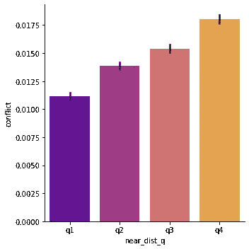
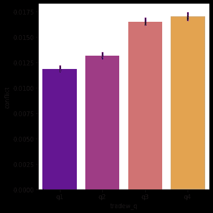
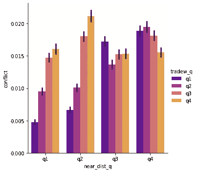

# 如何解读线性回归系数 | 完整指南

> 原文：[`towardsdatascience.com/how-to-interpret-linear-regression-coefficients-8f4450e38001`](https://towardsdatascience.com/how-to-interpret-linear-regression-coefficients-8f4450e38001)

## 从简单到高级模型的完整指南

 [Quentin Gallea, PhD](https://medium.com/@quentin.gallea?source=post_page-----8f4450e38001--------------------------------)

·发表于 [Towards Data Science](https://towardsdatascience.com/?source=post_page-----8f4450e38001--------------------------------) ·阅读时间 16 分钟·2023 年 5 月 24 日

--

由 Vitalii Khodzinskyi 拍摄，来自 [Unsplash](https://unsplash.com/fr/photos/cx8cofxiKYc)

在线查找如何解读线性回归系数类似于查找如何在 Python 中导入 CSV 文件，许多人能在脑海中掌握这些信息。尽管我在过去十年中教授了超过 10,000 名学生统计学，但在一些特殊情况下（例如二元结果和对数变换的解释变量），我仍然有时需要反复检查解释。这就是为什么我决定写这篇文章，它包含了各种线性回归模型的大量列表，并解释了每种情况的系数解释，包括对数变换变量、二元变量或交互项。

请注意，为了全面理解（但不必要）本文内容，你需要熟悉两个数学概念：[偏导数](https://en.wikipedia.org/wiki/Partial_derivative) 和 [条件期望](https://en.wikipedia.org/wiki/Conditional_expectation)。

在浏览不同情况的列表之前，让我介绍一些重要的定义和考虑事项（模型定义、ceteris paribus、二元变量、多重共线性）。

## 目录：

**0. 定义和重要考虑事项**

**1. 截距**

**2. 连续因变量**

2.1 连续自变量

2.1.a lin-lin: 线性结果，线性自变量

2.1.b log-lin: 对数变换的结果，线性自变量

2.1.c lin-log: 线性结果，对数变换的自变量

2.1.d log-log: 对数变换的结果，对数变换的自变量

[2.2 二元自变量](http://b7ae)

2.2.a 线性因变量

2.2.b 对数变换因变量

**3\. 二元因变量**

3.1 连续自变量

3.1.a 线性自变量

3.1.b 对数变换自变量

3.2 二元自变量

**4\. 互动效应**

4.1 二次效应

4.2 两个连续变量之间的互动

4.3 两个二元变量之间的互动

特殊情况差异中的差异

# **0\. 定义及重要考虑事项**

## 一般定义

模型的定义：

Yᵢ = β₀ + β₁ Xᵢ + Z’ λ + ϵᵢ

Yᵢ 是因变量，Xᵢ 是一个独立的连续变量，Z 是控制变量的向量，ϵᵢ 是误差项。

从分析角度来看，β₀ 是函数的截距，β₁ 是斜率参数。因此，β₁ 代表 X 单位增加后 Y 的变化，其它条件不变（保持 Z 的值固定）。

形式上，我们可以写作 β₁ = ∂ Y / ∂ X（Y 对 X 的偏导数）。

## 其它条件相同

在多重线性回归中，我们使用术语 *ceteris paribus*，即“其它条件相同”。这是上述定义的直接结果。偏导数衡量由于一个变量变化而函数的变化，其它变量保持不变。因此，在上述模型中，β₁ 代表 X 对 Y 的变化影响，同时保持控制变量 Z 向量中的所有其它内容固定。

## 二元变量

因变量或自变量可以是二元变量，即取值为 1 或 0 的变量。

当**自变量是二元变量**时，系数应解释为期望的差异。假设 Dᵢ 是一个二元变量，当数据集中的人是成年人（年龄≥21）时取值为 1，否则取值为 0。模型为 Yᵢ = β₀ + β₁ Dᵢ + Z’ λ + ϵᵢ。根据上述系数解释的一般定义（偏导数），这里的一个单位变化意味着从儿童到成人的变化。因此，系数应解释为儿童与成人之间 Y 的‘平均’差异。形式上，β₁ = E[Y |D=1,Z] - E[Y |D=0,Z]。换句话说，β₁ 表示成人的 Y 的‘平均’值与儿童的 Y 的平均值之间的差异。

当**因变量是二元变量**时，我们处于线性概率模型（LPM）的情况下。回归系数表示因变量等于 1 的概率变化。LPMs 通常被忽视，主要是因为这些模型可能会预测负概率或大于 1 的概率。为避免这个问题，我们应该依赖 logit（逻辑回归）或 probit 模型。然而，LPMs 仍然经常被使用，因为它们的系数易于解释（见第三部分）。特别是，对于固定效应，这在计量经济学中被广泛使用，LPMs 更“合适”（参见：[使用大面板数据估计固定效应 Logit 模型](https://www.econstor.eu/bitstream/10419/145837/1/VfS_2016_pid_6909.pdf)）。

## 完美的多重共线性

如果两个或更多的独立变量可以表示为彼此的确切线性关系，我们就遇到了完美的多重共线性问题。（从技术上讲，解释变量的矩阵将不是满秩的，因此不能求逆，而这对于估计回归参数至关重要。）对于二元变量和分类变量，这一点非常重要。你不能包含捕捉所有不同可能类别的二元变量，否则你会遇到完美的多重共线性问题。例如，在同一个回归模型中，你不能同时包含成人和非成人的二元变量。实际上，这并不是一个问题，因为与该变量（这里是成人）相关的回归系数表示与参考类别（这里是非成人）之间的差异。因此，同时存在这两个变量并没有用。

现在，如果你有两个以上的类别，例如轻度、中度和重度，你不能为所有类别设置一个二元变量。你必须排除其中一个类别。

示例：

Yᵢ = β₀ + β1₁ Mediumᵢ + β₂ Heavy + Z’ λ + ϵᵢ

在这里我们排除了轻度类别。因此，β₀实际上表示属于轻度类别的观测值的 Y 期望。被排除的类别将成为参考类别，这意味着系数将始终表示与此类别相比的期望差异：

β₁ = E[Y|Medium=1,Z]-E[Y |Light=1,Z]

β₂ = E[Y|Heavy=1,Z]-E[Y |Light=1,Z]

## **对数转换**

**我们为什么要进行对数转换？**

注意，对数转换通常用于线性回归。线性回归衡量的是平均效应，因此当一个变量在右侧高度偏斜时，常见的方法是应用自然对数进行转换。这种策略旨在减少偏斜，从而允许使用均值。我的个人规则是，如果偏斜度（偏斜度的度量）大于 3，我会对变量进行对数转换。

**我在对数转换中应该注意什么？**

当一个变量被转换为对数时，系数的解释会发生变化。这不一定是坏事，甚至可能是有益的。当变量经过对数变换时，线性回归系数可以解释为弹性或半弹性。正如我们稍后将看到的，这意味着我们不再关注变量的单位变化，而是关注百分比变化。在没有对数变换的水平回归中，回归系数对应于偏导数（∂ Y / ∂ X），X 的单位变化意味着 Y 的变化为 β₁ 单位（其中 Y 为因变量，X 为自变量，β₁ 为与 X 相关的回归系数）。当两个变量（因变量和自变量）都经过对数变换时，我们将回归系数大致解释为弹性：X 的 1% 变化意味着 Y 的 β₁% 变化。

在进行变换前后，应进行仔细的探索性数据分析（EDA）以做出正确的决策。你可以参考我的 EDA 方法：[`medium.com/towards-data-science/a-recipe-to-empirically-answer-any-question-quickly-22e48c867dd5`](https://medium.com/towards-data-science/a-recipe-to-empirically-answer-any-question-quickly-22e48c867dd5)。此外，请参阅*“*[*对数变换及其对数据分析的影响*](https://www.ncbi.nlm.nih.gov/pmc/articles/PMC4120293/)*”*（Feng et al.（2002））了解更多潜在问题的细节。

# 1. 截距

模型定义：

Yᵢ = β₀ + β₁ Xᵢ + Z’ λ+ ϵᵢ

Y 是因变量，X 是自变量，Z 是控制变量的向量，ϵᵢ 是误差项。

*解释：* β₀ 是 Y 的期望值，如果所有其他变量设置为 0。注意，如果解释变量从不等于零（例如身高、GDP 等），则解释此系数没有意义。

# 2. 连续因变量

在本节 2 中，因变量 Yᵢ 始终是连续的。

## 2.1 连续自变量

在本小节 2.1 中，自变量 Xᵢ 始终是连续的。

## **2.1.a 水平-水平：水平结果，水平自变量**

模型定义：

Yᵢ = β₀ + β₁ Xᵢ + Z’ λ+ ϵᵢ

Y 是因变量，X 是自变量，ϵ 是误差项。

*解释：* X 增加一个单位，Yᵢ 平均变化 β₁ 单位（其他条件不变）。

## **2.1.b 对数-水平：对数变换的结果，水平自变量**

模型定义：

log(Yᵢ) = β₀ + β₁ Xᵢ + Z’ λ+ ϵᵢ

log(Yᵢ) 是对数变换后的因变量，Xᵢ 是自变量，ϵᵢ 是误差项。

*解释：* X 增加一个单位意味着 Y 平均变化 (exp(β₁)-1)*100 百分比（在其他条件不变的情况下）。为了快速近似，你可以将系数解释为半弹性：X 增加一个单位意味着 Y 平均变化 100*β₁ %（在其他条件不变的情况下）。

## **2.1.c 水平-对数：水平结果，对数变换的独立变量**

模型定义：

Yᵢ = β₀ + β₁ log(Xᵢ) + Z’ λ+ ϵᵢ

Yᵢ 是因变量，log(Xᵢ) 是对数变换的独立变量，ϵᵢ 是误差项。

*解释：* X 增加一个百分比意味着 Y 平均变化 β₁*log(1.01)（在其他条件不变的情况下）。为了快速近似，你可以将系数解释为半弹性：X 增加一个百分比意味着 Y 平均变化 β₁ / 100 单位（在其他条件不变的情况下）。

## 2.1.d 对数-对数：对数变换的结果，对数变换的独立变量

模型定义：

log(Yᵢ) = β₀ + β₁ log(Xᵢ) + Z’ λ+ ϵᵢ

log(Yᵢ) 是对数变换的因变量，log(Xᵢ) 是对数变换的独立变量，ϵᵢ 是误差项。

*解释：* X 增加一个百分比意味着 Yᵢ 平均变化 (1.01^β₁–1) * 100 百分比（在其他条件不变的情况下）。为了快速近似，你可以将系数解释为弹性：X 增加一个百分比意味着 Y 平均变化 β₁ 百分比（在其他条件不变的情况下）。

# 2.2 二元独立变量

在第 2.2 节中，独立变量 Dᵢ 是一个仅取值 1 或 0 的二元变量。

## 2.2.a 水平因变量

模型定义：

Yᵢ = β₀ + β₁ Dᵢ+ Z’ λ+ ϵᵢ

Yᵢ 是因变量，Dᵢ 是独立二元变量，Z 是控制变量向量，ϵᵢ 是误差项。

*解释：* 记住，正式来说 β₁ = E[Yᵢ |Dᵢ=1,Z]-E[Yᵢ |Dᵢ=0,Z]。换句话说，当 Dᵢ 从 0 变为 1 时的期望差异等于 β₁，其他条件相等。

为了使其更具体，让我使用以下示例：

HoursOfSleepᵢ = β₀ + β₁ Adultᵢ+ Z’ λ+ ϵᵢ。

在这个例子中，β₁ 代表成年人（当 Adult = 1）与非成年人（即儿童，当 Adult = 0）之间的“平均”睡眠小时差异，其他条件相等。

## 2.2.b 对数变换的因变量

模型定义：

log(Yᵢ) = β₀ + β₁ Dᵢ+ Z’ λ+ ϵᵢ

log(Yᵢ) 是对数变换的因变量，Dᵢ 是独立二元变量，Z 是控制变量向量，ϵᵢ 是误差项。

*解释：* 记住，二元变量的系数表示“均值”（条件期望）的差异。然而，由于对数变换，我们有：

β₁ = log(E[Yᵢ |Dᵢ=1,Z]) — log(E[Yᵢ |Dᵢ=0,Z]) = log(E[Yᵢ |Dᵢ=1,Z]/E[Yᵢ |Dᵢ=0,Z])

⇔ exp(β₁) = E[Yᵢ |Dᵢ=1,Z]/E[Yᵢ |Dᵢ=0,Z]

为了更具体地说明，我使用以下示例：log(睡眠时间ᵢ) = β₀ + β₁ 成人ᵢ+ Z’ λ+ ϵᵢ。在这个例子中，exp(β₁) 代表成人（当 成人ᵢ = 1）相对于非成人（即儿童，当 成人ᵢ = 0）的平均睡眠时间的比率，其他条件相等。如果 exp(β₁) = 1.1，这意味着成人的睡眠时间比儿童多 10%。如果 exp(β₁) = 1.5，这意味着成人的睡眠时间比儿童多 50%。

请注意，在这个上下文中，均值是几何均值（更多细节请参见：[`stats.oarc.ucla.edu/other/mult-pkg/faq/general/faqhow-do-i-interpret-a-regression-model-when-some-variables-are-log-transformed/`](https://stats.oarc.ucla.edu/other/mult-pkg/faq/general/faqhow-do-i-interpret-a-regression-model-when-some-variables-are-log-transformed/)）。

# **3\. 二元因变量**

在第三部分中，因变量 Dᵢ 始终是二元的（取值为 1 或 0）。在这种情况下，模型称为线性概率模型（有关更多细节，请参见第零部分的注释）。

## 3.1 连续独立变量

在这一小节 3.1 中，独立变量 Xᵢ 是连续变量。

## 3.1.a 水平独立变量

模型定义：

Dᵢ = β₀ + β₁ Xᵢ + Z’ λ+ ϵᵢ

Dᵢ 是二元因变量，Xᵢ 是独立的连续变量，Z 是控制变量的向量，ϵᵢ 是误差项。

*解释：* X 增加一个单位意味着 β₁ 平均上改变 D = 1 的概率（其他条件不变）。例如，如果 β₁=0.1，这意味着 D 等于 1 的概率平均增加 0.1（其他条件不变）。

## 3.1.b 对数变换的独立变量

模型定义：

Dᵢ = β₀ + β₁ log(Xᵢ) + Z’ λ+ ϵᵢ

Dᵢ 是二元因变量，log(Xᵢ) 是对数变换的独立连续变量，Z 是控制变量的向量，ϵᵢ 是误差项。

*解释：* X 增加一个百分点意味着 D = 1 的概率平均变化 β₁ 单位（其他条件不变）。例如，如果 β₁=0.1，这意味着 X 增加一个百分点后，D 等于 1 的概率平均增加 0.1（其他条件不变）。

## 3.2 二元独立变量

模型定义：

Dᵢ = β₀ + β₁ Bᵢ + Z’ λ+ ϵᵢ

Dᵢ 是二元因变量，Bᵢ 是独立的二元变量，Z 是控制变量的向量，ϵᵢ 是误差项。

*解释：* 当 B 从 0 变化到 1 时，D = 1 的概率变化为 β₁，其他条件相等。例如，如果 β₁ = 0.1，这意味着当 B 从 0 变化到 1 时，D 等于 1 的概率平均增加 0.1（其他条件不变）。

为了更具体地说明，我使用以下示例：

失眠ᵢ = β₀ + β₁ 成人ᵢ + Z’ λ+ ϵᵢ。

失眠是一个二元变量，如果个体 “i” 患有失眠则取值为 1，否则为 0。成年人是一个二元变量，如果个体 “i” 严格超过 20 岁则取值为 1，否则为 0。在这个例子中，如果 β₁ = 0.1，这意味着成年人（成年人 = 1）患失眠的概率比儿童（成年人 = 0）高 0.1，其他条件相同。

# 4. 互动效应

线性回归在参数上是线性的，这并不妨碍非线性函数的估计。我们将看到三种不同类型的交互作用。为了简洁起见，我在本节中只使用一个连续因变量：Y。

## 4.1 二次效应

模型定义：

Yᵢ = β₀ + β₁ Xᵢ + β₂ Xᵢ * Xᵢ + Z’ λ + ϵᵢ

或

Yᵢ = β₀ + β₁ Xᵢ + β₂ Xᵢ² + Z’ λ + ϵᵢ

Yᵢ 是一个连续的因变量，Xᵢ 是一个独立的连续变量，Z 是一个控制变量的向量，ϵᵢ 是一个误差项。这个模型包含了 X 的二阶多项式函数。线性回归可以包括更高阶的多项式函数。

*解释：* 多项式形式的解释更为复杂，因为偏导数（边际效应）不再是常数。在当前情况下，∂ Y / ∂ X = β₁ + 2 * β₂ Xᵢ。由于边际效应依赖于 X 的值，我们必须对 X 的不同有意义的值进行边际效应的评估。

为此，我计算并绘制了 X 对 Y 的边际效应图，涵盖了 X 的不同值。在 STATA 中，你可以使用 *margins* 和 *marginsplot* 命令，在 R 中你可以使用 *marginaleffects*，而在 Python 中我使用以下代码：

上面的图表揭示了 X 和 Y 之间的二次关系。因此，X 对 Y 的边际效应最初为负，然后变为正。下面的代码允许我们计算这种特定情况下的边际效应。注意，我手动计算了这个二次多项式函数的导数，如你从第一行代码中可以看到的那样。

从上面的图表中可以看出，对于大约低于 -1 的值，边际效应为负，然后变为正值。

# 4.2 两个连续变量之间的交互作用

在某些情况下，我们期望两个不同的变量之间存在相互作用。在我最近与同事 Pr.Rohner 共同发表在 PNAS 上的一篇文章中，我们探讨了控制海上贸易的战略位置、贸易开放性和冲突之间的关系（[`www.pnas.org/doi/abs/10.1073/pnas.2105624118?doi=10.1073%2Fpnas.2105624118`](https://www.pnas.org/doi/abs/10.1073/pnas.2105624118?doi=10.1073%2Fpnas.2105624118)）。贸易开放性和位置的战略价值对冲突的概率有直接影响。但也存在一个重要的联合效应（交互作用），如下面的一系列图表所示。

作者提供的图片。该图揭示了接近主要战略位置以控制海洋贸易路线（X 轴）对冲突概率（Y 轴）的影响。观察值按接近度的四分位数（q1, q2, q3 和 q4）进行划分，q4 表示距离战略位置最近的区域。

上图揭示了距离战略位置越近，冲突风险越高。

作者提供的图片。该图揭示了贸易开放度（X 轴）对冲突概率（Y 轴）的关系。观察值按贸易开放度的四分位数（q1, q2, q3 和 q4）进行划分。

第二张图显示了贸易开放度越大，冲突风险越高。因此，贸易繁荣的年份有更高的冲突风险。

作者提供的图片。这张条形图表示了距离战略位置的四分位数（near_dist_q）、年度贸易开放度（tradew_q）和冲突概率（Y 轴）之间的关系。

最后一张图显示了我们两个解释变量的互动。一方面，我们可以看到左侧第一组条形图中，远离战略位置的海洋贸易地点在贸易扩张期（黄色条）冲突风险更高。另一方面，对于靠近战略位置的地点（右侧的条形图组），这种关系则被逆转。

因此，距离战略位置的边际效应在冲突概率上会随着贸易开放度的变化而变化。为了建模这种效应，我们必须使用交互效应。

模型定义：

Yᵢ = β₀ + β₁ Xᵢ + β₂ Zᵢ + β₃ Zᵢ*Xᵢ + ϵᵢ

Yᵢ是一个连续的因变量，Xᵢ和 Zᵢ是独立的连续变量，ϵᵢ是误差项。需要特别注意的是，当我们有交互效应时，必须在模型中包含每个“主”项。例如，如果我们想要 X 和 Z 之间的交互作用，我们还必须在回归中单独包含 X 和 Z。

*解释:* 要理解如何解释这种效应，我们必须回到边际效应的定义，即偏导数。在我们的案例中，有两个不同的偏导数包括β₃。

∂ Y / ∂ X = β₁ + β₃ Zᵢ

∂ Y / ∂ Z = β₁ + β₃ Xᵢ

因此，在这种情况下，与多项式情况一样，我们必须评估 Z 或 X 的一组有意义的值的边际效应，因为边际效应是这些变量的函数。为此，我在 STATA 中使用命令*margins*和*marginsplot*，在 R 中使用*marginaleffects*，在 Python 中使用以下代码：

上图绘制了回归平面（不再是回归线，因为 Y 是 X 和 Z 的函数）。

以下代码将允许我们绘制 X 对 Y 的边际效应作为 Z 值的函数。

从上图中我们可以看到，当 z 大约小于-1 时，x 对 y 的边际效应是负的，而对于更大的值则变为正的。

# 4.3 两个二元变量之间的交互

与前一部分一样，我们有时会遇到相互作用的二元变量。一个著名的例子是工资歧视。让我们设想一个相关模型来计算男性和女性、白人和非白人之间的平均工资差异。在这个模型中，如果我们想测试针对非白人女性的工资歧视是否不同（可能更大）于对女性和非白人的歧视之和，则重要的是要包含一个交互项。

模型：

Wageᵢ = β₀ + β₁ Womanᵢ + β₂ NonWhiteᵢ + β₃ Womanᵢ * NonWhiteᵢ + ϵᵢ

Wageᵢ 是每小时工资，Womanᵢ 是一个二元变量，当个体“i”是女性时取值为 1，NonWhiteᵢ 是一个二元变量，当个体“i”是非白人时取值为 1，ϵᵢ 是一个误差项。

需要特别注意的是，当我们有交互效应时，我们还必须在模型中包含每一个“主”项。例如，如果我们想要得到 X 和 Z 之间的交互效应，我们还必须在回归中单独包含 X 和 Z（这里我们包含了交互项，但也分别包含了 Woman 和 NonWhite）。

*解释：* 首先，让我们解释主要效果：

β₁ = E[Wageᵢ | Womanᵢ = 1, NonWhiteᵢ = 0] - E[Wageᵢ | Womanᵢ = 0, NonWhiteᵢ = 0]

β₁ 捕捉了白人女性和白人男性之间的平均工资差异。请注意，其他项为 0，因为 NonWhite 设置为 0（包括交互项）。

β₂ = E[Wageᵢ | NonWhiteᵢ = 1, Womanᵢ = 0] — E[Wageᵢ | NonWhiteᵢ = 0, Womanᵢ = 0]

β₂ 捕捉了非白人男性和非白人男性之间的平均工资差异。请注意，其他项为 0，因为 Woman 设置为 0（包括交互项）。

β₃ =

(E[Wageᵢ | NonWhiteᵢ = 1, Womanᵢ = 1] — E[Wageᵢ | NonWhiteᵢ = 0, Womanᵢ = 1])

-

(E[Wageᵢ | NonWhiteᵢ = 1, Womanᵢ = 0] — E[Wageᵢ | NonWhiteᵢ = 0, Womanᵢ = 0])

最后，β₃ 是作为非白人和女性的额外工资惩罚（假设系数为负）。

**特殊情况：差异中的差异（Difference-in-Difference）**

另一种常见的情况是我们使用二元变量的交互作用。一种在计量经济学中广泛使用的准实验技术叫做差异中的差异。这种策略旨在衡量政策的因果效应。例如。然而，如何在这种情况下评估因果关系的讨论超出了本文的范围（见 Scott Cuningham 的免费电子书：[“因果推断：混合录音带”](https://mixtape.scunning.com/09-difference_in_differences#going-beyond-cunningham2013)）。

让我讨论一个 Diff-in-Diff 模型的基本假设例子。在 2008 年，英国实施了一项减少二氧化碳排放的政策，而爱尔兰不受此政策影响。为了评估该政策对污染的影响，我们可以设置以下模型：

CO²人均排放ᵢₜ = β₀ + β₁ UKᵢₜ + β₂ Postᵢₜ + β₃ UKᵢₜ * Postᵢₜ + ϵᵢₜ

i 和 t 分别是国家和年份的指标，CO²人均排放ᵢₜ 是不言而喻的，UKᵢ 是一个二元变量，如果观察 i 是英国，则取值为 1，Postᵢ 是一个二元变量，如果观察 i 是在政策实施后（2008 年后）测量的，则取值为 1，ϵᵢ 是误差项。

*解释：*

首先，让我们解释主要效果。β₁是整个期间内英国和爱尔兰之间的人均 CO2 排放差异的平均值。β₂是 2008 年后（Post）和之前（Pre）期间的人均 CO2 排放差异的平均值（两个国家一起计算）。在这种设置中，重要的系数是β₃。

β₃ =

(E[CO²人均排放ᵢₜ| Postᵢ = 1, UKᵢ = 1] —

E[CO²人均排放ᵢₜ | Postᵢ = 0, UKᵢ = 1])

-

(E[CO²人均排放ᵢₜ| Postᵢ = 1, UKᵢ = 0] —

E[CO²人均排放ᵢₜ | Postᵢ = 0, UKᵢ = 0])

β₃ 实际上是一个双重差分。它表示政策实施后英国 CO²排放的变化与爱尔兰（一个没有实施政策的国家）CO²排放变化的比较。因此，假设爱尔兰是一个良好的对照，β₃捕捉到的额外差异代表了政策的效果。
