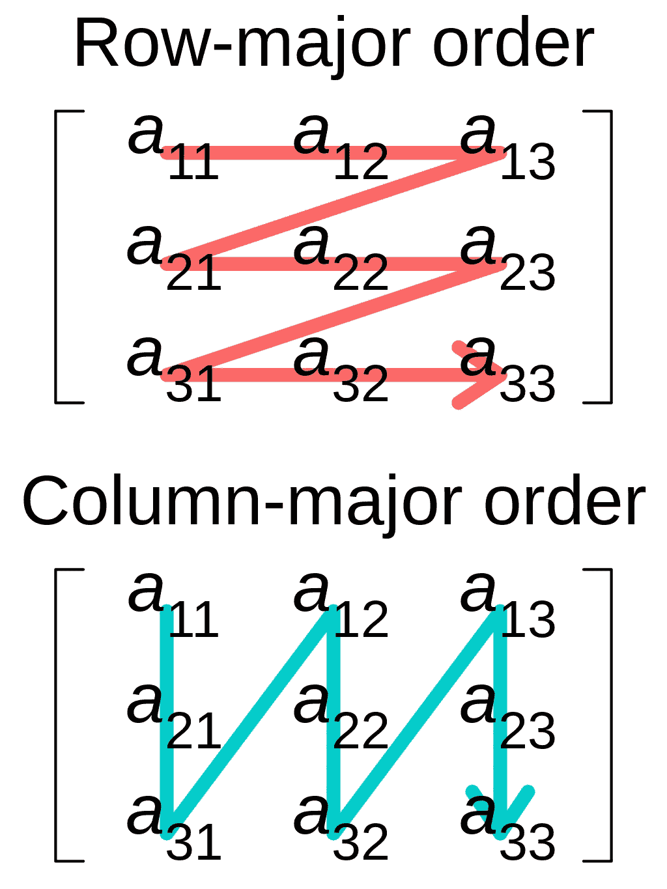

# 如何迭代一个 Pandas Dataframe

> 原文：[`towardsdatascience.com/how-to-iterate-over-a-pandas-dataframe-5dc15ab147f9`](https://towardsdatascience.com/how-to-iterate-over-a-pandas-dataframe-5dc15ab147f9)


照片由[Sid Balachandran](https://unsplash.com/@itookthose?utm_source=medium&utm_medium=referral)拍摄，来源于[Unsplash](https://unsplash.com/?utm_source=medium&utm_medium=referral)

## 行优先与列优先，Pandas 最佳实践

[](https://medium.com/@marcellopoliti?source=post_page-----5dc15ab147f9--------------------------------)[](https://towardsdatascience.com/?source=post_page-----5dc15ab147f9--------------------------------) [Marcello Politi](https://medium.com/@marcellopoliti?source=post_page-----5dc15ab147f9--------------------------------)

·发表于[Towards Data Science](https://towardsdatascience.com/?source=post_page-----5dc15ab147f9--------------------------------) ·4 分钟阅读·2023 年 5 月 18 日

--

如果你有一些数据科学的经验，你肯定遇到过从表格数据中开发算法的情况，这类常见挑战的例子有[Titanic — 从灾难中学习机器学习](https://www.kaggle.com/c/titanic)或波士顿房价数据。

以表格形式表示的数据（如 CSV 文件）可以分为**行优先格式**和**列优先格式**。在计算中，行优先顺序和列优先顺序是存储[多维数组](https://en.wikipedia.org/wiki/Multidimensional_array)的线性存储方法，如[随机存取内存](https://en.wikipedia.org/wiki/Random_access_memory)。根据格式设计的范式，有最佳实践可遵循，以优化文件的读写时间。数据科学家经常不幸地以错误的方式使用诸如 pandas 之类的库，从而浪费宝贵的时间

行优先格式意味着在表中，连续的行在内存中被连续保存。因此，如果我正在读取第 i 行，那么访问第 i+1 行将是一个非常快速的操作。

遵循列优先格式范式的格式，如 Parquet，会在内存中连续保存列。

在机器学习中，我们经常遇到行代表数据样本，列代表特征的情况。因此，如果我们需要快速访问样本，我们将使用 CSV 文件，如果我们经常需要访问特征（例如计算统计等），我们将使用 Parquet。



src: [`en.wikipedia.org/wiki/Row-_and_column-major_order#/media/File:Row_and_column_major_order.svg`](https://en.wikipedia.org/wiki/Row-_and_column-major_order#/media/File:Row_and_column_major_order.svg)

## Pandas

Pandas 是一个在数据科学中广泛使用的库，尤其是在处理表格数据时。Pandas 基于 DataFrame 的概念，即数据的表格表示。虽然 DataFrame 遵循列优先格式范式。

所以按行迭代 DataFrame，像通常做的那样，是非常慢的。让我们看一个例子，让我们导入 BostonHousing DataFrame 并进行迭代。

```py
import pandas as pd
import time
```

```py
df = pd.read_csv('https://raw.githubusercontent.com/selva86/datasets/master/BostonHousing.csv')
df.head()
```

在第一次实验中，我们迭代 DataFrame 的列（df.columns），然后访问每列中的所有元素，并计算完成该过程所需的时间。

```py
#iterating df by column
start = time.time()
for col in df.columns:
  for item in df[col]:
    pass
print(time.time() -start , " seconds")

#OUTPUT: 0.0021004676818847656  seconds
```

而在第二次实验中，我们使用 df.iloc 函数按行迭代 DataFrame，该函数返回整行的内容。

```py
#iterating df by row
n_rows = len(df)
start = time.time()
for i in range(n_rows):
  for item in df.iloc[i]:
    pass
print(time.time() -start , " seconds")

#OUTPUT : 0.059470415115356445  seconds
```

正如你所看到的，第二次实验的结果远大于第一次。在这种情况下，我们的数据集非常小，但如果你用自己的更大数据集进行尝试，你会注意到这种差异会变得越来越明显。

## **Numpy**

幸运的是，numpy 库来拯救我们。当我们使用 numpy 时，我们可以指定我们想要使用的主要顺序，默认情况下使用的是行优先顺序。

所以我们可以做的是将 pandas DataFrame 转换为 numpy，然后逐行迭代。让我们看一些实验。

我们首先将 DataFrame 转换为 numpy 格式。

```py
df_np = df.to_numpy()
n_rows, n_cols = df_np.shape
```

现在让我们按列迭代数据，并计算时间。

```py
#iterating numpy by columns
start = time.time()
for j in range(n_cols):
  for item in df_np[:,j]:
    pass
print(time.time() -start, " seconds")

#OUTPUT : 0.002185821533203125  seconds
```

现在按行迭代同样的操作。

```py
#iterating numpy by row
start = time.time()
for i in range(n_rows):
  for item in df_np[i]:
    pass
print(time.time() -start, " seconds")

#OUTPUT : 0.0023500919342041016  seconds
```

我们看到使用 numpy 时两个实验的速度都提高了！而且，两者之间的差异很小。

# 终极思考

在这篇文章中，我们介绍了处理表格数据时行优先和列优先范式的差异。我们指出了许多数据科学家使用 Pandas 时的一个常见错误。在这种情况下，访问数据的时间差异很小，因为我们使用了一个小数据集。但你必须小心，因为数据集越大，这种差异也会变大，你可能会浪费很多时间仅仅在读取数据上。作为解决方案，尽量在可能的情况下使用 numpy。

关注我以获取更多类似文章！[😉](https://emojipedia.org/it/apple/ios-15.4/faccina-che-fa-l-occhiolino/)

# 结束

*马切洛·波利蒂*

[Linkedin](https://www.linkedin.com/in/marcello-politi/)、[Twitter](https://twitter.com/_March08_)、[Website](https://marcello-politi.super.site/)
