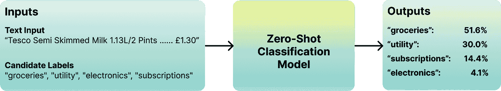
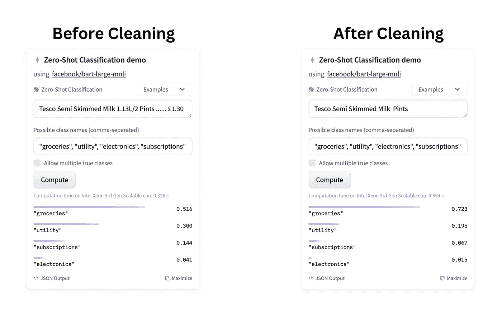
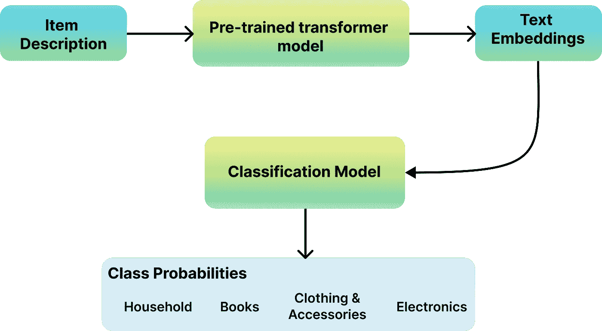
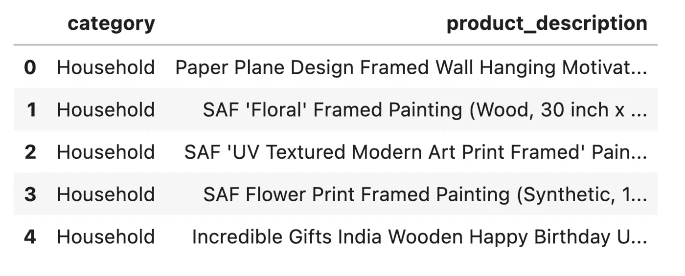
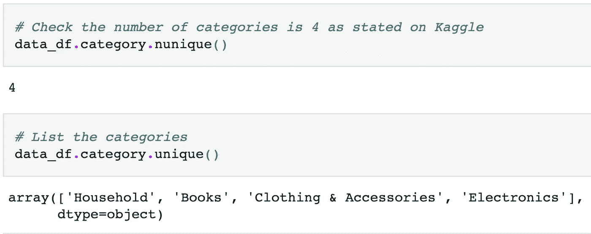
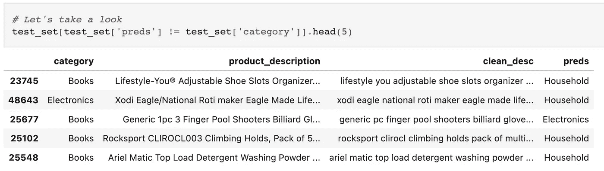

# 如何利用预训练的 Transformer 模型进行自定义文本分类？

> 原文：[`towardsdatascience.com/how-to-leverage-pre-trained-transformer-models-for-custom-text-categorisation-3757c517bd65`](https://towardsdatascience.com/how-to-leverage-pre-trained-transformer-models-for-custom-text-categorisation-3757c517bd65)

## 所以，你有一些自定义的文本数据集，想要进行分类，但不知道如何做？好吧，让我展示一下，如何利用预训练的最先进语言模型来实现。

[](https://saedhussain.medium.com/?source=post_page-----3757c517bd65--------------------------------)[](https://towardsdatascience.com/?source=post_page-----3757c517bd65--------------------------------) [Saed Hussain](https://saedhussain.medium.com/?source=post_page-----3757c517bd65--------------------------------)

·发布于[Towards Data Science](https://towardsdatascience.com/?source=post_page-----3757c517bd65--------------------------------) ·阅读时间 11 分钟·2023 年 3 月 31 日

--


图片来源于[Meagan Carsience](https://unsplash.com/@mcarsience_photography?utm_source=medium&utm_medium=referral)在[Unsplash](https://unsplash.com/?utm_source=medium&utm_medium=referral)

好吧，让我们直奔主题！你有一些自定义数据，现在想将其分类到自定义类别中。在本文中，我将展示你如何使用两种方法来实现这一目标。这两种方法都利用了最先进的基于 Transformer 的预训练模型。

请注意，本文的目标是与您分享方法及其使用方式。这不是一个包含最佳实践的完整数据科学教程。不幸的是，这超出了本文的范围。

本文中的所有代码可以在这个[GitHub 仓库](https://github.com/saedhussain/medium/tree/main/text_category/notebooks)中找到。

# 1: 零样本分类

## 概述

零样本分类是一种技术，它允许你在没有为特定任务训练专门模型的情况下对文本进行分类。相反，它使用已经在大量数据上训练过的预训练模型来执行分类。模型通常会在包括语言建模、文本补全和文本蕴涵等各种任务上进行训练。



使用预训练的 LLM 进行零样本文本分类（来源：作者）

要执行零样本分类，你只需向预训练模型提供一些文本和一个可能的类别列表。

模型将利用其对语言的理解和已有知识将文本分类到提供的类别之一。这种方法特别有用，当你为特定分类任务拥有的数据有限时，因为它允许你利用模型的已有知识。

由于它在特定任务上没有任何训练，因此被称为零样本分类。

## 实现

我们需要做的就是使用`pip install transformers`安装[hugging face transformers 库](https://github.com/huggingface/transformers)。我们将使用预训练的 Facebook BART（双向和自回归变换器）模型来完成这项任务。

***附注***：首次使用时，下载模型可能需要一些时间。

输出是一个包含 3 个键的字典：

+   **序列**：由管道分类的输入文本

+   **标签**：提供给管道的候选（类别）标签的列表，根据它们的概率分数进行排序。

+   **分数**：基于模型对输入文本属于该标签的可能性的预测，分配给每个候选标签的概率分数。

```py
from transformers import pipeline

pipe = pipeline(model="facebook/bart-large-mnli")
pipe("Tesco Semi Skimmed Milk 1.13L/2 Pints ...... £1.30",
    candidate_labels=["groceries", "utility", "electronics", "subscriptions"],
)

# output
>> {'sequence': 'Tesco Semi Skimmed Milk Pints',
 'labels': ['groceries', 'utility', 'subscriptions', 'electronics'],
 'scores': [0.9199661612510681,
  0.05123506113886833,
  0.022794339805841446,
  0.0060044946148991585]}
```

如你所见，在没有任何训练的情况下，模型已正确地将给定文本分类到“杂货”类别。因为模型是在特定语言的大型语料库上训练的，它能够理解该语言并进行推断。它理解了文本并从候选标签列表中识别了合适的类别。

简而言之，真是太棒了！！😊

模型越大，零样本分类任务的表现越好。有关更多信息，请查看 hugging face 上的[零样本分类页面](https://huggingface.co/tasks/zero-shot-classification)。

⚡️ 查看这个[笔记本](https://github.com/saedhussain/medium/blob/48db9652f83cbb83b547a0a55ff5bfb8355e0d26/text_category/notebooks/zero_shot_classification.ipynb)以获取更多示例。

## 什么时候使用它？

鉴于其在没有任何训练的情况下表现卓越，如果你了解类别的描述，我强烈建议首先尝试这个方法。它利用了最先进的预训练模型，并在没有任何训练的情况下提供了卓越的结果。

这里是一些非详尽的情况，当这些情况适合你的方法时：

1.  当你拥有有限的标注训练数据时

1.  当你需要快速原型一个解决方案时

1.  当你需要对新的或稀有的类别进行分类时

1.  当你需要将实例分类到多个类别中时

1.  当你想利用预训练模型对实例进行分类而无需额外训练时

1.  当你想将实例分类到由自然语言描述定义的类别中，而不是预定义标签时。

## 有哪些限制？

这里是使用零样本分类方法时需要考虑的一些潜在缺点和限制：

1.  有限的训练数据扩增：在零-shot 分类中，扩增训练数据以提升模型性能的范围有限，这与传统监督学习方法不同。

1.  对模型行为的控制有限：零-shot 分类依赖于预训练模型，这意味着你对其行为和学习到的模式的控制有限。这可能导致意外结果，特别是当模型没有在类似于你任务的数据上训练时。

1.  有限的自定义：由于零-shot 分类依赖于预训练模型，因此自定义或微调以适应特定任务的余地有限。这可能限制模型的准确性和性能，尤其是当任务涉及复杂或领域特定的语言时。

## 🚀 专业提示：始终清理你的文本！！

尽管基于变换器的 LLM 在处理嘈杂文本方面显著优于其他模型，但在将文本输入模型之前，仍然强烈建议清理文本。

这不仅是良好的数据科学实践，还会产生巨大差异。与干净文本输入相比，生成的嵌入在嘈杂文本数据中的相似性评分可能较低。这无疑会降低类别分类评分。

例如，下面是对这段文本——“*Tesco Semi Skimmed Milk 1.13L/2 Pints …… £1.30*”——在去除特殊字符和数字前后的分类对比。为什么不在[Hugging Face zero-shot classification](https://huggingface.co/tasks/zero-shot-classification)页面上试试呢？



使用零-shot 方法在清理文本前后的文本分类概率比较。（来源：作者）

> ☕️ 让我们在继续之前休息一下……


照片由[Victoria Tronina](https://unsplash.com/@victoriaorvicky?utm_source=medium&utm_medium=referral)拍摄，来自[Unsplash](https://unsplash.com/?utm_source=medium&utm_medium=referral)

> ☕️ 5 分钟后……好吧，让我们开始吧 🏃

# 2: 迁移学习（预训练模型 + 分类模型）

## 概述

这是一种比前一种方法更高级的方式。如前所述，零-shot 分类不允许针对特定任务进行自定义。这就是这种方法作为**长期解决方案**的所在。

在这种方法中，你使用预训练的变换器模型创建文本嵌入，然后训练一个分类模型将这些嵌入分类到各自的类别中。



解决方案概述：使用预训练模型将项目描述文本转换为文本嵌入，并使用分类模型将文本分类到不同类别中。（来源：作者）

为了演示这个例子，我们将使用来自 Kaggle 的[e-commerce 产品数据集](https://www.kaggle.com/datasets/saurabhshahane/ecommerce-text-classification)。

该数据集包含 4 个产品类别和产品的文本描述。目标是构建一个模型，可以将产品描述文本分类到这 4 个类别中。



[Kaggle](https://www.kaggle.com/datasets/saurabhshahane/ecommerce-text-classification)上的电子商务产品描述和类别数据。（来源：作者）



这个[数据集](https://www.kaggle.com/datasets/saurabhshahane/ecommerce-text-classification)中有 4 个类别。（来源：作者）

## 实现

这个方法的实现可以分为 4 个步骤：

1.  在将文本输入模型之前，请先清理文本。

1.  使用预训练的大型语言模型（LLM）生成文本嵌入。

1.  使用嵌入训练一个自定义类别的分类模型。

1.  使用训练好的模型和预处理管道进行预测。

到此为止，你将拥有一个分类模型，该模型利用了 LLM 在大量数据上训练学到的高质量嵌入。

这些嵌入是 LLM 成功的关键因素，因为它们捕捉了语言的丰富表示，能够有效捕捉文本中的意义和上下文的细微差别。

⚡️ 请注意，完整的代码可以在以下[笔记本](https://github.com/saedhussain/medium/blob/53453650d6b5281686796cdbf8e4d9592b376c85/text_category/notebooks/ecommerce_text_categorisation.ipynb)中找到。

## 步骤 1：清理文本

如前述方法所提，使用模型之前清理文本始终是一个好习惯。以下是本文中用于清理文本的`代码`。

***附注****：清理是高度任务特定的。在这个例子中，我只实现了一些基本的清理。作为最佳实践，最好先了解数据，然后实施一些任务特定的清理。例如，你可能需要根据具体任务的要求决定是否保留或删除数字。此外，通过删除不必要的词语/符号来减少文本量，可以减少后续处理的时间。祝清理愉快!* 😄

```py
import re

pattern = r"(?:\b\w+\b|['\"“”‘’])"
url_pattern = re.compile(r'http\S+|www\S+')
punct_pattern = re.compile(r'[^\w\s]')
digit_pattern = re.compile(r'\d+')
non_ascii_pattern = re.compile(r'[^\x00-\x7F]+')

def clean_text(text):

    # Convert to lowercase
    text = text.lower()
    # Remove URLs
    text = url_pattern.sub('', text)
    # Remove punctuation
    text = punct_pattern.sub(' ', text)
    # Remove digits
    text = digit_pattern.sub('', text)
    # Remove non-ASCII characters
    text = non_ascii_pattern.sub('', text)
    # Tokenize words and remove single characters
    words = [word for word in re.findall(pattern, text) if len(word) > 1]
    return ' '.join(words)

# Example Output  
text = "This is an example text with a URL https://www.example.com, some #hashtag."
cleaned_text = clean_text(text)
print(cleaned_text)
>> "this is an example text with url some hashtag"

# Apply it to both the training and test data.
train_df["clean_desc"] = train_df["item_description"].apply(lambda x: clean_text(x))
test_df["clean_desc"] = test_df["item_description"].apply(lambda x: clean_text(x))
```

## 步骤 2：生成文本嵌入

我们将使用来自 Hugging Face 的[SentenceTransformer](https://huggingface.co/sentence-transformers)库来创建文本嵌入。该库包含基于变换器的预训练模型，用于生成固定长度的文本数据向量表示，如段落或句子。

具体来说，我们将使用库中的*“paraphrase-mpnet-base-v2”*预训练模型，该模型生成长度为 768 的固定长度向量。

***附注***：为了节省时间，我减少了训练集和测试集的样本量。生成嵌入表示可能需要一些时间，尤其是在本地机器上。这可能会影响模型的性能。

```py
from sentence_transformers import SentenceTransformer

# Load SentenceTransformer model
model = SentenceTransformer('paraphrase-mpnet-base-v2')

# Example Output
sentence = ['This is a sample sentence for encoding.']
embedding = model.encode(sentence)
print(embedding)
>> [[ 4.99693975e-02 -1.26025528e-01 -9.15094614e-02  1.19477045e-02
   9.89145786e-02  9.02947485e-02  1.74566925e-01  1.84450839e-02
  -1.04984418e-01 ....... 8.46698135e-02  8.69197398e-03 -1.48386151e-01]]

# Generate embeddings for the training data
train_desc = train_df['clean_desc'].tolist()
train_embeddings = model.encode(train_desc)
X_train = np.array(train_embeddings)
```

## 步骤 3：训练分类模型

现在我们已经有了嵌入表示，我们准备训练一个分类模型，将这些嵌入表示分类到 4 个产品类别中的其中一个。

在这个演示中，我使用了 XGBoost 模型，但你可以随意使用你喜欢的模型！

***附注***：为了在训练过程中节省时间，网格搜索中使用了有限的超参数。此外，为了简化，我们使用准确率作为性能衡量标准。确保使用适当的指标来衡量你的分类任务的性能。

```py
from sklearn.model_selection import train_test_split,GridSearchCV
from sklearn.preprocessing import LabelEncoder
import xgboost as xgb

# Encode the target variable as categorical with one-hot encoding
le = LabelEncoder()
y_train = le.fit_transform(train_set['category'])

# Split the data into training and validation sets
X_train, X_val, y_train, y_val = train_test_split(X_train, y_train, test_size=0.2, random_state=42)

# Define the parameter grid for grid search cross-validation
param_grid = {
    'max_depth': [7],
    'n_estimators': [300],
    'learning_rate': [ 0.2, 0.5],
}

# Train an XGBoost model with grid search cross-validation
xgb_model = xgb.XGBClassifier(objective='multi:softmax', num_class=4)
grid_search = GridSearchCV(xgb_model, param_grid=param_grid, cv=5, n_jobs=-1, verbose=0)
grid_search.fit(X_train, y_train)
# -----------------------------------------------------------------

# Print the best hyperparameters found by grid search
print("Best hyperparameters:", grid_search.best_params_)

# Make predictions on the validation data using the best model
y_pred = grid_search.predict(X_val)

# Decode the predicted target variable
y_pred = le.inverse_transform(y_pred)

# Evaluate the performance of the model
accuracy = np.mean(y_pred == le.inverse_transform(y_val))
print(f"Accuracy: {accuracy:.2f}")

# Output
>> Best hyperparameters: {'learning_rate': 0.2, 'max_depth': 7, 'n_estimators': 300}
>> Accuracy: 0.94
```

## 步骤 4：运行预测

最后，打包文本处理步骤，加载训练好的分类器模型，你就可以在测试数据集上运行预测了。

```py
import pickle
# Save the trained model to a file
filename = 'xgb_model.sav'
pickle.dump(grid_search, open(filename, 'wb'))

# Load the model from file
loaded_model = pickle.load(open(filename, 'rb'))

# Define function to make predictions on new data
def predict_gl_code(text):
    # Preprocess the text data
    text = clean_text(text)

    # Generate embeddings for the text data
    embeddings = model.encode([text], show_progress_bar=False)
    X = np.array(embeddings)

    # Make predictions using the loaded model
    y_pred = loaded_model.predict(X)
    gl_code = le.inverse_transform(y_pred)[0]
    return gl_code

# Add a new column for predictions to the test dataframe
test_set['preds'] = test_set['clean_desc'].apply(predict_gl_code)

# Compute the accuracy of the model on the test data
accuracy = np.mean(test_set['preds'] == test_set['category'])
print(f"Accuracy: {accuracy:.2f}")

# Output 
>> Accuracy: 0.91
```

这就是各位的内容！！ 😃

在没有进行太多特定任务的文本清理的情况下，我们使用了预训练变换器模型生成的嵌入表示，并构建了一个分类器，将其分类到 4 个类别中，准确率为 91%。


测试数据集上的预测（preds）。 (来源:作者)



在测试数据集上预测错误的情况。 (来源:作者)

模型未能正确预测的情况可以通过使用更多的数据进行训练和执行特定任务的文本清理来改进。例如，保留维度编号，因为它有助于区分家庭产品与其他产品。

⚡️ 再次提醒，完整代码可在这个[笔记本](https://github.com/saedhussain/medium/blob/53453650d6b5281686796cdbf8e4d9592b376c85/text_category/notebooks/ecommerce_text_categorisation.ipynb)中找到。 🤗

# 最终想法

在这篇文章中，我们探讨了利用预训练的大型语言模型（LLMs）定制文本分类的两种不同方法。由于它们生成的高质量嵌入，我们可以以最小的努力取得令人印象深刻的结果。

由于这些 LLMs 已经在大量数据上进行过训练，它们对语言有深入的理解，并且能够有效捕捉文本中意义和语境的细微差别。

既然你知道了这两种方法，尝试一下你的文本分类任务吧！ 😃

👉 **别忘了关注以获取更多类似的文章。** 🤗

🚀 希望你觉得这篇文章对你有帮助。考虑使用[我的链接](https://medium.com/@saedhussain/membership)加入 Medium，获取我和其他平台上优秀作者的更多精彩内容！

*我的其他文章：*

[](/how-to-extract-and-convert-tables-from-pdf-files-to-pandas-dataframe-cb2e4c596fa8?source=post_page-----3757c517bd65--------------------------------) [## 如何从 PDF 文件中提取并转换表格到 Pandas 数据框？

### 所以你有一些包含表格的 PDF 文件，并且想将它们读取到一个 pandas 数据框中。让我来展示给你看。

[如何从 PDF 文件中提取并转换表格到 pandas 数据框](https://towardsdatascience.com/how-to-extract-and-convert-tables-from-pdf-files-to-pandas-dataframe-cb2e4c596fa8?source=post_page-----3757c517bd65--------------------------------) [](/how-to-schedule-a-serverless-google-cloud-function-to-run-periodically-249acf3a652e?source=post_page-----3757c517bd65--------------------------------) [## 如何调度无服务器 Google Cloud 函数以定期运行

### 你是否有一些代码需要定期运行？

[如何定期调度无服务器 Google Cloud 函数](https://towardsdatascience.com/how-to-schedule-a-serverless-google-cloud-function-to-run-periodically-249acf3a652e?source=post_page-----3757c517bd65--------------------------------) [](/how-to-develop-and-test-your-google-cloud-function-locally-96a970da456f?source=post_page-----3757c517bd65--------------------------------) [## 如何在本地开发和测试你的 Google Cloud 函数

### 因此，你已经编写了无服务器云函数，但不想浪费时间部署它并希望它能正常工作。让…

[如何在本地开发和测试你的 Google Cloud 函数](https://towardsdatascience.com/how-to-develop-and-test-your-google-cloud-function-locally-96a970da456f?source=post_page-----3757c517bd65--------------------------------) [](/machine-learning-model-as-a-serverless-endpoint-using-google-cloud-function-a5ad1080a59e?source=post_page-----3757c517bd65--------------------------------) [## 使用 Google Cloud Functions 将机器学习模型作为无服务器端点

### 因此，你已经构建了一个模型，并且想将它作为无服务器解决方案在 Google Cloud Platform (GCP) 上投入生产。让我来…

[使用 Google Cloud Functions 将机器学习模型作为无服务器端点](https://towardsdatascience.com/machine-learning-model-as-a-serverless-endpoint-using-google-cloud-function-a5ad1080a59e?source=post_page-----3757c517bd65--------------------------------)
