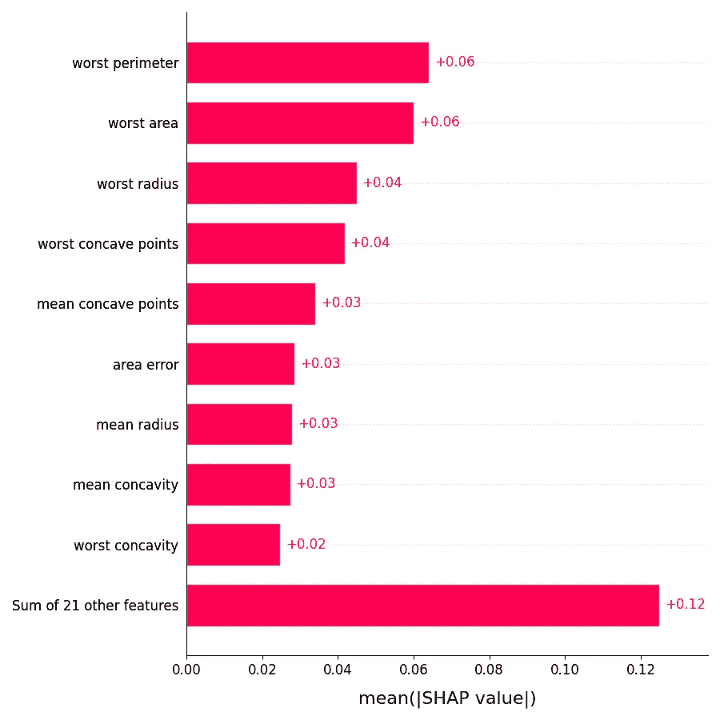
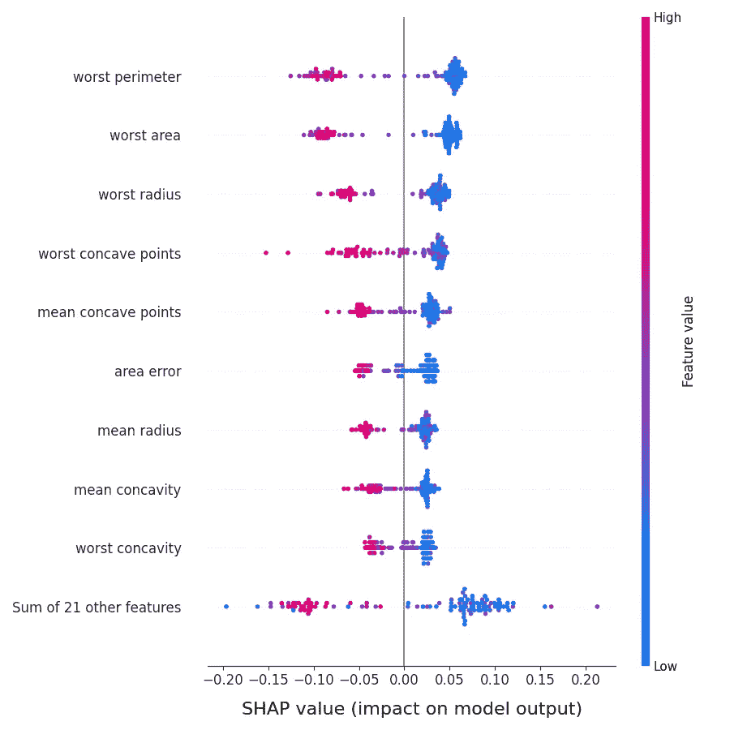
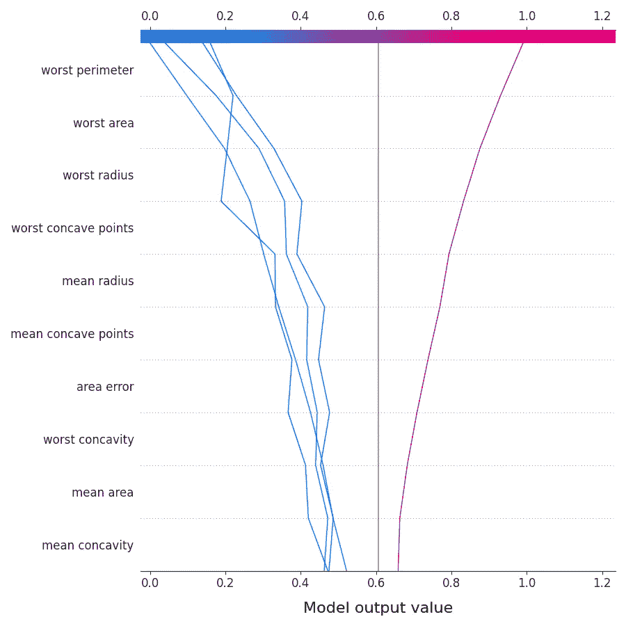

# 如何制作 40+个互动图表以分析你的机器学习管道

> 原文：[`towardsdatascience.com/how-to-make-40-interactive-plots-to-analyze-your-machine-learning-pipeline-ee718afd7bc2?source=collection_archive---------14-----------------------#2023-03-08`](https://towardsdatascience.com/how-to-make-40-interactive-plots-to-analyze-your-machine-learning-pipeline-ee718afd7bc2?source=collection_archive---------14-----------------------#2023-03-08)

## 一个关于如何制作干净、互动的 Python 图表以验证你的数据和模型的快速指南

[](https://tvdboom.medium.com/?source=post_page-----ee718afd7bc2--------------------------------)[](https://towardsdatascience.com/?source=post_page-----ee718afd7bc2--------------------------------) [Marco vd Boom](https://tvdboom.medium.com/?source=post_page-----ee718afd7bc2--------------------------------)

·

[关注](https://medium.com/m/signin?actionUrl=https%3A%2F%2Fmedium.com%2F_%2Fsubscribe%2Fuser%2Fe2091b627921&operation=register&redirect=https%3A%2F%2Ftowardsdatascience.com%2Fhow-to-make-40-interactive-plots-to-analyze-your-machine-learning-pipeline-ee718afd7bc2&user=Marco+vd+Boom&userId=e2091b627921&source=post_page-e2091b627921----ee718afd7bc2---------------------post_header-----------) 发表在 [Towards Data Science](https://towardsdatascience.com/?source=post_page-----ee718afd7bc2--------------------------------) ·4 分钟阅读·2023 年 3 月 8 日[](https://medium.com/m/signin?actionUrl=https%3A%2F%2Fmedium.com%2F_%2Fvote%2Ftowards-data-science%2Fee718afd7bc2&operation=register&redirect=https%3A%2F%2Ftowardsdatascience.com%2Fhow-to-make-40-interactive-plots-to-analyze-your-machine-learning-pipeline-ee718afd7bc2&user=Marco+vd+Boom&userId=e2091b627921&source=-----ee718afd7bc2---------------------clap_footer-----------)

--

[](https://medium.com/m/signin?actionUrl=https%3A%2F%2Fmedium.com%2F_%2Fbookmark%2Fp%2Fee718afd7bc2&operation=register&redirect=https%3A%2F%2Ftowardsdatascience.com%2Fhow-to-make-40-interactive-plots-to-analyze-your-machine-learning-pipeline-ee718afd7bc2&source=-----ee718afd7bc2---------------------bookmark_footer-----------)

图片由 [Markus Winkler](https://unsplash.com/@markuswinkler?utm_source=medium&utm_medium=referral) 在 [Unsplash](https://unsplash.com/?utm_source=medium&utm_medium=referral) 提供

## 介绍

图表已经成为帮助数据科学家和利益相关者理解机器学习项目过程和结果的事实标准工具。在本故事中，我们将向你展示如何使用[ATOM](https://github.com/tvdboom/ATOM)库轻松制作干净的交互式图表，以便快速分析数据集、检查管道、评估模型的性能并解释模型的结果。ATOM 是一个开源 Python 包，旨在帮助数据科学家加速机器学习管道的探索。如果你想对这个库有一个温和的介绍，请阅读这个故事。

## 数据图表

让我们从图表开始，以帮助你更好地理解你正在处理的数据集。如何转换管道和训练模型使用 ATOM 超出了本故事的范围。阅读这个故事或这个故事以了解更多信息。在这里，我们将直接深入到图表制作中。

初始化*atom*后，创建图表就像调用适当的方法一样简单。除了一些例外，图表是使用[plotly](https://plotly.com/python/)库制作的，并以 html 渲染。点击[这里](https://tvdboom.github.io/ATOM/latest/user_guide/plots/#data-plots)查看所有可用数据图表方法的列表。

```py
from atom import ATOMClassifier
from sklearn.datasets import load_breast_cancer

X, y = load_breast_cancer(return_X_y=True, as_frame=True)

atom = ATOMClassifier(X, y)

atom.plot_correlation()
```

```py
atom.plot_distribution(columns=0)
```

```py
atom.plot_relationships(columns=(0, 1, 2))
```

## 特征选择图表

特征选择图表可以帮助你分析由[PCA](https://scikit-learn.org/stable/modules/generated/sklearn.decomposition.PCA.html)或[RFECV](https://scikit-learn.org/stable/modules/generated/sklearn.feature_selection.RFECV.html)策略选择的特征。点击[这里](https://tvdboom.github.io/ATOM/latest/user_guide/plots/#feature-selection-plots)查看所有特征选择图表的列表。

```py
from atom import ATOMClassifier
from sklearn.datasets import load_breast_cancer

X, y = load_breast_cancer(return_X_y=True, as_frame=True)

atom = ATOMClassifier(X, y)
atom.feature_selection("pca", n_features=5)

atom.plot_pca()
```

```py
atom.plot_components(show=10)
```

## 超参数调优图表

ATOM 使用[optuna](https://optuna.readthedocs.io/en/stable/index.html)库来应用[超参数调优](https://tvdboom.github.io/ATOM/latest/user_guide/training/#hyperparameter-tuning)。通过 optuna 提供的图表也可以通过 ATOM 的 API 直接获取，还有一些额外的图表。点击[这里](https://tvdboom.github.io/ATOM/latest/user_guide/plots/#hyperparameter-tuning-plots)查看所有超参数调优图表的列表。

```py
from atom import ATOMClassifier
from sklearn.datasets import load_breast_cancer

X, y = load_breast_cancer(return_X_y=True, as_frame=True)

atom = ATOMClassifier(X, y)
atom.run(models="RF", metric="f1", n_trials=15)

atom.plot_hyperparameters(params=(0, 1, 2))
```

```py
atom.plot_parallel_coordinate(params=slice(1, 5))
```

```py
atom.plot_slice(params=(0, 1, 2))
```

## 预测图表

在训练模型之后，使用其在训练集和测试集上的预测来评估模型的性能或检查特征重要性。ATOM 最强大的功能之一是能够在同一图表中绘制多个模型或数据集（例如，训练集与测试集）的结果。

```py
from atom import ATOMClassifier

X = pd.read_csv("https://raw.githubusercontent.com/tvdboom/ATOM/master/examples/datasets/weatherAUS.csv")

atom = ATOMClassifier(X, y="RainTomorrow")
atom.impute()
atom.encode()
atom.run(models=["LR", "RF"])

atom.plot_roc()
```

```py
atom.plot_prc(models="RF", dataset="train+test")
```

```py
atom.plot_feature_importance(show=10)
```

## 可解释性图表

[SHAP](https://github.com/slundberg/shap)（SHapley Additive exPlanations）Python 包使用博弈论的方法来解释任何机器学习模型的输出。它将最优的信用分配与本地解释联系起来，使用经典的[Shapley 值](https://en.wikipedia.org/wiki/Shapley_value)及其相关扩展。ATOM 实现了从其 API 直接绘制 SHAP 的 7 种绘图功能的方法。由于这些图不是由 ATOM 生成的，因此它们既不具备交互性，也不能显示多个模型。

```py
from atom import ATOMClassifier
from sklearn.datasets import load_breast_cancer

X, y = load_breast_cancer(return_X_y=True, as_frame=True)

atom = ATOMClassifier(X, y)
atom.run(models="RF")

atom.plot_shap_bar()
```



```py
atom.plot_shap_beeswarm(show=10)
```



```py
atom.plot_shap_decision(index=slice(5), show=10)
```



## 参数

除了特定于图表的参数外，所有图表共有五个参数：

+   `title`参数为图表添加标题。默认值不显示任何标题。提供配置（作为字典）以自定义其外观，例如`title=dict(text="Awesome plot", color="red")`。更多信息请参阅 plotly 的[文档](https://plotly.com/python/figure-labels/)。

+   `legend`参数用于显示/隐藏、定位或自定义图表的图例。提供配置（作为字典）以自定义其外观（例如`legend=dict(title="Title for legend", title_font_color="red")`）或选择以下位置之一：左上角、右上角、左下角、右下角、上中、下中、左中、右中、中间、外部。

+   `figsize`参数调整图表的大小。

+   `filename`参数用于保存图表。

+   `display`参数确定是否显示或返回图表。

```py
from atom import ATOMClassifier
from sklearn.datasets import load_breast_cancer

X, y = load_breast_cancer(return_X_y=True, as_frame=True)

atom = ATOMClassifier(X, y)

atom.plot_distribution(
    columns=0,
    title=dict(
        text="Custom left side title",
        font_color="teal",
        x=0,
        xanchor="left",
    ),
    legend="upper left",
)
```

## 结论

我们已经展示了如何使用 ATOM 包制作交互式图表，以快速分析机器学习管道的结果。要查看所有可用图表的列表，请点击[这里](https://tvdboom.github.io/ATOM/latest/user_guide/plots/#available-plots)。

欲了解有关 ATOM 的更多信息，请查看软件包的[文档](https://tvdboom.github.io/ATOM/)。如有错误或功能请求，请随时在[GitHub](https://github.com/tvdboom/ATOM)上提交问题或给我发邮件。

相关故事：

+   `towardsdatascience.com/atom-a-python-package-for-fast-exploration-of-machine-learning-pipelines-653956a16e7b`

+   `towardsdatascience.com/how-to-test-multiple-machine-learning-pipelines-with-just-a-few-lines-of-python-1a16cb4686d`

+   `towardsdatascience.com/from-raw-data-to-web-app-deployment-with-atom-and-streamlit-d8df381aa19f`

+   `towardsdatascience.com/exploration-of-deep-learning-pipelines-made-easy-e1cf649892bc`

+   `towardsdatascience.com/deep-feature-synthesis-vs-genetic-feature-generation-6ba4d05a6ca5`

+   `towardsdatascience.com/from-raw-text-to-model-prediction-in-under-30-lines-of-python-32133d853407`

参考文献：

+   本文中的所有图表均由作者创建。
