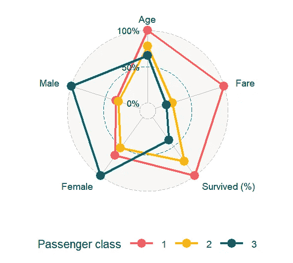
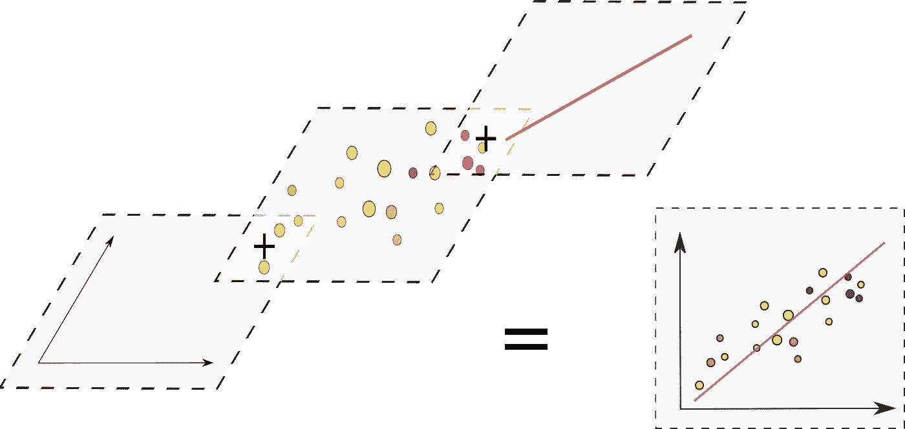
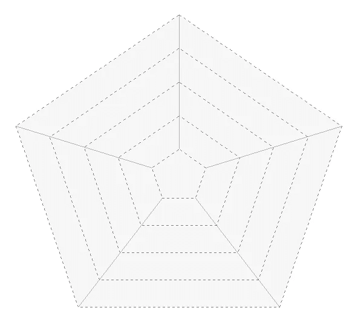
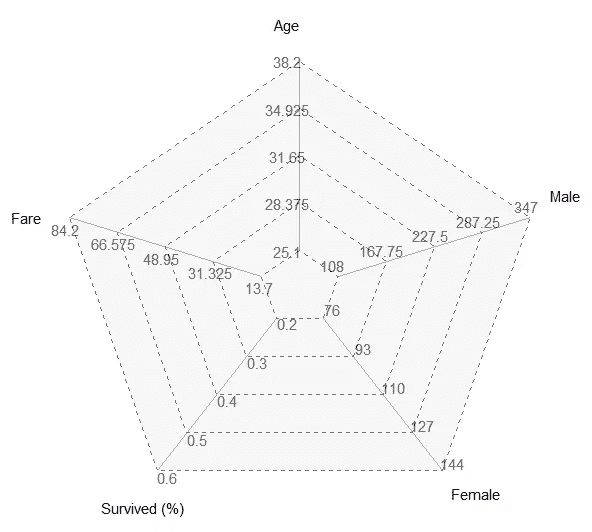
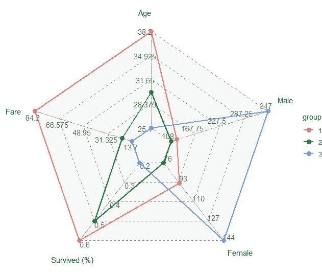
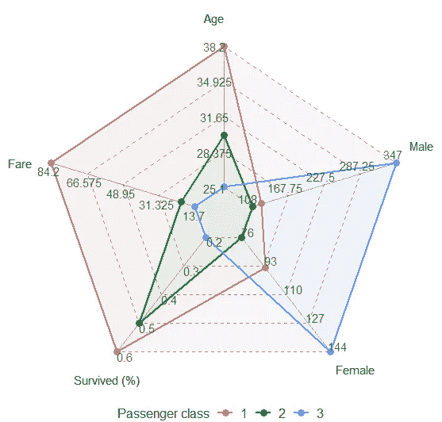
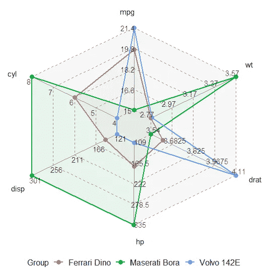

# 如何在 R 中使用 ggplot2 制作蜘蛛图

> 原文：[`towardsdatascience.com/how-to-make-a-spider-chart-in-r-using-ggplot2-85a4f1898cab?source=collection_archive---------4-----------------------#2023-01-11`](https://towardsdatascience.com/how-to-make-a-spider-chart-in-r-using-ggplot2-85a4f1898cab?source=collection_archive---------4-----------------------#2023-01-11)

## 一步一步构建蜘蛛图/雷达图

[](https://medium.com/@zvonimir.boban.mef?source=post_page-----85a4f1898cab--------------------------------)[](https://towardsdatascience.com/?source=post_page-----85a4f1898cab--------------------------------) [Zvonimir Boban](https://medium.com/@zvonimir.boban.mef?source=post_page-----85a4f1898cab--------------------------------)

·

[关注](https://medium.com/m/signin?actionUrl=https%3A%2F%2Fmedium.com%2F_%2Fsubscribe%2Fuser%2Fe31978768a4e&operation=register&redirect=https%3A%2F%2Ftowardsdatascience.com%2Fhow-to-make-a-spider-chart-in-r-using-ggplot2-85a4f1898cab&user=Zvonimir+Boban&userId=e31978768a4e&source=post_page-e31978768a4e----85a4f1898cab---------------------post_header-----------) 发布于 [Towards Data Science](https://towardsdatascience.com/?source=post_page-----85a4f1898cab--------------------------------) ·8 分钟阅读·2023 年 1 月 11 日[](https://medium.com/m/signin?actionUrl=https%3A%2F%2Fmedium.com%2F_%2Fvote%2Ftowards-data-science%2F85a4f1898cab&operation=register&redirect=https%3A%2F%2Ftowardsdatascience.com%2Fhow-to-make-a-spider-chart-in-r-using-ggplot2-85a4f1898cab&user=Zvonimir+Boban&userId=e31978768a4e&source=-----85a4f1898cab---------------------clap_footer-----------)

--

[](https://medium.com/m/signin?actionUrl=https%3A%2F%2Fmedium.com%2F_%2Fbookmark%2Fp%2F85a4f1898cab&operation=register&redirect=https%3A%2F%2Ftowardsdatascience.com%2Fhow-to-make-a-spider-chart-in-r-using-ggplot2-85a4f1898cab&source=-----85a4f1898cab---------------------bookmark_footer-----------)

图片由 [Divyadarshi Acharya](https://unsplash.com/@lincon_street?utm_source=unsplash&utm_medium=referral&utm_content=creditCopyText) 提供，来自 [Unsplash](https://unsplash.com/photos/Qbs6liSxjr8?utm_source=unsplash&utm_medium=referral&utm_content=creditCopyText)

了解到雷达图可以制作引人注目的可视化，我尝试寻找合适的 R 库。当我的搜索几乎没有结果时，我感到惊讶**（编辑：在写这篇文章后不久，我创建了`**ggvanced**`包，其中的`**ggspider**`函数处理了这个问题。你可以在[**另一篇文章**](https://medium.com/towards-data-science/ggvanced-a-package-for-generating-advanced-data-visualizations-on-top-of-the-ggplot2-package-2a935763a4b)中了解更多信息。）**。我找到的唯一一个包是`ggradar`，它不在 CRAN 上，只能从 GitHub 安装。

我决定尝试使用`titanic`包中的泰坦尼克号数据。为了计算所需的数据汇总并将数据转换为绘图所需的形状，我使用了`dplyr`、`tidyr`、`tibble`、`purr`和`scales`包。如果你不熟悉这些，请查看我之前关于 R 数据处理的文章。

[](/diving-into-the-tidyverse-using-the-titanic-data-83f54295d5df?source=post_page-----85a4f1898cab--------------------------------) ## 深入探索 tidyverse 使用泰坦尼克号数据

[towardsdatascience.com

```py
library(dplyr)
library(tidyr)
library(tibble)
library(purrr)

Titanic <- titanic_train

Titanic_gr1 <-
  Titanic %>%
  select(Survived:Fare) %>%
  group_by(Pclass) %>%
  summarise(across(c(Age, Fare), mean, na.rm = TRUE))

Titanic_gr2 <-
  Titanic %>%
  select(Survived:Fare) %>%
  group_by(Pclass, Survived) %>%
  summarise(N = n()) %>%
  pivot_wider(names_from = Survived, values_from = N) %>%
  mutate("Survived (%)" = `1`/(`0` + `1`)) %>%
  select(1,4)

Titanic_gr3 <-
  Titanic %>%
  select(Survived:Fare) %>%
  group_by(Pclass, Sex) %>%
  summarise(N = n()) %>%
  pivot_wider(names_from = Sex, values_from = N)

Titanic_gr <- reduce(list(Titanic_gr1, 
                          Titanic_gr2, 
                          Titanic_gr3), left_join) %>%
  rename(Male = "male", Female = "female")
```

```py
Titanic_gr

# A tibble: 3 × 6
  Pclass   Age  Fare `Survived (%)` Female  Male
   <int> <dbl> <dbl>          <dbl>  <int> <int>
1      1  38.2  84.2          0.630     94   122
2      2  29.9  20.7          0.473     76   108
3      3  25.1  13.7          0.242    144   347
```

安装并加载`ggradar`包并将数据重新缩放到(0, 1)区间后，我们可以通过调用`ggradar`函数来创建雷达图。

```py
library(ggplot2)
library(scales)
library(devtools)
install_github("ricardo-bion/ggradar", dependencies=TRUE)
library(ggradar)

Titanic_gr %>%
  mutate(across(-Pclass, normiranje)) %>%
  ggradar(legend.title = "Passenger class") +
  theme(legend.position = "bottom", legend.title = element_text(size = 17))
```



使用 ggradar 包制作的雷达图。图片来源：作者

尽管获得的图表整洁且视觉上令人愉悦，但我希望每个变量有独立的轴。虽然雷达图和蜘蛛图的名称通常可以互换使用，但我认为在每个变量都有自己的轴的情况下，蜘蛛图更为合适，而雷达图则适用于上述图片中的情况。不幸的是，因为我更感兴趣的是创建蜘蛛图，并且这个包中没有这种选项，所以我不得不自行解决这个问题。

# 进入 ggplot2

`ggplot2`的美在于其底层的图形语法，允许通过将多个图层叠加在一起创建图表。这一强大的概念让我们能够创建几乎任何可视化，只要我们知道如何编码。我将使用它从零开始构建一个蜘蛛图。



使用 ggplot2 包构建图表背后的哲学。图片来源：作者

分层方法要求分别构建图表的不同方面。首先我们将创建图表轮廓。由于蜘蛛图涉及极坐标，我编写了一个函数，该函数根据数据集中变量的数量计算多边形顶点的坐标。

```py
library(dplyr)
library(tidyr)
library(tibble)
library(purrr)
library(scales)
library(ggplot2)

p_data <- Titanic_gr %>% rename(group = "Pclass")

circle_coords <- function(r, n_axis = ncol(p_data) - 1){
  fi <- seq(0, 2*pi, (1/n_axis)*2*pi) + pi/2
  x <- r*cos(fi)
  y <- r*sin(fi)

  tibble(x, y, r)
}

central_distance <- 0.2

step_1 <- map_df(seq(0, 1, 0.25) + central_distance, circle_coords) %>%
    ggplot(aes(x, y)) +
    geom_polygon(data = circle_coords(1 + central_distance), 
                 alpha = 1, fill = "gray97") +
    geom_path(aes(group = r), lty = 2, alpha = 0.5) +
    theme_void()
```


第一步：创建图表的背景。图片来源：作者

接下来，我们需要计算坐标轴的坐标并将它们添加到图表中。

```py
axis_coords <- function(n_axis){
  fi <- seq(0, (1 - 1/n_axis)*2*pi, (1/n_axis)*2*pi) + pi/2
  x1 <- central_distance*cos(fi)
  y1 <- central_distance*sin(fi)
  x2 <- (1 + central_distance)*cos(fi)
  y2 <- (1 + central_distance)*sin(fi)

  tibble(x = c(x1, x2), y = c(y1, y2), id = rep(1:n_axis, 2))
}

step_2 <- step_1 + geom_line(data = axis_coords(ncol(p_data) - 1), 
aes(x, y, group = id), alpha = 0.3)
```



为数据集中的每个变量添加坐标轴。图片由作者提供

现在我们可以添加文本标签和坐标轴的名称。

```py
text_data <- p_data %>%
  select(-group) %>%
  map_df(~ min(.) + (max(.) - min(.)) * seq(0, 1, 0.25)) %>%
  mutate(r = seq(0, 1, 0.25)) %>%
  pivot_longer(-r, names_to = "parameter", values_to = "value")

text_coords <- function(r, n_axis = ncol(p_data) - 1){
  fi <- seq(0, (1 - 1/n_axis)*2*pi, (1/n_axis)*2*pi) + pi/2 + 0.01*2*pi/r
  x <- r*cos(fi)
  y <- r*sin(fi)

  tibble(x, y, r = r - central_distance)
}

labels_data <- map_df(seq(0, 1, 0.25) + central_distance, text_coords) %>%
  bind_cols(text_data %>% select(-r))

step_3 <- step_2 + 
    geom_text(data = labels_data, aes(x, y, label = value), alpha = 0.65) +
    geom_text(data = text_coords(1 + central_distance + 0.2), 
              aes(x, y), label = labels_data$parameter[1:(ncol(p_data)-1)])
```



添加坐标轴名称和标签。图片由作者提供

现在剩下的工作就是叠加数据点。

```py
rescaled_coords <- function(r, n_axis){
  fi <- seq(0, 2*pi, (1/n_axis)*2*pi) + pi/2
  tibble(r, fi) %>% mutate(x = r*cos(fi), y = r*sin(fi)) %>% select(-fi)
}

rescaled_data <- p_data %>% 
  mutate(across(-group, rescale)) %>%
  mutate(copy = pull(., 2)) %>% 
  pivot_longer(-group, names_to = "parameter", values_to = "value") %>%
  group_by(group) %>%
  mutate(coords = rescaled_coords(value + central_distance, ncol(p_data) - 1)) %>%
  unnest

step_4 <- step_3 + 
    geom_point(data = rescaled_data, 
               aes(x, y, group = group, col = group), 
               size = 3) +
    geom_path(data = rescaled_data, 
              aes(x, y, group = group, col = group), 
              size = 1)
```



用数据点叠加图表。图片由作者提供

以及一些最后的美学修饰……

```py
step_5 <- step_4 + 
    labs(col = "Passenger class") +
    theme(legend.position = "bottom",
          legend.text = element_text(size = 12),
          legend.title = element_text(size = 12)) 
```



最终的蛛网图。图片由作者提供

哒哒，我们的工作完成了。让我们再花一点时间评论一下显示的数字。头等舱乘客是三者中年龄最大、最富有的。三等舱乘客中男性和女性人数最多，是最年轻的一组——可能大多数是年轻人和寻求更好生活的家庭。然而，头等舱乘客的生还率最高，而三等舱的最低。这可能部分是因为头等舱距离船甲板较近，部分是因为该舱等级的女性比例较高（因为女性和儿童是优先救援的）。

# 奖励积分

为了使图表更容易复现，我将上述代码制作成了一个函数。

```py
library(dplyr)
library(tidyr)
library(tibble)
library(purrr)
library(scales)
library(ggplot2)

ggspider <- function(p_data, 
legend_title = "Group", 
background_color = "gray97", 
area_fill = TRUE, 
central_distance = 0.2, 
axis_name_offset = 0.2){

circle_coords <- function(r, n_axis = ncol(p_data) - 1){
  fi <- seq(0, 2*pi, (1/n_axis)*2*pi) + pi/2
  x <- r*cos(fi)
  y <- r*sin(fi)

  tibble(x, y, r)
}

(step_1 <- map_df(seq(0, 1, 0.25) + central_distance, circle_coords) %>%
    ggplot(aes(x, y)) +
    geom_polygon(data = circle_coords(1 + central_distance), alpha = 1, fill = background_color) +
    geom_path(aes(group = r), lty = 2, alpha = 0.5) +
    theme_void())

axis_coords <- function(n_axis){
  fi <- seq(0, (1 - 1/n_axis)*2*pi, (1/n_axis)*2*pi) + pi/2
  x1 <- central_distance*cos(fi)
  y1 <- central_distance*sin(fi)
  x2 <- (1 + central_distance)*cos(fi)
  y2 <- (1 + central_distance)*sin(fi)

  tibble(x = c(x1, x2), y = c(y1, y2), id = rep(1:n_axis, 2))
}

text_data <- p_data %>%
  select(-group) %>%
  map_df(~ min(.) + (max(.) - min(.)) * seq(0, 1, 0.25)) %>%
  mutate(r = seq(0, 1, 0.25)) %>%
  pivot_longer(-r, names_to = "parameter", values_to = "value")

text_coords <- function(r, n_axis = ncol(p_data) - 1){
  fi <- seq(0, (1 - 1/n_axis)*2*pi, (1/n_axis)*2*pi) + pi/2 + 0.01*2*pi/r
  x <- r*cos(fi)
  y <- r*sin(fi)

  tibble(x, y, r = r - central_distance)
}

labels_data <- map_df(seq(0, 1, 0.25) + central_distance, text_coords) %>%
  bind_cols(text_data %>% select(-r))

rescaled_coords <- function(r, n_axis){
  fi <- seq(0, 2*pi, (1/n_axis)*2*pi) + pi/2
  tibble(r, fi) %>% mutate(x = r*cos(fi), y = r*sin(fi)) %>% select(-fi)
}

rescaled_data <- p_data %>% 
  mutate(across(-group, rescale)) %>%
  mutate(copy = pull(., 2)) %>%
  pivot_longer(-group, names_to = "parameter", values_to = "value") %>%
  group_by(group) %>%
  mutate(coords = rescaled_coords(value + central_distance, ncol(p_data) - 1)) %>%
  unnest

  step_1 + 
    geom_line(data = axis_coords(ncol(p_data) - 1), 
              aes(x, y, group = id), alpha = 0.3) +
    geom_point(data = rescaled_data, 
              aes(x, y, group = group, col = group), size = 3) +
    geom_path(data = rescaled_data, 
              aes(x, y, group = group, col = group), size = 1) +
    {if(area_fill == TRUE) geom_polygon(data = rescaled_data, 
                            aes(x, y, group = group, 
                                col = group, fill = group), 
                                size = 1, alpha = 0.05, show.legend = FALSE)} +
    geom_text(data = labels_data, 
                     aes(x, y, label = value), alpha = 0.65) +
    geom_text(data = text_coords(1 + central_distance + axis_name_offset), 
              aes(x, y), label = labels_data$parameter[1:(ncol(p_data)-1)]) +
    labs(col = legend_title) +
    theme(legend.position = "bottom",
          legend.text = element_text(size = 12),
          legend.title = element_text(size = 12))
}
```

现在，我们可以在一些不同的数据上轻松测试这个函数，比如内置于 R 中的`mtcars`数据集。

```py
p_data <- mtcars %>%
  rownames_to_column(var = "group") %>%
  as_tibble() %>%
  tail(3) %>%
  select(1:7)

ggspider(p_data)
```



mtcars 数据集的蛛网图。图片由作者提供

# 结论

本文展示了如何在 R 中从头构建蛛网图。虽然我知道的 R 包中没有支持这种图表的，但利用`ggplot2`包中的分层图形语法方法为我提供了自己创建这种图表的工具。当然，图表的美学方面仍有改进的空间，但那是另一个文章的话题。

就这些了。我希望你觉得这篇文章有用，并将其用于未来制作更多精美的蛛网图。享受吧！

附言：如果你喜欢这篇文章，请点赞并关注，以便未来获得更多类似内容。此外，随时欢迎提出你认为值得在 R 中实现的其他有趣可视化建议。
