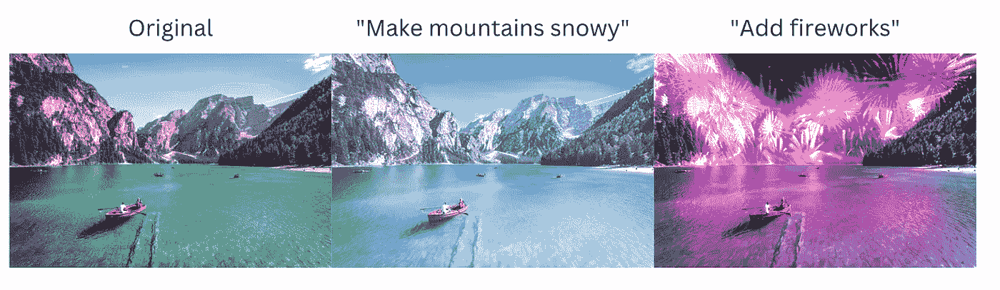
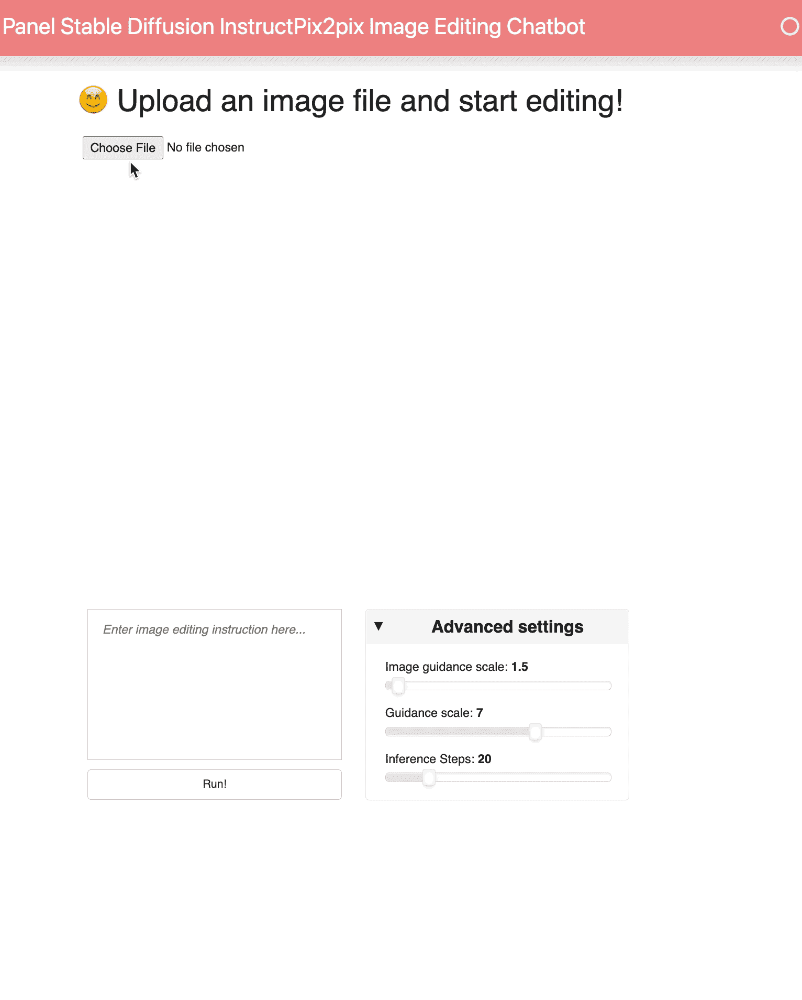

# 如何制作 AI 图像编辑聊天机器人

> 原文：[`towardsdatascience.com/how-to-make-an-ai-image-editing-chatbot-1ddd0209884?source=collection_archive---------10-----------------------#2023-02-01`](https://towardsdatascience.com/how-to-make-an-ai-image-editing-chatbot-1ddd0209884?source=collection_archive---------10-----------------------#2023-02-01)

## 面板应用中的稳定扩散 InstructPix2Pix

 [Sophia Yang, Ph.D.](https://sophiamyang.medium.com/?source=post_page-----1ddd0209884--------------------------------)

·

[关注](https://medium.com/m/signin?actionUrl=https%3A%2F%2Fmedium.com%2F_%2Fsubscribe%2Fuser%2Fae9cae9cbcd2&operation=register&redirect=https%3A%2F%2Ftowardsdatascience.com%2Fhow-to-make-an-ai-image-editing-chatbot-1ddd0209884&user=Sophia+Yang%2C+Ph.D.&userId=ae9cae9cbcd2&source=post_page-ae9cae9cbcd2----1ddd0209884---------------------post_header-----------) 发表在 [Towards Data Science](https://towardsdatascience.com/?source=post_page-----1ddd0209884--------------------------------) · 5 min read · 2023 年 2 月 1 日 

--

由 [Sophia Yang](https://www.linkedin.com/in/sophiamyang/) 和 [Philipp Rudiger](https://www.linkedin.com/in/philippjfr/) 撰写

使用 InstructPix2Pix 进行图像编辑的示例。（原图由 [Pietro De Grandi](https://unsplash.com/@peter_mc_greats?utm_source=unsplash&utm_medium=referral&utm_content=creditCopyText) 提供，发布在 [Unsplash](https://unsplash.com/images/nature/mountain?utm_source=unsplash&utm_medium=referral&utm_content=creditCopyText)）

InstructPix2Pix 是一个条件扩散模型，它结合了语言模型 GPT-3 和文本到图像模型 Stable Diffusion，根据用户提示执行图像编辑。受到 [InstructPix2Pix 项目](https://github.com/timothybrooks/instruct-pix2pix) 和 [多个](https://huggingface.co/spaces/ysharma/InstructPix2Pix_Chatbot) [应用](https://huggingface.co/timbrooks/instruct-pix2pix) 在 HuggingFace 上托管的启发，我们希望在 Panel 中制作一个 AI 图像编辑聊天机器人。Panel 是一个 Python 仪表盘工具，使我们能够用几行代码构建这个聊天机器人。

+   查看 Hugging Face 空间上的实时应用：[`huggingface.co/spaces/sophiamyang/Panel_InstructPix2Pix`](https://huggingface.co/spaces/sophiamyang/Panel_InstructPix2Pix)（我们只会保持其在线几天。GPU 非常昂贵！！！）。

在本文中，我们将逐步展示如何制作这个聊天机器人：

在 Panel 应用中的 Stable Diffusion InstructPix2Pix 聊天机器人

# **通过 Anaconda 设置 Python**

由于我们正在制作一个 Python 应用，首先需要安装 Python。下载 [Anaconda](http://anaconda.com) 是获取 Python 和 Conda 环境管理的最简单和推荐的方法。
