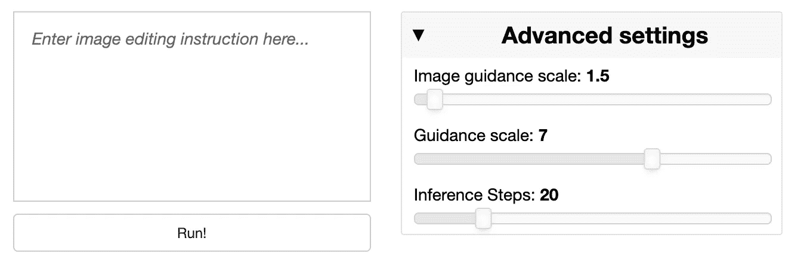

# 如何制作 AI 图像编辑聊天机器人

> 原文：[`towardsdatascience.com/how-to-make-an-ai-image-editing-chatbot-1ddd0209884`](https://towardsdatascience.com/how-to-make-an-ai-image-editing-chatbot-1ddd0209884)

## Stable Diffusion InstructPix2Pix 在 Panel 应用中

[](https://sophiamyang.medium.com/?source=post_page-----1ddd0209884--------------------------------)[](https://towardsdatascience.com/?source=post_page-----1ddd0209884--------------------------------) [Sophia Yang, Ph.D.](https://sophiamyang.medium.com/?source=post_page-----1ddd0209884--------------------------------)

·发表于 [Towards Data Science](https://towardsdatascience.com/?source=post_page-----1ddd0209884--------------------------------) ·阅读时间 5 分钟·2023 年 2 月 1 日

--

由 [Sophia Yang](https://www.linkedin.com/in/sophiamyang/) 和 [Philipp Rudiger](https://www.linkedin.com/in/philippjfr/)


使用 InstructPix2Pix 进行图像编辑的示例。（原图由 [Pietro De Grandi](https://unsplash.com/@peter_mc_greats?utm_source=unsplash&utm_medium=referral&utm_content=creditCopyText) 提供，来源于 [Unsplash](https://unsplash.com/images/nature/mountain?utm_source=unsplash&utm_medium=referral&utm_content=creditCopyText)）

InstructPix2Pix 是一种条件扩散模型，将语言模型 GPT-3 和文本到图像模型 Stable Diffusion 结合起来，根据用户提示进行图像编辑。受到 [InstructPix2Pix 项目](https://github.com/timothybrooks/instruct-pix2pix) 和在 HuggingFace 上托管的 [多个](https://huggingface.co/spaces/ysharma/InstructPix2Pix_Chatbot) [应用](https://huggingface.co/timbrooks/instruct-pix2pix) 的启发，我们有兴趣在 Panel 中创建一个 AI 图像编辑聊天机器人。Panel 是一个 Python 仪表板工具，可以让我们通过仅几行代码构建这个聊天机器人。

+   查看 Hugging Face 空间中的实时应用：[`huggingface.co/spaces/sophiamyang/Panel_InstructPix2Pix`](https://huggingface.co/spaces/sophiamyang/Panel_InstructPix2Pix)（我们只会保持几天的在线状态。GPU 非常昂贵！！！）。

在本文中，我们将逐步展示如何制作这个聊天机器人：


Stable Diffusion InstructPix2Pix 聊天机器人在 Panel 应用中

# **通过 Anaconda 设置 Python**

由于我们要制作一个 Python 应用程序，因此首先需要安装 Python。下载 [Anaconda](http://anaconda.com) 是获取 Python 和 Conda 环境管理的最简单和推荐的方式。

然后你需要创建一个新的环境（可选但推荐），并安装此项目所需的包。

```py
conda create -n chatbot_env
conda activate chatbot_env
conda install diffusers transformers accelerate xformers hvplot panel notebook -c pytorch -c conda-forge
```

# **启动 Jupyter Notebook**

接下来，我们可以启动一个 Jupyter Notebook（在命令行中输入`jupyter notebook`），并在笔记本中导入所需的包：

```py
import io

import numpy as np
import panel as pn
import param
import PIL
import requests
import torch

from diffusers import StableDiffusionInstructPix2PixPipeline

pn.extension('texteditor', template="bootstrap", sizing_mode='stretch_width')
```

# **使用 InstructPix2Pix 模型 API**

[这个 Hugging Face 页面](https://huggingface.co/docs/diffusers/main/en/api/pipelines/stable_diffusion/pix2pix)详细介绍了如何使用 InstructPix2Pix 模型 API。我们需要定义 InstructPix2Pix 模型的 ID 并从 StableDiffusionInstructPix2PixPipeline 获取预训练模型。注意，建议在 GPU 上运行此模型。

在我们的面板应用中，我们直接使用这个预训练模型。我们创建了一个辅助函数`normaize_image`来规范化输入图像的大小和通道，然后创建了一个函数`new_image`，基于提示、原始图像和一些高级特征设置来创建新图像。

```py
model_id = "timbrooks/instruct-pix2pix"

pipe = pn.state.cache['pipe'] = StableDiffusionInstructPix2PixPipeline.from_pretrained(
    model_id, torch_dtype=torch.float16
).to("cuda")

def normalize_image(value, width):
    """
    normalize image to RBG channels and to the same size
    """
    b = io.BytesIO(value)
    image = PIL.Image.open(b).convert("RGB")
    aspect = image.size[1] / image.size[0]
    height = int(aspect * width)
    return image.resize((width, height), PIL.Image.LANCZOS)

def new_image(prompt, image, img_guidance, guidance, steps, width=600):
    """
    create a new image from the StableDiffusionInstructPix2PixPipeline model
    """
    edit = pipe(
        prompt,
        image=image,
        image_guidance_scale=img_guidance,
        guidance_scale=guidance,
        num_inference_steps=steps,
    ).images[0]
    return edit
```

# **创建面板应用**

## ***步骤 1：定义面板小部件***

为了制作这个应用，我们需要以下小部件：

+   一个文件输入小部件，用于加载图像`file_input`

+   一个文本输入小部件，允许用户输入提示`prompt`

+   三个滑块小部件，用于控制特征设置：`img_guidance`、`guidance`、`steps`

+   一个按钮小部件，用于显示运行应用的按钮`run_button`

然后，我们将所有小部件组织成一个`Panel`对象：`widgets`。

```py
file_input = pn.widgets.FileInput(width=600)
prompt = pn.widgets.TextEditor(
    value="", placeholder="Enter image editing instruction here...", height=160, toolbar=False
)
img_guidance = pn.widgets.DiscreteSlider(
    name="Image guidance scale", options=list(np.arange(1, 10.5, 0.5)), value=1.5
)
guidance = pn.widgets.DiscreteSlider(
    name="Guidance scale", options=list(np.arange(1, 10.5, 0.5)), value=7
)
steps = pn.widgets.IntSlider(
    name="Inference Steps", start=1, end=100, step=1, value=20
)
run_button = pn.widgets.Button(name="Run!")

widgets = pn.Row(
    pn.Column(prompt, run_button, margin=5),
    pn.Card(
        pn.Column(img_guidance, guidance, steps),
        title="Advanced settings", margin=10
    ), width=600
)
```



小部件

## ***步骤 2：在一个函数中定义所有对话***

这可能是最重要的一步。在这一步中，我们定义了一个名为`get_conversations`的函数，具有以下功能：

+   每次加载新文件时，我们都会保存新图像，并准备好进行编辑。

+   我们将图像规范化为 RGB 通道，并确保它们的大小相同。这在图像尺寸过大时特别有用。如果将大图像输入到模型中，你可能会遇到内存不足的错误。

+   如果有提示，我们将生成新图像。

+   所有的提示和图像都会附加到`convos`列表中，并显示在一个面板对象中。

```py
# define global variables to keep track of things
convos = []  # store all panel objects in a list
image = None
filename = None

def get_conversations(_, img, img_guidance, guidance, steps, width=600):
    """
    Get all the conversations in a Panel object
    """
    global image, filename
    prompt_text = prompt.value
    prompt.value = ""

    # if the filename changes, open the image again
    if filename != file_input.filename:
        filename = file_input.filename
        image = normalize_image(file_input.value, width)
        convos.clear()

    # if there is a prompt run output
    if prompt_text:
        image = new_image(prompt_text, image, img_guidance, guidance, steps)
        convos.extend([
            pn.Row(
                pn.panel("\U0001F60A", width=10),
                prompt_text,
                width=600
            ),
            pn.Row(
                pn.panel(image, align='end', width=500),
                pn.panel("\U0001F916", width=10),
                align='end'
            )
        ])
    return pn.Column(*convos, margin=15, width=575)
```

## ***步骤 3：将小部件绑定到函数***

你可能会想：`get_conversations`什么时候运行？当我们点击运行按钮或更改任何小部件时会运行。为实现这一点，我们将函数与小部件“绑定”，使函数对小部件的变化做出反应：

```py
# bind widgets to functions
interactive_upload = pn.panel(pn.bind(pn.panel, file_input, width=575, min_height=400, margin=15))

interactive_conversation = pn.panel(
    pn.bind(
        get_conversations, run_button, file_input, img_guidance, guidance, steps
    ), loading_indicator=True
)
```

## ***步骤 4：定义布局***

最后，我们将小部件和对话组织成一个合理的布局，我们使用`pn.Column`将多个面板对象排列在一个垂直容器中。随意尝试不同的布局 :)

```py
 # layout
pn.Column(
    "## \U0001F60A Upload an image file and start editing!",
    file_input,
    interactive_upload,
    interactive_conversation,
    widgets
).servable(title="Panel Stable Diffusion InstructPix2pix Image Editing Chatbot")
```

## **步骤 5：服务应用**

现在你已经准备好所有的代码，可以开始服务你的应用了。要在本地服务它，运行`panel serve app.py`（假设你的文件名为 app.py）。我们还在 Hugging Face 上服务了我们的应用：[`huggingface.co/spaces/sophiamyang/Panel_InstructPix2Pix`](https://huggingface.co/spaces/sophiamyang/Panel_InstructPix2Pix)。请注意，我们只会保持它在线几天。GPU 是昂贵的！

# **完整代码**

你可以在这里找到完整的代码：

[`huggingface.co/spaces/sophiamyang/Panel_InstructPix2Pix/blob/main/app.py`](https://huggingface.co/spaces/sophiamyang/Panel_InstructPix2Pix/blob/main/app.py)

# **你可以在哪里了解更多关于 Panel 的信息？**

+   查看我们之前的博客文章：3 种构建 Panel 可视化仪表板的方法。

+   查看官方文档：holoviz.org、panel.holoviz.org 和 hvplot.holoviz.org。

+   查看 [`awesome-panel.org/`](https://awesome-panel.org/) 获取灵感。

+   如果你有问题或想与其他 Panel 用户联系，请访问 [`discourse.holoviz.org/.`](https://discourse.holoviz.org/.)

# **结论**

在本文中，我们展示了如何在 Panel 中构建 AI 图像编辑聊天机器人。使用预训练的 InstructPix2Pix 模型，我们的聊天机器人具备了基于用户提示的惊人图像编辑功能。试试看，并告诉我们你的想法！

# 致谢：

感谢[Jim Bednar](https://www.linkedin.com/in/james-bednar-7602911b/)的指导和支持！

# 参考资料：

+   [`www.timothybrooks.com/instruct-pix2pix/`](https://www.timothybrooks.com/instruct-pix2pix/)

+   [`huggingface.co/spaces/ysharma/InstructPix2Pix_Chatbot`](https://huggingface.co/spaces/ysharma/InstructPix2Pix_Chatbot)

+   [`huggingface.co/timbrooks/instruct-pix2pix`](https://huggingface.co/timbrooks/instruct-pix2pix)

+   [`github.com/timothybrooks/instruct-pix2pix`](https://github.com/timothybrooks/instruct-pix2pix)

+   [`twitter.com/yvrjsharma/status/1617265318619148288`](https://twitter.com/yvrjsharma/status/1617265318619148288)

. . .

由[Sophia Yang](https://www.linkedin.com/in/sophiamyang/)和[Philipp Rudiger](https://www.linkedin.com/in/philippjfr/)于 2023 年 1 月 31 日发布

Sophia Yang 是 Anaconda 的高级数据科学家。通过[LinkedIn](https://www.linkedin.com/in/sophiamyang/)、[Twitter](https://twitter.com/sophiamyang)和[YouTube](https://www.youtube.com/SophiaYangDS)与我联系，并加入 DS/ML [读书俱乐部](https://dsbookclub.github.io/) ❤️
