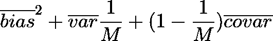
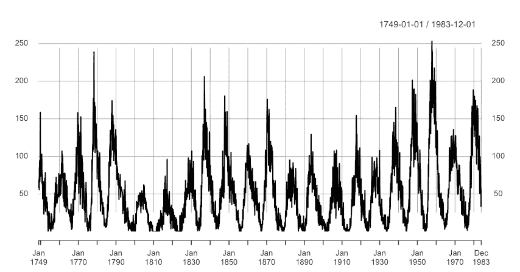
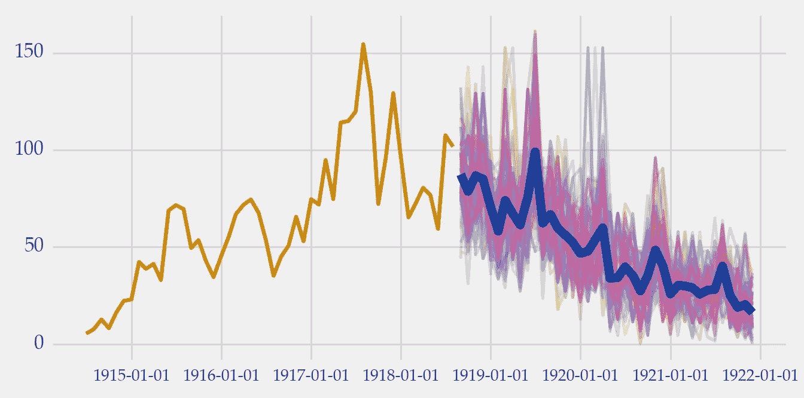
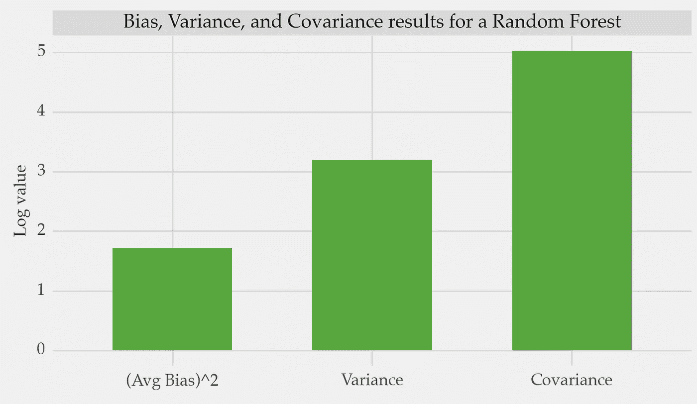

# 如何测量和改善预测集成的多样性

> 原文：[`towardsdatascience.com/how-to-measure-and-improve-the-diversity-of-forecasting-ensembles-2ec899014d6`](https://towardsdatascience.com/how-to-measure-and-improve-the-diversity-of-forecasting-ensembles-2ec899014d6)

## 使用偏差-方差-协方差分解来分析预测集成

[](https://vcerq.medium.com/?source=post_page-----2ec899014d6--------------------------------)[](https://towardsdatascience.com/?source=post_page-----2ec899014d6--------------------------------) [Vitor Cerqueira](https://vcerq.medium.com/?source=post_page-----2ec899014d6--------------------------------)

·发表于 [Towards Data Science](https://towardsdatascience.com/?source=post_page-----2ec899014d6--------------------------------) ·5 分钟阅读·2023 年 1 月 31 日

--


图片来源于 [henry perks](https://unsplash.com/@hjkp?utm_source=medium&utm_medium=referral) 在 [Unsplash](https://unsplash.com/?utm_source=medium&utm_medium=referral)

在本文中，你将学习偏差-方差-协方差分解方法。

回归模型的误差可以通过偏差-方差权衡来分析。对于集成模型，这种误差可以通过协方差项进一步分解。

以下是如何使用这种分解来改进预测集成的方法。

# 介绍

[个体模型之间的多样性是构建成功集成的关键要素](https://medium.com/towards-data-science/introduction-to-forecasting-ensembles-f63877a2498)。

每个模型应该做出准确的预测。但这些预测也应该与其他模型不同。因此，综合预测可以减少个体误差的影响。

这引出了两个问题：

1.  我们如何测量集成的多样性？

1.  我们如何在集成中引入多样性？

让我们深入探讨这些问题。

# 测量多样性

[偏差-方差权衡](https://en.wikipedia.org/wiki/Bias%E2%80%93variance_tradeoff) 是分析回归模型的标准方法。偏差涉及预测值与实际值之间的平均距离。方差涉及不同样本上的预测变异性。

低偏差意味着高方差，反之亦然。这种权衡与模型的复杂性有关。越来越复杂的模型往往具有较低的偏差（但方差较高）。

预测集成也是一种回归模型。它可以分解为这两个术语。但，最好使用三重分解来分析：即偏差-方差-协方差分解。

这种分解定义如下：



上述方程中的术语是具有*M*模型的集成的平均**偏差**、平均**方差**和平均**协方差**。

我们已经知道了偏差和方差项。除了这些，集成的期望误差还取决于协方差项。协方差衡量一对模型如何一起变化。因此，它是量化多样性的好方法。协方差值越大（即多样性越低），期望误差也越大。

你可以这样理解：

期望误差 = 平均偏差 + 平均方差 - 多样性

因此，集成多样性直接影响其期望的预测性能。

下面是如何编码这个分解的方法：

```py
import numpy as np
import pandas as pd

class BiasVarianceCovariance:

    @classmethod
    def get_bvc(cls, y_hat: pd.DataFrame, y: np.ndarray):
        return cls.avg_sqr_bias(y_hat, y), cls.avg_var(y_hat), cls.avg_cov(y_hat)

    @staticmethod
    def avg_sqr_bias(y_hat: pd.DataFrame, y: np.ndarray):
        """
        :param y_hat: predictions as pd.DataFrame with shape (n_observations, n_models).
        The predictions of each model are in different columns
        :param y: actual values as np.array
        """
        return (y_hat.mean(axis=0) - y.mean()).mean() ** 2

    @staticmethod
    def avg_var(y_hat: pd.DataFrame):
        M = y_hat.shape[1]

        return y_hat.var().mean() / M

    @staticmethod
    def avg_cov(y_hat: pd.DataFrame):
        M = y_hat.shape[1]
        cov_df = pd.DataFrame(np.cov(y_hat))
        np.fill_diagonal(cov_df.values, 0)
        cov_term = cov_df.values.sum() * (1 / (M * (M - 1)))

        return cov_term
```

你可以在参考文献[1]中找到有关偏差-方差-协方差分解的更多细节。

# 创建多样化的集成


[Franki Chamaki](https://unsplash.com/@franki?utm_source=medium&utm_medium=referral) 在[Unsplash](https://unsplash.com/?utm_source=medium&utm_medium=referral)上的照片

偏差-方差-协方差分解显示了鼓励集成多样性的重要性。你如何做到这一点？

这里有三种可能的方法：

1.  操作训练数据；

1.  使用不同的算法或配置；

1.  剪枝集成。

## 操作训练数据

一些最成功的集成方法遵循这种方法。例如，bagging 和 boosting。

Bagging 是一个决策树的集成。对于每棵树，使用自助法技术对可用数据进行重采样。因此，每棵树都有不同的训练集，从而引入了多样性。随机森林也进行自助法采样，并且还有更多操作。他们向解释变量的使用方式中添加了随机性，这进一步增加了树之间的多样性。

提升也会改变输入数据，但方式不同。一个关键方面是模型是按顺序训练的。每次迭代后，训练实例会根据之前的错误重新加权。

## 使用不同的算法或配置

改变算法是一种快速而简便的提高集成多样性的方法。

不同的方法（例如决策树和线性回归）对数据有不同的假设。这导致模型表现不同。

## 集成剪枝

提高多样性的另一种方法是通过[集成剪枝](https://medium.com/towards-data-science/introduction-to-forecasting-ensembles-f63877a2498)。

剪枝指的是从集成中移除不需要的模型。在这种情况下，你会丢弃高度相关的模型。这不仅能获得更好的多样性，还能降低成本。

# 案例研究：随机森林的分解

让我们使用偏差-方差-协方差分解来分析随机森林的误差。

在这个例子中，我们将使用有关太阳黑子的时间序列。



月度太阳黑子时间序列[3]。图片作者。

你可以按如下方式训练随机森林进行预测：

```py
import numpy as np
import pandas as pd

from sklearn.model_selection import train_test_split
from sklearn.ensemble import RandomForestRegressor
from sklearn.metrics import mean_squared_error

from pmdarima.datasets import load_sunspots

# src module here: https://github.com/vcerqueira/blog
from src.tde import time_delay_embedding
from src.ensembles.bvc import BiasVarianceCovariance

# load time series 
series = load_sunspots(as_series=True) # GPL-3

# train test split
train, test = train_test_split(series, test_size=0.3, shuffle=False, random_state=1)

# time series for supervised learning
train_df = time_delay_embedding(train, n_lags=12, horizon=1)
test_df = time_delay_embedding(test, n_lags=12, horizon=1)

# creating the predictors and target variables
target_var = 'Series(t+1)'
X_train, y_train = train_df.drop(target_var, axis=1), train_df[target_var]
X_test, y_test = test_df.drop(target_var, axis=1), test_df[target_var]

# training a random forest ensemble with 100 decision trees 
rf = RandomForestRegressor(n_estimators=100, random_state=1)
rf.fit(X_train, y_train)

# getting predictions from each tree in RF
rf_pred = [tree.predict(X_test) for tree in rf.estimators_]
rf_pred = pd.DataFrame(rf_pred).T

# bias-variance-covariance decomposition
rf_a_bias, rf_a_var, rf_a_cov = BiasVarianceCovariance.get_bvc(rf_pred, y_test.values)
```

这是预测样本：



随机森林中树的预测样本。组合预测用粗体藏青色表示。图片由作者提供。

这里是错误分解成每一项的方式：



偏差、方差和协方差项（对数缩放）。图片由作者提供。

你可以利用这些信息来指导集成模型的发展。

在这个例子中，大部分的期望误差是由于协方差项造成的。你可以通过提高集成的多样性来减少它。我们探讨了三种方法来做到这一点。例如，你可以尝试通过移除相关的树来修剪集成。

# 关键要点

+   预测集成的期望误差可以分解为三个部分：偏差、方差和协方差；

+   协方差项衡量集成中的多样性；

+   这种分解对指导集成模型的发展非常有价值；

+   提高集成多样性有很多方法。这些方法包括操作训练数据、使用不同的算法或进行集成修剪。

感谢阅读，我们下一个故事见！

## 相关文章

+   集成预测简介

+   如何组合集成预测

+   [使用 R 从 Python 进行动态预测组合](https://medium.com/towards-data-science/dynamic-forecast-combination-using-r-from-python-afcdf6adf85b)

## 参考文献

[1] Brown, G., Wyatt, J., Harris, R., & Yao, X. (2005). 多样性创建方法：调查与分类。*信息融合*, *6*(1), 5–20。

[2] Brown, Gavin, 等。“回归集成中的多样性管理。” *机器学习研究杂志* 6.9 (2005)。

[3] [太阳黑子时间序列。GPL-3 许可证](https://www.rdocumentation.org/packages/datasets/versions/3.6.1/topics/sunspots)
