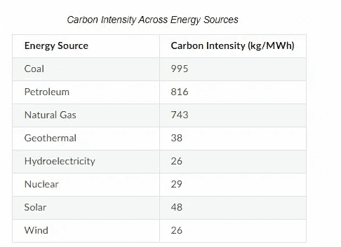
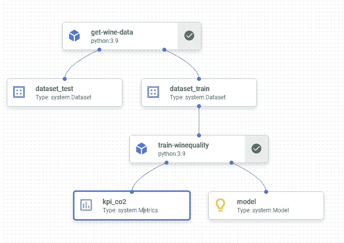
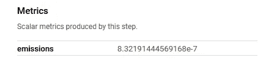
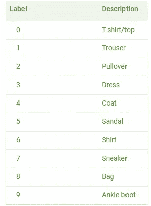
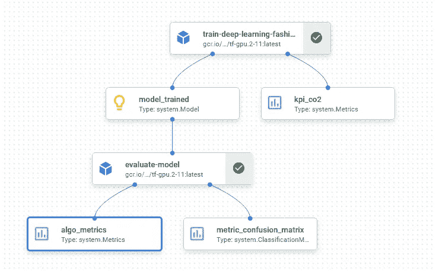
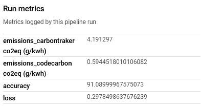

# 如何使用 Python 和 Vertex AI Pipelines 测量碳足迹

> 原文：[`towardsdatascience.com/how-to-mesure-the-carbon-footprint-using-vertex-ai-pipelines-3d6bc9695e7b`](https://towardsdatascience.com/how-to-mesure-the-carbon-footprint-using-vertex-ai-pipelines-3d6bc9695e7b)

## 关于使用 Vertex AI Pipelines 跟踪碳排放的逐步指南

[](https://medium.com/@anna.bildea?source=post_page-----3d6bc9695e7b--------------------------------)[](https://towardsdatascience.com/?source=post_page-----3d6bc9695e7b--------------------------------) [Ana Bildea, PhD](https://medium.com/@anna.bildea?source=post_page-----3d6bc9695e7b--------------------------------)

·发表于 [Towards Data Science](https://towardsdatascience.com/?source=post_page-----3d6bc9695e7b--------------------------------) ·9 分钟阅读·2023 年 1 月 31 日

--


图片由作者使用 Midjourney 生成。

# 动机

机器学习已经成为我们日常生活的一部分，因此是时候考虑它对环境的潜在影响了。否则，大自然可能会以自然灾害的形式给我们一个‘*我早就说过了*’的教训，导致严重的人类痛苦。我们可以通过开始测量和减少机器学习模型的碳足迹来帮助应对气候变化。碳足迹衡量的是服务、产品、个人、组织或事件造成的温室气体排放总量。在机器学习的情况下，它包括训练和运行模型所需的能源，以及运行这些模型的硬件所用的能源。

在这篇文章中，我将对两个开源 Python 库 [CodeCarbon](https://pypi.org/project/codecarbon/) 和 [CarbonTracker](https://github.com/lfwa/carbontracker) 提供反馈，它们能够估算碳足迹。我还将包括一个在 Vertex AI 管道中使用它们的逐步指南。最后，我将列出减少碳足迹的实际考虑因素。所以，让我们在为时已晚之前开始为拯救地球贡献自己的力量吧！💚

# I. Python 中的碳足迹 📗

用于测量 Python 中碳足迹的两个最流行的库是 [CodeCarbon](https://pypi.org/project/codecarbon/) 和 [CarbonTracker](https://github.com/lfwa/carbontracker)。事实是我们没有很多开源的替代方案。但我相信，一旦社区开始将碳足迹集成到机器学习系统中，我们将会有更多的选择。

让我们先说几句关于库的内容。

## CodeCarbon

它是一个开源 Python 库，用于估算运行代码时产生的 CO2。该项目由 Yoshua Bengio 发起。我最欣赏的一点是它非常易于使用，文档良好，并且有一个很棒的[仪表盘](https://dashboard.codecarbon.io/)。估算通过测量总 GPU、CPU 和 RAM 的功耗来完成。然后，它应用您的[云](https://github.com/mlco2/codecarbon/blob/master/codecarbon/data/cloud/impact.csv)提供商或[国家](https://github.com/mlco2/codecarbon/blob/master/codecarbon/data/private_infra/eu-carbon-intensity-electricity.csv)的[区域碳强度](https://ourworldindata.org/grapher/carbon-intensity-electricity)，如果您使用本地计算机或本地集群。请参考下表以查看各种能源来源的碳强度。



@[CodeCarbon](https://mlco2.github.io/codecarbon/methodology.html#) 来源

二氧化碳排放估算（CO₂eq）计算如下：

```py
CO₂eq=Power_consumption(kilowatt-hours)*Carbon_Intensity(kg of CO₂/kilowatt-hour) 
```

请注意，当碳强度不可用时，CodeCarbon 使用世界平均值[**475 gCO2.eq/KWh**](https://www.iea.org/reports/global-energy-co2-status-report-2019/emissions)。排放量被保存到名为`emissions.csv.`的 CSV 文件中。

在支持的基础设施方面，它兼容支持[NVIDIA 管理库（NVML）](https://developer.nvidia.com/nvidia-management-library-nvml)的 NVIDIA GPU 和支持[Intel RAPL](http://web.eece.maine.edu/~vweaver/projects/rapl/rapl_support.html)的 Intel CPU。如果您的 CPU 不在[支持的 CPU 列表](https://github.com/mlco2/codecarbon/blob/master/codecarbon/data/hardware/cpu_power.csv)上，它将估算 CPU 的功耗为其热设计功耗（TDP）的 50%，默认 TDP 平均值为 85W。

使用 pip 安装：

```py
pip install codecarbon
```

它支持两种模式：`在线模式` 或 `离线模式`。

`在线模式` 需要互联网连接来获取您的地理位置。请参见下面使用它的示例，带有或不带装饰器：

`离线模式` 可以在您的设置无法访问互联网时使用。它需要指定国家的 3 个字母 ISO 代码。您可以在[维基百科](https://en.wikipedia.org/wiki/List_of_ISO_3166_country_codes)上找到国家**ISO**代码的列表。

## CarbonTracker

[CarbonTracker](https://arxiv.org/abs/2007.03051) 是一个开源库，旨在通过测量训练所用硬件的功耗来估算训练深度学习模型的碳足迹。目前，它支持 GPU、CPU 和 DRAM 组件。它与支持[NVIDIA 管理库 (NVML)](https://developer.nvidia.com/nvidia-management-library-nvml)的 NVIDIA GPU、支持[Intel RAP](http://web.eece.maine.edu/~vweaver/projects/rapl/rapl_support.html)的 Intel CPU、Slurm 和 Google Colab / Jupyter Notebook 兼容。使用起来很简单，但不幸的是，文档有限。

为了估算碳足迹，它使用以下公式：

```py
Carbon Footprint = Energy Consumption × Carbon Intensity
```

`Energy Consumption` 是基于 PUE（功耗使用效率）计算的，这是一种用于衡量数据中心能源效率的指标。它通过将数据中心使用的总能量除以 IT 设备（如服务器、存储等）使用的能量来计算。

它使用与 `codecarbon` 相同的每个[云](https://github.com/mlco2/codecarbon/blob/master/codecarbon/data/cloud/impact.csv)或[国家](https://github.com/mlco2/codecarbon/blob/master/codecarbon/data/private_infra/eu-carbon-intensity-electricity.csv)的 `Carbon Intensity`。当碳强度不可用时，应用[**475 gCO2.eq/KWh**](https://www.iea.org/reports/global-energy-co2-status-report-2019/emissions)的全球平均值。

可以通过 pip 安装：

```py
pip install carbontracker
```

使用方法如下面的示例所示：

它还具备在指定目录中收集和存储日志的能力：

```py
from carbontracker import parser
logs = parser.parse_all_logs(log_dir="./"+YOUR_DIR+"/")
```

现在我们对 CodeCarbon 和 CarbonTracker 有了一定了解，接下来我们将在 Vertex AI Pipeline 中使用它们。

# II. 使用 Vertex AI Pipelines 的案例研究👷

## 有趣的部分现在开始 😄

在继续 Vertex AI Pipelines 之前，我邀请你阅读[**我的文章**](https://medium.com/towards-data-science/how-to-set-up-custom-vertex-ai-pipelines-step-by-step-467487f81cad)，该文章展示了如何使用 Vertex AI Pipelines。

接下来，我将演示如何在两种场景中跟踪碳足迹：

+   1\. 仅使用 CodeCarbon 进行的监督学习（CarbonTracker 仅支持深度学习）。

+   2\. 使用 CodeCarbon 和 CarbonTracker 进行深度学习。

## *1\. CPU 上监督学习的碳足迹*

我们将跟踪训练随机森林算法以**“*预测葡萄酒质量*”**时的碳排放。数据从[UCI 机器学习库](https://archive.ics.uci.edu/ml/datasets/wine+quality)下载，@source [Cortez 等, 2009]。有关数据集的更多细节，请查看我的文章中的[用例](https://medium.com/towards-data-science/how-to-set-up-custom-vertex-ai-pipelines-step-by-step-467487f81cad)部分。笔记本可在[GitHub](https://github.com/anabild/mlops/tree/main/notebook)上获取。

为了测量训练期间的碳排放，我们需要按如下方式修改笔记本中的 `train_winequality` 自定义 Kubeflow 组件：

+   将 `codecarbon` 添加到 `packages_to_install` 列表中。

+   添加一个指标以跟踪 CO2 估算值 `kpi_co2:Output[Metrics].`

+   导入 `OfflineEmissionsTracker` 以使用离线模式（设置时没有互联网连接）。

+   实例化 codecarbon 跟踪器 `tracker = OfflineEmissionsTracker(country_iso_code=”BEL”).` BEL 代表比利时。注意国家代码应与所选的 Google Cloud 区域匹配，在我们的例子中是 `europe-west1`。

+   使用 `tracker.start().` 开始跟踪。

+   使用 .fit() 方法开始训练模型。

+   使用 `tracker.stop()` 停止跟踪

+   记录排放 `kpi_co2.log_metric(“emissions”, float(emissions)).`

请参见下方我的示例。

一旦你更新 `train_winequality` 组件并重新运行笔记本，你应该会在管道图上看到 `kpi_co2` 指标工件。



作者提供的图片

然后，进入 NODE INFO 标签以检查 CO2 排放估算值（以 kg/kWh 为单位）。



❗️ 请注意，要创建一个 Vertex AI Pipeline 并在完成之前不进行监控，你可以使用 **submit** 而不是 **run**。

现在让我们使用深度学习算法进行练习。

## **2. 碳足迹使用 GPU 上的深度学习**

在这个练习中，我们将使用 [Keras](https://keras.io/)（开源 Python 深度学习库）和 [Tensorflow](https://www.tensorflow.org/)（开源机器学习框架）训练深度学习模型。目标是确定照片是否包含表 1 中列出的任何标签。为此，我们使用自定义的 *卷积神经网络*（CNN）架构进行图像分类。

## **2.1 数据描述**

我们使用 Keras 提供的由 Zalando SE 提供的 Fashion-MNIST 数据集，该数据集基于[MIT 许可证](https://github.com/zalandoresearch/fashion-mnist/blob/master/LICENSE)。它包括 60,000 张用于训练的图片和 10,000 张用于测试的图片。每张图片都是一个 28x28 的灰度图像，属于 10 种不同的时尚类别，并标记为以下 10 个类别之一：



表 1：包含照片的标签。

## 2.2 设置环境

+   Vertex AI Workbench

+   Python 3

+   Kubeflow 管道组件

+   使用 NVIDIA TESLA T4 GPU 预构建镜像

+   Tensorflow 2.11

+   Codecarbon

+   CarbonTracker

然后使用 pip 安装 Google Cloud Pipeline 组件和 TensorFlow。

```py
pip3 install google-cloud-pipeline-components --upgrade --user
pip3 install kfp tensorflow 
```

导入库。

定义全局变量。

## 2.3 创建自定义深度学习组件

我将使用`tf-gpu.2–11:latest`作为基础镜像，该镜像包含 TensorFlow 和 GPU，存储在 Artifact Registry 中。请参见欧洲的[预测](https://console.cloud.google.com/artifacts/docker/vertex-ai/europe/prediction)和[训练](https://console.cloud.google.com/artifacts/docker/vertex-ai/europe/training)的预构建镜像。请注意，Google 还在[Container Registry](https://console.cloud.google.com/gcr/images/deeplearning-platform-release/GLOBAL)中发布了预构建镜像。

为了启用`codecarbon`和`carbontracker`，我们将按如下步骤进行：

+   将`codecarbon 和 carbontracker`添加到`packages_to_install`列表中。

+   添加度量来跟踪估计值`kpi_co2:Output[Metrics]`。

+   导入 CarbonTracker 和日志解析器。

+   定义一个目录来重定向`carbontracker`的日志，例如`DIR_LOG="log"`。

+   加载训练图像并进行缩放。

+   使用`keras.Sequential` API 来定义 CNN 的层。

+   编译模型。

+   启动`codecarbon`并指定荷兰地区的 ISO 代码 NLD。

+   指定 epochs 的数量和 carbontracker 的日志目录`carbontracker = CarbonTracker(epochs=epochs, log_dir=”./”+DIR_LOG+”/”)`。

+   启动 carbontracker `carbontracker.epoch_start()`。

+   在训练数据上拟合模型。

+   停止 carbontracker：`carbontracker.epoch_end()` & codecarbon `codecarbon.stop()`。

+   记录排放值并保存模型。

## 2.4 评估模型

评估组件依赖于预编译的 GPU Tensorflow 2.11 基础镜像。

输入经过训练的模型。然后加载`fashion.mist`测试数据集。它调整和重塑测试图像，评估模型，并计算准确率、损失和混淆矩阵。

## 2.5 创建并提交管道

该管道促进了无服务器工作流的编排。我们的管道有两个步骤：训练（deep_learning_mist_task）和评估（model_evaluation_task）。它接受一些参数，如 learning_rate、epochs 的数量、batch_size、API 端点、项目 ID 和服务 URI。

要为管道步骤指定机器配置，请使用：

```py
 .add_node_selector_constraint("cloud.google.com/gke-accelerator", GPU_TYPE )
.set_gpu_limit(GPU_LIMIT)
```

GPU_TYPE 的可用值包括：

+   NVIDIA_TESLA_A100，

+   NVIDIA_TESLA_K80，

+   NVIDIA_TESLA_P4，

+   NVIDIA_TESLA_P100，

+   NVIDIA_TESLA_T4，

+   NVIDIA_TESLA_V10。

GPU_LIMIT 是一个表示 GPU 限制的正数。

执行管道后，你应该会看到以下图表：



作者提供的图片

转到***总结***选项卡以查看训练期间 CO2 排放的估算值。



作者提供的图片

我们可以注意到 CO2 估算值不同，因为两个库之间的能耗公式不同。说实话，我更喜欢 Codecarbon，因为它有更好的兼容性和文档。

# III. 减少碳足迹的几个实践💡

我建议在设计 AI 算法时考虑一些实际问题。

> 考虑将碳足迹整合到**机器学习模型的整个生命周期**中，从数据收集到模型部署。
> 
> **寻找配备适当处理器**（CPU/GPU/TPU）的机器，以适应你的用例。
> 
> **选择碳足迹较低的云区域**。例如，Google Cloud Platform 会指示每个可用区域是否低 CO2。
> 
> 在你的机器学习生态系统中**集成碳足迹跟踪器**。
> 
> **选择高效的模型架构**。查看可能减少能耗的[sparse models](https://ai.googleblog.com/2021/03/constructing-transformers-for-longer.html)。
> 
> **鼓励团队使用云**，因为研究表明它[更具能源效率](https://www.morganclaypool.com/doi/10.2200/S00874ED3V01Y201809CAC046)。
> 
> 尽可能**使用预构建模型**，而不是从头开始训练。
> 
> **在组织中共享数据集、特征库和预构建**的专业模型。

# 关键要点

总之，我推荐使用 Codecarbon，因为它在机器学习（CPU）和深度学习算法（GPU）上表现良好，并且具有更好的基础设施兼容性。关于 CarbonTraker，我在 Google Cloud CPU 上遇到了无法运行的错误，导致浪费时间。如果你打算使用 GPU，记得在使用前验证 GPU[可用性](https://cloud.google.com/compute/docs/gpus/gpu-regions-zones)。此外，我强烈建议检查[GPU 定价](https://cloud.google.com/compute/gpus-pricing#gpu-pricing)以期望更低的成本。最后，重要的是要记住，减少机器学习中的碳足迹是一个持续的过程，新技术和技术不断发展以应对这一问题。确保跟踪有关碳足迹减少策略的更新。

笔记本可以在我的[GitHub](https://github.com/anabild/mlops/tree/main/notebook)账户中找到。

希望你喜欢这篇文章。

# 谢谢阅读！

如果你想在收件箱中收到我的未来故事，别忘了[订阅](https://medium.com/subscribe/@anna.bildea)。

*如果你喜欢阅读我的故事并希望支持我成为作者，请考虑注册成为 Medium 会员，并获得数千篇数据工程和数据科学文章的访问权限。*

[](https://medium.com/@anna.bildea/membership?source=post_page-----3d6bc9695e7b--------------------------------) [## 使用我的推荐链接加入 Medium — Bildea Ana

### 作为 Medium 会员，你的会员费的一部分将用于你阅读的作者，并且你可以完全访问每一个故事……

medium.com](https://medium.com/@anna.bildea/membership?source=post_page-----3d6bc9695e7b--------------------------------)

*在* [*LinkedIn*](https://www.linkedin.com/in/ana-bildea-phd-2339b728/) *和* [Twitter](https://twitter.com/AnaBildea) *上找到我！*

查看我的 MLops 文章集合


[安娜·比尔迪亚博士](https://medium.com/@anna.bildea?source=post_page-----3d6bc9695e7b--------------------------------)

## MLOps - AI 在生产中

[查看列表](https://medium.com/@anna.bildea/list/mlops-ai-in-production-04b6c81c50c8?source=post_page-----3d6bc9695e7b--------------------------------)4 个故事
