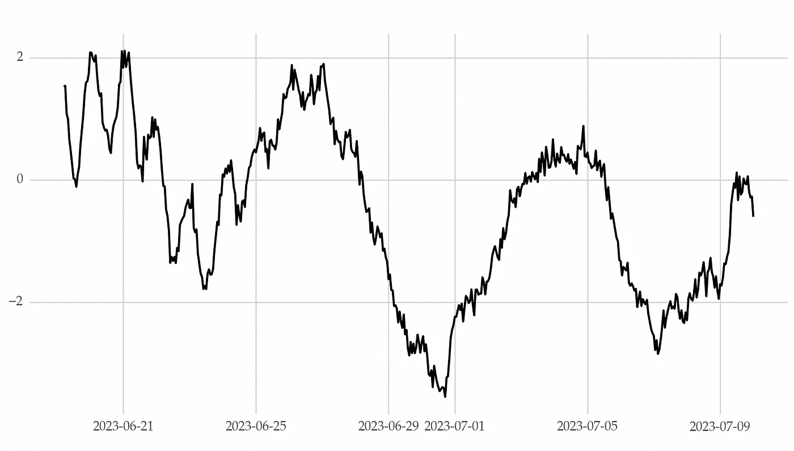
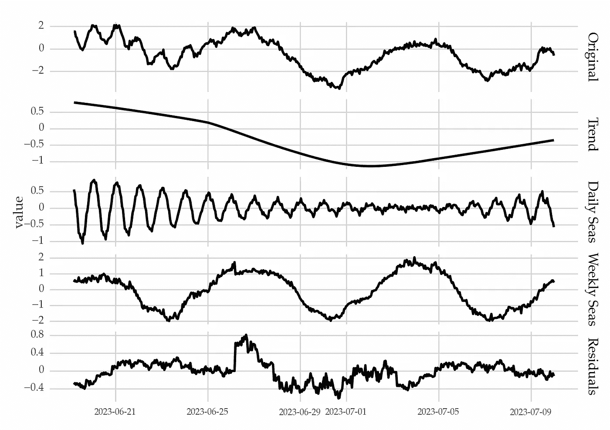
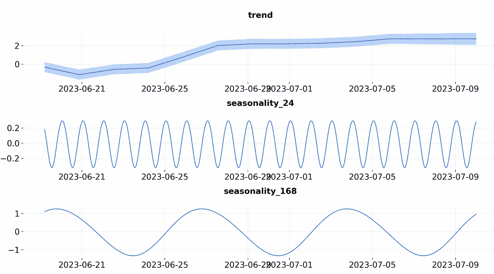

# 如何在时间序列中建模多重季节性

> 原文：[`towardsdatascience.com/how-to-model-multiple-seasonality-in-time-series-2a3488f8e7f5`](https://towardsdatascience.com/how-to-model-multiple-seasonality-in-time-series-2a3488f8e7f5)

## **处理多个周期的季节性效应**

[](https://vcerq.medium.com/?source=post_page-----2a3488f8e7f5--------------------------------)[](https://towardsdatascience.com/?source=post_page-----2a3488f8e7f5--------------------------------) [Vitor Cerqueira](https://vcerq.medium.com/?source=post_page-----2a3488f8e7f5--------------------------------)

·发布于 [Towards Data Science](https://towardsdatascience.com/?source=post_page-----2a3488f8e7f5--------------------------------) ·阅读时间 5 分钟·2023 年 7 月 25 日

--


图片由 [Joshua Woroniecki](https://unsplash.com/@joshua_j_woroniecki?utm_source=medium&utm_medium=referral) 提供，来源于 [Unsplash](https://unsplash.com/?utm_source=medium&utm_medium=referral)

在这篇文章中，你将学习如何在时间序列中建模多重季节性。我们将涵盖：

+   如何使用 MSTL 分解时间序列

+   创建捕捉复杂季节性的解释变量

+   使用现成的方法，基于*orbit*的预测包进行示例。

# 复杂的季节性

[季节性指的是以规律的周期性重复的系统性变化](https://medium.com/towards-data-science/8-techniques-to-model-seasonality-2f81d739710)。这些模式与时间序列的观察频率有关。低频时间序列通常包含一个季节性周期。例如，每月时间序列表现出年度季节性。

越来越多的时间序列以更高的采样频率收集，如每日或每小时。这导致了具有复杂季节性的大数据集。每日时间序列可能显示出每周、每月和每年的重复模式。

下面是一个具有每日和每周季节性的每小时时间序列示例：



每小时时间序列具有每日和每周的季节性。人工数据和图像由作者创建。

乍一看，以上时间序列似乎没有超过一个季节性模式。多个季节性效应可能相互重叠，这使得识别所有相关周期变得困难。

# 多重季节性的分解

分解方法旨在将时间序列拆分为其基本部分：趋势、季节性和残差。

大多数方法设计用于处理单一预定义周期的季节性。例子包括经典方法、x11 和 STL 等。

STL 方法已经扩展以处理多重季节性。MSTL（用于多重 STL）在*statsmodels* Python 包中可用：

```py
import numpy as np
from statsmodels.tsa.seasonal import MSTL

# creating an artificial time series with complex seasonality
# daily and weekly seasonality
period1, period2 = 24, 24 * 7
# 500 data points
size = 500
beta1 = np.linspace(-.6, .3, num=size)
beta2 = np.linspace(.6, -.3, num=size)
sin1 = np.asarray([np.sin(2 * np.pi * i / period1) for i in np.arange(1, size + 1)])
sin2 = np.asarray([np.sin(2 * np.pi * i / period2) for i in np.arange(1, size + 1)])
cos1 = np.asarray([np.cos(2 * np.pi * i / period1) for i in np.arange(1, size + 1)])
cos2 = np.asarray([np.cos(2 * np.pi * i / period2) for i in np.arange(1, size + 1)])

xt = np.cumsum(np.random.normal(scale=0.1, size=size))
noise = np.random.normal(scale=0.1, size=size)

# combining parts
yt = xt + beta1 * sin1 + beta2 * cos1 + sin2 + cos2 + noise

# hourly time series
ind = pd.date_range(end=pd.Timestamp('2023-07-10'), periods=size, freq='H')
yt = pd.Series(yt, index=ind)
yt.name = 'Series'
yt.index.name = 'Date'

# decomposition with MSTL
decomp = MSTL(endog=yt, periods=(period1, period2)).fit()
```

分解结果包括以下部分：



时间序列及其基本部分，包括两个季节性组件。图像由作者提供。

因此，MSTL 可以用于调整具有复杂季节性的时间序列。

你可以查看上一篇文章，了解如何使用分解后的时间序列构建预测模型。

# 多重季节性建模

除了分解，还有[其他季节性建模方法](https://medium.com/towards-data-science/8-techniques-to-model-seasonality-2f81d739710)，这些方法通常专注于具有单一季节周期的时间序列。不过，有些方法也可以处理复杂的季节性。

例如，你可以为不同的时期获取季节性虚拟变量。对于小时级时间序列，你可以获取每个观测值的日期、周或月份等信息。

使用傅里叶级数，你可以通过不同的周期计算正弦和余弦波。以下是如何使用*sktime* 实现这一点：

```py
from sktime.transformations.series.fourier import FourierFeatures

# Fourier series with two periods
# 4 terms for the first period
# 2 terms for the second period
fourier = FourierFeatures(sp_list=[period1, period2],
                          fourier_terms_list=[4, 2],
                          keep_original_columns=False)

fourier_feats = fourier.fit_transform(yt)
```

你还可以获取多个周期的径向基函数。

## 现成的方法

有一些现成的方法可以处理复杂的季节性。例如，TBATS、Prophet、MSTL 或 KTR（基于核的时间变化回归）都是不错的选择。

使用 MSTL，你可以通过[分别预测每个组件，然后合并预测](https://medium.com/towards-data-science/8-techniques-to-model-seasonality-2f81d739710)的方法来处理这个任务。

下面是如何使用 KTR 的示例，这在*orbit* Python 包中可用：

```py
from orbit.models import KTR
from orbit.diagnostics.plot import plot_predicted_data, plot_predicted_components
from sklearn.model_selection import train_test_split

df = yt.reset_index()

# train test split
train, test = train_test_split(df, shuffle=False, test_size=100)

# creating a KTR instance with the required periods
ktr_with_seas = KTR(
    response_col='Series',
    date_col='Date',
    seed=1,
    seasonality=[24, 24 * 7],
    estimator='pyro-svi',
    n_bootstrap_draws=1e4,
    # pyro training config
    num_steps=301,
    message=100,
)

# fitting the model
ktr_with_seas.fit(train)

# inference
predicted_df = ktr_with_seas.predict(df=df, decompose=True)

_ = plot_predicted_data(training_actual_df=train,
                        predicted_df=predicted_df,
                        date_col='Date',
                        actual_col='Series',
                        test_actual_df=test,
                        markersize=10, lw=.5)

_ = plot_predicted_components(predicted_df=predicted_df,
                              date_col='Date',
                              plot_components=['trend',
                                               'seasonality_24',
                                               'seasonality_168'])
```

每个季节性组件都通过傅里叶级数建模，这些级数被用作解释变量。它们的样子如下：



从函数 plot_predicted_components 获取的结果。图像由作者提供。

每个傅里叶波具有不同的特征，以捕捉每个季节性的周期性。

# 关键要点

高频时间序列可以在多个周期中表现出季节性。捕捉所有季节性模式对于时间序列的最佳建模至关重要。

在这篇文章中，你学到了如何扩展常见的方法以处理多个季节性周期。

一些现成的方法也能够应对这个问题，如 Prophet 或 KTR。

感谢阅读，下次见！

## 相关文章

+   [8 种季节性建模技巧](https://medium.com/towards-data-science/8-techniques-to-model-seasonality-2f81d739710)

+   [3 种季节性及其检测方法](https://medium.com/towards-data-science/3-types-of-seasonality-and-how-to-detect-them-4e03f548d167)

+   [理解时间序列趋势](https://medium.com/towards-data-science/understanding-time-series-trend-addfd9d7764e)

## 代码

+   [`github.com/vcerqueira/blog/blob/main/posts/seasonality/complex_seasonality.py`](https://github.com/vcerqueira/blog/blob/main/posts/seasonality/complex_seasonality.py)

## 参考文献

[1] Orbit 的 KTR 文档：[`orbit-ml.readthedocs.io/en/stable/tutorials/ktr2.html`](https://orbit-ml.readthedocs.io/en/stable/tutorials/ktr2.html)

[2] 预测：原理与实践，复杂季节性部分：[`otexts.com/fpp3/complexseasonality.html`](https://otexts.com/fpp3/complexseasonality.html)

[3] Holmes, Elizabeth E., Mark D. Scheuerell, 和 E. J. Ward. “应用于渔业和环境数据的时间序列分析。” *NOAA 渔业，西北渔业科学中心，西雅图，WA* (2020)。
